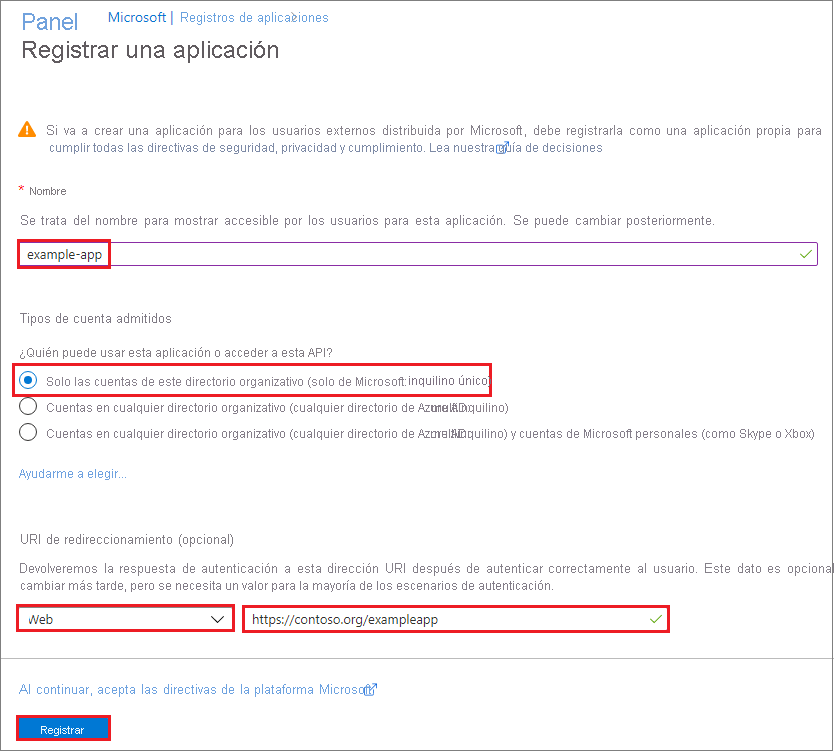

# <a name="how-to-use-the-portal-to-create-an-azure-ad-application-and-service-principal-that-can-access-resources"></a>Procedimientos: Uso del portal para crear una aplicación de Azure AD y una entidad de servicio con acceso a los recursos

En este artículo se muestra cómo crear una nueva entidad de servicio y aplicación de Azure Active Directory (Azure AD) que puede usar con el control de acceso basado en rol. Cuando haya aplicaciones, servicios hospedados o herramientas automatizadas que deban tener acceso a ciertos recursos o modificarlos, puede crear una identidad para la aplicación. Esta identidad se conoce como una entidad de servicio. El acceso a los recursos está restringido por los roles asignados a la entidad de servicio, lo que permite controlar a qué recursos pueden tener acceso y en qué nivel. Por motivos de seguridad, se recomienda usar siempre entidades de servicio con las herramientas automatizadas, en lugar de permitirles iniciar sesión con una identidad de usuario. 

En este artículo se muestra cómo usar el portal para crear la entidad de servicio en Azure Portal. Se centra en una aplicación de un único inquilino donde la aplicación está diseñada para ejecutarse en una sola organización. Normalmente, utiliza aplicaciones de inquilino único para aplicaciones de línea de negocio que se ejecutan dentro de su organización.  También puede consultar [Uso de Azure PowerShell para crear una entidad de servicio](howto-authenticate-service-principal-powershell.md).

> [!IMPORTANT]
> En lugar de crear una entidad de servicio, considere el uso de identidades administradas para recursos de Azure para la identidad de la aplicación. Si el código se ejecuta en un servicio que admite identidades administradas y tiene acceso a recursos que admiten la autenticación de Azure AD, las identidades administradas son la opción ideal para usted. Para obtener más información sobre las identidades administradas para recursos de Azure, incluidos los servicios que actualmente lo admiten, consulte [¿Qué es Managed Identities for Azure Resources?](../managed-identities-azure-resources/overview.md).

## <a name="app-registration-app-objects-and-service-principals"></a>Registro de aplicaciones, objetos de aplicación y entidades de servicio
No hay una manera directa de crear una entidad de servicio con Azure Portal.  Cuando registre una aplicación mediante Azure Portal, se crearán automáticamente un objeto de aplicación y una entidad de servicio en el inquilino o directorio principal.  Para obtener más información sobre la relación entre el registro de aplicaciones, los objetos de aplicación y las entidades de servicio, consulte [Objetos de aplicación y de entidad de servicio de Azure Active Directory](app-objects-and-service-principals.md).

## <a name="permissions-required-for-registering-an-app"></a>Permisos necesarios para registrar una aplicación

Debe tener permisos suficientes para registrar una aplicación en su inquilino de Azure AD y asignar a la aplicación un rol en su suscripción de Azure.

### <a name="check-azure-ad-permissions"></a>Comprobación de los permisos de Azure AD

1. Seleccione **Azure Active Directory**.
1. Anote su rol. Si tiene el rol **Usuario**, debe asegurarse de que los no administradores pueden registrar aplicaciones.

   

1. En el panel izquierdo, seleccione **Configuración de usuario**.
1. Compruebe la configuración de **App registrations** (Registros de aplicaciones). Este valor solo puede configurarlo un administrador. Si se configura en **Sí**, cualquier usuario en el inquilino de Azure Active Directory puede registrar una aplicación.

Si la configuración de registro de aplicaciones se establece en **No**, solo los usuarios con un rol de administrador pueden registrar este tipo de aplicaciones. Consulte los [roles disponibles](../users-groups-roles/directory-assign-admin-roles.md#available-roles) y los [permisos de roles](../users-groups-roles/directory-assign-admin-roles.md#role-permissions) para conocer los roles de administrador disponibles y los permisos específicos en Azure AD que se otorgan a cada rol. Si la cuenta está asignada al rol Usuario, pero la opción Registros de aplicaciones está limitada a los administradores, pida al administrador que le asigne un rol de administrador para poder crear y administrar todos los aspectos de los registros de aplicaciones, o que permita a los usuarios registrar las aplicaciones.

### <a name="check-azure-subscription-permissions"></a>Comprobación de los permisos de suscripción de Azure

En su suscripción de Azure, su cuenta debe tener acceso a `Microsoft.Authorization/*/Write` para asignar un rol a una aplicación de AD. Esta acción se concede mediante el rol [Propietario](../../role-based-access-control/built-in-roles.md#owner) o el rol [Administrador de acceso de usuario](../../role-based-access-control/built-in-roles.md#user-access-administrator). Si su cuenta tiene asignado al rol **Colaborador**, no tiene los permisos adecuados. Recibirá un error al intentar asignarle un rol a la entidad de servicio.

Para comprobar los permisos de su suscripción:

1. Busque y seleccione **Suscripciones** o seleccione **Suscripciones** en la página **Inicio**.

   

1. Seleccione la suscripción en la que quiere crear la entidad de servicio.

   

   Si no ve la suscripción que busca, seleccione el **filtro de suscripciones globales**. Asegúrese de que la suscripción que desea está seleccionada para el portal.

1. Seleccione **Mis permisos**. A continuación, seleccione **Click here to view complete access details for this subscription** (Haga clic aquí para ver los detalles de acceso completos para esta suscripción).

   

1. Seleccione **Ver** en **Asignaciones de roles** para ver los roles asignados y determine si tiene los permisos correspondientes para asignar un rol a una aplicación de AD. En caso contrario, pida al administrador de suscripciones que le agregue al rol Administrador de acceso de usuario. En la imagen siguiente, el usuario está asignado al rol Propietario, lo que significa que el usuario tiene los permisos adecuados.

   

## <a name="register-an-application-with-azure-ad-and-create-a-service-principal"></a>Registro de una aplicación con Azure AD y creación de una entidad de servicio

Vamos a saltar directamente a la creación de la identidad. Si experimenta un problema, compruebe los [permisos necesarios](#permissions-required-for-registering-an-app) para asegurarse de que su cuenta puede crear la identidad.

1. Inicie sesión en su cuenta de Azure mediante [Azure Portal](https://portal.azure.com).
1. Seleccione **Azure Active Directory**.
1. Seleccione **App registrations** (Registros de aplicaciones).
1. Seleccione **Nuevo registro**.
1. Asigne un nombre a la aplicación. Seleccione un tipo de cuenta compatible, que determinará quién puede usar la aplicación. En **URI de redireccionamiento**, seleccione **Web** para indicar el tipo de aplicación que quiere crear. Escriba el URI al que se envía el token de acceso. No se pueden crear credenciales para una [aplicación nativa](../manage-apps/application-proxy-configure-native-client-application.md). No se puede usar ese tipo en una aplicación automatizada. Después de configurar los valores, seleccione **Registrar**.

   

Ha creado una aplicación de Azure AD y una entidad de servicio.

## <a name="assign-a-role-to-the-application"></a>Asignación de un rol a la aplicación

Para acceder a los recursos de la suscripción, debe asignar un rol a la aplicación. Decida qué rol ofrece los permisos adecuados para la aplicación. Para obtener más información sobre los roles disponibles, vea [RBAC: Roles integrados](../../role-based-access-control/built-in-roles.md).

Puede establecer el ámbito en el nivel de suscripción, grupo de recursos o recurso. Los permisos se heredan en los niveles inferiores del ámbito. Por ejemplo, el hecho de agregar una aplicación al rol *Lector* para un grupo de recursos significa que esta puede leer el grupo de recursos y los recursos que contiene.

1. En Azure Portal, seleccione el nivel de ámbito al que desea asignar la aplicación. Por ejemplo, para asignar un rol en el ámbito de la suscripción, busque y seleccione **Suscripciones**, o seleccione **Suscripciones** en la página **Inicio**.

   

1. Seleccione la suscripción concreta que se asignará a la aplicación.

   

   Si no ve la suscripción que busca, seleccione el **filtro de suscripciones globales**. Asegúrese de que la suscripción que desea está seleccionada para el portal.

1. Seleccione **Access Control (IAM)** .
1. Seleccione **Agregar asignación de roles**.
1. Seleccione el rol que quiere asignar a la aplicación. Por ejemplo, para que la aplicación ejecute acciones como **reiniciar**, **iniciar** y **detener** instancias, seleccione **Colaborador**.  Más información sobre los [roles disponibles](../../role-based-access-control/built-in-roles.md). De manera predeterminada, las aplicaciones de Azure AD no se muestran en las opciones disponibles. Para encontrar la aplicación, busque el nombre y selecciónelo.

   

1. Haga clic en **Guardar** para finalizar la asignación del rol. Verá la aplicación en la lista de usuarios con un rol para ese ámbito.

La entidad de servicio está configurada. Puede empezar a usarla para ejecutar aplicaciones o scripts. Para administrar la entidad de servicio (permisos, permisos confirmados por el usuario, ver qué usuarios han dado su consentimiento, revisar permisos, ver información de inicio de sesión, etc.), vaya a **Aplicaciones empresariales**.

En la sección siguiente se muestra cómo obtener valores necesarios al iniciar sesión mediante programación.

## <a name="get-tenant-and-app-id-values-for-signing-in"></a>Obtención de valores de identificador de inquilino y aplicación para iniciar sesión

Al iniciar sesión mediante programación, deberá pasar el identificador de inquilino con la solicitud de autenticación y el identificador de aplicación.  También necesita un certificado o una clave de autenticación (lo que se describe en la sección siguiente). Para obtener estos valores, use los pasos siguientes:

1. Seleccione **Azure Active Directory**.
1. En **Registros de aplicaciones**, en Azure AD, seleccione su aplicación.
1. Copie el identificador del directorio (inquilino) y almacénelo en el código de la aplicación.

    

    El identificador de directorio (inquilino) también se puede encontrar en la página de información general del directorio predeterminado.

1. Copie el **id. de aplicación** y almacénelo en el código de la aplicación.

   

## <a name="upload-a-certificate-or-create-a-secret-for-signing-in"></a>Carga de un certificado o creación de un secreto para iniciar sesión
Hay dos tipos de autenticación disponibles para las entidades de servicio: autenticación basada en contraseña (secreto de aplicación) y autenticación basada en certificados.  Se recomienda usar un certificado, pero también puede crear un secreto de aplicación nuevo.

### <a name="upload-a-certificate"></a>Carga de un certificado

Puede usar un certificado existente si lo tiene.  Si quiere, puede crear un certificado autofirmado con *fines de prueba únicamente*. Para crear un certificado autofirmado, abra PowerShell y ejecute [New-SelfSignedCertificate](/powershell/module/pkiclient/new-selfsignedcertificate) con los parámetros siguientes para crear el certificado en el almacén de certificados del usuario en su equipo: 

```powershell
$cert=New-SelfSignedCertificate -Subject "CN=DaemonConsoleCert" -CertStoreLocation "Cert:\CurrentUser\My"  -KeyExportPolicy Exportable -KeySpec Signature
```

Exporte este certificado a un archivo con el complemento MMC [Administrar certificado de usuario](/dotnet/framework/wcf/feature-details/how-to-view-certificates-with-the-mmc-snap-in) accesible desde el Panel de control de Windows.

1. Seleccione **Ejecutar** en el menú **Inicio** y, a continuación, escriba **certmgr.msc**.

   Aparece la herramienta Administrador de certificados para el usuario actual.

1. Para ver los certificados, en **Certificados - usuario actual** en el panel izquierdo, expanda el directorio **Personal**.
1. Haga clic con el botón derecho en el certificado que ha creado y seleccione **Todas las tareas->Exportar**.
1. Siga el Asistente para exportar certificados.  No exporte la clave privada ni realice exportaciones a un archivo .CER.

Para cargar el certificado:

1. Seleccione **Azure Active Directory**.
1. En **Registros de aplicaciones**, en Azure AD, seleccione su aplicación.
1. Seleccione **Certificados y secretos**.
1. Seleccione **Cargar certificado** y seleccione el certificado (un certificado existente o el certificado autofirmado que exportó).

    

1. Seleccione **Agregar**.

Después de registrar el certificado con la aplicación en el portal de registro de aplicación, debe habilitar el código de la aplicación cliente para usar el certificado.

### <a name="create-a-new-application-secret"></a>Creación de un secreto de aplicación

Si decide no usar un certificado, puede crear un secreto de aplicación nuevo.

1. Seleccione **Azure Active Directory**.
1. En **Registros de aplicaciones**, en Azure AD, seleccione su aplicación.
1. Seleccione **Certificados y secretos**.
1. Seleccione **Secretos de cliente -> Nuevo secreto de cliente**.
1. Proporcione una descripción y duración del secreto. Cuando haya terminado, seleccione **Agregar**.

   Después de guardar el secreto de cliente, se muestra el valor del mismo. Copie este valor porque no podrá recuperar la clave más adelante. Deberá proporcionar el valor de la clave junto con el identificador de la aplicación para iniciar sesión como la aplicación. Guarde el valor de clave donde la aplicación pueda recuperarlo.

   

## <a name="configure-access-policies-on-resources"></a>Configuración de directivas de acceso sobre los recursos
Puede que tenga que configurar permisos adicionales para los recursos a los que la aplicación tiene que acceder. Por ejemplo, también debe [actualizar las directivas de acceso de un almacén de claves](../../key-vault/general/secure-your-key-vault.md#data-plane-and-access-policies) para proporcionar a la aplicación acceso a las claves, los secretos o los certificados.  

1. En [Azure Portal](https://portal.azure.com), vaya al almacén de claves y seleccione **Directivas de acceso**.  
1. Seleccione **Agregar directiva de acceso** y, luego, seleccione la clave, el secreto y los permisos de certificado que quiere conceder a la aplicación.  Seleccione la entidad de servicio que creó anteriormente.
1. Seleccione **Agregar** para agregar la directiva de acceso y, luego, **Guardar** para confirmar los cambios.
    

## <a name="next-steps"></a>Pasos siguientes
* Obtenga información sobre el [Uso de Azure PowerShell para crear una entidad de servicio](howto-authenticate-service-principal-powershell.md).
* Para obtener información sobre cómo especificar directivas de seguridad, consulte [Control de acceso basado en roles de Azure (RBAC de Azure)](../../role-based-access-control/role-assignments-portal.md).  
* Para obtener una lista de las acciones que puede conceder o denegar a los usuarios, consulte [Operaciones del proveedor de recursos de Azure Resource Manager](../../role-based-access-control/resource-provider-operations.md).