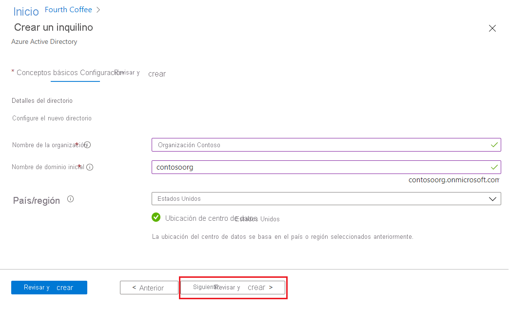
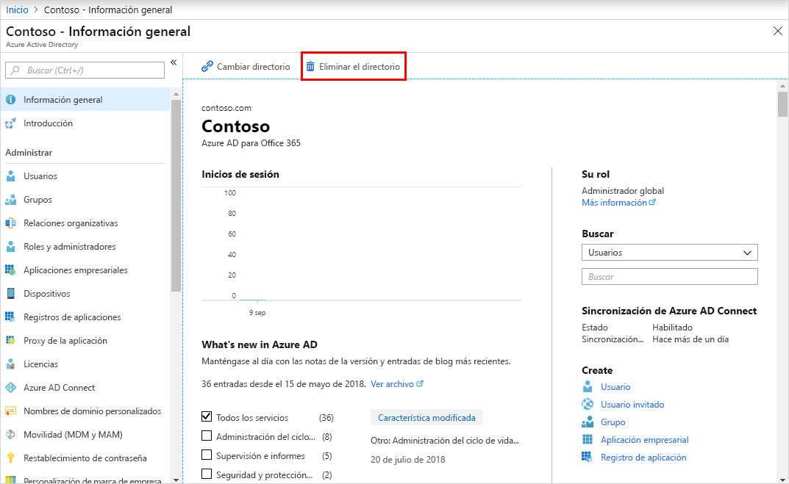

# Inicio rápido: Creación de un inquilino en Azure Active Directory
Puede hacer todas las tareas administrativas mediante el portal de Azure Active Directory (Azure AD), incluida la creación de un inquilino para su organización. 

En este tutorial, obtendrá información sobre cómo acceder a Azure Portal y a Azure Active Directory y sobre cómo crear un inquilino básico para su organización.

Si no tiene una suscripción a Azure, cree una [cuenta gratuita](https://azure.microsoft.com/free/) antes de empezar.

## Creación de un inquilino para la organización
Después de iniciar sesión en Azure Portal, puede crear un inquilino para su organización. El nuevo inquilino representa a su organización y le ayuda a administrar una instancia específica de Servicios en la nube de Microsoft para los usuarios internos y externos.

### Para crear un inquilino

1. Inicie sesión en la instancia de [Azure Portal](https://portal.azure.com/) de la organización.

1. En el menú de Azure Portal, seleccione **Azure Active Directory**.  

    <kbd></kbd>  

1. Seleccione **Create a tenant** (Crear un inquilino).

1. En la pestaña Conceptos básicos, seleccione el tipo de inquilino que desea crear, **Azure Active Directory** o **Azure Active Directory (B2C)** .

1. Seleccione **Siguiente: Configuration** (Siguiente: Configuración) para pasar a la pestaña Configuración.

    <kbd></kbd>

1.  En la pestaña Configuración, escriba la siguiente información:
    
    - _Contoso Organization_ en el cuadro **Nombre de organización**.

    - _Contosoorg_ en el cuadro **Nombre de dominio inicial**.

    - Deje la opción _Estados Unidos_ en el cuadro **País o región**.

1. Seleccione **Siguiente: Revisar y crear**. Revise la información que ha escrito y, si es correcta, seleccione **Crear**.

    <kbd></kbd>

El nuevo inquilino se crea con el dominio contoso.onmicrosoft.com.

## Limpieza de recursos
Si no va a seguir usando esta aplicación, puede eliminar el inquilino mediante los siguientes pasos:

- Asegúrese de que ha iniciado sesión en el directorio que desea eliminar mediante el filtro **Directorio y suscripción** de Azure Portal y cambie al directorio de destino, si es necesario.
- Seleccione **Azure Active Directory** y, después, en la página **Contoso - Información general**, seleccione **Eliminar directorio**.

    El inquilino y su información asociada se eliminarán.

    <kbd></kbd>

## Pasos siguientes
- Para cambiar o agregar nombres de dominio adicionales, vea [Incorporación de su nombre de dominio personalizado a Azure Active Directory](add-custom-domain.md).

- Para agregar usuarios, vea [Incorporación o eliminación de un nuevo usuario](add-users-azure-active-directory.md).

- Para agrear grupos y miembros, vea [Creación de un grupo básico y adición de miembros](active-directory-groups-create-azure-portal.md).

- Obtenga información sobre el [acceso basado en rol mediante Privileged Identity Management](../../role-based-access-control/best-practices.md) y el [acceso condicional](../../role-based-access-control/conditional-access-azure-management.md) para ayudar a administrar el acceso a aplicaciones y recursos de su organización.

- Obtenga información sobre Azure AD, incluida la [información de licencia básica, terminología y características asociadas](active-directory-whatis.md).
