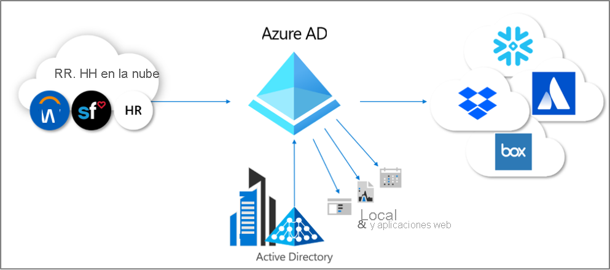
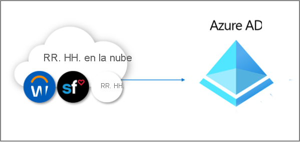
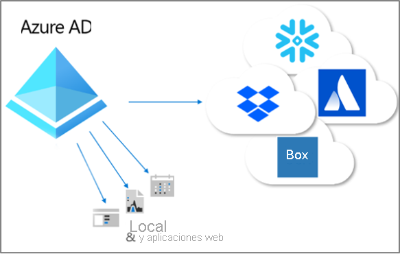

# ¿Qué es el aprovisionamiento?

El aprovisionamiento y el desaprovisionamiento son los procesos que garantizan la coherencia de las identidades digitales en varios sistemas.  Normalmente, estos procesos se aprovechan como parte de la [administración del ciclo de vida de la identidad](what-is-identity-lifecycle-management.md).

El **aprovisionamiento** es el proceso de creación de una identidad en un sistema de destino según determinadas condiciones.  El **desaprovisionamiento** es el proceso de eliminación de la identidad del sistema de destino cuando ya no se cumplen las condiciones. La **sincronización** es el proceso que permite mantener actualizado el objeto aprovisionado, de modo que el objeto de origen y el de destino sean similares.

Por ejemplo, cuando un nuevo empleado se une a una organización, se incorpora al sistema de RR. HH.  En ese momento, el aprovisionamiento **desde** RR. HH. **en** Azure Active Directory (Azure AD) puede crear una cuenta de usuario correspondiente en Azure AD. Las aplicaciones que consultan Azure AD pueden ver la cuenta de ese nuevo empleado.  Si hay aplicaciones que no usan Azure AD, el aprovisionamiento **desde** Azure AD **en** las bases de datos de esas aplicaciones garantiza que el usuario pueda acceder a todas las aplicaciones que necesite.  Este proceso permite al usuario empezar a trabajar y acceder a las aplicaciones y sistemas que necesitan desde el primer día.  De manera similar, si las propiedades como, por ejemplo, su departamento o estado laboral, cambian en el sistema de RR. HH., la sincronización de esas actualizaciones del sistema de RR. HH. con Azure AD y con otras aplicaciones y bases de datos de destino, garantiza la coherencia.

Actualmente, Azure AD proporciona tres áreas de aprovisionamiento automatizado.  Son las siguientes:  

- Aprovisionamiento desde un sistema externo autoritativo sin directorios de registro en Azure AD mediante el **[aprovisionamiento controlado por recursos humanos](#hr-driven-provisioning)**  
- Aprovisionamiento desde Azure AD en aplicaciones mediante el **[aprovisionamiento de aplicaciones](#app-provisioning)**  
- Aprovisionamiento entre Azure AD y Active Directory Domain Services mediante el **[aprovisionamiento entre directorios](#inter-directory-provisioning)** 

## Aprovisionamiento controlado por recursos humanos

El aprovisionamiento de recursos humanos en Azure AD implica la creación de objetos, normalmente identidades de usuario que representan a cada empleado pero que, en algunos casos, también representan a departamentos u otras estructuras, según la información que se encuentra en el sistema de recursos humanos.  

El escenario más común sería el siguiente: cuando un empleado nuevo empleado entra a formar parte de la empresa, se le incorpora al sistema de recursos humanos.  Cuando esto sucede, se le aprovisiona automáticamente como nuevo usuario en Azure AD, sin necesidad de intervención administrativa para cada nuevo contrato.  Por lo general, el aprovisionamiento desde recursos humanos puede abarcar los siguientes escenarios.

- **Contratación de nuevos empleados**: cuando se agrega un nuevo empleado a un sistema de RR. HH, se crea automáticamente una cuenta de usuario en Active Directory, Azure AD y, opcionalmente, en los directorios de otras aplicaciones compatibles con Azure AD, con reescritura de la dirección de correo electrónico en el sistema de RR. HH.
- **Actualizaciones de atributos y perfiles de empleados**: si se actualiza un registro de empleado en el sistema de RR. HH (por ejemplo, el nombre, el cargo o el jefe), su cuenta de usuario se actualizará automáticamente en Active Directory, Azure AD y, opcionalmente, en otras aplicaciones compatibles con Azure AD.
- **Despidos de empleados**: cuando se prescinde de un empleado en el sistema de RR. HH., se impide automáticamente a su cuenta de usuario el inicio de sesión o se elimina esa cuenta de Active Directory, Azure AD y de otras aplicaciones.
- **Recontratación de empleados**: cuando se vuelve a contratar a un empleado en el sistema de RR. HH. en la nube, su cuenta anterior se puede volver a activar o reaprovisionar automáticamente (según lo que prefiera).

Hay tres opciones de implementación para el aprovisionamiento controlado por recursos humanos con Azure AD:

1. Para las organizaciones con una suscripción única a Workday o SuccessFactors, y que no usan Active Directory
1. Para las organizaciones con una suscripción única a Workday o SuccessFactors, y que usan Active Directory y Azure AD
1. Para las organizaciones con varios sistemas de recursos humanos, o un sistema de recursos humanos local como SAP, Oracle eBusiness o PeopleSoft

Para más información, consulte [¿Qué es el aprovisionamiento controlado por RR. HH.?](what-is-hr-driven-provisioning.md)

## Aprovisionamiento de aplicaciones

En Azure AD, el término **[aprovisionamiento de aplicaciones](../app-provisioning/user-provisioning.md)** hace referencia a la creación automática de copias de identidades de usuario en las aplicaciones a las que los usuarios necesitan acceder, para aquellas aplicaciones que tienen su propio almacén de datos y que son distintas de Azure AD o Active Directory. Además de crear identidades de usuario, el aprovisionamiento de aplicaciones incluye el mantenimiento y la eliminación de identidades de usuario de esas aplicaciones a medida que el estado o los roles del usuario cambian. Algunos escenarios comunes incluyen el aprovisionamiento de un usuario de Azure AD en aplicaciones como [Dropbox](../saas-apps/dropboxforbusiness-provisioning-tutorial.md), [Salesforce](../saas-apps/salesforce-provisioning-tutorial.md) o [ServiceNow](../saas-apps/servicenow-provisioning-tutorial.md), ya que cada una de estas aplicaciones tiene su propio repositorio de usuarios distinto de Azure AD.

Para más información, consulte [¿Qué es el aprovisionamiento de aplicaciones?](what-is-app-provisioning.md)

## Aprovisionamiento entre directorios

Muchas organizaciones confían en Active Directory y Azure AD, y pueden tener aplicaciones conectadas a Active Directory como, por ejemplo, servidores de archivos locales.

Como muchas organizaciones han implementado tradicionalmente el aprovisionamiento controlado por recursos humanos en el entorno local, es posible que ya tengan identidades de usuario para todos sus empleados en Active Directory.   El escenario más común para el aprovisionamiento entre directorios se produce cuando un usuario que ya está en Active Directory se aprovisiona en Azure AD.  Este aprovisionamiento se realiza normalmente mediante la sincronización o el aprovisionamiento en la nube de Azure AD Connect. 

Además, es posible que las organizaciones quieran también aprovisionar en sistemas locales desde Azure AD.  Por ejemplo, una organización puede haber incluido invitados en el directorio de Azure AD, pero esos invitados deberán tener acceso a aplicaciones web basadas en la autenticación integrada de Windows local mediante el proxy de la aplicación.  Esto requiere el aprovisionamiento de cuentas de AD locales para esos usuarios en Azure AD.

Para más información, consulte [¿Qué es el aprovisionamiento entre directorios?](what-is-inter-directory-provisioning.md)

 
## Pasos siguientes 
- [¿Qué es la administración del ciclo de vida de la identidad?](what-is-identity-lifecycle-management.md)
- [¿Qué es el aprovisionamiento controlado por RR. HH.?](what-is-hr-driven-provisioning.md)
- [¿Qué es el aprovisionamiento de aplicaciones?](what-is-app-provisioning.md)
- [¿Qué es el aprovisionamiento entre directorios?](what-is-inter-directory-provisioning.md)