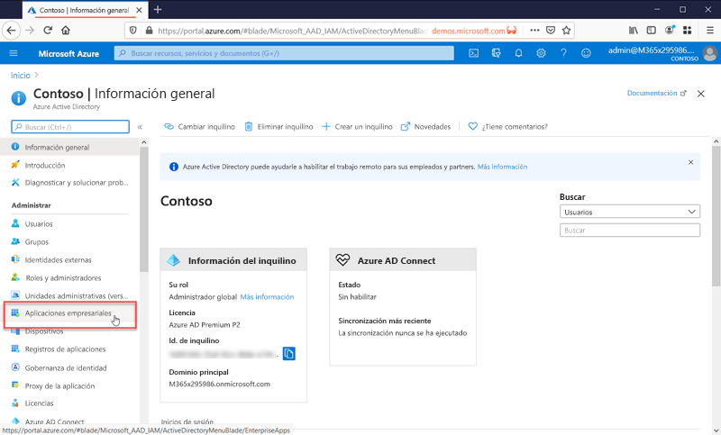

# ¿Qué es la administración de aplicaciones?

Azure AD es un sistema de administración de identidades y acceso (IAM). Proporciona un lugar centralizado para almacenar la información de las identidades digitales. Puede configurar las aplicaciones de software para que usen Azure AD como el lugar donde se almacena la información del usuario. 

Azure AD debe estar configurada para poder integrarse con una aplicación. En otras palabras, debe saber qué aplicaciones lo están usando como sistema de identidades. El proceso por el que Azure AD sabe de estas aplicaciones y cómo debe controlarlas, se conoce como administración de aplicaciones.

Las aplicaciones se administran en la hoja **Aplicaciones empresariales**, que se encuentra en la sección Administrar del portal de Azure Active Directory.

## ¿Qué es un sistema de administración de identidades y acceso (IAM)?
Una aplicación es un fragmento de software que se usa para algún propósito. La mayoría de las aplicaciones requieren que los usuarios inicien sesión para que la aplicación pueda proporcionar una experiencia personalizada para ese usuario en particular. En otras palabras, la aplicación necesita conocer la identidad del usuario que utiliza la aplicación para saber qué funcionalidad tiene que ofrecer u ocultar al usuario.

Si cada aplicación hace un seguimiento de los usuarios por separado, el resultado sería un silo de distintos nombres de usuario e inicios de sesión para cada aplicación. Una aplicación no sabría nada sobre los usuarios de otras aplicaciones.

Un sistema de identidades centralizado resuelve este problema porque proporciona un solo lugar para almacenar la información de los usuario que, después, todas las aplicaciones pueden usar. Estos sistemas se conocen como sistemas de administración de identidades y acceso (IAM). Azure Active AD es el sistema de IAM de la nube de Microsoft.

>[!TIP]
>Un sistema de IAM proporciona un lugar centralizado en el que hacer un seguimiento de las identidades de los usuarios. Azure AD es el sistema de IAM de la nube de Microsoft.

## ¿Por qué administrar aplicaciones con una solución en la nube?

Las organizaciones suelen tener cientos de aplicaciones de las que los usuarios dependen para poder realizar su trabajo. Los usuarios acceden a estas aplicaciones desde muchos dispositivos y ubicaciones. Cada día se agregan, desarrollan y retiran nuevas aplicaciones. Con tantas aplicaciones y puntos de acceso, es más importante que nunca usar una solución basada en la nube para administrar el acceso de los usuarios a todas las aplicaciones.

>[!TIP]
>La galería de aplicaciones de Azure AD contiene muchas aplicaciones populares que ya están preconfiguradas para trabajar con Azure AD como proveedor de identidades.

## ¿Cómo funciona Azure AD con las aplicaciones?

Azure AD simplifica la manera de administrar las aplicaciones, porque proporciona un único sistema de identidades para las aplicaciones en la nube y el entorno local. Puede agregar a Azure AD las aplicaciones de software como servicio (SaaS), aplicaciones locales y aplicaciones de línea de negocio (LOB). Después, los usuarios inician sesión una vez para acceder de forma segura y sin problemas a estas aplicaciones, junto con Microsoft 365 y otras aplicaciones empresariales de Microsoft. Puede reducir los costos administrativos gracias a la [automatización del aprovisionamiento de usuarios](../app-provisioning/user-provisioning.md). También puede utilizar la autenticación multifactor y las directivas de acceso condicional para proporcionar un acceso seguro a las aplicaciones.

## ¿Qué tipos de aplicaciones puedo integrar con Azure AD?

Hay cuatro tipos principales de aplicaciones que se pueden agregar a las **aplicaciones empresariales** y administrar con Azure AD:

- **Aplicaciones de la galería de Azure AD**: Azure AD tiene una galería que contiene miles de aplicaciones que se han integrado previamente para el inicio de sesión único con Azure AD. Algunas de las aplicaciones que su organización usa probablemente estén en la galería. [Aprenda sobre cómo planear la integración de la aplicación](plan-an-application-integration.md) u obtenga pasos detallados de la integración para aplicaciones individuales en los [tutoriales de aplicaciones SaaS](https://docs.microsoft.com/azure/active-directory/saas-apps/).

- **Aplicaciones locales con Application Proxy**: con Azure AD Application Proxy, puede integrar las aplicaciones web locales con Azure AD para admitir el inicio de sesión único. Después, los usuarios finales pueden acceder a sus aplicaciones web locales de la misma manera que acceden a Microsoft 365 y a otras aplicaciones de SaaS. Consulte [Acceso remoto a aplicaciones locales mediante Azure Active Directory Application Proxy](application-proxy.md).

- **Aplicaciones desarrolladas a medida**: al crear sus propias aplicaciones de línea de negocio, puede integrarlas con Azure AD para admitir el inicio de sesión único. Al registrar la aplicación con Azure AD, tendrá el control de la directiva de autenticación de dicha aplicación. Para más información, consulte las [instrucciones para desarrolladores](developer-guidance-for-integrating-applications.md).

- **Aplicaciones que no son de la galería**: traiga sus propias aplicaciones. Admita el inicio de sesión único para otras aplicaciones agregándolas a Azure AD. Hay varias maneras de integrar una aplicación; algunas de ellas se enumeran a continuación. Para más información, consulte [Configuración del inicio de sesión único de SAML](configure-saml-single-sign-on.md).

>[!TIP]
>Puede integrar Azure AD con una aplicación aunque no esté configurada previamente, y en la galería de aplicaciones. Puede **integrar Azure AD con cualquiera** de los siguientes:
> - Un vínculo web, o aplicación, que represente un **campo de nombre de usuario y contraseña**.
> - Una aplicación que admita **protocolos SAML u OpenID Connect**.
> - Una aplicación que admita la norma **System for Cross-domain Identity Management (SCIM)**.

## Administración de riesgos con directivas de acceso condicional

El acoplamiento del inicio de sesión único (SSO) de Azure AD con [acceso condicional](../conditional-access/concept-conditional-access-cloud-apps.md) ofrece niveles altos de seguridad para acceder a las aplicaciones. Las funcionalidades de seguridad incluyen la protección de identidad en la nube, el control de acceso basado en riesgos, la autenticación multifactor nativa y las directivas de acceso condicional. Estas funcionalidades admiten directivas de control detalladas basadas en aplicaciones o en grupos que necesitan niveles más altos de seguridad.

## Mejora de la seguridad con el inicio de sesión único

Habilitar el inicio de sesión único (SSO) en las aplicaciones y Microsoft 365 ofrece una experiencia de inicio de sesión superior para los usuarios existentes con la reducción o eliminación de mensajes de inicio de sesión. El entorno del usuario será más coherente y menos confuso sin tantos mensajes o sin la necesidad de administrar varias contraseñas. El grupo de negocios puede administrar y aprobar el acceso mediante una pertenencia dinámica y de autoservicio. Permitir que las personas correctas de la empresa administren el acceso a una aplicación mejora la seguridad del sistema de identidades.

El inicio de sesión único mejora la seguridad. *Sin el inicio de sesión único*, los administradores necesitan crear y actualizar cuentas de usuario para cada aplicación individual, lo que requiere tiempo. Además, los usuarios deben realizar un seguimiento de varias credenciales para acceder a sus aplicaciones. Como resultado, los usuarios tienden a anotar las contraseñas o usar otras soluciones de administración de contraseñas que presentan riesgos para la seguridad de los datos. [Obtenga más información sobre el inicio de sesión único](what-is-single-sign-on.md).

## Abordar la gobernanza y el cumplimiento

Con Azure AD, puede supervisar los inicios de sesión en la aplicación mediante informes que usan herramientas de supervisión de eventos e incidentes de seguridad (SIEM). Puede acceder a los informes desde el portal o con las API. Audite mediante programación quién accede a sus aplicaciones y retire el acceso a usuarios inactivos mediante revisiones de acceso.

## Administrar costos

Al migrar a Azure AD, puede ahorrar costos y las molestias de administrar la infraestructura local. Azure AD también proporciona acceso de autoservicio a las aplicaciones, lo que ahorra tiempo para los administradores y usuarios. El inicio de sesión único elimina las contraseñas específicas de aplicaciones. Esta posibilidad de iniciar sesión solo una vez ahorra costos relacionados con el restablecimiento de contraseñas para las aplicaciones y la pérdida de productividad al recuperar estas.

En el caso de las aplicaciones de recursos humanos u otras aplicaciones con un gran conjunto de usuarios, puede aprovechar el aprovisionamiento de aplicaciones para automatizar el proceso de aprovisionamiento y desaprovisionamiento de usuarios; consulte [¿Qué es el aprovisionamiento de aplicaciones?](../app-provisioning/user-provisioning.md).

## Pasos siguientes

- [Serie de guías de inicio rápido sobre la administración de aplicaciones](view-applications-portal.md)
- [Introducción a la integración de aplicaciones](plan-an-application-integration.md)
- [Obtenga información sobre cómo automatizar el aprovisionamiento](../app-provisioning/user-provisioning.md)
