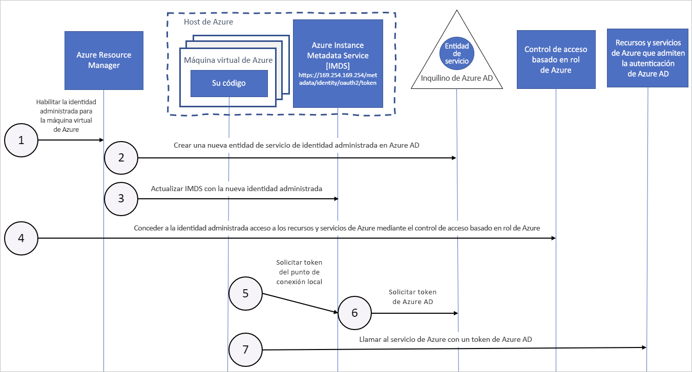

# Funcionamiento de las identidades administradas para recursos de Azure con las máquinas virtuales de Azure

Las identidades administradas para los recursos de Azure proporcionan a los servicios de Azure una identidad administrada automáticamente en Azure Active Directory. Puede usar esta identidad para autenticar a cualquier servicio que admita la autenticación de Azure AD, sin necesidad de tener credenciales en el código.

En este artículo, aprenderá cómo funcionan las identidades administradas con máquinas virtuales de Azure.

## Funcionamiento

Internamente, las identidades administradas son entidades de servicio de un tipo especial, que solo puedan usarse con recursos de Azure. Cuando se elimina la identidad administrada, se quita automáticamente la entidad de servicio correspondiente.
Además, cuando se crea una identidad asignada por el usuario o asignada por el sistema, el proveedor de recursos de identidades administradas (MSRP) genera un certificado internamente para esa identidad. 

El código puede usar una identidad administrada para solicitar tokens de acceso de los servicios que admiten la autenticación de Azure AD. Azure se encarga de rotar las credenciales que usa la instancia del servicio. 

En el diagrama siguiente se muestra cómo funcionan las identidades de servicio administradas con máquinas virtuales (VM) de Azure:

|  Propiedad    | Identidad administrada asignada por el sistema | Identidad administrada asignada por el usuario |
|------|----------------------------------|--------------------------------|
| Creación |  Se crea como parte de un recurso de Azure (por ejemplo, una máquina virtual de Azure o Azure App Service). | Se crea como un recurso de Azure independiente. |
| Ciclo de vida | Se comparte el ciclo de vida con el recurso de Azure con el que se creó la identidad administrada.   Si se elimina el recurso primario, se elimina también la identidad administrada. | Ciclo de vida independiente.   Se debe eliminar explícitamente. |
| Uso compartido de recursos de Azure | No se puede compartir.   Solo se puede asociar con un único recurso de Azure. | Se puede compartir.   La misma identidad administrada asignada por el usuario se puede asociar con más de un recurso de Azure. |
| Casos de uso comunes | Cargas de trabajo que contiene un único recurso de Azure.   Cargas de trabajo para las que necesita identidades independientes.   Por ejemplo, una aplicación que se ejecuta en una sola máquina virtual | Cargas de trabajo que se ejecutan en varios recursos y que pueden compartir una única identidad.   Cargas de trabajo que necesitan autorización previa para un recurso seguro como parte de un flujo de aprovisionamiento.   Cargas de trabajo donde los recursos se reciclan con frecuencia, pero los permisos deben permanecer coherentes.   Por ejemplo, una carga de trabajo en la que varias máquinas virtuales tienen que acceder al mismo recurso |

## Identidad administrada asignada por el sistema

1. Azure Resource Manager recibe una solicitud para habilitar la identidad administrada asignada por el sistema de una máquina virtual.

2. Entonces crea una entidad de servicio en Azure AD para la identidad de la máquina virtual. La entidad de servicio se crea en el inquilino de Azure AD que sea de confianza para la suscripción.

3. Azure Resource Manager configura la identidad de la máquina virtual mediante la actualización del punto de conexión de identidad de Azure Instance Metadata Service con el identificador de cliente y el certificado de la entidad de servicio.

4. Ahora que la máquina virtual tiene una identidad, se usa la información de la entidad de servicio para conceder a la máquina virtual acceso a los recursos de Azure. Para llamar a Azure Resource Manager, use el control de acceso basado en rol (RBAC) de Azure AD para asignar el rol apropiado a la entidad de servicio de la máquina virtual. Para llamar a Key Vault, conceda a su código acceso al secreto o a la clave específicos en Key Vault.

5. El código que se ejecuta en la máquina virtual puede solicitar un token del punto de conexión de Azure Instance Metadata Service, accesible únicamente desde dentro de la máquina virtual: `http://169.254.169.254/metadata/identity/oauth2/token`
    - El parámetro del recurso especifica el servicio al que se va a enviar el token. Para autenticarse en Azure Resource Manager, use `resource=https://management.azure.com/`.
    - El parámetro de versión de API especifica la versión de IMDS, use api-version=2018-02-01 o posterior.

6. Se realiza una llamada a Azure AD para solicitar un token de acceso, tal y como se especifica en el paso 5, con el identificador de cliente y el certificado configurado en el paso 3. Azure AD devuelve un token de acceso JSON Web Token (JWT).

7. El código envía el token de acceso en una llamada a un servicio que admite la autenticación de Azure AD.

## Identidad administrada asignada por el usuario

1. Azure Resource Manager recibe una solicitud para crear una identidad administrada asignada por el usuario.

2. Luego crea una entidad de servicio en Azure AD para la identidad asignada por el usuario. La entidad de servicio se crea en el inquilino de Azure AD que sea de confianza para la suscripción.

3. Azure Resource Manager recibe una solicitud para configurar la identidad administrada asignada por el usuario en una máquina virtual y actualiza el punto de conexión de identidad de Azure Instance Metadata Service con el identificador de cliente y el certificado de la entidad de servicio de la identidad administrada asignada por el usuario.

4. Una vez que se ha creado la identidad administrada asignada por el usuario, se usa la información de la entidad de servicio para conceder a la identidad acceso a los recursos de Azure. Para llamar a Azure Resource Manager, use el control de acceso basado en rol (RBAC) de Azure AD para asignar el rol apropiado a la entidad de servicio de la identidad asignada por el usuario. Para llamar a Key Vault, conceda a su código acceso al secreto o a la clave específicos en Key Vault.

   > [!Note]
   > También puede realizar este paso antes del paso 3.

5. El código que se ejecuta en la máquina virtual puede solicitar un token del punto de conexión de identidad de Azure Instance Metadata Service, accesible únicamente desde dentro de la máquina virtual: `http://169.254.169.254/metadata/identity/oauth2/token`.
    - El parámetro del recurso especifica el servicio al que se va a enviar el token. Para autenticarse en Azure Resource Manager, use `resource=https://management.azure.com/`.
    - El parámetro de identificador de cliente especifica la identidad para la que se solicita el token. Este valor es necesario para eliminar la ambigüedad cuando hay varias identidades asignadas por el usuario en la misma máquina virtual.
    - El parámetro de versión de API especifica la versión de Azure Instance Metadata Service. Use `api-version=2018-02-01` o superior.

6. Se realiza una llamada a Azure AD para solicitar un token de acceso, tal y como se especifica en el paso 5, con el identificador de cliente y el certificado configurado en el paso 3. Azure AD devuelve un token de acceso JSON Web Token (JWT).
7. El código envía el token de acceso en una llamada a un servicio que admite la autenticación de Azure AD.

## Pasos siguientes

Empiece a utilizar la característica Managed Identities for Azure Resources con las guías de inicio rápido siguientes:

* [Uso de las identidades administradas asignadas por el sistema de una máquina virtual Windows para acceder a Resource Manager](tutorial-windows-vm-access-arm.md)
* [Uso de las identidades administradas asignadas por el sistema de una máquina virtual Linux para acceder a Resource Manager](tutorial-linux-vm-access-arm.md) how-managed-identities-work-vm
