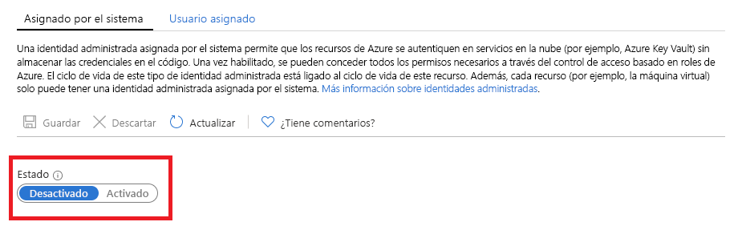

# ¿Qué son las identidades administradas de recursos de Azure?

[!INCLUDE [preview-notice](../../../includes/active-directory-msi-preview-notice.md)]

Como desarrollador de la nube, es probable que busque el método más sencillo y más seguro para acceder a los recursos de Azure en el código. 

Las identidades administradas para los recursos de Azure pueden ayudarle con este requisito ya que las identidades administradas:

- **Eliminan** la necesidad de credenciales en el código.
- **Cambian** las credenciales automáticamente.
- **Reducen** su participación en la administración de identidades al mínimo.

## Funcionamiento 

Todos los recursos de Azure que admiten identidades administradas pueden obtener tokens para intercambiar datos sin tener credenciales en el código. El proceso consta de los pasos siguientes:

 
1.  **Habilitar**: crea la identidad administrada para el recurso.
2.  **Conceder acceso**: permite el acceso a los recursos con el control de acceso basado en roles de Azure.
3.  **Acceder**: realiza las acciones permitidas.
4.  **Deshabilitar**: elimina la identidad administrada. 

## Tipos de identidad administrada

Hay dos tipos de identidades administradas:

- Identidad administrada asignada por el sistema

- Identidad administrada asignada por el usuario

En el caso de los recursos independientes de Azure, puede habilitar identidades administradas **asignadas por el sistema**. Las identidades administradas asignadas por el sistema proporcionan la compatibilidad más conveniente desde la perspectiva de la administración de identidades. Con solo un clic, puede habilitar la administración automatizada del ciclo de vida de una identidad para el recurso.   

   

Aunque las identidades administradas asignadas por el sistema proporcionan la solución más conveniente para los recursos independientes, todo cambia si necesita administrar un grupo de recursos de Azure para la misma tarea. En este escenario, es mejor crear una identidad manualmente y asignar esta identidad maestra a todos los recursos de Azure que necesita agrupar. Esta asignación se denomina identidad administrada **asignada por el usuario**. 
  

## Servicios admitidos

Puede usar las identidades administradas para recursos de Azure para autenticarse en los servicios que admiten la autenticación de Azure AD. Para ver una lista de los servicios de Azure que admiten la característica Managed Identities for Azure Resources, consulte [Services that support managed identities for Azure resources](services-support-msi.md) (Servicios que admiten la característica Managed Identities for Azure Resources).

## Pasos siguientes

Empiece a utilizar la característica Managed Identities for Azure Resources con las guías de inicio rápido siguientes:

* [Uso de las identidades administradas asignadas por el sistema de una máquina virtual Windows para acceder a Resource Manager](tutorial-windows-vm-access-arm.md)
* [Uso de las identidades administradas asignadas por el sistema de una máquina virtual Linux para acceder a Resource Manager](tutorial-linux-vm-access-arm.md)
