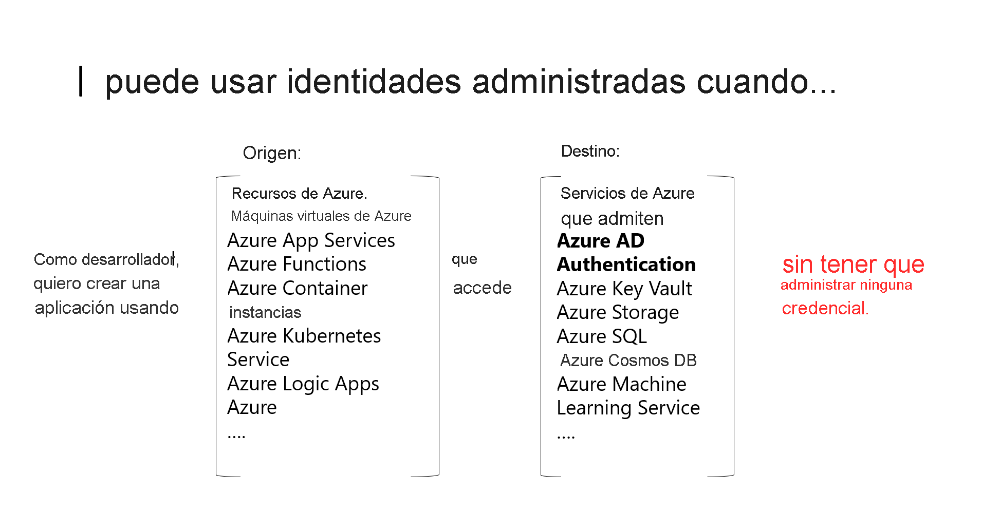

# ¿Qué son las identidades administradas de recursos de Azure?

Un desafío común para los desarrolladores es la administración de secretos y credenciales para proteger la comunicación entre distintos servicios. En Azure, las identidades administradas eliminan la necesidad de que los desarrolladores administren credenciales, al proporcionar una identidad para el recurso de Azure en Azure AD y usarla para obtener tokens de Azure Active Directory (Azure AD). Esto también permite acceder a [Azure Key Vault](../../key-vault/general/overview.md), en donde los desarrolladores pueden almacenar credenciales de forma segura. Las identidades administradas para recursos de Azure solucionan este problema al proporcionar a los servicios de Azure una identidad administrada automáticamente en Azure AD.

¿Para qué se puede usar una identidad administrada?

   > [!VIDEO https://www.youtube.com/embed/5lqayO_oeEo]

Estas son algunas de las ventajas de usar las identidades administradas:

- No es necesario administrar credenciales. Las credenciales ni siquiera están accesible.
- Puede usar las identidades administradas para autenticarse en cualquier servicio de Azure que admita la autenticación de Azure AD, como Azure Key Vault.
- Las identidades administradas se pueden usar sin ningún costo adicional.

> [!NOTE]
> Identidades administradas para recursos de Azure es el nombre con el que ahora se conoce al servicio Managed Service Identity (MSI).

## Tipos de identidad administrada

Hay dos tipos de identidades administradas:

- **Asignada por el sistema**. Algunos servicios de Azure permiten habilitar una identidad administrada directamente en una instancia de servicio. Cuando se habilita una identidad administrada asignada por el sistema, se crea una identidad en Azure AD que está vinculada al ciclo de vida de esa instancia de servicio. Por tanto, cuando se elimina el recurso, Azure elimina automáticamente la identidad. Por diseño, solo ese recurso de Azure puede usar esta identidad para solicitar tokens de Azure AD.
- **Asignada por el usuario**. También es posible crear una identidad administrada como un recurso independiente de Azure. Puede [crear una identidad administrada asignada por el usuario](how-to-manage-ua-identity-portal.md) y asignarla a una o varias instancias de un servicio de Azure. En el caso de las identidades administradas asignadas por el usuario, la identidad se administra independientemente de los recursos que la utilicen.   

  > [!VIDEO https://www.youtube.com/embed/OzqpxeD3fG0]

En la tabla siguiente, se muestran las diferencias entre los dos tipos de identidades administradas.

|  Propiedad    | Identidad administrada asignada por el sistema | Identidad administrada asignada por el usuario |
|------|----------------------------------|--------------------------------|
| Creación |  Se crea como parte de un recurso de Azure (por ejemplo, una máquina virtual de Azure o Azure App Service) | Se crea como un recurso de Azure independiente |
| Ciclo de vida | Se comparte el ciclo de vida con el recurso de Azure con el que se creó la identidad administrada.   Si se elimina el recurso primario, se elimina también la identidad administrada. | Ciclo de vida independiente.   Se debe eliminar explícitamente. |
| Uso compartido de recursos de Azure | No se puede compartir.   Solo se puede asociar con un único recurso de Azure. | Se puede compartir   La misma identidad administrada asignada por el usuario se puede asociar con más de un recurso de Azure. |
| Casos de uso comunes | Cargas de trabajo contenidas en un único recurso de Azure   Cargas de trabajo para las que necesita identidades independientes.   Por ejemplo, una aplicación que se ejecuta en una sola máquina virtual | Cargas de trabajo que se ejecutan en varios recursos y que pueden compartir una única identidad.   Cargas de trabajo que necesitan autorización previa para un recurso seguro como parte de un flujo de aprovisionamiento.   Cargas de trabajo donde los recursos se reciclan con frecuencia, pero los permisos deben permanecer coherentes.   Por ejemplo, una carga de trabajo en la que varias máquinas virtuales tienen que acceder al mismo recurso |

>[!IMPORTANT]
>Independientemente del tipo de identidad elegido, una identidad administrada es una entidad de servicio de un tipo especial que solo se puede usar con recursos de Azure. Cuando se elimina la identidad administrada, se quita automáticamente la entidad de servicio correspondiente.

## ¿Cómo se usan las identidades administradas de Managed Identities for Azure Resources?

## ¿Qué servicios de Azure admiten la característica?

Las identidades administradas de Managed Identities for Azure Resources se pueden usar para autenticarse en servicios que admiten la autenticación de Azure AD. Para ver una lista de los servicios de Azure que admiten la característica Managed Identities for Azure Resources, consulte [Services that support managed identities for Azure resources](./services-support-managed-identities.md) (Servicios que admiten la característica Managed Identities for Azure Resources).

## Pasos siguientes

* [Uso de las identidades administradas asignadas por el sistema de una máquina virtual Windows para acceder a Resource Manager](tutorial-windows-vm-access-arm.md)
* [Uso de las identidades administradas asignadas por el sistema de una máquina virtual Linux para acceder a Resource Manager](tutorial-linux-vm-access-arm.md)
* [Cómo usar identidades administradas para App Service y Azure Functions](../../app-service/overview-managed-identity.md)
* [Cómo utilizar una identidad administrada con Azure Container Instances](../../container-instances/container-instances-managed-identity.md)
* [Implementación de identidades administradas para recursos de Microsoft Azure](https://www.pluralsight.com/courses/microsoft-azure-resources-managed-identities-implementing).