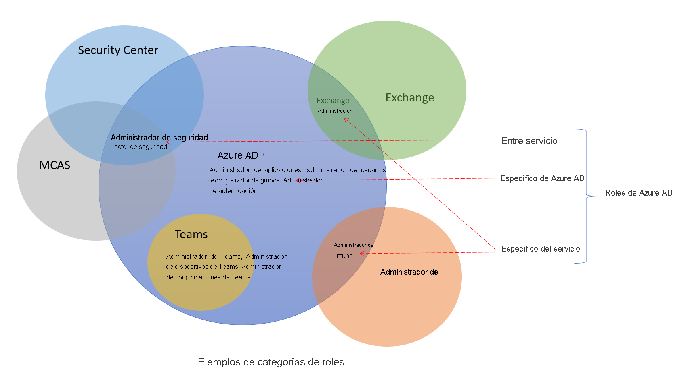

# Descripción de los roles en Azure Active Directory

En Azure Active Directory (Azure AD) hay unos 60 roles integrados, que son roles con un conjunto fijo de permisos de rol. Para complementar los roles integrados, Azure AD también admite roles personalizados. Use roles personalizados para seleccionar los permisos de rol que desee. Por ejemplo, puede crear uno para administrar determinados recursos de Azure AD, como aplicaciones o entidades de servicio.

En este artículo se explica qué son los roles de Azure AD y cómo se pueden usar.

## Diferencias entre los roles de Azure AD y los de Microsoft 365

Hay muchos servicios diferentes en Microsoft 365, como Azure AD e Intune. Algunos de estos servicios tienen sus propios sistemas de control de acceso basado en rol, como:

- Azure AD
- Exchange
- Intune
- Security Center
- Centro de cumplimiento
- Microsoft Cloud App Security
- Operaciones comerciales

Otros servicios como Teams, SharePoint y Managed Desktop, no tienen sistemas de control de acceso basados en rol independientes. Usan los roles de Azure AD para el acceso administrativo. Azure tiene su propio sistema de control de acceso basado en rol para los recursos de Azure, como las máquinas virtuales, que no es el mismo que los roles de Azure AD.

Cuando decimos "un sistema de control de acceso basado en rol independiente", significa que hay un almacén de datos diferente en el que se almacenan las definiciones y las asignaciones de roles. Del mismo modo, se realizan controles de acceso en puntos definidos por distintas directivas. Para más información, consulte [Roles de los servicios de Microsoft 365 en Azure AD](m365-workload-docs.md) y [Roles de administrador de la suscripción clásica, roles de Azure y roles de Azure AD](../../role-based-access-control/rbac-and-directory-admin-roles.md).

## ¿Por qué algunos roles de Azure AD son para otros servicios?

Microsoft 365 tiene varios sistemas de control de acceso basado en rol que se han desarrollado de forma independiente con el tiempo, cada uno con su propio portal de servicios. Para que sea práctico administrar las identidades en Microsoft 365 desde el portal de Azure AD, se han agregado roles integrados de servicios específicos, cada uno de los cuales concede acceso administrativo a un servicio de Microsoft 365. Un ejemplo de esta incorporación es el rol Administrador de Exchange en Azure AD. Este rol es equivalente al [grupo de roles Administración de la organización](/exchange/organization-management-exchange-2013-help) en el sistema de control de acceso basado en rol de Exchange y administra todos los aspectos de Exchange. Del mismo modo, se ha agregado el rol Administrador de Intune, Administrador de Teams, Administrador de SharePoint, etc. Los roles de servidor específico son una de las categorías de los roles integrados de Azure AD que se tratan en la sección siguiente.

## Categorías de roles de Azure AD

Los roles integrados de Azure AD se diferencian según el lugar en el que se usan, el cual se puede dividir en tres categorías.

- **Roles específicos de Azure AD**: estos roles conceden permisos para administrar recursos solo en Azure AD. Por ejemplo, Administrador de usuarios, Administrador de aplicaciones, Administrador de grupos, todos conceden permisos para administrar recursos que residen en Azure AD.
- **Roles de servicio específico:** en el caso de los principales servicios de Microsoft 365 (distintos de Azure AD), hemos creado roles de servicio específico que conceden permisos para administrar todas las características de ese servicio.  Por ejemplo, los roles Administrador de Exchange, Administrador de Intune, Administrador de SharePoint y Administrador de Teams pueden administrar características de sus servicios respectivos. El Administrador de Exchange administra los buzones de correo, el Administrador de Intune administra las directivas de dispositivo, el Administrador de SharePoint administra las colecciones de sitios, el Administrador de Teams administra las cualidades de las llamadas, etc.
- **Roles multiservicios**: hay algunos roles que abarcan varios servicios. Tenemos dos roles globales: Administrador global y Lector global. Estos dos roles abarcan todos los servicios de Microsoft 365. Además, hay algunos roles relacionados con la seguridad, como el Administrador de seguridad y el Lector de seguridad, que conceden acceso a varios servicios de seguridad en Microsoft 365. Por ejemplo, con roles Administrador de seguridad en Azure AD puede administrar Security Center de Microsoft 365, Protección contra amenazas avanzada de Microsoft Defender y Microsoft Cloud App Security. Del mismo modo, en el rol Administrador de cumplimiento puede administrar la configuración relacionada con el cumplimiento en el Centro de cumplimiento de Microsoft 365, Exchange, etc.

La tabla siguiente se ofrece como ayuda para comprender estas categorías de rol. Las categorías se denominan arbitrariamente y no pretenden incluir otras funcionalidades aparte de los [permisos de rol documentados](permissions-reference.md).

Category | Role
---- | ----
Roles específicos de Azure AD | Administrador de aplicaciones Desarrollador de aplicaciones Administrador de autenticación Administrador de conjuntos de claves B2C con IEF Administrador de directivas B2C con IEF Administrador de aplicaciones en la nube Administrador de dispositivos en la nube Administrador de acceso condicional Administradores de dispositivos Lectores de directorios Cuentas de sincronización de directorios Escritores de directorios Administrador de flujos de usuarios con id. externo Administrador de atributos de flujos de usuarios con id. externo Administrador de proveedor de identidades externo Administrador de grupos Invitador de usuarios Administrador del departamento de soporte técnico Administrador de identidades híbridas Administrador de licencias Soporte para asociados de nivel 1 Soporte para asociados de nivel 2 Administrador de contraseñas Administrador de autenticación con privilegios Administrador de roles con privilegios Lector de informes Administrador de cuenta de usuario
Roles multiservicios | Administrador de la compañía Administrador de cumplimiento Administrador de datos de cumplimiento Lector global Administrador de seguridad Operador de seguridad Lector de seguridad Administrador del soporte técnico del servicio
Roles de servicio específico | Administrador de Azure DevOps Administrador de Azure Information Protection Administrador de facturación Administrador de servicios de CRM Aprobador del acceso a la Caja de seguridad del cliente Administrador de análisis de escritorio Administrador de servicios de Exchange Administrador de Insights Coordinador de Insights de la empresa Administrador de servicios de Intune Administrador de Kaizala Administrador de servicios de Lync Lector de privacidad del Centro de mensajes Lector del Centro de mensajes Usuario de comercio moderno Administrador de red Administrador de aplicaciones de Office Administrador de servicios de Power BI Administrador de Power Platform Administrador de impresoras Técnico de impresoras Administrador de búsqueda Editor de búsqueda Administrador de servicios de SharePoint Administrador de comunicaciones de Teams Ingeniero de soporte técnico de comunicaciones de Teams Especialista de soporte técnico de comunicaciones de Teams Administrador de dispositivos de Teams Administrador de servicios de Teams

## Pasos siguientes

- [Introducción al control de acceso basado en rol de Azure AD](custom-overview.md)
- Creación de asignaciones de roles con [Azure Portal, Azure AD PowerShell y Graph API](custom-create.md)
- [Visualización de las asignaciones de un rol](custom-view-assignments.md)
