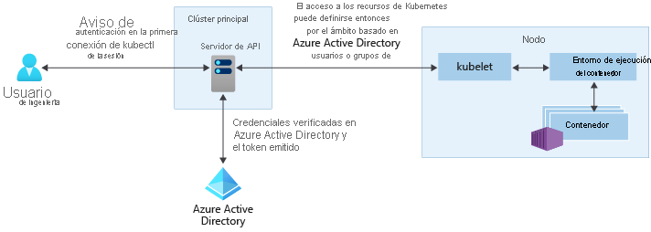

# Opciones de acceso e identidad en Azure Kubernetes Service (AKS)

Hay diferentes maneras de autenticarse, controlar el acceso y autorizar y proteger los clústeres de Kubernetes. Mediante el control de acceso basado en rol de Kubernetes (RBAC de Kubernetes), puede conceder acceso a usuarios, grupos y cuentas de servicio únicamente a los recursos que necesitan. Con Azure Kubernetes Service (AKS), puede mejorar aún más la seguridad y la estructura de permisos mediante el uso de Azure Active Directory y Azure RBAC. Estos enfoques le ayudan a proteger el acceso al clúster y a proporcionarles solo los permisos mínimos necesarios a los desarrolladores y operadores.

En este artículo se presentan los conceptos básicos para ayudarle a autenticarse y a asignar permisos en AKS:

- [Control de acceso basado en rol de Kubernetes (RBAC de Kubernetes)](#kubernetes-role-based-access-control-kubernetes-rbac)
  - [Roles y ClusterRoles](#roles-and-clusterroles)
  - [RoleBindings y ClusterRoleBindings](#rolebindings-and-clusterrolebindings) 
  - [Cuentas de servicio de Kubernetes](#kubernetes-service-accounts)
- [Integración de Azure Active Directory](#azure-active-directory-integration)
- [Azure RBAC](#azure-role-based-access-control-azure-rbac)
  - [Azure RBAC para autorizar el acceso al recurso de AKS](#azure-rbac-to-authorize-access-to-the-aks-resource)
  - [Azure RBAC para la autorización de Kubernetes (versión preliminar)](#azure-rbac-for-kubernetes-authorization-preview)

## Control de acceso basado en rol de Kubernetes (RBAC de Kubernetes)

Para facilitar el filtrado detallado de las acciones que los usuarios pueden efectuar, Kubernetes utiliza el control de acceso basado en rol de Kubernetes (RBAC de Kubernetes). Este mecanismo de control le permite asignar a usuarios o grupos de usuarios, permiso para realizar acciones como crear o modificar recursos, o ver registros de cargas de trabajo de aplicaciones en ejecución. Estos permisos se pueden limitar a un único espacio de nombres o conceder en todo el clúster de AKS. Con el control de acceso basado en rol de Kubernetes, puede crear *roles* para definir permisos y, después, asignar esos roles a usuarios mediante *enlaces de rol*.

Para obtener más información, consulte [Uso de la autorización de RBAC de Kubernetes][kubernetes-rbac].

### Roles y ClusterRoles

Antes de asignar permisos a los usuarios con el control de acceso basado en rol de Kubernetes, defina primero esos permisos como un *rol*. Los roles de Kubernetes *conceden* permisos. No hay ningún concepto de *denegación* de permiso.

Los roles se usan para conceder permisos en un espacio de nombres. Si necesita conceder permisos en todo el clúster o para recursos de clúster fuera de un espacio de nombres determinado, puede usar en su lugar *ClusterRoles*.

Un ClusterRole funciona de la misma manera para conceder permisos a los recursos, pero se puede aplicar a los recursos de todo el clúster, no solo a los de un espacio de nombres específico.

### RoleBindings y ClusterRoleBindings

Una vez que se definen roles para conceder permisos a los recursos, asigne esos permisos de RBAC de Kubernetes con un *RoleBinding*. Si el clúster de AKS [se integra con Azure Active Directory (Azure AD)](#azure-active-directory-integration), los enlaces son la forma en que se otorgan permisos a esos usuarios de Azure AD para realizar acciones dentro del clúster, vea cómo en [Administración del acceso a recursos de clúster mediante el control de acceso basado en roles de Kubernetes y las identidades de Azure Active Directory](azure-ad-rbac.md).

Los enlaces de roles se usan para asignar roles para un espacio de nombres determinado. Este enfoque le permite separar lógicamente un único clúster de AKS, con usuarios que solo pueden acceder a los recursos de la aplicación en su espacio de nombres asignado. Si necesita enlazar roles en todo el clúster o para recursos de clúster fuera de un espacio de nombres determinado, puede usar en su lugar *ClusterRoleBindings*.

Un ClusterRoleBinding funciona de la misma manera para enlazar roles con usuarios, pero se puede aplicar a los recursos de todo el clúster, no solo a los de un espacio de nombres específico. Este enfoque le permite conceder acceso para los administradores o ingenieros de soporte técnico a todos los recursos del clúster de AKS.

> [!NOTE]
> Todas las acciones de clúster realizadas por Microsoft/AKS se realizan con el consentimiento del usuario en un rol de Kubernetes integrado `aks-service` y el enlace de roles integrado `aks-service-rolebinding`. Este rol permite a AKS solucionar problemas de clústeres, pero no puede modificar permisos ni crear roles, enlaces de roles ni otras acciones de privilegios elevados. El acceso a roles solo se habilita en incidencias de soporte técnico activos con acceso Just-in-Time (JIT). Obtenga más información sobre [Directivas de soporte técnico de AKS](support-policies.md).

### Cuentas de servicio de Kubernetes

Uno de los tipos de usuario principales de Kubernetes es una *cuenta de servicio*. Una cuenta de servicio existe en la API de Kubernetes y está administrada por esta. Las credenciales de las cuentas de servicio se almacenan como secretos de Kubernetes que usan los pods autorizados para comunicarse con el servidor de API. La mayoría de las solicitudes de API proporcionan un token de autenticación para una cuenta de servicio o una cuenta de usuario normal.

Las cuentas de usuario normales permiten un acceso más tradicional para administradores o desarrolladores humanos, no solo a servicios y procesos. Kubernetes por sí solo no proporciona una solución de administración de identidades donde se almacenan contraseñas y cuentas de usuario normales. En su lugar, se pueden integrar soluciones de identidad externas en Kubernetes. Para los clústeres de AKS, esta solución de identidades integrada es Azure Active Directory.

Para más información sobre las opciones de identidad en Kubernetes, consulte la [autenticación Kubernetes][kubernetes-authentication].

## Integración de Azure Active Directory

Puede mejorar la seguridad de los clústeres de AKS con la integración de Azure Active Directory (AD). Compilada después de varias décadas de administración de identidades empresariales, Azure AD es un servicio multiinquilino de administración de identidades y de directorios basado en la nube que combina los servicios de directorio principales, la administración del acceso de las aplicaciones y la protección de identidades. Con Azure AD, puede integrar identidades locales en clústeres de AKS para proporcionar un único origen para la seguridad y administración de cuentas.

Con los clústeres de AKS integrados en Azure AD, puede conceder a los usuarios o grupos acceso a los recursos de Kubernetes de un espacio de nombres o del clúster. Para obtener un contexto de configuración de `kubectl`, el usuario puede ejecutar el comando [az aks get-credentials][az-aks-get-credentials]. Cuando un usuario interactúa con el clúster de AKS con `kubectl`, se le pide que inicie sesión con sus credenciales de Azure AD. Este enfoque proporciona un único origen para la administración de cuentas de usuario y de las credenciales de contraseña. El usuario solo puede acceder a los recursos como defina el administrador de clústeres.

La autenticación de Azure AD se proporciona a los clústeres de AKS con OpenID Connect. OpenID Connect es una capa de identidad creada basándose en el protocolo OAuth 2.0. Puede encontrar más información sobre OpenID Connect en la [documentación de OpenID Connect][openid-connect]. Dentro del clúster de Kubernetes, se usa [la autenticación de token de webhook][webhook-token-docs] para verificar los tokens de autenticación. La autenticación de token de webhook se configura y administra como parte del clúster de AKS.

### Webhook y servidor de API

Como se muestra en el gráfico anterior, el servidor de API llama al servidor de webhook de AKS y realiza los pasos siguientes:

1. Kubectl usa la aplicación cliente de Azure AD para el inicio de sesión de los usuarios con [Flujo de concesión de autorización de dispositivos OAuth 2.0](../active-directory/develop/v2-oauth2-device-code.md).
2. Azure AD proporciona un access_token, id_token y un refresh_token.
3. El usuario realiza una solicitud a kubectl con un access_token de kubeconfig.
4. Kubectl envía el access_token a APIServer.
5. El servidor de API se configura con el servidor de autenticación de Webhook para realizar la validación.
6. El servidor de autenticación de webhook confirma que la firma JSON Web Token es válida mediante la comprobación de la clave de firma pública de Azure AD.
7. La aplicación del servidor usa credenciales proporcionadas por el usuario para consultar la pertenencia a grupos del usuario que ha iniciado sesión desde la MS Graph API.
8. Se envía una respuesta al APIServer con información de usuario, como la demanda de nombre principal de usuario (UPN) del token de acceso, y la pertenencia al grupo del usuario basándose en el identificador de objeto.
9. La API realiza una decisión de autorización basada en el rol Kubernetes/RoleBinding.
10. Una vez autorizado, el servidor de API devuelve una respuesta a kubectl.
11. Kubectl envía comentarios al usuario.
 
**Obtenga información sobre cómo integrar AKS con AAD [aquí](managed-aad.md).**

## Control de acceso basado en roles de Azure (RBAC de Azure)

Azure RBAC es un sistema de autorización basado en [Azure Resource Manager](../azure-resource-manager/management/overview.md) que proporciona administración de acceso específico a los recursos de Azure.

 Azure RBAC está diseñado para trabajar con los recursos de la suscripción de Azure mientras Kubernetes RBAC está diseñado para trabajar con los recursos de Kubernetes del clúster de AKS. 

Con el control de acceso basado en rol de Azure, puede crear una *definición de rol* que describe los permisos que se aplicarán. A continuación, se asigna esta definición de rol a un usuario o grupo a través de una *asignación de roles* para un *ámbito* determinado que puede ser un recurso individual, un grupo de recursos o en toda la suscripción.

Para obtener más información, consulte [¿Qué es el control de acceso basado en roles (RBAC) de Azure?][azure-rbac]

Hay dos niveles de acceso necesarios para operar completamente un clúster de AKS: 
1. [Acceso al recurso de AKS en la suscripción de Azure](#azure-rbac-to-authorize-access-to-the-aks-resource) Este proceso permite controlar las cosas que escalan o actualizan el clúster mediante las API de AKS, así como la extracción de kubeconfig.
2. Acceso al API de Kubernetes. Este acceso se controla mediante [Kubernetes RBAC](#kubernetes-role-based-access-control-kubernetes-rbac) (tradicionalmente) o la [integración de Azure RBAC con AKS para la autorización de Kubernetes](#azure-rbac-for-kubernetes-authorization-preview).

### Azure RBAC para autorizar el acceso al recurso de AKS

Con Azure RBAC, puede proporcionar a los usuarios (o identidades) acceso granular a los recursos de AKS en una o varias suscripciones. Por ejemplo, puede tener el [rol de colaborador de Azure Kubernetes Service](../role-based-access-control/built-in-roles.md#azure-kubernetes-service-contributor-role) que le permite realizar acciones como escalar y actualizar el clúster. Mientras que otro usuario podría tener el [rol de administrador de clúster de Azure Kubernetes Service](../role-based-access-control/built-in-roles.md#azure-kubernetes-service-cluster-admin-role) que solo concede permiso para extraer el kubeconfig de administración.

Como alternativa, puede conceder al usuario el rol de [Colaborador](../role-based-access-control/built-in-roles.md#contributor) general, que abarcaría los permisos anteriores y todas las acciones posibles en el recurso AKS, con la excepción de administrar los permisos.

Vea más información sobre cómo usar Azure RBAC para proteger el acceso al archivo kubeconfig que proporciona acceso a la API de Kubernetes [aquí](control-kubeconfig-access.md).

### Azure RBAC para la autorización de Kubernetes (versión preliminar)

Con la integración de la característica RBAC de Azure, AKS utilizará un servidor de webhooks de autorización de Kubernetes, lo que le permitirá administrar los permisos y asignaciones de los recursos del clúster K8s integrados en Azure AD utilizando la definición y la asignación de roles de Azure AD.

Como se muestra en el diagrama anterior, al usar la integración de Azure RBAC, todas las solicitudes a la API Kubernetes seguirán el mismo flujo de autenticación que se explica en la [sección de integración de Azure Active](#azure-active-directory-integration). 

Pero después, en lugar de confiar exclusivamente en el RBAC de Kubernetes para la autorización, la solicitud se va a autorizar realmente con Azure, siempre y cuando la identidad que haya realizado la solicitud exista en AAD. Si la identidad no existe en AAD, por ejemplo una cuenta de servicio de Kubernetes, Azure RBAC no se iniciará y será el RBAC de Kubernetes normal.

En este escenario, puede proporcionar a los usuarios uno de los cuatro roles integrados o crear roles personalizados como haría con los roles de Kubernetes, pero en este caso con las API y los mecanismos de Azure RBAC. 

Esta característica le permitirá, por ejemplo, no solo conceder a los usuarios permisos para el recurso AKS entre suscripciones, sino configurar y darles el rol y los permisos que tendrán dentro de cada uno de los clústeres que controlan el acceso a la API de Kubernetes. Por ejemplo, puede conceder el rol de `Azure Kubernetes Service RBAC Viewer` en el ámbito de la suscripción y su destinatario podrá mostrar y obtener todos los objetos Kubernetes de todos los clústeres, pero no modificarlos.

#### Roles integrados

AKS proporciona los siguientes cuatro roles integrados. Son similares a los [roles integrados de Kubernetes](https://kubernetes.io/docs/reference/access-authn-authz/rbac/#user-facing-roles) pero con algunas diferencias, como la compatibilidad con CRDs. Para obtener la lista completa de acciones permitidas por cada rol integrado, consulte [aquí](../role-based-access-control/built-in-roles.md).

| Role                                | Descripción  |
|-------------------------------------|--------------|
| Visor de Azure Kubernetes Service RBAC  | Permite el acceso de solo lectura para ver la mayoría de los objetos en un espacio de nombres. No permite la visualización de roles o enlaces de roles. Este rol no permite la visualización de `Secrets`, ya que leer el contenido de los secretos permite el acceso a las credenciales de `ServiceAccount` en el espacio de nombres, que permitiría el acceso a la API como cualquier `ServiceAccount` en el espacio de nombres (una forma de elevación de privilegios).  |
| Escritor de Azure Kubernetes Service RBAC | Permite el acceso de lectura y escritura para ver la mayoría de los objetos en un espacio de nombres. Este rol no permite la visualización o modificación de roles o enlaces de roles. Sin embargo, este rol permite acceder a `Secrets` y ejecutar pods como cualquier ServiceAccount en el espacio de nombres, por lo que se puede usar para obtener los niveles de acceso de la API de cualquier ServiceAccount en el espacio de nombres. |
| Administrador de Azure Kubernetes Service RBAC  | Permite el acceso de administrador, diseñado para su concesión dentro de un espacio de nombres. Permite el acceso de lectura y escritura a la mayoría de los recursos de un espacio de nombres (o ámbito de clúster), incluida la capacidad de crear roles y enlaces de roles dentro del espacio de nombres. Este rol no permite el acceso de escritura a la cuota de recursos o al espacio de nombres en sí. |
| Administrador de clúster de Azure Kubernetes Service RBAC  | Permite el acceso de superusuario para realizar cualquier acción en cualquier recurso. Proporciona control total sobre todos los recursos del clúster y en todos los espacios de nombres. |

**Para obtener información sobre cómo habilitar Azure RBAC para la autorización de Kubernetes, consulte [esta página](manage-azure-rbac.md).**

## Resumen

En esta tabla se resumen las formas en que los usuarios pueden autenticarse en Kubernetes cuando se habilita la integración de Azure AD.  En todos los casos, la secuencia de comandos del usuario es:
1. Ejecute `az login` para autenticarse en Azure.
1. Ejecute `az aks get-credentials` para descargar las credenciales del clúster en `.kube/config`.
1. Ejecute comandos `kubectl` (el primero de los cuales puede desencadenar la autenticación basada en explorador para autenticarse en el clúster, tal y como se describe en la tabla siguiente).

La concesión de roles a la que se hace referencia en la segunda columna es la concesión de roles RBAC de Azure que se muestra en la pestaña **Control de acceso** de Azure Portal. El grupo de administración de clústeres de Azure AD se muestra en la pestaña **Configuración** del portal (o con el nombre de parámetro `--aad-admin-group-object-ids` en la CLI de Azure).

| Descripción        | Concesión de rol requerida| Grupos de administración de clústeres de Azure AD | Cuándo se usa |
| -------------------|------------|----------------------------|-------------|
| Inicio de sesión de administrador heredado con certificado de cliente| **Rol de administrador de Azure Kubernetes**. Este rol permite usar `az aks get-credentials` con la marca `--admin`, que descarga un [certificado de administrador de clústeres heredado (no de Azure AD)](control-kubeconfig-access.md) en `.kube/config` del usuario. Este es el único propósito del "rol de administrador de Azure Kubernetes".|N/D|Si está bloqueado de forma permanente porque no tiene acceso a un grupo válido de Azure AD con acceso al clúster.| 
| Azure AD con (Cluster)RoleBindings manual| **Rol de usuario de Azure Kubernetes**. El rol "Usuario" permite usar `az aks get-credentials` sin la marca `--admin`. (Este es el único propósito del "rol de usuario de Azure Kubernetes"). El resultado, en un clúster habilitado para Azure AD, es la descarga de [una entrada vacía](control-kubeconfig-access.md) en `.kube/config`, que desencadena la autenticación basada en explorador cuando se usa por primera vez en `kubectl`.| El usuario no se encuentra en ninguno de estos grupos. Dado que el usuario no está en ningún grupo de administración de clústeres, cualquier RoleBindings o ClusterRoleBindings configurado por los administradores de clústeres controlarán por completo sus derechos. (Cluster)RoleBindings [designa los usuarios de Azure AD o los grupos de Azure AD](azure-ad-rbac.md) como sus `subjects`. Si no se ha configurado ningún enlace de este tipo, el usuario no podrá ejecutar ningún comando `kubectl`.|Si desea tener un control de acceso específico y no usa RBAC de Azure para la autorización de Kubernetes. Tenga en cuenta que el usuario que configura los enlaces debe iniciar sesión con uno de los otros métodos enumerados en esta tabla.|
| Azure AD por miembro de grupo de administración| Lo mismo que antes.|El usuario es miembro de uno de los grupos que se indican aquí. AKS genera automáticamente un elemento ClusterRoleBinding que enlaza todos los grupos indicados al rol `cluster-admin` de Kubernetes. De este modo, los usuarios de estos grupos pueden ejecutar todos los comandos `kubectl` como `cluster-admin`.|Si desea conceder de forma práctica a los usuarios derechos de administrador completos y _no_ usan RBAC de Azure para la autorización de Kubernetes.|
| Azure AD con RBAC de Azure para la autorización de Kubernetes|Dos roles: En primer lugar, el **rol de usuario de Azure Kubernetes**. En segundo lugar, uno de los roles **RBAC** de "Azure Kubernetes Service" indicados anteriormente, o su propia alternativa personalizada.|El campo de roles de administrador de la pestaña Configuración es irrelevante cuando está habilitada la autorización de RBAC de Azure para Kubernetes.|Usa RBAC de Azure para la autorización de Kubernetes. Este enfoque proporciona un control específico, sin necesidad de configurar RoleBindings o ClusterRoleBindings.|

## Pasos siguientes

- Para empezar a trabajar con Azure AD y el RBAC de Kubernetes, consulte [Integración de Azure Active Directory con AKS][aks-aad].
- Para conocer los procedimientos recomendados asociados, consulte [Procedimientos recomendados para la autenticación y la autorización en AKS][operator-best-practices-identity].
- Para empezar a trabajar con Azure RBAC para la autorización de Kubernetes, consulte [usar Azure RBAC para autorizar el acceso en el clúster de Azure Kubernetes Service (AKS)](manage-azure-rbac.md).
- Para empezar a proteger el archivo kubeconfig, consulte [limitar el acceso al archivo de configuración del clúster](control-kubeconfig-access.md)

Para obtener más información sobre los conceptos básicos de Kubernetes y AKS, consulte los artículos siguientes:

- [Clústeres y cargas de trabajo de Kubernetes/AKS][aks-concepts-clusters-workloads]
- [Seguridad de Kubernetes/AKS][aks-concepts-security]
- [Redes virtuales de Kubernetes/AKS][aks-concepts-network]
- [Almacenamiento de Kubernetes/AKS][aks-concepts-storage]
- [Escala de Kubernetes/AKS][aks-concepts-scale]

<!-- LINKS - External -->
[kubernetes-authentication]: https://kubernetes.io/docs/reference/access-authn-authz/authentication
[webhook-token-docs]: https://kubernetes.io/docs/reference/access-authn-authz/authentication/#webhook-token-authentication
[kubernetes-rbac]: https://kubernetes.io/docs/reference/access-authn-authz/rbac/

<!-- LINKS - Internal -->
[openid-connect]: ../active-directory/develop/v2-protocols-oidc.md
[az-aks-get-credentials]: /cli/azure/aks#az-aks-get-credentials
[azure-rbac]: ../role-based-access-control/overview.md
[aks-aad]: managed-aad.md
[aks-concepts-clusters-workloads]: concepts-clusters-workloads.md
[aks-concepts-security]: concepts-security.md
[aks-concepts-scale]: concepts-scale.md
[aks-concepts-storage]: concepts-storage.md
[aks-concepts-network]: concepts-network.md
[operator-best-practices-identity]: operator-best-practices-identity.md
