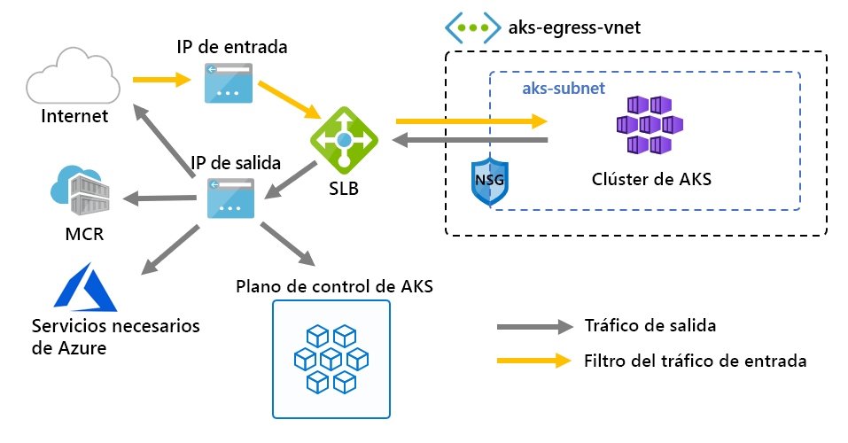

# Personalización de la salida de un clúster con una ruta definida por el usuario

La salida de un clúster de AKS se puede personalizar para escenarios específicos. De forma predeterminada, AKS aprovisionará un equilibrador de carga de SKU estándar, que se configurará y se usará para la salida. Sin embargo, es posible que la configuración predeterminada no cumpla los requisitos de todos los escenarios si no se permiten direcciones IP públicas o se requieren saltos adicionales para la salida.

En este artículo se explica cómo personalizar la ruta de salida de un clúster para admitir escenarios de red personalizados, como los que no permiten direcciones IP públicas y requieren que el clúster se encuentre detrás de un dispositivo virtual de red (NVA).

## Requisitos previos
* CLI de Azure, versión 2.0.81 o posterior.
* Versión de API `2020-01-01` o posterior

## Limitaciones
* OutboundType solo se puede definir en el momento de crear el clúster y no se puede actualizar después.
* La configuración de `outboundType` requiere clústeres de AKS con un valor de `vm-set-type` de `VirtualMachineScaleSets`, y un valor de `load-balancer-sku` de `Standard`.
* Para configurar `outboundType` en un valor de `UDR`, se necesita una ruta definida por el usuario con conectividad de salida válida para el clúster.
* Configurar `outboundType` en un valor de `UDR` implica que la IP de origen de la entrada enrutada al equilibrador de carga **no puede coincidir** con la dirección de destino de la salida del clúster.

## Introducción a los tipos de salida en AKS

Un clúster de AKS se puede personalizar con un valor de `outboundType` único del tipo de equilibrador de carga o enrutamiento definido por el usuario.

> [!IMPORTANT]
> El tipo de salida afecta solo al tráfico de salida del clúster. Para obtener más información, consulte cómo [configurar los controladores de entrada](ingress-basic.md).

> [!NOTE]
> Puede usar su propia [tabla de rutas][byo-route-table] con UDR y redes de kubenet. Asegúrese de que la identidad del clúster (entidad de servicio o identidad administrada) tenga permisos de colaborador en la tabla de enrutamiento personalizada.

### Tipo de salida de loadBalancer

Si se establece `loadBalancer`, AKS completa automáticamente la configuración siguiente. El equilibrador de carga se usa para la salida a través de una dirección IP pública asignada a AKS. El tipo de salida de `loadBalancer` admite los servicios de Kubernetes del tipo `loadBalancer`, que esperan la salida del equilibrador de carga creado por el proveedor de recursos de AKS.

AKS realiza la siguiente configuración.
   * Se aprovisiona una dirección IP pública para la salida del clúster.
   * La dirección IP pública se asocia al recurso de equilibrador de carga.
   * Se configuran los grupos de back-end del equilibrador de carga para los nodos del agente en el clúster.

A continuación se muestra una topología de red implementada en clústeres de AKS de forma predeterminada, que usa un valor de `outboundType` de `loadBalancer`.

### Tipo de salida de userDefinedRouting

> [!NOTE]
> El uso del tipo de salida es un escenario de redes avanzado y requiere una configuración de red adecuada.

Si se establece `userDefinedRouting`, AKS no configurará automáticamente las rutas de salida. El usuario debe encargarse de la configuración de salida.

El clúster de AKS debe implementarse en una red virtual existente con una subred que se haya configurado previamente porque, al no usar la arquitectura de equilibrador de carga estándar (SLB), debe establecer una salida explícita. Como tal, esta arquitectura requiere el envío explícito del tráfico de salida a un dispositivo, como un firewall, una puerta de enlace o un proxy, o para permitir que la traducción de direcciones de red (NAT) se realice mediante una dirección IP pública asignada al equilibrador de carga estándar o dispositivo.

El proveedor de recursos de AKS implementará un equilibrador de carga estándar (SLB). El equilibrador de carga no está configurado con ninguna regla y [no incurre en ningún cargo hasta que se coloca una regla](https://azure.microsoft.com/pricing/details/load-balancer/). AKS **no** aprovisionará automáticamente una dirección IP pública para el front-end de SLB ni configurará automáticamente el grupo de back-end del equilibrador de carga.

## Implementación de un clúster con el tipo de salida UDR y Azure Firewall

Para ilustrar la aplicación de un clúster con un tipo de salida que usa una ruta definida por el usuario, se puede configurar un clúster en una red virtual con una instancia de Azure Firewall en su propia subred. Consulte este ejemplo en [Restricción del tráfico de salida con Azure Firewall](limit-egress-traffic.md#restrict-egress-traffic-using-azure-firewall).

> [!IMPORTANT]
> El tipo de salida de UDR requiere que haya una ruta para 0.0.0.0/0 y un destino del próximo salto de NVA (aplicación virtual de red) en la tabla de rutas.
> La tabla de enrutamiento ya tiene un valor predeterminado de 0.0.0.0/0 a Internet, sin una dirección IP pública para SNAT, simplemente agregar esta ruta no le proporcionará la salida. AKS validará que no cree una ruta 0.0.0.0/0 que apunte a Internet, sino a NVA o a la puerta de enlace, etc.
> 
> Cuando se utiliza un tipo de salida de UDR, no se crea una dirección IP pública del equilibrador de carga a menos que se configure un servicio del tipo *loadbalancer*.

## Pasos siguientes

Consulte [Información general de redes de Microsoft Azure](../virtual-network/virtual-networks-udr-overview.md).

Consulte [cómo crear, modificar o eliminar una tabla de rutas](../virtual-network/manage-route-table.md).

<!-- LINKS - internal -->
[az-aks-get-credentials]: /cli/azure/aks?view=azure-cli-latest#az-aks-get-credentials
[byo-route-table]: configure-kubenet.md#bring-your-own-subnet-and-route-table-with-kubenet
