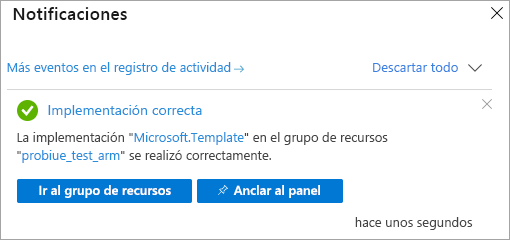

# <a name="quickstart-create-a-server---azure-resource-manager-template"></a>Inicio rápido: Creación de un servidor: plantilla de Azure Resource Manager

En este inicio rápido se describe cómo crear un recurso de servidor de Analysis Services en la suscripción de Azure mediante una plantilla de Resource Manager.

[!INCLUDE [About Azure Resource Manager](../../includes/resource-manager-quickstart-introduction.md)]

## <a name="prerequisites"></a>Prerrequisitos

* **Suscripción de Azure**: visite [Evaluación gratuita de Azure](https://azure.microsoft.com/offers/ms-azr-0044p/) para crear una cuenta.
* **Azure Active Directory**: la suscripción debe estar asociada a un inquilino de Azure Active Directory. Además, debe estar conectado en Azure con una cuenta en ese Azure Active Directory. Para más información, consulte [Permisos de usuario y autenticación](analysis-services-manage-users.md).

## <a name="create-a-server"></a>Creación de un servidor

### <a name="review-the-template"></a>Revisión de la plantilla

La plantilla usada en este inicio rápido forma parte de las [plantillas de inicio rápido de Azure](https://azure.microsoft.com/resources/templates/101-analysis-services-create/).

:::code language="json" source="~/quickstart-templates/101-analysis-services-create/azuredeploy.json" range="1-79" highlight="63-78":::

En la plantilla se define un único recurso [Microsoft.AnalysisServices/servers](https://docs.microsoft.com/azure/templates/microsoft.analysisservices/2017-08-01/servers) con una regla de Firewall. 

### <a name="deploy-the-template"></a>Implementación de la plantilla

1. Seleccione el vínculo Implementar en Azure siguiente para iniciar sesión en Azure y abrir una plantilla. La plantilla se usa para crear un recurso de servidor de Analysis Services y especificar propiedades obligatorias y opcionales.

   [](https://portal.azure.com/#create/Microsoft.Template/uri/https%3A%2F%2Fraw.githubusercontent.com%2FAzure%2Fazure-quickstart-templates%2Fmaster%2F101-analysis-services-create%2Fazuredeploy.json)

2. Seleccione o escriba los siguientes valores.

    A menos que se especifique lo contrario, use los valores predeterminados.

    * **Suscripción**: Seleccione una suscripción de Azure.
    * **Grupo de recursos**: haga clic en **Crear nuevo** y luego escriba un nombre único para el nuevo grupo de recursos.
    * **Ubicación**: seleccione una ubicación predeterminada para los recursos creados en el grupo de recursos.
    * **Server Name** (Nombre del servidor): escriba un nombre para el recurso de servidor. 
    * **Ubicación**: omita este campo para Analysis Services. La ubicación se especifica en Ubicación del servidor.
    * **Ubicación del servidor**: escriba la ubicación del servidor de Analysis Services. Suele ser la misma región que la ubicación predeterminada especificada para el grupo de recursos, pero no es obligatorio. Por ejemplo, **Centro-norte de EE. UU.** Para ver las regiones admitidas, consulte [Disponibilidad de Analysis Services por región](analysis-services-overview.md#availability-by-region).
    * **Nombre de SKU**: escriba el nombre de la SKU del servidor de Analysis Services que se va a crear. Elija entre las siguientes opciones: B1, B2, D1, S0, S1, S2, S3, S4, S8v2, S9v2. La disponibilidad de SKU depende de la región. Se recomiendan S0 o D1 para evaluación y pruebas.
    * **Capacity**: especifique el número total de instancias de escalado horizontal de réplicas de consultas. El escalado horizontal de más de una instancia solo se admite en regiones determinadas.
    * **Configuración de firewall**: especifique reglas de firewall de entrada que definir para el servidor. Si no se especifica, el firewall está deshabilitado.
    * **URI del contenedor de blobs de seguridad**: escriba el URI de SAS para un contenedor de Azure Blob Storage privado con permisos de lectura, escritura y lista. Solo es necesario si tiene previsto usar [Copia de seguridad o restauración](analysis-services-backup.md).
    * **Acepto los términos y condiciones anteriores**: Seleccionar.

3. Seleccione **Comprar**. Una vez que el servidor se haya implementado correctamente, recibirá una notificación:

   

## <a name="validate-the-deployment"></a>Validación de la implementación

Use Azure Portal o Azure PowerShell para comprobar que se ha creado el grupo de recursos y el recurso de servidor.

### <a name="powershell"></a>PowerShell

```azurepowershell-interactive
$resourceGroupName = Read-Host -Prompt "Enter the Resource Group name"
(Get-AzResource -ResourceType "Microsoft.AnalysisServices/servers" -ResourceGroupName $resourceGroupName).Name
 Write-Host "Press [ENTER] to continue..."
```

---

## <a name="clean-up-resources"></a>Limpieza de recursos

Cuando ya no los necesite, use Azure Portal, la CLI de Azure o Azure PowerShell para eliminar el grupo de recursos y el recurso del servidor.

# <a name="cli"></a>[CLI](#tab/CLI)

```azurecli-interactive
echo "Enter the Resource Group name:" &&
read resourceGroupName &&
az group delete --name $resourceGroupName &&
echo "Press [ENTER] to continue ..."
```

# <a name="powershell"></a>[PowerShell](#tab/PowerShell)

```azurepowershell-interactive
$resourceGroupName = Read-Host -Prompt "Enter the Resource Group name"
Remove-AzResourceGroup -Name $resourceGroupName
Write-Host "Press [ENTER] to continue..."
```

---

## <a name="next-steps"></a>Pasos siguientes

En este inicio rápido, ha usado una plantilla de Azure Resource Manager para crear un nuevo grupo de recursos y un recurso de servidor de Azure Analysis Services. Después de crear un recurso de servidor mediante la plantilla, tenga en cuenta lo siguiente:
- [Inicio rápido: Creación de un servidor: PowerShell](analysis-services-create-powershell.md)
- [Incorporación de un modelo de ejemplo desde el portal](analysis-services-create-sample-model.md)
- [Configuración de los roles de administrador del servidor y de usuario](tutorials/analysis-services-tutorial-roles.md)
