# <a name="quickstart-create-an-aspnet-core-web-app-in-azure"></a>Inicio rápido: Creación de una aplicación web ASP.NET Core en Azure

En esta guía de inicio rápido, aprenderá a crear e implementar su primera aplicación web de ASP.NET Core en [Azure App Service](overview.md). 

Cuando termine, tendrá un grupo de recursos de Azure que consta de un plan de hospedaje de App Service y una aplicación web implementada.

## <a name="prerequisites"></a>Prerrequisitos

- Una cuenta de Azure con una suscripción activa. [Cree una cuenta gratuita](https://azure.microsoft.com/free/dotnet/).
- En este inicio rápido se implementa una aplicación en App Service en Windows. Para realizar implementaciones en App Service en _Linux_, consulte [Creación de una aplicación web de .NET Core en App Service en Linux](./containers/quickstart-dotnetcore.md).
- Instalar <a href="https://www.visualstudio.com/downloads/" target="_blank">Visual Studio 2019</a> con la carga de trabajo de **ASP.NET y desarrollo web**.

  Si ya ha instalado Visual Studio 2019:

  - Para instalar las actualizaciones más recientes de Visual Studio, seleccione **Ayuda** > **Buscar actualizaciones**.
  - Para agregar la carga de trabajo, seleccione **Herramientas** > **Obtener herramientas y características**.


## <a name="create-an-aspnet-core-web-app"></a>Cree una aplicación web ASP.NET Core

Siga estos pasos para crear una aplicación web de ASP.NET Core en Visual Studio:

1. Abra Visual Studio y seleccione **Crear un proyecto**.

1. En **Crear un nuevo proyecto**, seleccione **Aplicación web ASP.NET Core**  y confirme que **C#** aparece en los lenguajes de esa opción y, a continuación, seleccione **Siguiente**.

1. En **Configure su nuevo proyecto**, asigne al proyecto de aplicación web el nombre *miPrimeraAzureWebApp* y luego seleccione **Crear**.

   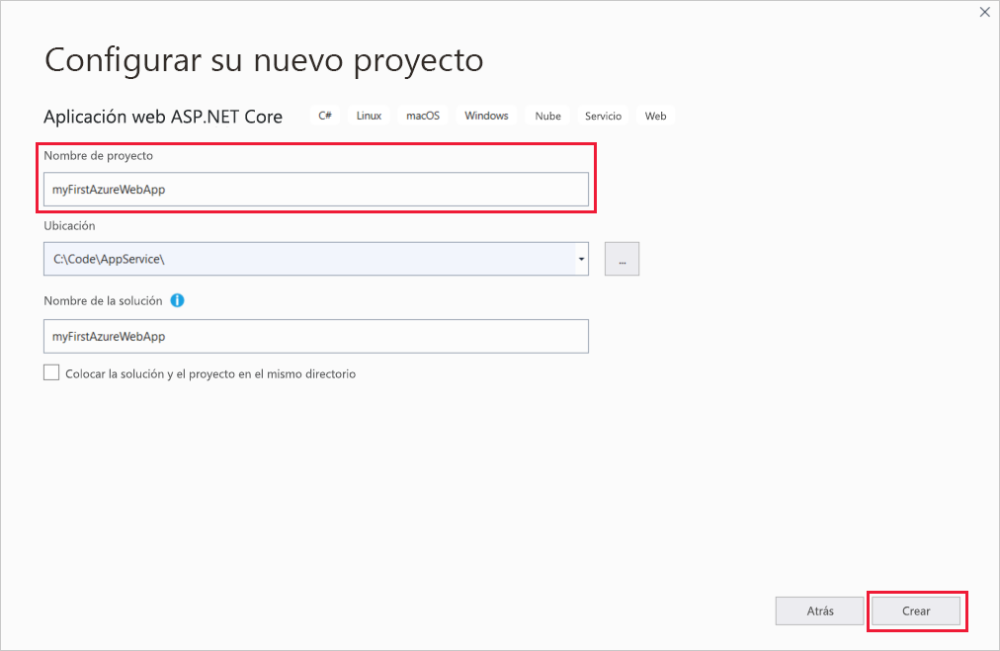

1. Puede implementar cualquier tipo de aplicación web de ASP.NET Core en Azure pero, para este inicio rápido, elija la plantilla de **Aplicación web**. Asegúrese de que **Autenticación** esté establecido en **Sin autenticación** y que no hay ninguna otra opción seleccionada. Seleccione **Crear**.

   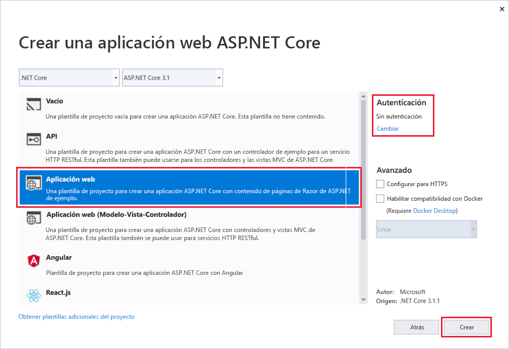 
   
1. En el menú de Visual Studio, seleccione **Depurar** > **Iniciar sin depurar** para ejecutar la aplicación web localmente.

   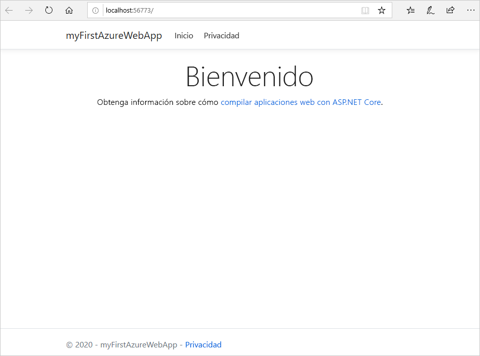

## <a name="publish-your-web-app"></a>Publicación de la aplicación web

Para publicar la aplicación web, primero debe crear y configurar una nueva instancia de App Service en la que pueda publicar la aplicación. 

Como parte de la configuración de la instancia de App Service, creará:

- Un nuevo [grupo de recursos](https://docs.microsoft.com/azure/azure-resource-manager/management/overview#terminology) que contendrá todos los recursos de Azure para el servicio.
- Un [plan de hospedaje](https://docs.microsoft.com/azure/app-service/overview-hosting-plans) que especifique la ubicación, el tamaño y las características de la granja de servidores web que hospeda la aplicación.

Siga estos pasos para crear la instancia de App Service y publicar la aplicación web:

1. En **Explorador de soluciones**, haga clic con el botón derecho en el proyecto **myFirstAzureWebApp** y seleccione **Publicar**. Si aún no ha iniciado sesión en la cuenta de Azure desde Visual Studio, seleccione **Agregar una cuenta** o **Iniciar sesión**. También puede crear una cuenta de Azure gratis.

1. En el cuadro de diálogo **Elegir un destino de publicación**, elija **App Service**, seleccione **Crear nuevo** y, a continuación, seleccione **Crear perfil**.

   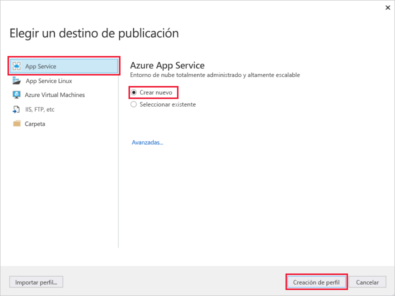

1. En el cuadro de diálogo **App Service: Cree un nuevo cuadro de diálogo**  y proporcione un **nombre** único global para la aplicación; para ello, acepte el nombre predeterminado o escriba uno nuevo. Los caracteres válidos son `a-z`, `A-Z`, `0-9` y `-`. Este **nombre** se usa como prefijo de dirección URL para la aplicación web con el formato `http://<app_name>.azurewebsites.net`.

1. En **Suscripción**, acepte la suscripción que aparece o seleccione otra en la lista desplegable.

1. En **Grupo de recursos**, seleccione **Nuevo**. En **Nuevo nombre de grupo de recursos**, escriba *myResourceGroup* y seleccione **Aceptar**. 

1. En **Plan de hospedaje**, seleccione **Nuevo**. 

1. En el cuadro de diálogo **Plan de hospedaje: Crear nuevo**, escriba los valores especificados en la tabla siguiente:

   | Configuración  | Valor sugerido | Descripción |
   | -------- | --------------- | ----------- |
   | **Plan de hospedaje**  | *miPrimerPlanDeAzureWebApp* | Nombre del plan de App Service. |
   | **Ubicación**      | *Oeste de Europa* | El centro de datos donde se hospeda la aplicación web. |
   | **Tamaño**          | *Gratis* | [Plan de tarifa](https://azure.microsoft.com/pricing/details/app-service/?ref=microsoft.com&utm_source=microsoft.com&utm_medium=docs&utm_campaign=visualstudio) determina las características de hospedaje. |
   
   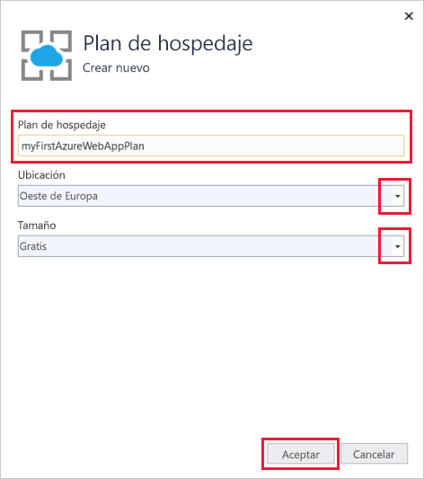

1. Deje **Application Insights** establecida en *Ninguno*.

1. En el cuadro de diálogo **App Service: Crear nuevo**, seleccione **Crear** para empezar a crear los recursos de Azure.

   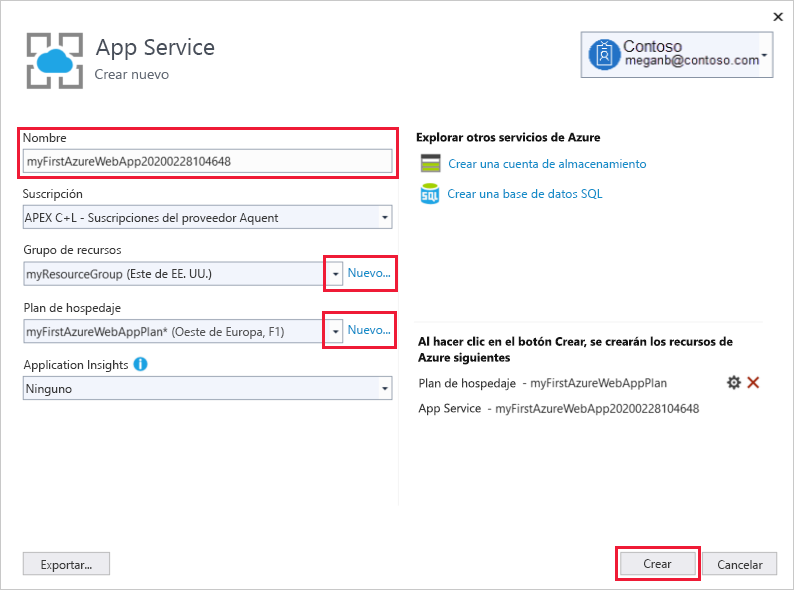

1. Una vez completado el asistente, seleccione **Publicar**.

   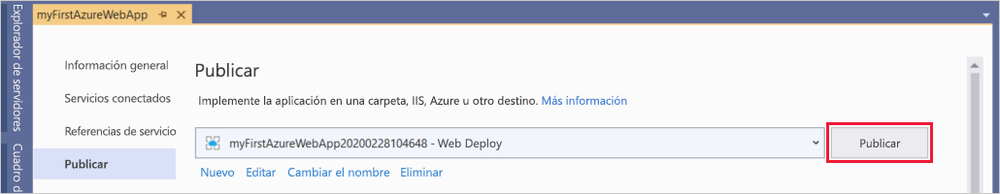

   Visual Studio publica la aplicación web de ASP.NET Core en Azure e inicia la aplicación en el explorador predeterminado. 

   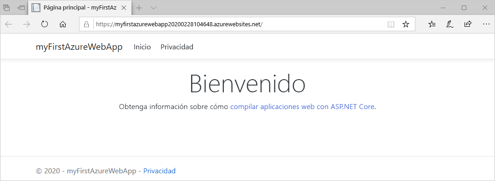

**¡Enhorabuena!** La aplicación web de ASP.NET Core se está ejecutando en Azure App Service.

## <a name="update-the-app-and-redeploy"></a>Actualización de la aplicación y nueva implementación

Siga estos pasos para actualizar y volver a implementar la aplicación web:

1. En **Explorador de soluciones**, en el proyecto, abra **Pages** > **Index.cshtml**.

1. Reemplace las dos etiquetas `<div>` por el código siguiente:

   ```HTML
   <div class="jumbotron">
       <h1>ASP.NET in Azure!</h1>
       <p class="lead">This is a simple app that we've built that demonstrates how to deploy a .NET app to Azure App Service.</p>
   </div>
   ```

1. Para volver a implementar en Azure, haga clic con el botón derecho en el proyecto **myFirstAzureWebApp**, en el **Explorador de soluciones** y seleccione **Publicar**.

1. En la página de resumen **Publicar**, seleccione **Publicar**.

   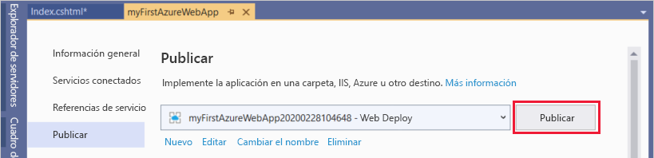

Cuando se completa la publicación, Visual Studio inicia un explorador en la dirección URL de la aplicación web.

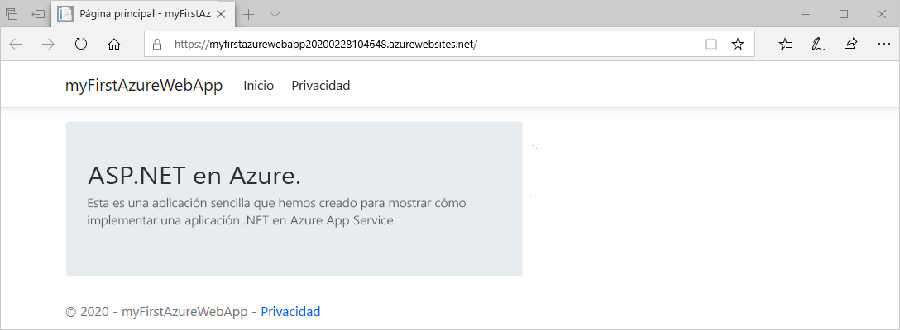

## <a name="manage-the-azure-app"></a>Administración de la aplicación de Azure

Para administrar la aplicación web, vaya a [Azure Portal](https://portal.azure.com) y busque y seleccione **App Services**.

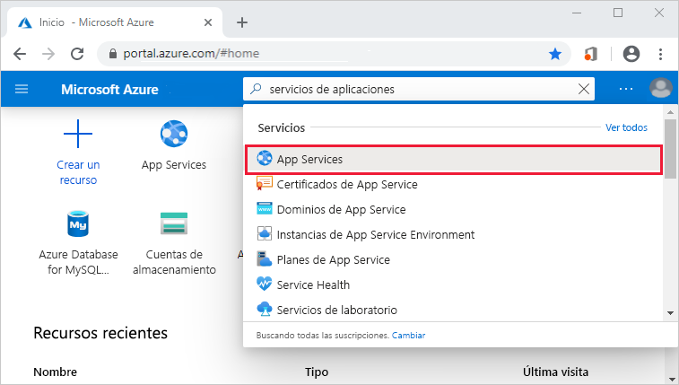

En la página **App Services**, seleccione el nombre de la aplicación web.

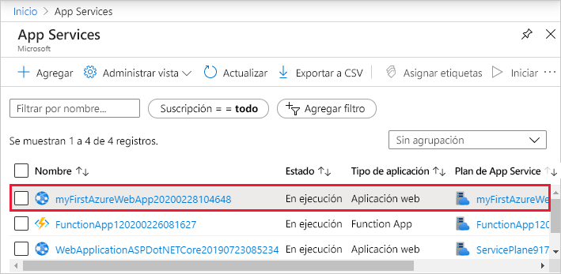

La página **Información general** de la aplicación web contiene opciones para la administración básica como examinar, detener, iniciar, reiniciar y eliminar. El menú izquierdo proporciona varias páginas para configurar la aplicación.

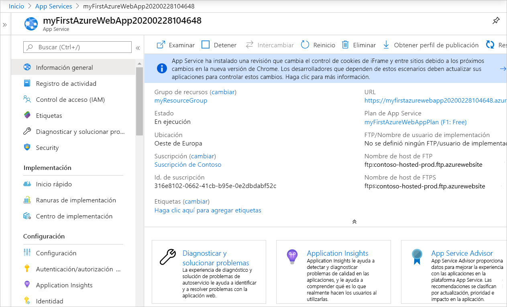

[!INCLUDE [Clean-up section](../../includes/clean-up-section-portal.md)]

## <a name="next-steps"></a>Pasos siguientes

En este inicio rápido, ha utilizado Visual Studio para crear e implementar una aplicación web de ASP.NET Core en Azure App Service.

Pase al siguiente artículo para aprender a crear una aplicación de .NET Core y conectarla a una instancia de SQL Database:

> [!div class="nextstepaction"]
> [ASP.NET Core con SQL Database](app-service-web-tutorial-dotnetcore-sqldb.md)
