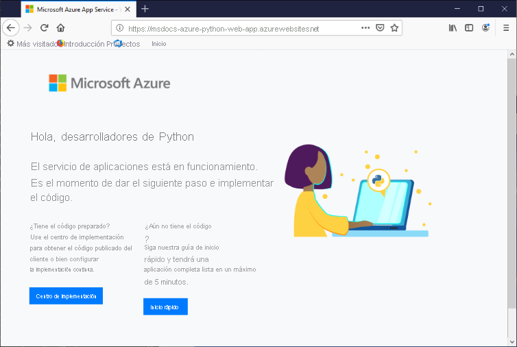

# <a name="configure-a-linux-python-app-for-azure-app-service"></a>Configuración de una aplicación de Python en Linux para Azure App Service

En este artículo se describe la forma en que [Azure App Service](overview.md) ejecuta aplicaciones de Python y cómo se puede personalizar el comportamiento de App Service cuando es necesario. Las aplicaciones de Python deben implementarse con todos los módulos [pip](https://pypi.org/project/pip/) requeridos.

El motor de implementación de App Service activa automáticamente un entorno virtual y ejecuta `pip install -r requirements.txt` automáticamente cuando se implementa un [repositorio de Git](deploy-local-git.md) o un [paquete ZIP](deploy-zip.md).

En esta guía se incluyen conceptos clave e instrucciones para los desarrolladores de Python que usan un contenedor Linux integrado en App Service. Si nunca ha usado Azure App Service, siga primero el [inicio rápido de Python](quickstart-python.md) y el [tutorial de Python con PostgreSQL](tutorial-python-postgresql-app.md).

Puede usar [Azure Portal](https://portal.azure.com) o la CLI de Azure para la configuración:

- **Azure Portal** , use la página **Configuración** > **Configuración** de la aplicación, como se describe en [Configurar una aplicación de App Service en Azure Portal](configure-common.md).

- **CLI de Azure** : tiene dos opciones.

    - Ejecute los comandos de [Azure Cloud Shell](../cloud-shell/overview.md), que puede abrir mediante el botón **Probar** de la parte superior derecha de los bloques de código.
    - Ejecute los comandos localmente instalando la versión más reciente de la [CLI de Azure](/cli/azure/install-azure-cli) y, luego, inicie sesión en Azure con [az login](/cli/azure/reference-index#az-login).
    
> [!NOTE]
> Linux es actualmente la opción recomendada para ejecutar aplicaciones de Python en App Service. Para obtener información acerca de la opción de Windows, consulte [Configuración de un entorno de Python en Azure App Service (Windows)](/visualstudio/python/managing-python-on-azure-app-service).

## <a name="configure-python-version"></a>Configuración de la versión de Python

- **Azure Portal** : use la pestaña **Configuración general** de la página **Configuración** , como se describe en [Configurar las opciones generales](configure-common.md#configure-general-settings) para contenedores Linux.

- **CLI de Azure** :

    -  Muestre la versión actual de Python con [az webapp config show](/cli/azure/webapp/config#az_webapp_config_show):
    
        ```azurecli-interactive
        az webapp config show --resource-group <resource-group-name> --name <app-name> --query linuxFxVersion
        ```
        
        Reemplace `<resource-group-name>` y `<app-name>` por los nombres adecuados para su aplicación web.
    
    - Establezca la versión de Python con [az webapp config set](/cli/azure/webapp/config#az_webapp_config_set).
        
        ```azurecli-interactive
        az webapp config set --resource-group <resource-group-name> --name <app-name> --linux-fx-version "PYTHON|3.7"
        ```
    
    - Muestre todas las versiones de Python que se admiten en Azure App Service con [az webapp list-runtimes](/cli/azure/webapp#az_webapp_list_runtimes):
    
        ```azurecli-interactive
        az webapp list-runtimes --linux | grep PYTHON
        ```
    
Para ejecutar una versión no compatible de Python, cree una imagen de su propio imagen de contenedor. Para más información, consulte [Uso de una imagen personalizada de Docker](tutorial-custom-container.md?pivots=container-linux).

<!-- <a> element here to preserve external links-->
<a name="access-environment-variables"></a>

## <a name="customize-build-automation"></a>Personalización de la automatización de compilaciones

El sistema de compilación de App Service, denominado Oryx, realiza los pasos siguientes al implementar la aplicación mediante paquetes Git o ZIP:

1. Ejecute un script anterior a la compilación personalizado si lo especifica el valor `PRE_BUILD_COMMAND` .
1. Ejecute `pip install -r requirements.txt`. El archivo *requirements.txt* debe estar dentro de la carpeta raíz del proyecto. De lo contrario, el proceso de compilación notifica el error: "Could not find setup.py or requirements.txt; Not running pip install" (No se pudo encontrar setup.py o requirements.txt; no se ejecutará la instalación de PIP).
1. Si *manage.py* se encuentra en la raíz del repositorio (lo que indica una aplicación de Django), ejecute *manage.py collectstatic* . Sin embargo, si el valor `DISABLE_COLLECTSTATIC` es `true`, se omitirá este paso.
1. Ejecute el script posterior a la compilación personalizado si lo especifica el valor `POST_BUILD_COMMAND`.

De forma predeterminada, los valores `PRE_BUILD_COMMAND`, `POST_BUILD_COMMAND` y `DISABLE_COLLECTSTATIC` están vacíos. 

- Para deshabilitar la ejecución de collectstatic al compilar aplicaciones de Django, establezca `DISABLE_COLLECTSTATIC` en true.

- Para ejecutar comandos anteriores a la compilación, establezca el valor `PRE_BUILD_COMMAND` para que contenga un comando, como `echo Pre-build command`, o una ruta de acceso a un archivo de script relativo a la raíz del proyecto, como `scripts/prebuild.sh`. Todos los comandos deben usar rutas de acceso relativas a la carpeta raíz del proyecto.

- Para ejecutar comandos posteriores a la compilación, establezca el valor `POST_BUILD_COMMAND` para que contenga un comando, como `echo Post-build command`, o una ruta de acceso a un archivo de script relativo a la raíz del proyecto, como `scripts/postbuild.sh`. Todos los comandos deben usar rutas de acceso relativas a la carpeta raíz del proyecto.

Puede encontrar otros valores que personalicen la automatización de la compilación en [Configuración de Oryx](https://github.com/microsoft/Oryx/blob/master/doc/configuration.md). 

Para más información sobre cómo App Service ejecuta y compila aplicaciones de Python en Linux, consulte [Cómo Oryx detecta y compila aplicaciones de Python](https://github.com/microsoft/Oryx/blob/master/doc/runtimes/python.md).

> [!NOTE]
> Los valores `PRE_BUILD_SCRIPT_PATH` y `POST_BUILD_SCRIPT_PATH` son idénticos a `PRE_BUILD_COMMAND` y `POST_BUILD_COMMAND`, que se pueden usar como valores heredados.
> 
> Un valor denominado `SCM_DO_BUILD_DURING_DEPLOYMENT`, si contiene `true` o 1, desencadena una compilación de Oryx durante la implementación. El valor es true cuando se implementa con Git, el comando `az webapp up` de la CLI de Azure y Visual Studio Code.

> [!NOTE]
> Use siempre rutas de acceso relativas en todos los scripts anteriores y posteriores a la compilación, ya que el contenedor de compilación en el que se ejecuta Oryx es diferente del contenedor en tiempo de ejecución en el que se ejecuta la aplicación. Nunca confíe en la ubicación exacta de la carpeta de proyecto de la aplicación dentro del contenedor (por ejemplo, si está ubicada en *site/wwwroot* ).

## <a name="production-settings-for-django-apps"></a>Configuración de producción para aplicaciones de Django

En un entorno de producción como Azure App Service, las aplicaciones de Django deben seguir la [lista de comprobación de implementación](https://docs.djangoproject.com/en/3.1/howto/deployment/checklist/) de Django (djangoproject.com).

En la tabla siguiente se describe la configuración de producción que es pertinente para Azure. Esta configuración se define en el archivo *setting.py* de la aplicación.

| Valor de Django | Instrucciones para Azure |
| --- | --- |
| `SECRET_KEY` | Almacene el valor en un valor de configuración de App Service, como se describe en [Acceso a la configuración de la aplicación como variables de entorno](#access-app-settings-as-environment-variables). Como alternativa, puede [almacenar el valor como un "secreto" en Azure Key Vault](/azure/key-vault/secrets/quick-create-python). |
| `DEBUG` | Cree un valor `DEBUG` en App Service con el valor 0 (false) y, luego, cargue el valor como una variable de entorno. En el entorno de desarrollo, cree una variable de entorno `DEBUG` con el valor 1 (true). |
| `ALLOWED_HOSTS` | En producción, Django requiere que incluya la dirección URL de la aplicación en la matriz `ALLOWED_HOSTS` de *settings.py* . Puede recuperar esta dirección URL en tiempo de ejecución con el código `os.environ['WEBSITE_HOSTNAME']`. App Service establece automáticamente la variable de entorno `WEBSITE_HOSTNAME` en la dirección URL de la aplicación. |
| `DATABASES` | Defina la configuración en App Service para la conexión de base de datos y cárguela como variables de entorno para rellenar el diccionario [`DATABASES`](https://docs.djangoproject.com/en/3.1/ref/settings/#std:setting-DATABASES). También puede almacenar los valores (especialmente el nombre de usuario y la contraseña) como [secretos de Azure Key Vault](/azure/key-vault/secrets/quick-create-python). |

## <a name="container-characteristics"></a>Características del contenedor

Cuando se implementan en App Service, las aplicaciones de Python se ejecutan en un contenedor de Docker de Linux que se define en el [repositorio de GitHub App Service Python](https://github.com/Azure-App-Service/python). Puede encontrar las configuraciones de imagen dentro de los directorios específicos de la versión.

Este contenedor tiene las siguientes características:

- Las aplicaciones se ejecutan mediante el [servidor HTTP de WSGI de Gunicorn](https://gunicorn.org/), mediante los argumentos adicionales `--bind=0.0.0.0 --timeout 600`.
    - Puede proporcionar valores de configuración para Gunicorn mediante un archivo *gunicorn.conf.py* en la raíz del proyecto, como se describe en [Introducción a la configuración de Gunicorn](https://docs.gunicorn.org/en/stable/configure.html#configuration-file) (docs.gunicorn.org). También puede [personalizar el comando de inicio](#customize-startup-command).

    - Para proteger la aplicación web de ataques de DDOS accidentales o deliberados, Gunicorn se ejecuta detrás de un proxy inverso de Nginx, como se describe en [Implementación de Gunicorn](https://docs.gunicorn.org/en/latest/deploy.html) (docs.gunicorn.org).

- De forma predeterminada, la imagen base del contenedor incluye solo la plataforma web Flask, pero el contenedor admite otras plataformas que son compatibles con WSGI y Python 3.6, como Django.

- Para instalar otros paquetes, como Django, cree un archivo [*requirements.txt*](https://pip.pypa.io/en/stable/user_guide/#requirements-files) en la raíz del proyecto que especifique las dependencias directas. A continuación, App Service instala automáticamente esas dependencias al implementar el proyecto.

    Para que se instalen esas dependencias, el archivo *requirements.txt* *debe* estar en la raíz del proyecto. De lo contrario, el proceso de compilación notifica el error: "Could not find setup.py or requirements.txt; Not running pip install" (No se pudo encontrar setup.py o requirements.txt; no se ejecutará la instalación de PIP). Si se produce este error, compruebe la ubicación del archivo de requisitos.

- App Service define automáticamente una variable de entorno llamada `WEBSITE_HOSTNAME` con la dirección URL de la aplicación web, por ejemplo, `msdocs-hello-world.azurewebsites.net`. También define `WEBSITE_SITE_NAME` con el nombre de la aplicación, por ejemplo, `msdocs-hello-world`. 
   
## <a name="container-startup-process"></a>Proceso de inicio del contenedor

Durante el inicio, la instancia de App Service en el contenedor de Linux ejecuta los siguientes pasos:

1. Use un [comando de inicio personalizado](#customize-startup-command), si se proporciona.
2. Compruebe la existencia de una [aplicación de Django](#django-app) e inicie Gunicorn para ella si se detecta.
3. Compruebe la existencia de una [aplicación de Flask](#flask-app) e inicie Gunicorn para ella si se detecta.
4. Si no se encuentra ninguna otra aplicación, inicia una aplicación predeterminada que está integrada en el contenedor.

En las secciones siguientes se proporcionan detalles adicionales para cada opción.

### <a name="django-app"></a>Aplicación de Django

Para las aplicaciones de Django, App Service busca un archivo denominado `wsgi.py` en el código de la aplicación y, a continuación, ejecuta Gunicorn mediante el comando siguiente:

```bash
# <module> is the name of the folder that contains wsgi.py
gunicorn --bind=0.0.0.0 --timeout 600 <module>.wsgi
```

Si quiere un control más específico sobre el comando de inicio, use un [comando de inicio personalizado](#customize-startup-command), reemplace `<module>` por el nombre de la carpeta que contiene *wsgi.py* y agregue un argumento `--chdir` si ese módulo no está en la raíz del proyecto. Por ejemplo, si *wsgi.py* se encuentra en *knboard/backend/config* de la raíz del proyecto, use los argumentos `--chdir knboard/backend config.wsgi`.

Para habilitar el registro de producción, agregue los parámetros `--access-logfile` y `--error-logfile` como se muestra en los ejemplos de los [comandos de inicio personalizados](#customize-startup-command).

### <a name="flask-app"></a>Aplicación de Flask

En el caso de Flask, App Service busca un archivo denominado *application.py* o *app.py* e inicia Gunicorn como se indica a continuación:

```bash
# If application.py
gunicorn --bind=0.0.0.0 --timeout 600 application:app

# If app.py
gunicorn --bind=0.0.0.0 --timeout 600 app:app
```

Si el módulo de la aplicación principal está contenido en un archivo diferente, use un nombre diferente para el objeto de la aplicación, o si desea proporcionar argumentos adicionales para Gunicorn, use un [comando de inicio personalizado](#customize-startup-command).

### <a name="default-behavior"></a>Comportamiento predeterminado

Si el servicio de aplicación no encuentra un comando personalizado, una aplicación de Django o una aplicación de Flask, se ejecutará una aplicación predeterminada de solo lectura, ubicada en la carpeta _opt/defaultsite_ . La aplicación predeterminada aparece como sigue:



## <a name="customize-startup-command"></a>Personalización del comando de inicio

Como se indicó anteriormente en este artículo, puede proporcionar valores de configuración para Gunicorn mediante un archivo *gunicorn.conf.py* en la raíz del proyecto, como se describe en [Introducción a la configuración de Gunicorn](https://docs.gunicorn.org/en/stable/configure.html#configuration-file).

Si dicha configuración no es suficiente, puede controlar el comportamiento de inicio del contenedor proporcionando un comando de inicio personalizado o varios comandos en un archivo de comandos de inicio. Un archivo de comandos de inicio puede usar cualquier nombre que elija, por ejemplo, *startup.sh* , *startup.cmd* , *startup. txt* , etc.

Todos los comandos deben usar rutas de acceso relativas a la carpeta raíz del proyecto.

Para especificar un comando de inicio o un archivo de comandos:

- **Azure Portal** : seleccione la página **Configuración** de la aplicación y, luego, elija **Configuración general** . En el campo **Comando de inicio** , coloque el texto completo del comando de inicio o el nombre del archivo de comandos de inicio. Luego, seleccione **Guardar** para aplicar los cambios. En el caso de contenedores Linux, consulte [Configuración general](configure-common.md#configure-general-settings).

- **CLI de Azure** : use el comando [az webapp config set](/cli/azure/webapp/config#az_webapp_config_set) con el parámetro `--startup-file` para establecer el comando de inicio o el archivo de comandos de inicio:

    ```azurecli-interactive
    az webapp config set --resource-group <resource-group-name> --name <app-name> --startup-file "<custom-command>"
    ```
        
    Reemplace `<custom-command>` por el texto completo del comando de inicio o por el nombre del archivo de comandos de inicio.
        
App Service omite los errores que se producen al procesar un comando de inicio personalizado o un archivo de comandos de inicio personalizados y continúa su proceso de inicio buscando aplicaciones de Django y Flask. Si no ve el comportamiento que espera, compruebe que el comando de inicio o el archivo de comandos de inicio no tengan errores y que el archivo de comandos de inicio esté implementado en App Service junto con el código de la aplicación. También puede consultar los [registros de diagnóstico](#access-diagnostic-logs) para más información. Consulte también la página **Diagnosticar y solucionar de problemas** en [Azure Portal](https://portal.azure.com).

### <a name="example-startup-commands"></a>Comandos de inicio de ejemplo

- **Argumentos de Gunicorn agregados** : en el ejemplo siguiente se agrega `--workers=4` a una línea de comandos de Gunicorn para iniciar una aplicación de Django: 

    ```bash
    # <module-path> is the relative path to the folder that contains the module
    # that contains wsgi.py; <module> is the name of the folder containing wsgi.py.
    gunicorn --bind=0.0.0.0 --timeout 600 --workers=4 --chdir <module_path> <module>.wsgi
    ```    

    Para más información, consulte [Running Gunicorn](https://docs.gunicorn.org/en/stable/run.html) (Ejecución de Gunicorn) (docs.gunicorn.org).

- **Habilitar el registro de producción para Django** : agregue los argumentos `--access-logfile '-'` y `--error-logfile '-'` a la línea de comandos:

    ```bash    
    # '-' for the log files means stdout for --access-logfile and stderr for --error-logfile.
    gunicorn --bind=0.0.0.0 --timeout 600 --workers=4 --chdir <module_path> <module>.wsgi --access-logfile '-' --error-logfile '-'
    ```    

    Estos registros aparecerán en la [secuencia de registro de App Service](#access-diagnostic-logs).

    Para más información, consulte [Registro de Gunicorn](https://docs.gunicorn.org/en/stable/settings.html#logging) (docs.gunicorn.org).
    
- **Personalizar el módulo principal de Flask** : de forma predeterminada, App Service supone que el módulo principal de una aplicación de Flask es *application.py* o *app.py* . Si el módulo principal utiliza un nombre diferente, debe personalizar el comando de inicio. Por ejemplo, si tiene una aplicación de Flask cuyo módulo principal es *hello.py* y el objeto de aplicación de Flask en ese archivo se denomina `myapp`, el comando es de esta manera:

    ```bash
    gunicorn --bind=0.0.0.0 --timeout 600 hello:myapp
    ```
    
    Si el módulo principal está en una subcarpeta como, por ejemplo, `website` especifique esa carpeta con el argumento `--chdir`:
    
    ```bash
    gunicorn --bind=0.0.0.0 --timeout 600 --chdir website hello:myapp
    ```
    
- **Usar un servidor que no sea de Gunicorn** : para usar un servidor web diferente, como [aiohttp](https://aiohttp.readthedocs.io/en/stable/web_quickstart.html), utilice el comando adecuado como comando de inicio o en el archivo de comandos de inicio:

    ```bash
    python3.7 -m aiohttp.web -H localhost -P 8080 package.module:init_func
    ```

## <a name="access-app-settings-as-environment-variables"></a>Acceso a la configuración de la aplicación como variables de entorno

La configuración de la aplicación son valores almacenados en la nube específicamente para la aplicación, como se describe en [Configuración de valores de la aplicación](configure-common.md#configure-app-settings). Esta configuración está disponible para el código de la aplicación como variables de entorno y se puede acceder a ella mediante el patrón estándar [os.environ](https://docs.python.org/3/library/os.html#os.environ).

Por ejemplo, si ha creado una configuración de aplicación llamada `DATABASE_SERVER`, el código siguiente recupera el valor de esta configuración:

```python
db_server = os.environ['DATABASE_SERVER']
```
    
## <a name="detect-https-session"></a>Detección de sesión de HTTPS

En App Service, la [terminación de SSL](https://wikipedia.org/wiki/TLS_termination_proxy) (wikipedia.org) se produce en los equilibradores de carga de red, por lo que todas las solicitudes HTTPS llegan a su aplicación en forma de solicitudes HTTP sin cifrar. Si su aplicación lógica necesita comprobar si las solicitudes de usuario están cifradas, inspeccione el encabezado `X-Forwarded-Proto`.

```python
if 'X-Forwarded-Proto' in request.headers and request.headers['X-Forwarded-Proto'] == 'https':
# Do something when HTTPS is used
```

Los marcos web más usados le permiten acceder a la información de `X-Forwarded-*` en el patrón de aplicación estándar. En [CodeIgniter](https://codeigniter.com/), [is_https()](https://github.com/bcit-ci/CodeIgniter/blob/master/system/core/Common.php#L338-L365) comprueba el valor de `X_FORWARDED_PROTO` de forma predeterminada.

## <a name="access-diagnostic-logs"></a>Acceso a los registros de diagnóstico

[!INCLUDE [Access diagnostic logs](../../includes/app-service-web-logs-access-linux-no-h.md)]

Para acceder a los registros mediante Azure Portal, seleccione **Supervisión** > **Secuencia de registro** en el menú izquierdo de la aplicación.

## <a name="open-ssh-session-in-browser"></a>Abrir sesión SSH en el explorador

[!INCLUDE [Open SSH session in browser](../../includes/app-service-web-ssh-connect-builtin-no-h.md)]

## <a name="troubleshooting"></a>Solución de problemas

- **Ve la aplicación predeterminada después de implementar su propio código de aplicación.** La aplicación predeterminada aparece porque no ha implementado el código de la aplicación en App Service o porque este no ha encontrado el código de la aplicación y ha ejecutado la aplicación predeterminada en su lugar.

    - Reinicie App Service, espere 15-20 segundos y vuelva a comprobar la aplicación.
    
    - Asegúrese de que está utilizando App Service para Linux en lugar de una instancia basada en Windows. Desde la CLI de Azure, ejecute el comando `az webapp show --resource-group <resource-group-name> --name <app-name> --query kind`, reemplazando `<resource-group-name>` y `<app-service-name>` en consecuencia. Debería ver `app,linux` como salida; en caso contrario, vuelva a crear la instancia de App Service y elija Linux.
    
    - Use SSH o la consola de Kudu para conectarse directamente con App Service y compruebe que los archivos existen en *site/wwwroot* . Si no existen los archivos, revise el proceso de implementación y vuelva a implementar la aplicación.
    
    - Si existen los archivos, App Service no fue capaz de identificar el archivo de inicio específico. Compruebe que la aplicación está estructurada como espera App Service para [Django](#django-app) o [Flask](#flask-app), o use un [comando de inicio personalizado](#customize-startup-command).

- **Ve el mensaje "Servicio no disponible" en el explorador.** El explorador ha superado el tiempo de espera mientras esperaba una respuesta de App Service, lo cual indica que App Service ha iniciado el servidor Gunicorn, pero los argumentos que especifica el código de la aplicación son incorrectos.

    - Actualice el explorador, especialmente si usa los planes de tarifa más bajos en su plan de App Service. Por ejemplo, la aplicación puede tardar más en iniciarse si usa niveles gratis, por ejemplo, y comienza a tener capacidad de respuesta después de actualizar el explorador.

    - Compruebe que la aplicación está estructurada como espera App Service para [Django](#django-app) o [Flask](#flask-app), o use un [comando de inicio personalizado](#customize-startup-command).

    - Examine la [secuencia de registro](#access-diagnostic-logs) para ver si hay mensajes de error.

- **La secuencia de registro muestra "Could not find setup.py or requirements.txt; Not running pip install" (No se pudo encontrar setup.py o requirements.txt; no se ejecutará la instalación de PIP).** : el proceso de compilación de Oryx no ha podido encontrar el archivo *requirements.txt* .

    - Use SSH o la consola de Kudu para conectarse directamente a App Service y compruebe que *requirements.txt* existe en *site/wwwroot* . Si no existe, haga que el archivo exista en el repositorio y que esté incluido en la implementación. Si existe en una carpeta distinta, muévalo a la raíz.

## <a name="next-steps"></a>Pasos siguientes

> [!div class="nextstepaction"]
> [Tutorial: Aplicación de Python con PostgreSQL](tutorial-python-postgresql-app.md)

> [!div class="nextstepaction"]
> [Tutorial: Implementar desde el repositorio de contenedor privado](tutorial-custom-container.md?pivots=container-linux)

> [!div class="nextstepaction"]
> [P+F sobre App Service en Linux](faq-app-service-linux.md)
