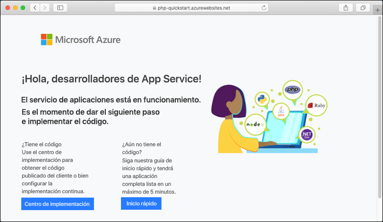

# <a name="create-a-php-app-in-app-service-on-linux"></a>Creación de una aplicación PHP en App Service en Linux

> [!NOTE]
> En este artículo se implementa una aplicación en App Service en Linux. Para implementar en App Service en _Windows_, consulte [Creación de una aplicación de PHP en Azure](../app-service-web-get-started-php.md).
>

[App Service en Linux](app-service-linux-intro.md) proporciona un servicio de hospedaje web muy escalable y con aplicación automática de revisiones utilizando el sistema operativo Linux. En este tutorial de inicio rápido se explica cómo implementar una aplicación PHP en Azure App Service en Linux mediante [Cloud Shell](https://docs.microsoft.com/azure/cloud-shell/overview).


Estos pasos se pueden realizar en este artículo con una máquina Mac, Windows o Linux.

[!INCLUDE [quickstarts-free-trial-note](../../../includes/quickstarts-free-trial-note.md)]

## <a name="prerequisites"></a>Requisitos previos

Para completar esta guía de inicio rápido:

* <a href="https://git-scm.com/" target="_blank">Instalación de Git</a>
* <a href="https://php.net" target="_blank">Instalación de PHP</a>

## <a name="download-the-sample"></a>Descarga del ejemplo

En la ventana del terminal, ejecute los siguientes comandos para clonar la aplicación de ejemplo en el equipo local y desplazarse al directorio que contiene el código de ejemplo.

```bash
git clone https://github.com/Azure-Samples/php-docs-hello-world
cd php-docs-hello-world
```

## <a name="run-the-app-locally"></a>Ejecución de la aplicación de forma local

Ejecute la aplicación localmente para ver cómo debería ser si se implementara en Azure. Abra una ventana de terminal y use el comando `php` para iniciar el servidor web de PHP integrado.

```bash
php -S localhost:8080
```

Abra un explorador web y vaya a la aplicación de ejemplo en `http://localhost:8080`.

Verá el mensaje **Hola mundo** desde la aplicación de ejemplo mostrada en la página.


En la ventana de terminal, presione **Ctrl + C** para salir del servidor web.

[!INCLUDE [cloud-shell-try-it.md](../../../includes/cloud-shell-try-it.md)]

[!INCLUDE [Configure deployment user](../../../includes/configure-deployment-user.md)]

[!INCLUDE [Create resource group](../../../includes/app-service-web-create-resource-group-linux.md)]

[!INCLUDE [Create app service plan](../../../includes/app-service-web-create-app-service-plan-linux.md)]

## <a name="create-a-web-app"></a>Creación de una aplicación web

[!INCLUDE [Create web app](../../../includes/app-service-web-create-web-app-php-linux-no-h.md)] 

Vaya al sitio para ver la aplicación recién creada con una imagen integrada. Reemplace _&lt;app_name>_ por el nombre de la aplicación.

```bash
http://<app-name>.azurewebsites.net
```

Este es el aspecto que debe tener su nueva aplicación:



[!INCLUDE [Push to Azure](../../../includes/app-service-web-git-push-to-azure.md)] 

<pre>
Counting objects: 26, done.
Delta compression using up to 4 threads.
Compressing objects: 100% (23/23), done.
Writing objects: 100% (26/26), 4.95 KiB | 0 bytes/s, done.
Total 26 (delta 9), reused 0 (delta 0)
remote: Deploy Async
remote: Updating branch 'master'.
remote: Updating submodules.
remote: Preparing deployment for commit id 'df425ea6ef'.
remote: Repository path is /home/site/repository
remote: Running oryx build...
remote: Build orchestrated by Microsoft Oryx, https://github.com/Microsoft/Oryx
remote: You can report issues at https://github.com/Microsoft/Oryx/issues
remote: .
remote: .
remote: .
remote: Deployment successful.
remote: Deployment Logs : 'https://&lt;app-name&gt;.scm.azurewebsites.net/newui/jsonviewer?view_url=/api/deployments/.../log'
To https://&lt;app-name&gt;.scm.azurewebsites.net/&lt;app-name&gt;.git
 * [new branch]      master -> master
</pre>

## <a name="browse-to-the-app"></a>Navegación hasta la aplicación

Vaya a la aplicación implementada mediante el explorador web.

```bash
http://<app-name>.azurewebsites.net
```

El ejemplo de código PHP se ejecuta en App Service en Linux con una imagen integrada.


**¡Enhorabuena!** Ha implementado su primera aplicación PHP en App Service en Linux.

## <a name="update-locally-and-redeploy-the-code"></a>Actualización local y nueva implementación del código

En el directorio local, abra el archivo `index.php` dentro de la aplicación PHP y realice un pequeño cambio en el texto dentro de la cadena situada junto a `echo`:

```php
echo "Hello Azure!";
```

Confirme los cambios en Git y, después, inserte los cambios de código en Azure.

```bash
git commit -am "updated output"
git push azure master
```

Una vez que la implementación haya finalizado, vuelva a la ventana del explorador que abrió en el paso **Navegación hasta la aplicación** y actualice la página.


## <a name="manage-your-new-azure-app"></a>Administración de la nueva aplicación de Azure

Vaya a <a href="https://portal.azure.com" target="_blank">Azure Portal</a> para administrar la aplicación que ha creado.

En el menú izquierdo, haga clic en **App Services** y, luego, en el nombre de la aplicación de Azure.


Verá la página de información general de la aplicación. En este caso, puede realizar tareas de administración básicas como examinar, detener, iniciar, reiniciar y eliminar.


El menú izquierdo proporciona distintas páginas para configurar la aplicación. 

[!INCLUDE [cli-samples-clean-up](../../../includes/cli-samples-clean-up.md)]

## <a name="next-steps"></a>Pasos siguientes

> [!div class="nextstepaction"]
> [Tutorial: Aplicación de PHP con MySQL](tutorial-php-mysql-app.md)

> [!div class="nextstepaction"]
> [Configure PHP app](configure-language-php.md) (Configuración de una aplicación de PHP)
