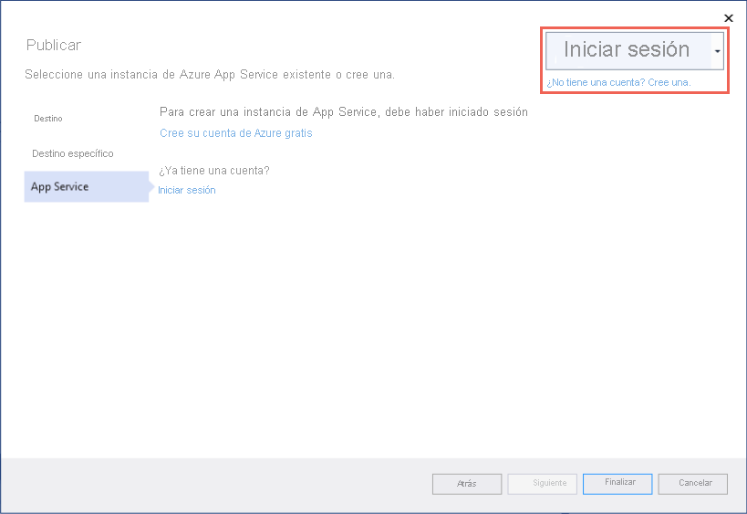
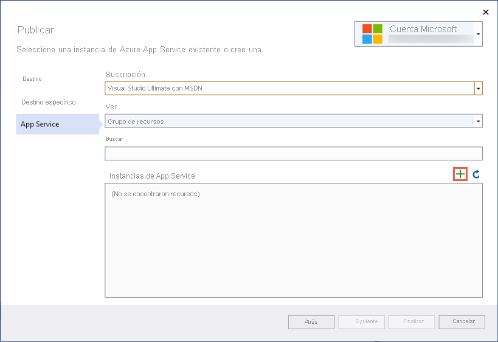

# <a name="quickstart-create-an-aspnet-core-web-app-in-azure"></a>Inicio rápido: Creación de una aplicación web ASP.NET Core en Azure

::: zone pivot="platform-windows"  

En esta guía de inicio rápido, aprenderá a crear e implementar su primera aplicación web de ASP.NET Core en [Azure App Service](overview.md). App Service es compatible con aplicaciones de .NET 5.0.

Cuando termine, tendrá un grupo de recursos de Azure que consta de un plan de hospedaje de App Service y una aplicación web implementada.

## <a name="prerequisites"></a>Prerrequisitos

- Una cuenta de Azure con una suscripción activa. [Cree una cuenta gratuita](https://azure.microsoft.com/free/dotnet/).
- Instalar <a href="https://www.visualstudio.com/downloads/" target="_blank">Visual Studio 2019</a> con la carga de trabajo de **ASP.NET y desarrollo web**.

  Si ya ha instalado Visual Studio 2019:

  - Para instalar las actualizaciones más recientes de Visual Studio, seleccione **Ayuda** > **Buscar actualizaciones**. Las actualizaciones más recientes contienen el SDK de .NET 5.0.
  - Para agregar la carga de trabajo, seleccione **Herramientas** > **Obtener herramientas y características**.


## <a name="create-an-aspnet-core-web-app"></a>Cree una aplicación web ASP.NET Core

Siga estos pasos para crear una aplicación web de ASP.NET Core en Visual Studio:

# <a name="net-core-31"></a>[.NET Core 3.1](#tab/netcore31)

1. Abra Visual Studio y seleccione **Crear un proyecto**.

1. En **Crear un nuevo proyecto**, seleccione **Aplicación web ASP.NET Core**  y confirme que **C#** aparece en los lenguajes de esa opción y, a continuación, seleccione **Siguiente**.

1. En **Configure su nuevo proyecto**, asigne al proyecto de aplicación web el nombre *miPrimeraAzureWebApp* y luego seleccione **Crear**.

   

1. Puede implementar cualquier tipo de aplicación web de ASP.NET Core en Azure pero, para este inicio rápido, elija la plantilla de **Aplicación web**. Asegúrese de que **Autenticación** esté establecido en **Sin autenticación** y que no hay ninguna otra opción seleccionada. Seleccione **Crear**.

    
   
1. En el menú de Visual Studio, seleccione **Depurar** > **Iniciar sin depurar** para ejecutar la aplicación web localmente.

   

# <a name="net-50"></a>[.NET 5.0](#tab/net50)

1. Abra Visual Studio y seleccione **Crear un proyecto**.

1. En **Crear un nuevo proyecto**, seleccione **Aplicación web ASP.NET Core**  y confirme que **C#** aparece en los lenguajes de esa opción y, a continuación, seleccione **Siguiente**.

1. En **Configure su nuevo proyecto**, asigne al proyecto de aplicación web el nombre *miPrimeraAzureWebApp* y luego seleccione **Crear**.

   

1. Para una aplicación de .NET 5.0, seleccione **ASP.NET Core 5.0** en el menú desplegable.

1. Puede implementar cualquier tipo de aplicación web de ASP.NET Core en Azure pero, para este inicio rápido, elija la plantilla de **Aplicación web de ASP.NET Core**. Asegúrese de que **Autenticación** esté establecido en **Sin autenticación** y que no hay ninguna otra opción seleccionada. Seleccione **Crear**.

    
   
1. En el menú de Visual Studio, seleccione **Depurar** > **Iniciar sin depurar** para ejecutar la aplicación web localmente.

   

---

## <a name="publish-your-web-app"></a>Publicación de la aplicación web

Para publicar la aplicación web, primero debe crear y configurar una nueva instancia de App Service en la que pueda publicar la aplicación. 

Como parte de la configuración de la instancia de App Service, creará:

- Un nuevo [grupo de recursos](../azure-resource-manager/management/overview.md#terminology) que contendrá todos los recursos de Azure para el servicio.
- Un [plan de hospedaje](./overview-hosting-plans.md) que especifique la ubicación, el tamaño y las características de la granja de servidores web que hospeda la aplicación.

Siga estos pasos para crear la instancia de App Service y publicar la aplicación web:

1. En **Explorador de soluciones**, haga clic con el botón derecho en el proyecto **myFirstAzureWebApp** y seleccione **Publicar**. 

1. En **Publicar**, seleccione **Azure** y haga clic en **Siguiente**.

1. Las opciones dependen de si ya ha iniciado sesión en Azure y de si tiene una cuenta de Visual Studio vinculada a una cuenta de Azure. Seleccione **Agregar una cuenta** o **Iniciar sesión** para iniciar sesión en la suscripción de Azure. Si ya ha iniciado sesión, seleccione la cuenta que desee.

   

1. A la derecha de **App Service instances** (Instancias de App Service), haga clic en **+** .

   

1. En **Suscripción**, acepte la suscripción que aparece o seleccione otra en la lista desplegable.

1. En **Grupo de recursos**, seleccione **Nuevo**. En **Nuevo nombre de grupo de recursos**, escriba *myResourceGroup* y seleccione **Aceptar**. 

1. En **Plan de hospedaje**, seleccione **Nuevo**. 

1. En el cuadro de diálogo **Plan de hospedaje: Crear nuevo**, escriba los valores especificados en la tabla siguiente:

   | Configuración  | Valor sugerido | Descripción |
   | -------- | --------------- | ----------- |
   | **Plan de hospedaje**  | *miPrimerPlanDeAzureWebApp* | Nombre del plan de App Service. |
   | **Ubicación**      | *Oeste de Europa* | El centro de datos donde se hospeda la aplicación web. |
   | **Tamaño**          | *Gratis* | [Plan de tarifa](https://azure.microsoft.com/pricing/details/app-service/?ref=microsoft.com&utm_source=microsoft.com&utm_medium=docs&utm_campaign=visualstudio) determina las características de hospedaje. |
   
   

1. En **Nombre**, escriba un nombre de aplicación único que incluya solo los caracteres válidos, que son `a-z`, `A-Z`, `0-9` y `-`. Puede aceptar el nombre único generado automáticamente. La dirección URL de la aplicación web es `http://<app-name>.azurewebsites.net`, donde `<app-name>` es el nombre de la aplicación.

2. Seleccione **Crear** para crear los recursos de Azure.

   

   Una vez finalizado el asistente, los recursos de Azure se crean automáticamente y ya puede publicarlos.

3. Seleccione **Finalizar** para cerrar el asistente.

1. En la página **Publicar**, haga clic en **Publicar**. Visual Studio compila, empaqueta y publica la aplicación en Azure y, luego, la inicia en el explorador predeterminado.

   

**¡Enhorabuena!** La aplicación web de ASP.NET Core se está ejecutando en Azure App Service.

## <a name="update-the-app-and-redeploy"></a>Actualización de la aplicación y nueva implementación

Siga estos pasos para actualizar y volver a implementar la aplicación web:

1. En **Explorador de soluciones**, en el proyecto, abra **Pages** > **Index.cshtml**.

1. Reemplace la etiqueta `<div>` entera por el siguiente código:

   ```html
   <div class="jumbotron">
       <h1>ASP.NET in Azure!</h1>
       <p class="lead">This is a simple app that we've built that demonstrates how to deploy a .NET app to Azure App Service.</p>
   </div>
   ```

1. Para volver a implementar en Azure, haga clic con el botón derecho en el proyecto **myFirstAzureWebApp**, en el **Explorador de soluciones** y seleccione **Publicar**.

1. En la página de resumen **Publicar**, seleccione **Publicar**.

   <!--  -->

    Cuando se completa la publicación, Visual Studio inicia un explorador en la dirección URL de la aplicación web.

    

## <a name="manage-the-azure-app"></a>Administración de la aplicación de Azure

Para administrar la aplicación web, vaya a [Azure Portal](https://portal.azure.com) y busque y seleccione **App Services**.


En la página **App Services**, seleccione el nombre de la aplicación web.

:::image type="content" source="./media/quickstart-dotnetcore/select-app-service.png" alt-text="Captura de pantalla de la página de App Services con una aplicación web de ejemplo seleccionada.":::

La página **Información general** de la aplicación web contiene opciones para la administración básica como examinar, detener, iniciar, reiniciar y eliminar. El menú izquierdo proporciona varias páginas para configurar la aplicación.


[!INCLUDE [Clean-up section](../../includes/clean-up-section-portal.md)]

## <a name="next-steps"></a>Pasos siguientes

En este inicio rápido, ha utilizado Visual Studio para crear e implementar una aplicación web de ASP.NET Core en Azure App Service.

Pase al siguiente artículo para aprender a crear una aplicación de .NET Core y conectarla a una instancia de SQL Database:

> [!div class="nextstepaction"]
> [ASP.NET Core con SQL Database](tutorial-dotnetcore-sqldb-app.md)

> [!div class="nextstepaction"]
> [Configure ASP.NET Core app](configure-language-dotnetcore.md) (Configuración de una aplicación de ASP.NET Core)

::: zone-end  

::: zone pivot="platform-linux"
[App Service en Linux](overview.md#app-service-on-linux) proporciona un servicio de hospedaje web muy escalable y con aplicación automática de revisiones utilizando el sistema operativo Linux. En esta guía de inicio rápido se muestra cómo crear una aplicación de [.NET Core](/aspnet/core/) en App Service en Linux. Creará la aplicación web con la [CLI de Azure](/cli/azure/get-started-with-azure-cli) y usará Git para implementar el código de .NET Core en la aplicación.


Estos pasos se pueden realizar en este artículo con una máquina Mac, Windows o Linux.

[!INCLUDE [quickstarts-free-trial-note](../../includes/quickstarts-free-trial-note.md)]

## <a name="set-up-your-initial-environment"></a>Configuración del entorno inicial

# <a name="net-core-31"></a>[.NET Core 3.1](#tab/netcore31)

Para completar esta guía de inicio rápido:

* <a href="https://dotnet.microsoft.com/download/dotnet-core/3.1" target="_blank">Instale el SDK de .NET Core 3.1 más reciente</a>.
* <a href="/cli/azure/install-azure-cli" target="_blank">Instale la CLI de Azure más reciente</a>.

# <a name="net-50"></a>[.NET 5.0](#tab/net50)

Para completar esta guía de inicio rápido:

* <a href="https://dotnet.microsoft.com/download/dotnet/5.0" target="_blank">Instale el SDK de .NET 5.0 más reciente</a>.
* <a href="/cli/azure/install-azure-cli" target="_blank">Instale la CLI de Azure más reciente</a>.

---

[¿Tiene problemas? Háganoslo saber.](https://aka.ms/DotNetAppServiceLinuxQuickStart)

## <a name="create-the-app-locally"></a>Creación de la aplicación localmente

En la ventana del terminal de la máquina, cree un directorio denominado `hellodotnetcore` y haga que sea el directorio actual.

```bash
mkdir hellodotnetcore
cd hellodotnetcore
```

Creación de una aplicación .NET Core

```bash
dotnet new web
```

## <a name="run-the-app-locally"></a>Ejecución de la aplicación de forma local

Ejecute la aplicación localmente para ver cómo debería ser si se implementara en Azure. 

```bash
dotnet run
```

Abra un explorador web y vaya a la aplicación en `http://localhost:5000`.

Verá el mensaje **Hola mundo** de la aplicación de ejemplo que aparece en la página.


[¿Tiene problemas? Háganoslo saber.](https://aka.ms/DotNetAppServiceLinuxQuickStart)

## <a name="sign-into-azure"></a>Inicio de sesión en Azure
En la ventana de terminal, inicie sesión en Azure con el siguiente comando:

```azurecli
az login
```

## <a name="deploy-the-app"></a>Implementar la aplicación

Implemente el código en la carpeta local (*hellodotnetcore*) mediante el comando `az webapp up`:

```azurecli
az webapp up --sku F1 --name <app-name> --os-type linux
```

- Si no se reconoce el comando `az`, asegúrese de que tiene instalada la CLI de Azure tal y como se describe en [Configuración del entorno inicial](#set-up-your-initial-environment).
- Reemplace `<app-name>` por un nombre que sea único en todo Azure (*los caracteres válidos son `a-z`, `0-9` y `-`* ). Un buen patrón es usar una combinación del nombre de la empresa y un identificador de la aplicación.
- El argumento `--sku F1` crea la aplicación web en el plan de tarifa Gratuito. Omita este argumento para usar un nivel Premium más rápido, lo que supondrá un costo por hora.
- Opcionalmente, incluya el argumento `--location <location-name>`, donde `<location-name>` es una región de Azure disponible. Puede recuperar una lista de las regiones permitidas para su cuenta de Azure mediante la ejecución del comando [`az account list-locations`](/cli/azure/appservice#az-appservice-list-locations).

El comando puede tardar varios minutos en completarse. Mientras se ejecuta, proporciona mensajes sobre cómo crear el grupo de recursos, el plan de App Service y la aplicación de hospedaje, configurar el registro y, a continuación, realizar la implementación del archivo ZIP. A continuación, se muestra el mensaje "Puede iniciar la aplicación en http://&lt;nombre_de_la_aplicación&gt;.azurewebsites.net", que es la dirección URL de la aplicación en Azure.

# <a name="net-core-31"></a>[.NET Core 3.1](#tab/netcore31)


# <a name="net-50"></a>[.NET 5.0](#tab/net50)

<!-- Deploy the code in your local folder (*hellodotnetcore*) using the `az webapp up` command:

```azurecli
az webapp up --sku B1 --name <app-name> --os-type linux
```

- If the `az` command isn't recognized, be sure you have the Azure CLI installed as described in [Set up your initial environment](#set-up-your-initial-environment).
- Replace `<app-name>` with a name that's unique across all of Azure (*valid characters are `a-z`, `0-9`, and `-`*). A good pattern is to use a combination of your company name and an app identifier.
- The `--sku B1` argument creates the web app in the Basic pricing tier, which incurs an hourly cost. Omit this argument to use a faster premium tier, which costs more.
- You can optionally include the argument `--location <location-name>` where `<location-name>` is an available Azure region. You can retrieve a list of allowable regions for your Azure account by running the [`az account list-locations`](/cli/azure/appservice#az-appservice-list-locations) command.

The command may take a few minutes to complete. While running, it provides messages about creating the resource group, the App Service plan and hosting app, configuring logging, then performing ZIP deployment. It then gives the message, "You can launch the app at http://&lt;app-name&gt;.azurewebsites.net", which is the app's URL on Azure. -->


---

[¿Tiene problemas? Háganoslo saber.](https://aka.ms/DotNetAppServiceLinuxQuickStart)

[!include [az webapp up command note](../../includes/app-service-web-az-webapp-up-note.md)]

## <a name="browse-to-the-app"></a>Navegación hasta la aplicación

Vaya a la aplicación implementada mediante el explorador web.

```bash
http://<app_name>.azurewebsites.net
```

El ejemplo de código de .NET Core se ejecuta en App Service en Linux con una imagen integrada.


**¡Enhorabuena!** Ha implementado su primera aplicación de .NET Core en App Service en Linux.

[¿Tiene problemas? Háganoslo saber.](https://aka.ms/DotNetAppServiceLinuxQuickStart)

## <a name="update-and-redeploy-the-code"></a>Actualización del código y nueva implementación

En el directorio local, abra el archivo _Startup.cs_. Realice un pequeño cambio en el texto en la llamada de método `context.Response.WriteAsync`:

```csharp
await context.Response.WriteAsync("Hello Azure!");
```

Guarde los cambios y vuelva a implementar la aplicación con el comando `az webapp up`:

```azurecli
az webapp up
```

Este comando utiliza valores que se almacenan en caché de forma local en el archivo *.azure/config*, incluidos el nombre de la aplicación, el grupo de recursos y el plan de App Service.

Una vez que la implementación haya finalizado, vuelva a cambiar la ventana del explorador que se abrió en el paso **Navegación hasta la aplicación** y actualice la vista.


[¿Tiene problemas? Háganoslo saber.](https://aka.ms/DotNetAppServiceLinuxQuickStart)

## <a name="manage-your-new-azure-app"></a>Administración de la nueva aplicación de Azure

Vaya a <a href="https://portal.azure.com" target="_blank">Azure Portal</a> para administrar la aplicación que ha creado.

En el menú izquierdo, haga clic en **App Services** y, luego, en el nombre de la aplicación de Azure.

:::image type="content" source="./media/quickstart-dotnetcore/portal-app-service-list-up.png" alt-text="Captura de pantalla de la página de App Services en la que se muestra una aplicación de ejemplo de Azure seleccionada.":::

Verá la página de información general de la aplicación. En este caso, puede realizar tareas de administración básicas como examinar, detener, iniciar, reiniciar y eliminar. 


El menú izquierdo proporciona distintas páginas para configurar la aplicación. 

[!INCLUDE [cli-samples-clean-up](../../includes/cli-samples-clean-up.md)]

[¿Tiene problemas? Háganoslo saber.](https://aka.ms/DotNetAppServiceLinuxQuickStart)

## <a name="next-steps"></a>Pasos siguientes

> [!div class="nextstepaction"]
> [Tutorial: Aplicación de ASP.NET Core con SQL Database](tutorial-dotnetcore-sqldb-app.md)

> [!div class="nextstepaction"]
> [Configure ASP.NET Core app](configure-language-dotnetcore.md) (Configuración de una aplicación de ASP.NET Core)

::: zone-end