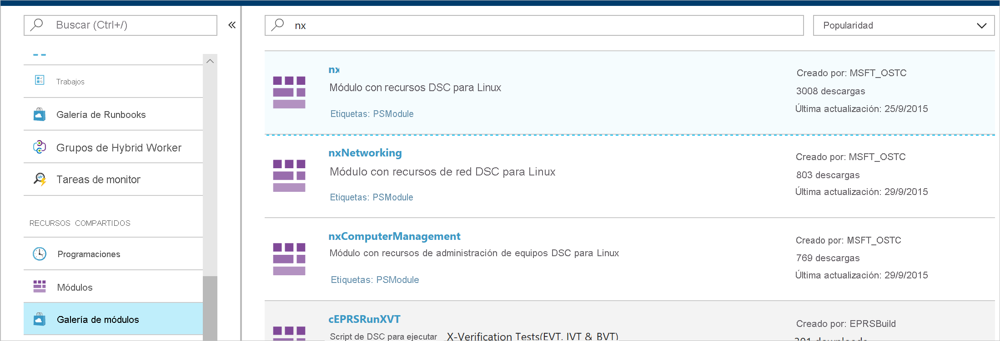
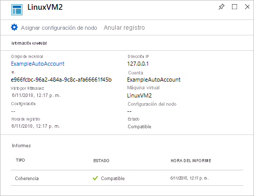

# <a name="configure-a-virtual-machine-with-desired-state-configuration"></a>Configurar una máquina virtual con Desired State Configuration

Al habilitar Azure Automation State Configuration, puede administrar y supervisar las configuraciones de los servidores Windows y Linux mediante Desired State Configuration (DSC). Las configuraciones que se desvían de una configuración deseada se pueden identificar o corregir automáticamente. Esta guía de inicio rápido le guía por la incorporación de una máquina virtual Linux y la implementación de una pila de LAMP con DSC.

## <a name="prerequisites"></a>Prerrequisitos

Para completar este inicio rápido necesita instalar:

* Suscripción a Azure. Si no tiene una suscripción a Azure, [cree una cuenta gratuita](https://azure.microsoft.com/free/).
* Una cuenta de Azure Automation Para obtener instrucciones sobre cómo crear una cuenta de ejecución de Azure Automation, consulte el artículo sobre las [cuentas de ejecución de Azure](automation-sec-configure-azure-runas-account.md).
* Una máquina virtual de Azure Resource Manager (no clásica) que ejecute Red Hat Enterprise Linux, CentOS u Oracle Linux. Para obtener instrucciones sobre la creación de una máquina virtual, consulte [Creación de máquinas virtuales Linux con Azure Portal](../virtual-machines/linux/quick-create-portal.md)

## <a name="sign-in-to-azure"></a>Inicio de sesión en Azure
Inicie sesión en Azure en https://portal.azure.com.

## <a name="onboard-a-virtual-machine"></a>Incorporar una máquina virtual

Hay muchos métodos diferentes de incorporar una máquina y habilitar DSC. Esta guía de inicio rápido trata la incorporación a través de una cuenta de Automation. Para más información sobre los distintos métodos de incorporación de máquinas a State Configuration, lea el artículo sobre la [incorporación](https://docs.microsoft.com/azure/automation/automation-dsc-onboarding).

1. En el panel izquierdo de Azure Portal, seleccione **Cuentas de Automation**. Si la opción no está visible en el panel izquierdo, haga clic en **Todos los servicios** y busque en la vista que se muestra.
1. Seleccione una cuenta de Automation de la lista.
1. En el panel izquierdo de la cuenta de Automation, seleccione **State Configuration (DSC)** (Configuración de estado [DSC]).
2. Haga clic en **Agregar** para abrir la página de selección de máquinas virtuales.
3. Busque la máquina virtual en la que va a habilitar DSC. Puede usar el campo de búsqueda y las opciones de filtro para buscar una máquina virtual específica.
4. Haga clic en la máquina virtual y, después, haga clic en **Conectar**
5. Seleccione la configuración de DSC adecuada para la máquina virtual. Si ya tiene una configuración preparada, la puede especificar como `Node Configuration Name`. Puede establecer el [modo de configuración](https://docs.microsoft.com/powershell/scripting/dsc/managing-nodes/metaConfig) para controlar el comportamiento de la configuración de la máquina.
6. Haga clic en **OK**. Mientras la extensión de DSC se implementa en la máquina virtual, el estado aparece como `Connecting`.


## <a name="import-modules"></a>Importación de módulos

Los módulos contienen recursos de DSC y muchos de ellos se pueden encontrar en la [Galería de PowerShell](https://www.powershellgallery.com). Todos los recursos que se utilizan en las configuraciones se deben importar en la cuenta de Automation antes de la compilación. Para este tutorial, es necesario el módulo denominado **nx**.

1. En el panel izquierdo de la cuenta de Automation, seleccione **Galería de módulos** en **Recursos compartidos**.
1. Para buscar el módulo que desea importar, escriba parte de su nombre: `nx`.
1. Haga clic en el módulo que se va a importar.
1. Haga clic en **Import**.



## <a name="import-the-configuration"></a>Importar la configuración

Esta guía de inicio rápido usa una configuración de DSC que configura el servidor HTTP Apache, MySQL y PHP en la máquina. Consulte [Configuraciones de DSC](https://docs.microsoft.com/powershell/scripting/dsc/configurations/configurations).

En un editor de texto, escriba lo siguiente y guárdelo localmente como **AMPServer.ps1**.

```powershell-interactive
configuration LAMPServer {
   Import-DSCResource -module "nx"

   Node localhost {

        $requiredPackages = @("httpd","mod_ssl","php","php-mysql","mariadb","mariadb-server")
        $enabledServices = @("httpd","mariadb")

        #Ensure packages are installed
        ForEach ($package in $requiredPackages){
            nxPackage $Package{
                Ensure = "Present"
                Name = $Package
                PackageManager = "yum"
            }
        }

        #Ensure daemons are enabled
        ForEach ($service in $enabledServices){
            nxService $service{
                Enabled = $true
                Name = $service
                Controller = "SystemD"
                State = "running"
            }
        }
   }
}
```

Para importar la configuración:

1. En el panel izquierdo de la cuenta de Automation, seleccione **State Configuration (DSC)** (Configuración de estado [DSC]) y, luego, haga clic en la pestaña **Configuraciones**.
2. Haga clic en **+ Agregar**.
3. Seleccione el archivo de configuración que guardó en el paso anterior.
4. Haga clic en **OK**.

## <a name="compile-a-configuration"></a>Compilar una configuración

Debe compilar una configuración DSC en la configuración de un nodo (documento de Managed Object Format) antes de que se pueda asignar a un nodo. La compilación valida la configuración y permite la entrada de valores de parámetro. Para más información sobre la compilación de una configuración, consulte: [Compilación de configuraciones en State Configuration](automation-dsc-compile.md).

1. En el panel izquierdo de la cuenta de Automation, seleccione **State Configuration (DSC)** (Configuración de estado [DSC]) y, luego, haga clic en la pestaña **Configuraciones**.
1. Seleccione la configuración `LAMPServer`.
1. En las opciones del menú, seleccione **Compilar** y, después, haga clic en **Sí**.
1. En la vista Configuración aparecerá un nuevo trabajo de compilación en cola. Cuando el trabajo se complete correctamente, podrá avanzar al paso siguiente. Si se produce algún error, puede hacer clic en el trabajo de compilación para obtener más información.

## <a name="assign-a-node-configuration"></a>Asignación de una configuración de nodo

Puede asignar una configuración de nodo compilada a un nodo de DSC. La asignación aplica la configuración a la máquina y supervisa, o corrige automáticamente, cualquier desvío de esa configuración.

1. En el panel izquierdo de la cuenta de Automation, seleccione **State Configuration (DSC)** y, luego, haga clic en la pestaña **Nodos**.
1. Seleccione el nodo al que va asignar una configuración.
1. Haga clic en **Asignar configuración de nodo**.
1. Seleccione la configuración del nodo `LAMPServer.localhost` y haga clic en **Aceptar**. State Configuration ahora asigna la configuración compilada al nodo y el estado del nodo cambia a `Pending`. En la siguiente comprobación periódica, el nodo recupera la configuración, la aplica y genera un informe del estado. El nodo puede tardar hasta 30 minutos en recuperar la configuración en función de su configuración. 
1. Para forzar una comprobación inmediata, puede ejecutar el comando siguiente localmente en la máquina virtual Linux: `sudo /opt/microsoft/dsc/Scripts/PerformRequiredConfigurationChecks.py`



## <a name="view-node-status"></a>Visualización del estado del nodo

Puede ver el estado de todos los nodos administrados por State Configuration de la cuenta de Automation. Para mostrar la información hay que elegir **State Configuration (DSC)** y hacer clic en la pestaña **Nodos**. Puede filtrar la visualización por el estado, la configuración del nodo o la búsqueda de nombre.


## <a name="next-steps"></a>Pasos siguientes

En este inicio rápido, ha incorporado una máquina virtual Linux a State Configuration, ha creado una configuración para una pila de LAMP y ha implementado la configuración en la máquina virtual. Para aprender a usar Azure Automation State Configuration para habilitar la implementación continua, consulte este artículo:

> [!div class="nextstepaction"]
> [Implementación continua en máquinas virtuales con DSC y Chocolatey](./automation-dsc-cd-chocolatey.md)

* Para más información sobre DSC de PowerShell, consulte [Introducción a Desired State Configuration de PowerShell](https://docs.microsoft.com/powershell/scripting/dsc/overview/overview).
* Para más información sobre cómo administrar State Configuration desde PowerShell, consulte [Azure PowerShell](https://docs.microsoft.com/powershell/module/azurerm.automation/).
* Para aprender a reenviar los informes de DSC a los registros de Azure Monitor para la generación de informes y alertas, consulte el artículo sobre el [reenvío de informes de DSC a los registros de Azure Monitor](automation-dsc-diagnostics.md).