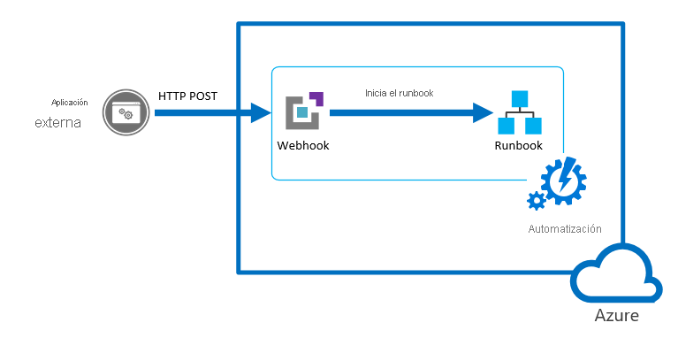

# <a name="start-a-runbook-from-a-webhook"></a>Inicio de un runbook desde un webhook

Un webhook permite que un servicio externo inicie un runbook determinado en Azure Automation mediante una sola solicitud HTTP. Entre los servicios externos se incluyen Azure DevOps Services, GitHub, registros de Azure Monitor y aplicaciones personalizadas. Estos servicios pueden usar un webhook para iniciar un runbook sin tener que implementar la API completa de Azure Automation. Puede comparar los webhooks con otros métodos para iniciar un runbook en [Inicio de un runbook en Azure Automation](automation-starting-a-runbook.md).

> [!NOTE]
> No se admite el uso de un webhook para iniciar un runbook de Python.



## <a name="webhook-properties"></a>Propiedades de un webhook

En la tabla siguiente se describen las propiedades que debe configurar para un webhook.

| Propiedad | Descripción |
|:--- |:--- |
| Nombre |Nombre del webhook. Puede indicar cualquier nombre que desee, ya que no se expone al cliente. Solo se utiliza para que identifique el runbook en Azure Automation. Como práctica recomendada, debe proporcionar al webhook un nombre relacionado con el cliente que lo usa. |
| URL |Dirección URL del webhook. Es la dirección única a la que llama un cliente con una solicitud HTTP POST para iniciar el runbook vinculado al webhook. Se genera automáticamente al crear el webhook. No se puede especificar una dirección URL personalizada. <br> <br> La dirección URL contiene un token de seguridad que permite que un sistema de terceros invoque el runbook sin autenticación adicional, por lo que debe tratarla como una contraseña. Por motivos de seguridad, solo puede ver la dirección URL en Azure Portal cuando se crea el webhook. Anote la dirección URL en una ubicación segura para su uso futuro. |
| Fecha de expiración | Fecha de expiración del webhook, tras la cual ya no se puede usar. Esta fecha se puede modificar una vez creado el webhook, siempre y cuando no haya expirado ya. |
| habilitado | Este valor indica si el webhook se habilita de forma predeterminada cuando se crea. Si establece esta propiedad en Deshabilitado, ningún cliente puede usar el webhook. Puede establecer esta propiedad al crear el webhook o en cualquier otro momento después de su creación. |

## <a name="parameters-used-when-the-webhook-starts-a-runbook"></a>Parámetros usados cuando el webhook inicia un runbook

Un webhook puede definir valores para parámetros de runbook que se usan cuando se inicia el runbook. El webhook debe incluir los valores de los parámetros obligatorios del runbook y puede incluir valores para los parámetros opcionales. Los valores de parámetro configurados en un webhook se pueden modificar incluso después de crear el webhook. Varios webhooks vinculados a un único runbook puede utilizar distintos valores de parámetros de runbook. Cuando un cliente inicia un runbook mediante un webhook, no puede reemplazar los valores de los parámetros definidos en el webhook.

Para recibir datos del cliente, el runbook admite un único parámetro llamado `WebhookData`. Este parámetro define un objeto que contiene datos que el cliente incluye en una solicitud POST.


El parámetro `WebhookData` tiene las siguientes propiedades:

| Propiedad | Descripción |
|:--- |:--- |
| `WebhookName` | Nombre del webhook. |
| `RequestHeader` | Tabla hash que contiene los encabezados de la solicitud POST entrante. |
| `RequestBody` | Cuerpo de la solicitud POST entrante. Este cuerpo conserva el formato de los datos, como cadena, JSON, XML o datos codificados por formulario. El runbook debe escribirse para que trabaje con el formato de datos que se espera. |

No hay ninguna configuración del webhook obligatoria para admitir el parámetro `WebhookData`, y el runbook no tiene que aceptarlo. Si el runbook no define el parámetro, se ignoran los detalles de la solicitud enviada desde el cliente.

> [!NOTE]
> Al llamar a un webhook, el cliente siempre debe almacenar los valores de los parámetros, por si se produce un error en la llamada. Si se produce un problema de conexión o de interrupción de la red, la aplicación no podrá recuperar las llamadas de webhook con errores.

Si especifica un valor para `WebhookData` durante la creación de webhook, se invalidará cuando el webhook inicie el runbook con los datos de la solicitud POST del cliente. Esto sucederá incluso si la aplicación no contiene ningún dato en el cuerpo de la solicitud. 

Si inicia un runbook que define `WebhookData` mediante un mecanismo que no sea un webhook, puede proporcionar un valor para `WebhookData` que el runbook reconozca. Este valor debe ser un objeto con las mismas [propiedades](#webhook-properties) que el parámetro `WebhookData`, para que el runbook pueda funcionar correctamente con él, del mismo modo que si trabajara con objetos `WebhookData` reales pasados por un webhook.

Por ejemplo, si va a iniciar el siguiente runbook desde Azure Portal y desea pasar algunos datos de webhook de ejemplo para las pruebas, debe pasarlos como JSON en la interfaz de usuario.


En el siguiente ejemplo de runbook, vamos a definir las siguientes propiedades para `WebhookData`:

* **WebhookName**: MyWebhook
* **RequestBody**: `*[{'ResourceGroup': 'myResourceGroup','Name': 'vm01'},{'ResourceGroup': 'myResourceGroup','Name': 'vm02'}]*`

Ahora pasamos el siguiente objeto JSON en la interfaz de usuario para el parámetro `WebhookData`. Este ejemplo, con los retornos de carro y los caracteres de nueva línea, coincide con el formato que se pasa desde un webhook.

```json
{"WebhookName":"mywebhook","RequestBody":"[\r\n {\r\n \"ResourceGroup\": \"vm01\",\r\n \"Name\": \"vm01\"\r\n },\r\n {\r\n \"ResourceGroup\": \"vm02\",\r\n \"Name\": \"vm02\"\r\n }\r\n]"}
```


> [!NOTE]
> Azure Automation registra los valores de todos los parámetros de entrada con el trabajo de runbook. Por tanto, se registra cualquier entrada que proporcione el cliente en la solicitud de webhook, y esta entrada estará disponible para cualquiera con acceso al trabajo de automatización. Por este motivo, debe tener cuidado en cómo incluir información confidencial en las llamadas de webhook.

## <a name="webhook-security"></a>Seguridad del webhook

La seguridad de un webhook se basa en la privacidad de su dirección URL, que contiene un token de seguridad que permite que se invoque el webhook. Azure Automation no realiza ninguna autenticación en una solicitud, siempre que se haga en la dirección URL correcta. Por esta razón, los clientes no deben utilizar webhooks en runbooks que realicen operaciones altamente confidenciales sin utilizar medios alternativos para validar la solicitud.

Puede incluir lógica dentro de un runbook para determinar si se le llama desde un webhook. Establezca que el runbook compruebe la propiedad `WebhookName` del parámetro `WebhookData`. El runbook puede realizar más validaciones buscando información determinada en las propiedades `RequestHeader` y `RequestBody`.

Otra estrategia es hacer que el runbook realice alguna validación de una condición externa cuando recibe una solicitud de webhook. Por ejemplo, considere un runbook al que llama GitHub siempre que hay una nueva confirmación en un repositorio de GitHub. El runbook puede conectarse a GitHub para asegurarse de que se ha realizado una nueva confirmación antes de continuar.

## <a name="create-a-webhook"></a>Creación de un webhook

Use el procedimiento siguiente para crear un nuevo Webhook vinculado a un Runbook en el Portal de Azure.

1. Desde la página Runbooks en Azure Portal, haga clic en el runbook que el webhook inicia, para ver su página de detalles. Asegúrese de que el campo **Estado** del runbook esté establecido en **Publicado**.
2. Haga clic en **Webhook** en la parte superior de la página para abrir la página Agregar Webhook.
3. Haga clic en **Crear nuevo Webhook** para abrir la página Crear webhook.
4. Rellene los campos **Nombre** y **Fecha de expiración** del webhook y especifique si debe habilitarse. Para más información sobre las propiedades del webhook, consulte [Propiedades de un webhook](#webhook-properties).
5. Haga clic en el icono de copiar y presione Ctrl+C para copiar la dirección URL del webhook. A continuación, guárdela en un lugar seguro. 

    > [!NOTE]
    > Una vez creado el webhook, ya no puede volver a recuperar la dirección URL.

   

1. Haga clic en **Parámetros** para especificar los valores de los parámetros del runbook. Si el runbook tiene parámetros obligatorios, no podrá crear el webhook a menos que proporcione valores para ellos.
1. Haga clic en **Crear** para crear el proyecto.

## <a name="use-a-webhook"></a>Uso de webhooks

Para utilizar un webhook una vez creado, el cliente debe emitir una solicitud HTTP `POST` con la dirección URL del webhook. La sintaxis es:

```http
http://<Webhook Server>/token?=<Token Value>
```

El cliente recibe uno de los siguientes códigos de retorno de la solicitud `POST`.

| Código | Texto | Descripción |
|:--- |:--- |:--- |
| 202 |Accepted |La solicitud se aceptó y el runbook se puso en cola correctamente. |
| 400 |Bad Request |No se aceptó la solicitud por uno de los siguientes motivos: <ul> <li>El webhook ha expirado.</li> <li>El webhook está deshabilitado.</li> <li>El token de la dirección URL no es válido.</li>  </ul> |
| 404 |No encontrado |No se aceptó la solicitud por uno de los siguientes motivos: <ul> <li>No se encontró el webhook.</li> <li>No se encontró el runbook.</li> <li>No se encontró la cuenta.</li>  </ul> |
| 500 |Internal Server Error |La dirección URL es válida, pero se produjo un error. Vuelva a enviar la solicitud. |

Si la solicitud es correcta, la respuesta del webhook contiene el identificador de trabajo en formato JSON, como se muestra a continuación. Contiene un solo identificador de trabajo, pero el formato JSON permite realizar potenciales mejoras en el futuro.

```json
{"JobIds":["<JobId>"]}
```

El cliente no puede determinar cuando se completa el trabajo del runbook ni su estado de finalización a partir del webhook. Sin embargo, puede conseguir esta información si usa el identificador de trabajo con otro mecanismo, como [Windows PowerShell](https://docs.microsoft.com/powershell/module/servicemanagement/azure/get-azureautomationjob) o la [API de Azure Automation](/rest/api/automation/job).

## <a name="renew-a-webhook"></a>Renovación de webhooks

Cuando se crea un webhook, tiene un período de validez de diez años, tras el cual expira automáticamente. Una vez que un webhook ha expirado, no se puede reactivar. Solo se puede quitar y volver a crear. 

Puede prolongar un webhook que no haya alcanzado su fecha de expiración. Para prolongar un webhook, haga lo siguiente:

1. Vaya al runbook que contiene el webhook. 
2. Seleccione **Webhooks** en **Recursos**. 
3. Haga clic en el webhook que desea prolongar. 
4. En la página Webhook, elija una nueva fecha y hora de expiración y haga clic en **Guardar**.

## <a name="sample-runbook"></a>Runbook de ejemplo

El siguiente runbook de ejemplo acepta los datos de webhook e inicia las máquinas virtuales especificadas en el cuerpo de la solicitud. Para probar este runbook, en su cuenta de Automation, bajo **Runbooks**, haga clic en **Crear un Runbook**. Si no sabe cómo crear un runbook, consulte [Creación de un runbook](automation-quickstart-create-runbook.md).

> [!NOTE]
> En el caso de los runbooks de PowerShell no gráficos, `Add-AzAccount` y `Add-AzureRMAccount` son alias de [Connect-AzAccount](https://docs.microsoft.com/powershell/module/az.accounts/connect-azaccount?view=azps-3.5.0). Puede usar estos cmdlets o bien [actualizar los módulos](automation-update-azure-modules.md) de la cuenta de Automation a las versiones más recientes. Es posible que deba actualizar los módulos incluso si acaba de crear una nueva cuenta de Automation.

```powershell
param
(
    [Parameter (Mandatory = $false)]
    [object] $WebhookData
)

# If runbook was called from Webhook, WebhookData will not be null.
if ($WebhookData) {

    # Check header for message to validate request
    if ($WebhookData.RequestHeader.message -eq 'StartedbyContoso')
    {
        Write-Output "Header has required information"}
    else
    {
        Write-Output "Header missing required information";
        exit;
    }

    # Retrieve VMs from Webhook request body
    $vms = (ConvertFrom-Json -InputObject $WebhookData.RequestBody)

    # Authenticate to Azure by using the service principal and certificate. Then, set the subscription.

    Write-Output "Authenticating to Azure with service principal and certificate"
    $ConnectionAssetName = "AzureRunAsConnection"
    Write-Output "Get connection asset: $ConnectionAssetName"

    $Conn = Get-AutomationConnection -Name $ConnectionAssetName
            if ($Conn -eq $null)
            {
                throw "Could not retrieve connection asset: $ConnectionAssetName. Check that this asset exists in the Automation account."
            }
            Write-Output "Authenticating to Azure with service principal."
            Add-AzAccount -ServicePrincipal -Tenant $Conn.TenantID -ApplicationId $Conn.ApplicationID -CertificateThumbprint $Conn.CertificateThumbprint | Write-Output

        # Start each virtual machine
        foreach ($vm in $vms)
        {
            $vmName = $vm.Name
            Write-Output "Starting $vmName"
            Start-AzVM -Name $vm.Name -ResourceGroup $vm.ResourceGroup
        }
}
else {
    # Error
    write-Error "This runbook is meant to be started from an Azure alert webhook only."
}
```

## <a name="test-the-sample"></a>Prueba del ejemplo

En el ejemplo siguiente se usa Windows PowerShell para iniciar un runbook con un webhook. Cualquier lenguaje que pueda realizar una solicitud HTTP puede usar un webhook. En este ejemplo se usa Windows PowerShell.

El runbook espera una lista de máquinas virtuales con formato JSON en el cuerpo de la solicitud. El runbook se asegura también de que las cabeceras contengan un mensaje definido para comprobar que el autor de llamada del webhook es válido.

```azurepowershell-interactive
$uri = "<webHook Uri>"

$vms  = @(
            @{ Name="vm01";ResourceGroup="vm01"},
            @{ Name="vm02";ResourceGroup="vm02"}
        )
$body = ConvertTo-Json -InputObject $vms
$header = @{ message="StartedbyContoso"}
$response = Invoke-WebRequest -Method Post -Uri $uri -Body $body -Headers $header
$jobid = (ConvertFrom-Json ($response.Content)).jobids[0]
```

En el siguiente ejemplo se muestra el cuerpo de la solicitud que está disponible para el runbook en la propiedad `RequestBody` de `WebhookData`. A este valor se le da formato JSON para que sea compatible con el formato incluido en el cuerpo de la solicitud.

```json
[
    {
        "Name":  "vm01",
        "ResourceGroup":  "myResourceGroup"
    },
    {
        "Name":  "vm02",
        "ResourceGroup":  "myResourceGroup"
    }
]
```

La siguiente imagen muestra la solicitud que se envía desde Windows PowerShell y la respuesta resultante. El identificador de trabajo se extrae de la respuesta y se convierte en una cadena.


## <a name="next-steps"></a>Pasos siguientes

* Para desencadenar un runbook a partir de una alerta, consulte [Uso de una alerta para desencadenar un runbook de Azure Automation](automation-create-alert-triggered-runbook.md).
