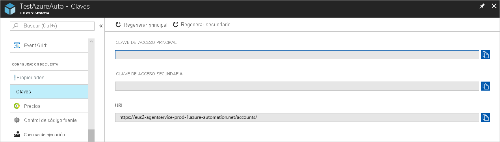
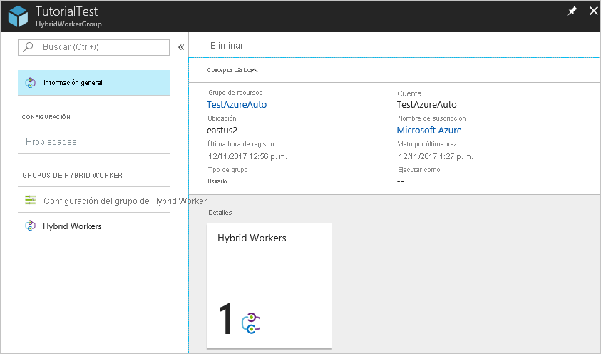

# <a name="deploy-a-windows-hybrid-runbook-worker"></a>Implementación de Hybrid Runbook Worker en Windows

La característica Hybrid Runbook Worker de Azure Automation permite ejecutar runbooks directamente en la máquina que hospeda el rol y en los recursos del entorno para administrar dichos recursos locales. Azure Automation almacena y administra los runbooks y después los entrega a una o más máquinas designadas. En este artículo se describe cómo implementar una instancia de Hybrid Runbook Worker en una máquina Windows, cómo eliminar el trabajo y cómo eliminar un grupo de Hybrid Runbook Worker.

Después de implementar correctamente un trabajo de runbook, revise la [ejecución de runbooks en Hybrid Runbook Worker](automation-hrw-run-runbooks.md) para más información sobre cómo configurar los runbooks para automatizar los procesos del centro de datos local o en otro entorno de nube.

## <a name="prerequisites"></a>Requisitos previos

Antes de empezar, asegúrese de que dispone de lo siguiente.

### <a name="a-log-analytics-workspace"></a>Un área de trabajo de Log Analytics

El rol Hybrid Runbook Worker depende de un área de trabajo de Log Analytics de Azure Monitor para instalar y configurar el rol. Puede usar [Azure Resource Manager](../azure-monitor/samples/resource-manager-workspace.md#create-a-log-analytics-workspace) mediante [PowerShell](../azure-monitor/scripts/powershell-sample-create-workspace.md?toc=/powershell/module/toc.json) o [Azure Portal](../azure-monitor/learn/quick-create-workspace.md).

Si no tiene ningún área de trabajo de Log Analytics de Azure Monitor, revise la [guía de diseño de registros de Azure Monitor](../azure-monitor/platform/design-logs-deployment.md) antes de crear el área de trabajo.

Si tiene un área de trabajo, pero no está vinculada a su cuenta de Automation, la habilitación de una característica de Automation agrega funcionalidad para Azure Automation, incluida la compatibilidad con Hybrid Runbook Worker. Cuando habilita una de las características de Azure Automation en el área de trabajo de Log Analytics, en concreto, en [Update Management](automation-update-management.md) o [Change Tracking e Inventario](change-tracking.md), los componentes de trabajo se insertan automáticamente en la máquina del agente.

   Para agregar la característica Administración de actualizaciones al área de trabajo, ejecute el cmdlet de PowerShell siguiente:

```powershell-interactive
   Set-AzOperationalInsightsIntelligencePack -ResourceGroupName <logAnalyticsResourceGroup> -WorkspaceName <logAnalyticsWorkspaceName> -IntelligencePackName "Updates" -Enabled $true
```

   Para agregar la característica Change Tracking e Inventario al área de trabajo, ejecute el cmdlet de PowerShell siguiente:

```powershell-interactive
   Set-AzOperationalInsightsIntelligencePack -ResourceGroupName <logAnalyticsResourceGroup> -WorkspaceName <logAnalyticsWorkspaceName> -IntelligencePackName "ChangeTracking" -Enabled $true
```

### <a name="log-analytics-agent"></a>Agente de Log Analytics

El rol de Hybrid Runbook Worker requiere el [agente de Log Analytics](../azure-monitor/platform/log-analytics-agent.md) para el sistema operativo Windows compatible.

### <a name="supported-windows-operating-system"></a>Sistemas operativos Windows compatibles

Las siguientes versiones del sistema operativo Windows son compatibles oficialmente con Hybrid Runbook Worker para Windows:

* Windows Server 2019
* Windows Server 2016, versión 1709 y 1803
* Windows Server 2012, 2012 R2
* Windows Server 2008 SP2 (x64), 2008 R2
* Windows 10 Enterprise (incluida la sesión múltiple) y Pro
* Windows 8 Enterprise y Pro
* Windows 7 SP1

### <a name="minimum-requirements"></a>Requisitos mínimos

Estos son los requisitos mínimos de Hybrid Runbook Worker en Windows:

* Windows PowerShell 5.1 o posterior ([descargar WMF 5.1](https://www.microsoft.com/download/details.aspx?id=54616)).
* .NET Framework 4.6.2, o posterior
* Dos núcleos
* 4 GB de RAM
* Puerto 443 (saliente)

### <a name="network-configuration"></a>Network configuration (Configuración de red)

Para obtener más requisitos de redes adicionales para Hybrid Runbook Worker, consulte el apartado sobre [configuración de la red](automation-hybrid-runbook-worker.md#network-planning).

### <a name="adding-a-machine-to-a-hybrid-runbook-worker-group"></a>Adición de una máquina a un grupo de Hybrid Runbook Worker.

Puede agregar la máquina de trabajo a un grupo de Hybrid Runbook Worker en su cuenta de Automation. Tenga en cuenta que debe ser compatible con los runbooks de Automation mientras use la misma cuenta para la característica de Azure Automation y la pertenencia a grupos de Hybrid Runbook Worker. Esta funcionalidad se agregó a la versión 7.2.12024.0 de Hybrid Runbook Worker.

>[!NOTE]
>Al habilitar [Update Management](automation-update-management.md) de Azure Automation, las máquinas Windows conectadas al área de trabajo de Log Analytics se configuran automáticamente como una instancia de Hybrid Runbook Worker para admitir actualizaciones de su sistema operativo. Sin embargo, este trabajo no se registra en ningún grupo de Hybrid Worker ya definido en la cuenta de Automation.

## <a name="enabling-machines-for-management-with-azure-automation-state-configuration"></a>Habilitación de máquinas para su administración mediante Azure Automation State Configuration

Para obtener información sobre cómo habilitar máquinas para su administración con Azure Automation State Configuration, consulte [Habilitar máquinas para administrarlas con Azure Automation State Configuration](automation-dsc-onboarding.md).

> [!NOTE]
> Para administrar la configuración de las máquinas que admiten el rol de Hybrid Runbook Worker con Desired State Configuration (DSC), debe agregar dichas máquinas como nodos de DSC.

## <a name="windows-hybrid-runbook-worker-installation-options"></a>Opciones de instalación de Hybrid Runbook Worker en Windows

Para instalar y configurar una instancia de Hybrid Runbook Worker en Windows, puede usar uno de los métodos siguientes.

* En el caso de las máquinas virtuales de Azure, instale el agente de Log Analytics para Windows mediante la [extensión de máquina virtual para Windows](../virtual-machines/extensions/oms-windows.md). La extensión instala el agente de Log Analytics en Azure Virtual Machines e inscribe las máquinas virtuales en un área de trabajo de Log Analytics existente mediante una plantilla de Azure Resource Manager o PowerShell. Una vez instalado el agente, la máquina virtual se puede agregar a un grupo de Hybrid Runbook Worker de su cuenta de Automation.

* En el caso de VM que no sean de Azure, instale el agente de Log Analytics para Windows con las opciones de implementación que se describen en el artículo [Conexión de equipos Windows a Azure Monitor](../azure-monitor/platform/agent-windows.md). Puede repetir este proceso para varias máquinas para agregar varios trabajos a su entorno. Una vez instalado el agente, las VM se pueden agregar a un grupo de Hybrid Runbook Worker de su cuenta de Automation.

* Use un script de PowerShell proporcionado para [automatizar](#automated-deployment) por completo el proceso de configuración de una o más máquinas Windows. Este es el método recomendado para las máquinas de su centro de recursos u otro entorno en la nube.

## <a name="automated-deployment"></a>Implementación automatizada

En la máquina de destino, realice los pasos siguientes para automatizar la instalación y configuración del rol Hybrid Worker en Windows mediante el script de PowerShell **New-OnPremiseHybridWorker.ps1**. El script sigue los pasos a continuación:

* Instala los módulos necesarios.
* Inicia sesión con su cuenta de Azure.
* Comprueba la existencia de la cuenta de Automation y el grupo de recursos especificados.
* Crea referencias a los atributos de la cuenta de Automation.
* Crea un área de trabajo de Log Analytics en Azure Monitor si no se especifica.
* Habilitar la solución Azure Automation en el área de trabajo
* Descarga e instalación del agente de Log Analytics para Windows
* Registro de las máquinas como Hybrid Runbook Worker

### <a name="step-1---download-the-powershell-script"></a>Paso 1: Descarga del script de PowerShell

Descargue el script **New-OnPremiseHybridWorker.ps1** de la [Galería de PowerShell](https://www.powershellgallery.com/packages/New-OnPremiseHybridWorker). Una vez descargado el script, cópielo o ejecútelo en la máquina de destino. El script **New-OnPremiseHybridWorker.ps1** usa los parámetros descritos a continuación durante la ejecución.

| Parámetro | Estado | Descripción |
| --------- | ------ | ----------- |
| `AAResourceGroupName` | Mandatory | el nombre del grupo de recursos que está asociado a su cuenta de Automation. |
| `AutomationAccountName` | Mandatory | el nombre de la cuenta de Automation.
| `Credential` | Opcional | credenciales que se usarán al iniciar sesión en el entorno de Azure. |
| `HybridGroupName` | Mandatory | el nombre de un grupo de Hybrid Runbook Worker que se especifica como destino para los runbooks que admiten este escenario. |
| `OMSResourceGroupName` | Opcional | el nombre del grupo de recursos para el área de trabajo de Log Analytics. Si no se especifica este grupo de recursos, se usa el valor de `AAResourceGroupName`. |
| `SubscriptionID` | Mandatory | identificador de la suscripción a Azure asociada a su cuenta de Automation. |
| `TenantID` | Opcional | identificador de la organización del inquilino asociado a su cuenta de Automation. |
| `WorkspaceName` | Opcional | Nombre del área de trabajo de Log Analytics. Si no tiene un área de trabajo de Log Analytics, el script creará y configurará una. |

> [!NOTE]
> Al habilitar las características, Azure Automation solo admite determinadas regiones para vincular un área de trabajo de Log Analytics y una cuenta de Automation. Para obtener una lista de los pares de asignación que se admiten, consulte [Asignación de región para la cuenta de Automation y el área de trabajo de Log Analytics](how-to/region-mappings.md).

### <a name="step-2---open-windows-powershell-command-line-shell"></a>Paso 2: Apertura del shell de la línea de comandos de Windows PowerShell

Desde el **menú Inicio**, haga clic en **Inicio**, escriba **PowerShell**, haga clic con el botón derecho en **Windows PowerShell** y, a continuación, haga clic en **Ejecutar como administrador**.

### <a name="step-3---run-the-powershell-script"></a>Paso 3: Ejecución del script de PowerShell

En el shell de la línea de comandos de PowerShell, vaya a la carpeta que contiene el script que ha descargado. Cambie los valores de los parámetros `AutomationAccountName`, `AAResourceGroupName`, `OMSResourceGroupName`, `HybridGroupName`, `SubscriptionID` y `WorkspaceName`. Después, ejecute el script.

Se le solicitará que se autentique en Azure después de ejecutar el script. Debe iniciar sesión con una cuenta que sea miembro del rol Administradores de suscripciones y coadministrador de la suscripción.

```powershell-interactive
.\New-OnPremiseHybridWorker.ps1 -AutomationAccountName <nameOfAutomationAccount> -AAResourceGroupName <nameOfResourceGroup>`
-OMSResourceGroupName <nameOfOResourceGroup> -HybridGroupName <nameOfHRWGroup> `
-SubscriptionID <subscriptionId> -WorkspaceName <nameOfLogAnalyticsWorkspace>
```

### <a name="step-4---install-nuget"></a>Paso 4: Instalación de NuGet

Se le pedirá que acepte la instalación de NuGet y que se autentique con sus credenciales de Azure. Si no tiene la versión más reciente de NuGet, puede descargarla en [Versiones de distribución de NuGet disponibles](https://www.nuget.org/downloads).

### <a name="step-5---verify-the-deployment"></a>Paso 5: Comprobación de la implementación

Una vez completado el script, la página Grupos de Hybrid Worker de la cuenta de Automation muestra el nuevo grupo y el número de miembros. Si se trata de un grupo existente, se incrementa el número de miembros. Puede seleccionar el grupo de la lista en la página Grupos de Hybrid Worker y elegir el icono **Hybrid Workers**. En la página Hybrid Workers, se mostrarán todos los miembros del grupo.

## <a name="manual-deployment"></a>Implementación manual

Para instalar y configurar una instancia de Hybrid Runbook Worker para Windows, siga los pasos que se indican a continuación.

### <a name="step-1---verify-agent-is-reporting-to-workspace"></a>Paso 1: compruebe que el agente informa al área de trabajo

El agente de Log Analytics para Windows conecta las máquinas a un área de trabajo de Log Analytics de Azure Monitor. Cuando instala el agente en la máquina y lo conecta al área de trabajo, se descargan automáticamente los componentes necesarios para la instancia de Hybrid Runbook Worker.

Una vez que el agente se ha conectado correctamente al área de trabajo de Log Analytics, transcurridos unos minutos, puede ejecutar la consulta siguiente para comprobar que envía datos de latido al área de trabajo.

```kusto
Heartbeat 
| where Category == "Direct Agent"
| where TimeGenerated > ago(30m)
```

En los resultados de la búsqueda, verá los registros de latido de la máquina que indican que está conectada y que está creando informes para el servicio. De forma predeterminada, cada agente reenvía un registro de latido a su área de trabajo asignada. Realice los siguientes pasos para completar la instalación y configuración del agente.

1. Habilite la característica para agregar el equipo del agente. Para Update Management y VM de Azure, consulte [Habilitar máquinas virtuales de Azure](automation-onboard-solutions-from-automation-account.md#enable-azure-vms). Para VM que no sean de Azure, consulte [Habilitación de máquinas en el área de trabajo](automation-onboard-solutions-from-automation-account.md#enable-machines-in-the-workspace). Para Change Tracking y VM de Azure, consulte [Habilitar máquinas virtuales de Azure](automation-enable-changes-from-auto-acct.md#enable-azure-vms). Para VM que no sean de Azure, consulte [Habilitación de máquinas en el área de trabajo](automation-enable-changes-from-auto-acct.md#enable-machines-in-the-workspace).

2. Para confirmar la versión de Hybrid Runbook Worker, vaya a `C:\Program Files\Microsoft Monitoring Agent\Agent\AzureAutomation\` y observe la subcarpeta **version**.

### <a name="step-3---install-the-runbook-environment-and-connect-to-azure-automation"></a>Paso 3: Instalación del entorno de runbook y conexión con Azure Automation

Cuando se configura un agente para que informe a un área de trabajo de Log Analytics, la característica de Azure Automation inserta el módulo de PowerShell `HybridRegistration`, que contiene el cmdlet `Add-HybridRunbookWorker`. Este cmdlet se usa para instalar el entorno de runbook en la máquina y registrarlo en Azure Automation.

Abra una sesión de PowerShell en modo de Administrador y ejecute el comando siguientes para importar el módulo.

```powershell-interactive
cd "C:\Program Files\Microsoft Monitoring Agent\Agent\AzureAutomation\<version>\HybridRegistration"
Import-Module .\HybridRegistration.psd1
```

Ahora, ejecute el cmdlet `Add-HybridRunbookWorker` con la siguiente sintaxis.

```powershell-interactive
Add-HybridRunbookWorker –GroupName <String> -Url <Url> -Key <String>
```

Puede obtener la información necesaria para los parámetros `Url` y `Key` de la página **Claves** de la cuenta de Automation. Seleccione **Claves** en la sección **Configuración de la cuenta** en el lado izquierdo de la página.



* Para el parámetro `Url`, copie el valor para **URL**.

* Para el parámetro `Key`, copie el valor para **CLAVE DE ACCESO PRIMARIA**.

* En el parámetro `GroupName`, use el nombre del grupo de Hybrid Runbook Worker. Si este grupo ya existe en la cuenta de Automation, se le agregará la máquina actual. Si este grupo no existe, se agrega.

* Si es necesario, establezca el parámetro `Verbose` para recibir detalles sobre la instalación.

### <a name="step-4----install-powershell-modules"></a>Paso 4: Instalación de módulos PowerShell

Los runbooks pueden usar cualquiera de las actividades y los cmdlets definidos en los módulos instalados en el entorno de Azure Automation. Dado que estos módulos no se implementan automáticamente en las máquinas locales, debe instalarlos de forma manual. La excepción es el módulo de Azure. Este módulo se instala de manera predeterminada y ofrece acceso a los cmdlets para todos los servicios y actividades de Azure para Azure Automation.

Como el propósito principal de la instancia de Hybrid Runbook Worker es administrar recursos locales, es muy probable que deba instalar los módulos que admiten estos recursos, específicamente el módulo `PowerShellGet`. Para más información sobre cómo instalar módulos de Windows PowerShell, consulte [Windows PowerShell](/powershell/scripting/developer/windows-powershell).

Los módulos instalados deben estar en una ubicación a la que haga referencia la variable de entorno `PSModulePath` para que Hybrid Worker los importe automáticamente. Para más información, consulte [Instalación de módulos en PSModulePath](/powershell/scripting/developer/module/installing-a-powershell-module?view=powershell-7).

## <a name="remove-the-hybrid-runbook-worker-from-an-on-premises-windows-machine"></a><a name="remove-windows-hybrid-runbook-worker"></a>Eliminación de la instancia de Hybrid Runbook Worker de una máquina Windows local

1. En Azure Portal, abra su cuenta de Automation.

2. En **Configuración de la cuenta**, seleccione **Claves** y anote los valores de **URL** y **Clave de acceso primaria**.

3. Abra una sesión de PowerShell en modo de administrador y ejecute el siguiente comando con los valores de la dirección URL y la clave de acceso principal. Utilice el parámetro `Verbose` para ver un registro detallado del proceso de eliminación. Para eliminar máquinas obsoletas del grupo Hybrid Worker, use el parámetro `machineName` opcional.

```powershell-interactive
Remove-HybridRunbookWorker -Url <URL> -Key <primaryAccessKey> -MachineName <computerName>
```

## <a name="remove-a-hybrid-worker-group"></a>Eliminación de un grupo de Hybrid Worker

Para quitar un grupo de Hybrid Runbook Worker, primero debe quitar la instancia de Hybrid Runbook Worker de todas las máquinas que sean miembros del grupo. Después, siga estos pasos para quitar el grupo:

1. Abra la cuenta de Automation en Azure Portal.

2. Seleccione **Grupos de Hybrid Worker** en **Automatización de procesos**. Seleccione el grupo que quiere eliminar. Aparece la página de propiedades de ese grupo.

   

3. En la página de propiedades del grupo seleccionado, seleccione **Eliminar**. Un mensaje le solicita que confirme esta acción. Seleccione **Sí** si está seguro de que quiere continuar.

   

   Este proceso puede tardar varios segundos en finalizar. Puede realizar un seguimiento de su progreso en **Notificaciones** en el menú.

## <a name="next-steps"></a>Pasos siguientes

* Consulte [Ejecución de runbooks en Hybrid Runbook Worker](automation-hrw-run-runbooks.md) para más información sobre cómo configurar los runbooks para automatizar los procesos del centro de datos local o de otros entornos de nube.

* Para aprender a solucionar problemas con las instancias de Hybrid Runbook Worker, consulte [Solución de incidencias de Hybrid Runbook Worker](troubleshoot/hybrid-runbook-worker.md#general).
