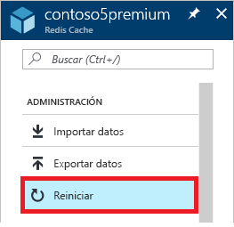
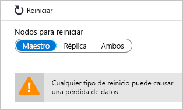
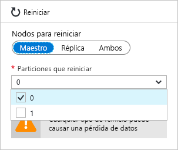

# Administración de Azure Cache for Redis
En este tema, se explica cómo realizar tareas de administración, como [reiniciar](#reboot) y [programar actualizaciones](#schedule-updates), en las instancias de Azure Cache for Redis.

[!INCLUDE [updated-for-az](../../includes/updated-for-az.md)]

## Reboot
La hoja **Reiniciar** permite reiniciar uno o varios nodos de la memoria caché. Esta funcionalidad de reinicio le permite probar la resistencia de la aplicación en caso de que haya un error de un nodo de la caché.

Seleccione los nodos que se van a reiniciar y haga clic en **Reiniciar**.

Si tiene una caché premium con la agrupación en clústeres habilitada, puede seleccionar qué particiones de la memoria caché se reiniciarán.

Para reiniciar uno o varios nodos de la caché, seleccione los nodos que prefiera y haga clic en **Reboot**(Reiniciar). Si tiene una caché premium con la agrupación en clústeres habilitada, seleccione las particiones para reiniciar y haga clic en **Reboot** (Reiniciar). Al cabo de unos minutos, los nodos seleccionados se reiniciarán y volverán a estar en línea poco tiempo después.

El impacto en las aplicaciones cliente varía en función de los nodos que se reinicien.

* **Maestro**: cuando el nodo principal se reinicia, Azure Cache for Redis realiza una conmutación por error en el nodo de la réplica y lo promueve para que se convierta en el principal. Durante esta conmutación por error puede haber un breve intervalo en el que se puede producir un error de conexión a la memoria caché.
* **Réplica**: el reinicio de un nodo de réplica no suele afectar a los clientes de caché.
* **Ambos, principal y réplica**: cuando se reinician ambos nodos de la caché, se pierden todos los datos de dicha memoria y las conexiones a esta producen un error hasta que el nodo principal vuelve a estar en línea. Si ha configurado la [persistencia de los datos](cache-how-to-premium-persistence.md), se restaurará la copia de seguridad más reciente cuando la caché vuelva a estar en línea, pero se perderán las escrituras de caché producidas después de la copia de seguridad más reciente.
* **Nodes of a premium cache with clustering enabled** (Nodos de una caché premium con agrupamiento en clústeres habilitado): cuando reinicie uno o varios nodos de una caché premium con el agrupamiento en clústeres habilitado, el comportamiento de los nodos seleccionados es el mismo que al reiniciar el nodo o nodos correspondientes de una caché sin agrupar.

## Preguntas más frecuentes sobre el reinicio
* [¿Qué nodo que debo reiniciar para probar mi aplicación?](#which-node-should-i-reboot-to-test-my-application)
* [¿Puedo reiniciar la memoria caché para borrar las conexiones de cliente?](#can-i-reboot-the-cache-to-clear-client-connections)
* [¿Se pierden los datos de mi memoria caché si reinicio?](#will-i-lose-data-from-my-cache-if-i-do-a-reboot)
* [¿Puedo reiniciar la caché con PowerShell, CLI u otras herramientas de administración?](#can-i-reboot-my-cache-using-powershell-cli-or-other-management-tools)

### ¿Qué nodo que debo reiniciar para probar mi aplicación?
Para probar la resistencia de la aplicación frente a errores del nodo principal de la memoria caché, reinicie el nodo **Master** (Maestro). Para probar la resistencia de la aplicación frente a errores del nodo de réplica, reinicie el nodo **Réplica**. Para probar la resistencia de la aplicación frente a errores de toda la caché, reinicie ambos nodos, **Both** (Ambos).

### ¿Puedo reiniciar la memoria caché para borrar las conexiones de cliente?
Sí, si reinicia la memoria caché se borran todas las conexiones de cliente. El reinicio puede resultar útil en caso de que estén agotadas todas las conexiones de cliente debido a un error lógico o a un error en la aplicación cliente. Cada plan de tarifa tiene diferentes [límites de conexión de clientes](cache-configure.md#default-redis-server-configuration) para los distintos tamaños y una vez alcanzados, no se aceptan más conexiones de cliente. Reiniciar la memoria caché es una forma de borrar todas las conexiones de cliente.

> [!IMPORTANT]
> Si reinicia la caché para borrar las conexiones de cliente, StackExchange.Redis vuelve a conectarse automáticamente una vez que el nodo de Redis esté de nuevo en línea. Si no se resuelve el problema subyacente, las conexiones de cliente pueden continuar agotándose.
> 
> 

### ¿Se pierden los datos de mi memoria caché si reinicio?
Si reinicia los nodos **Principal** y **Réplica**, se pueden perder todos los datos de la memoria caché (o de esa partición si utiliza una memoria premium con el agrupamiento en clústeres habilitado), pero esto no está garantizado. Si ha configurado la [persistencia de los datos](cache-how-to-premium-persistence.md), se restaurará la copia de seguridad más reciente cuando la caché vuelva a estar en línea, pero se perderán las escrituras de caché producidas después de realizar la copia de seguridad.

Si reinicia solo uno de los nodos, no se suelen perder datos, pero podría pasar. Por ejemplo, si se reinicia el nodo principal y se está escribiendo en la caché, los datos escritos se pierden. Otro escenario de pérdida de datos se produce al reiniciar un nodo y el otro nodo se dejar de funcionar debido a un error al mismo tiempo. Para obtener más información sobre las posibles causas de pérdida de datos, consulte [What happened to my data in Redis?](https://gist.github.com/JonCole/b6354d92a2d51c141490f10142884ea4#file-whathappenedtomydatainredis-md) (¿Qué ha ocurrido con mis datos en Redis?).

### ¿Puedo reiniciar la caché con PowerShell, CLI u otras herramientas de administración?
Sí. Para ver instrucciones de PowerShell, consulte [Reinicio de una instancia de Azure Cache for Redis](cache-how-to-manage-redis-cache-powershell.md#to-reboot-an-azure-cache-for-redis).

## Programar actualizaciones
La hoja **Programar actualizaciones** permite designar una ventana de mantenimiento para la instancia de caché. Una ventana de mantenimiento le permite controlar los días y las horas de una semana durante los que se pueden actualizar las máquinas virtuales que hospedan la memoria caché. Azure Cache for Redis hará todo lo posible por iniciar y finalizar la actualización del software del servidor de Redis en el período de tiempo especificado que defina.

> [!NOTE] 
> El período de mantenimiento solo se aplica a las actualizaciones del servidor de Redis y no a las actualizaciones de Azure o del sistema operativo de las máquinas virtuales que hospedan la caché.
>

Para especificar una ventana de mantenimiento, compruebe los días deseados, especifique la hora de inicio de la ventana de mantenimiento para cada día y haga clic en **Aceptar**. Tenga en cuenta que la hora del período de mantenimiento está en formato UTC. 

La ventana de mantenimiento predeterminada, y mínima, para las actualizaciones es de cinco horas. Este valor no es configurable desde Azure Portal, pero puede configurarlo en PowerShell mediante el parámetro `MaintenanceWindow` del cmdlet [New-AzRedisCacheScheduleEntry](/powershell/module/az.rediscache/new-azrediscachescheduleentry). Para más información, consulte ¿Se pueden administrar las actualizaciones programadas con PowerShell, CLI u otras herramientas de administración?

## Preguntas más frecuentes sobre la programación de actualizaciones
* [¿Cuándo se realizan las actualizaciones si no se usa la característica de programación de actualizaciones?](#when-do-updates-occur-if-i-dont-use-the-schedule-updates-feature)
* [¿Qué tipo de actualizaciones se actualizan durante el período programado de mantenimiento?](#what-type-of-updates-are-made-during-the-scheduled-maintenance-window)
* [¿Se pueden administrar las actualizaciones programadas con PowerShell, CLI u otras herramientas de administración?](#can-i-managed-scheduled-updates-using-powershell-cli-or-other-management-tools)

### ¿Cuándo se realizan las actualizaciones si no se usa la característica de programación de actualizaciones?
Si no especifica un período de mantenimiento, las actualizaciones pueden realizarse en cualquier momento.

### ¿Qué tipo de actualizaciones se actualizan durante el período programado de mantenimiento?
Las actualizaciones del servidor Redis solo se realizan durante el período programado de mantenimiento. La ventana de mantenimiento no se aplica a las actualizaciones de Azure o a las actualizaciones del sistema operativo de la máquina virtual.

### ¿Se pueden administrar las actualizaciones programadas con PowerShell, CLI u otras herramientas de administración?
Sí, puede administrar sus actualizaciones programadas con los siguientes cmdlets de PowerShell:

* [Get-AzRedisCachePatchSchedule](/powershell/module/az.rediscache/get-azrediscachepatchschedule)
* [New-AzRedisCachePatchSchedule](/powershell/module/az.rediscache/new-azrediscachepatchschedule)
* [New-AzRedisCacheScheduleEntry](/powershell/module/az.rediscache/new-azrediscachescheduleentry)
* [Remove-AzRedisCachePatchSchedule](/powershell/module/az.rediscache/remove-azrediscachepatchschedule)

## Pasos siguientes
Más información sobre las características de Azure Cache for Redis.

* [Niveles de servicio de Azure Cache for Redis](cache-overview.md#service-tiers)

