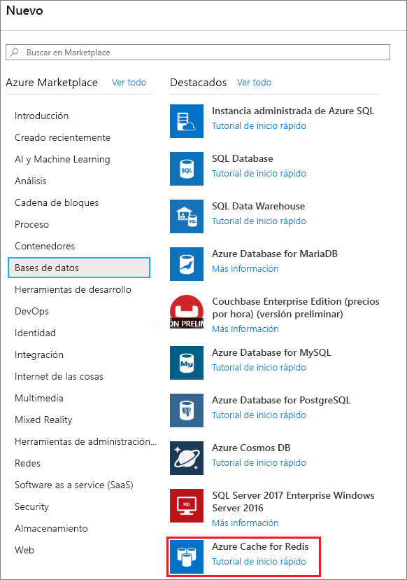
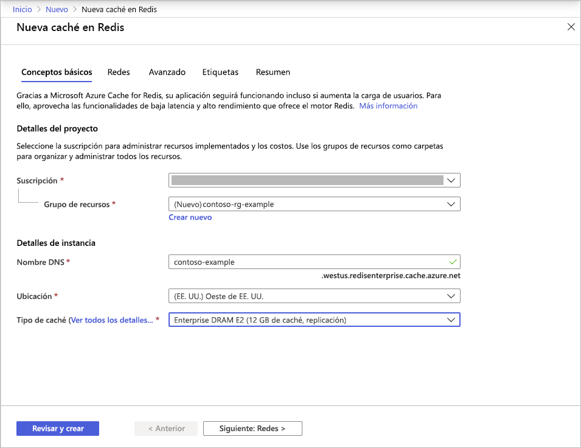
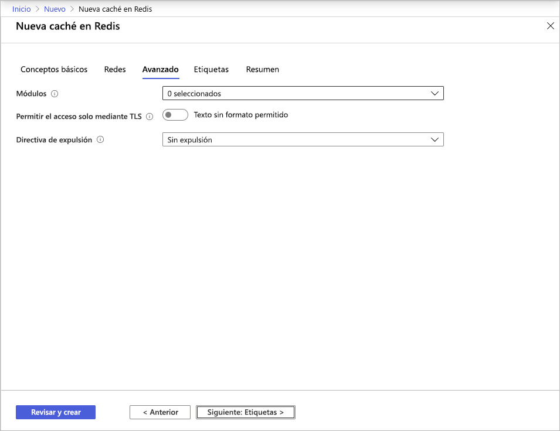
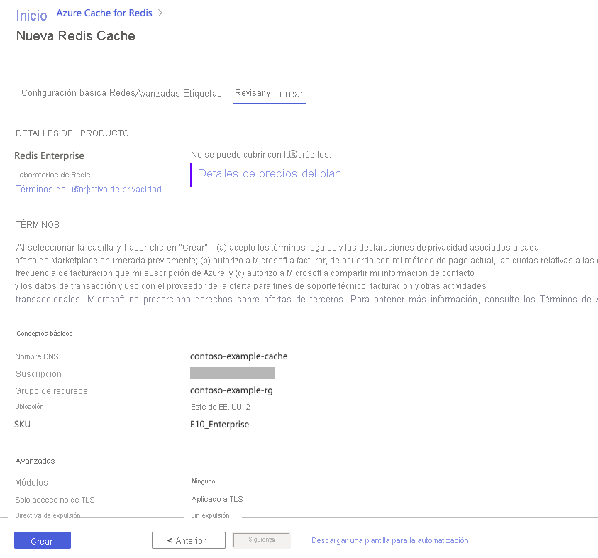

# Inicio rápido: Creación de una memoria caché con el nivel Enterprise (versión preliminar)

Los niveles Enterprise de Azure Cache for Redis proporcionan una instancia de [Redis Enterprise](https://redislabs.com/redis-enterprise/) totalmente integrada y administrada en Azure. Actualmente están disponibles en forma de versión preliminar. Hay dos nuevos niveles en esta versión preliminar:
* Enterprise, que usa memoria volátil (DRAM) en una máquina virtual para almacenar datos.
* Enterprise SSD, que usa memoria volátil y no volátil (NVMe) para almacenar los datos.

No hay ningún costo por unirse a la versión preliminar. Regístrese mediante la opción **Ponerse en contacto conmigo** de [Azure Marketplace](https://aka.ms/redispreviewsignup/) si le interesa. Tenemos un número muy limitado de participantes y no se puede garantizar que se le aceptará en la versión preliminar.

## Prerrequisitos

Necesitará una suscripción a Azure antes de empezar. En caso de no tener ninguna, [cree una cuenta gratuita](https://azure.microsoft.com/free/) primero.

## Creación de una caché
1. Para crear una caché, inicie sesión en Azure Portal mediante el vínculo de la invitación a la versión preliminar y seleccione **Crear un recurso**.

   > [!IMPORTANT] 
   > No se suscriba a *Azure Cache for Redis, niveles Enterprise* directamente en Marketplace.
   > Este paso lo realiza automáticamente la interfaz de usuario del portal de Azure Cache for Redis.
   >
   
1. En la página **Nuevo**, seleccione **Base de datos** y, a continuación, seleccione **Azure Cache for Redis**.
   
   
   
1. En la página **Nueva instancia de Redis Cache**, configure las opciones de la nueva caché.
   
   | Configuración      | Valor sugerido  | Descripción |
   | ------------ |  ------- | -------------------------------------------------- |
   | **Suscripción** | Desplácese hacia abajo y seleccione su suscripción. | La suscripción en la que se creará esta nueva instancia de Azure Cache for Redis. | 
   | **Grupos de recursos** | Desplácese hacia abajo y seleccione un grupo de recursos o **Crear nuevo** y escriba un nombre nuevo para el grupo de recursos. | Nombre del grupo de recursos en el que se van a crear la caché y otros recursos. Al colocar todos los recursos de la aplicación en un grupo de recursos, puede administrarlos o eliminarlos fácilmente. | 
   | **Nombre DNS** | Escriba un nombre único global. | El nombre de la memoria caché debe ser una cadena de entre 1 y 63 caracteres, y solo puede contener números, letras o guiones. El nombre debe comenzar y terminar por un número o una letra y no puede contener guiones consecutivos. El *nombre de host* de la instancia de caché será *\<nombreDNS>.<Azure region>.redisenterprise.cache.azure.net*. | 
   | **Ubicación** | Desplácese hacia abajo y seleccione una ubicación. | Los niveles Enterprise están disponibles en las regiones Oeste de EE. UU., Este de EE. UU. 2 y Oeste de Europa. |
   | **Nivel de caché** | Despliegue el menú y seleccione un nivel *Enterprise DRAM* o *Enterprise SSD* y un tamaño. |  El nivel determina el tamaño, rendimiento y características disponibles para la memoria caché. |
   
    

1. Seleccione **Siguiente: Redes** y omítalo.

   > [!NOTE] 
   > La compatibilidad con el vínculo privado se tratará más adelante.
   >

1. Seleccione **Siguiente: Avanzado**.
   
   Puede conservar la configuración predeterminada o cambiarla según corresponda. Al activar **Allow access only via TLS** (Permitir el acceso solo mediante TLS), debe usar TLS para acceder a la nueva memoria caché desde la aplicación.

    

   > [!NOTE] 
   > Los módulos de Redis no se admiten aún en el nivel Enterprise SSD. Si tiene previsto usar un módulo de Redis, asegúrese de elegir una caché de nivel Enterprise.
   >
   
1. Seleccione **Siguiente: Etiquetas** y omítalo.

1. Seleccione **Siguiente: Resumen**.

    

1. Haga clic en la casilla situada debajo de **Términos**, revise la configuración y, a continuación, seleccione **Revisar y crear**.
   
   La caché tarda un tiempo en crearse. Puede supervisar el progreso en la página **Información general** de Azure Cache for Redis. Cuando **Estado** se muestra como **En ejecución**, la memoria caché está lista para su uso.

   > [!NOTE] 
   > Una vez creada la memoria caché con el nivel Enterprise, recibirá un correo electrónico de **Acción requerida** de Azure Marketplace para que configure *Azure Cache for Redis, niveles Enterprise*. Esta acción no es necesaria. Puede ignorar el correo electrónico sin problemas.
   >

## Pasos siguientes

En este inicio rápido, aprenderá a crear una instancia de Azure Cache for Redis con el nivel Enterprise.

> [!div class="nextstepaction"]
> [Creación de una aplicación web ASP.NET que usa Azure Redis Cache.](./cache-web-app-howto.md)

