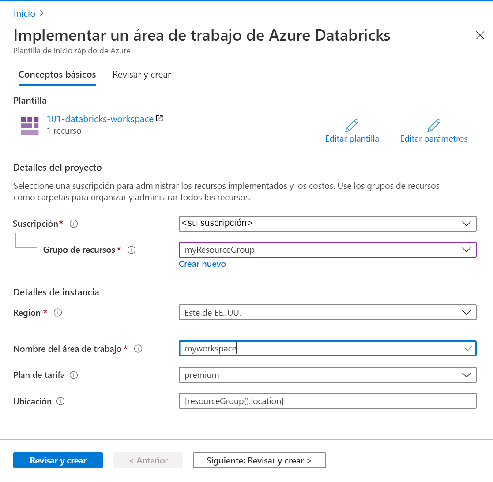

# <a name="quickstart-create-an-azure-databricks-workspace-by-using-the-azure-resource-manager-template"></a>Inicio rápido: Inicio rápido: Creación de un área de trabajo de Azure Databricks mediante la plantilla de Azure Resource Manager

En este inicio rápido, va a usar una plantilla de Azure Resource Manager para crear un área de trabajo de Azure Databricks. Una vez creado el área de trabajo, valide la implementación.

[!INCLUDE [About Azure Resource Manager](../../includes/resource-manager-quickstart-introduction.md)]

## <a name="prerequisites"></a>Requisitos previos

Para completar este artículo, necesitará lo siguiente:

* Una suscripción a Azure: [cree una gratuita](https://azure.microsoft.com/free/).

## <a name="create-an-azure-databricks-workspace"></a>Creación de un área de trabajo de Azure Databricks

### <a name="review-the-template"></a>Revisión de la plantilla

La plantilla usada en este inicio rápido forma parte de las [plantillas de inicio rápido de Azure](https://azure.microsoft.com/resources/templates/101-databricks-workspace/).

:::code language="json" source="~/quickstart-templates/101-databricks-workspace/azuredeploy.json" range="1-53" highlight="33-46":::

El recurso de Azure definido en la plantilla es [Microsoft.Databricks/workspaces](/azure/templates/microsoft.databricks/workspaces): crear un área de trabajo de Azure Databricks.

### <a name="deploy-the-template"></a>Implementación de la plantilla

En esta sección, creará un área de trabajo de Azure Databricks mediante una plantilla de Resource Manager.

1. Seleccione la imagen siguiente para iniciar sesión en Azure y abrir una plantilla. La plantilla crea un área de trabajo de Azure Databricks.

   [](https://portal.azure.com/#create/Microsoft.Template/uri/https%3A%2F%2Fraw.githubusercontent.com%2FAzure%2Fazure-quickstart-templates%2Fmaster%2F101-databricks-workspace%2Fazuredeploy.json)

2. Proporcione los valores necesarios para crear el área de trabajo de Azure Databricks.

   

   Proporcione los valores siguientes:

   |Propiedad  |Descripción  |
   |---------|---------|
   |**Suscripción**     | En el cuadro desplegable, seleccione la suscripción de Azure.        |
   |**Grupos de recursos**     | Especifique si desea crear un nuevo grupo de recursos o utilizar uno existente. Un grupo de recursos es un contenedor que almacena los recursos relacionados con una solución de Azure. Para más información, consulte [Información general del grupo de recursos de Azure](../azure-resource-manager/management/overview.md). |
   |**Ubicación**     | Seleccione **Este de EE. UU. 2**. Para otras regiones disponibles, consulte [Productos disponibles por región](https://azure.microsoft.com/regions/services/).        |
   |**Workspace name** (Nombre del área de trabajo)     | Proporcione un nombre para el área de trabajo de Databricks        |
   |**Plan de tarifa**     |  Elija entre **Standard** o **Premium**. Para más información sobre estos planes, consulte la [página de precios de Databricks](https://azure.microsoft.com/pricing/details/databricks/).       |

3. Seleccione **Revisar y crear** y, a continuación, **Crear**.

4. Se tarda unos minutos en crear el área de trabajo. Cuando se produce un error en una implementación del área de trabajo, esta todavía se crea en un estado de error. Elimine el área de trabajo con errores y cree una nueva que resuelva los errores de implementación. Al eliminar el área de trabajo con errores, también se eliminan el grupo de recursos administrados y los recursos implementados correctamente.

## <a name="review-deployed-resources"></a>Revisión de los recursos implementados

Puede usar Azure Portal para comprobar el área de trabajo de Azure Databricks o utilizar el siguiente script de la CLI de Azure o Azure PowerShell para enumerar el recurso.

### <a name="azure-cli"></a>Azure CLI

```azurecli-interactive
echo "Enter your Azure Databricks workspace name:" &&
read databricksWorkspaceName &&
echo "Enter the resource group where the Azure Databricks workspace exists:" &&
read resourcegroupName &&
az databricks workspace show -g $resourcegroupName -n $databricksWorkspaceName
```

### <a name="azure-powershell"></a>Azure PowerShell

```azurepowershell-interactive
$resourceGroupName = Read-Host -Prompt "Enter the resource group name where your Azure Databricks workspace exists"
(Get-AzResource -ResourceType "Microsoft.Databricks/workspaces" -ResourceGroupName $resourceGroupName).Name
 Write-Host "Press [ENTER] to continue..."
```

## <a name="clean-up-resources"></a>Limpieza de recursos

Si tiene pensado seguir trabajando con los otros tutoriales, considere la posibilidad de dejar estos recursos activos. Cuando ya no lo necesite, elimine el grupo de recursos; de este modo, se eliminarán también el área de trabajo de Azure Databricks y los recursos administrados relacionados. Para eliminar el grupo de recursos mediante la CLI de Azure o Azure PowerShell:

### <a name="azure-cli"></a>Azure CLI

```azurecli-interactive
echo "Enter the Resource Group name:" &&
read resourceGroupName &&
az group delete --name $resourceGroupName &&
echo "Press [ENTER] to continue ..."
```

### <a name="azure-powershell"></a>Azure PowerShell

```azurepowershell-interactive
$resourceGroupName = Read-Host -Prompt "Enter the Resource Group name"
Remove-AzResourceGroup -Name $resourceGroupName
Write-Host "Press [ENTER] to continue..."
```

## <a name="next-steps"></a>Pasos siguientes

En este inicio rápido, ha creado un área de trabajo de Azure Databricks mediante una plantilla de Azure Resource Manager y ha validado la implementación. Vaya al siguiente artículo para aprender cómo realizar una operación ETL (extraer, transformar y cargar datos) mediante Azure Databricks.

> [!div class="nextstepaction"]
> [Extracción, transformación y carga de datos mediante Azure Databricks](databricks-extract-load-sql-data-warehouse.md)
