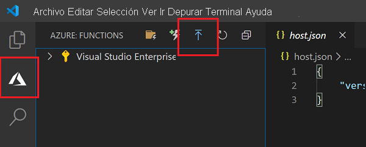

# Inicio rápido: Creación de una función en Azure con Python mediante Visual Studio Code

[!INCLUDE [functions-language-selector-quickstart-vs-code](../../includes/functions-language-selector-quickstart-vs-code.md)]

En este artículo se usa Visual Studio Code para crear una función de Python que responda a solicitudes HTTP. Después de probar el código localmente, se implementa en el entorno sin servidor de Azure Functions.

Este inicio rápido supone un pequeño costo en su cuenta de Azure.

También hay una [versión basada en la CLI](create-first-function-cli-python.md) de este artículo.

## Configurar su entorno

Antes de empezar, asegúrese de que cumple los siguientes requisitos:

+ Una cuenta de Azure con una suscripción activa. [Cree una cuenta gratuita](https://azure.microsoft.com/free/?ref=microsoft.com&utm_source=microsoft.com&utm_medium=docs&utm_campaign=visualstudio).

+ [Node.js](https://nodejs.org/), requerido por Windows para npm. Solo las [versiones Active LTS y Maintenance LTS ](https://nodejs.org/about/releases/). Use el comando `node --version` para comprobar la versión.
    No se requiere para el desarrollo local en macOS y Linux.

+ Azure Functions (x64) admite [Python 3.8](https://www.python.org/downloads/release/python-381/), [Python 3.7](https://www.python.org/downloads/release/python-375/) y [Python 3.6](https://www.python.org/downloads/release/python-368/).

+ [Visual Studio Code](https://code.visualstudio.com/) en una de las [plataformas admitidas](https://code.visualstudio.com/docs/supporting/requirements#_platforms).

+ La [extensión de Python](https://marketplace.visualstudio.com/items?itemName=ms-python.python) para Visual Studio Code  

+ La [extensión de Azure Functions](https://marketplace.visualstudio.com/items?itemName=ms-azuretools.vscode-azurefunctions) para Visual Studio Code.

## Creación del proyecto local

En esta sección se usa Visual Studio Code para crear un proyecto local de Azure Functions en Python. Más adelante en este artículo, publicará el código de función en Azure.

1. Seleccione el icono de Azure en la barra de actividades y después en el área **Azure: Functions**, seleccione el icono **Crear un proyecto**.

    

1. Elija una ubicación de directorio para el área de trabajo del proyecto y elija **Seleccionar**.

    > [!NOTE]
    > Estos pasos se han diseñado para completarse fuera de un área de trabajo. Por tanto, no seleccione una carpeta de proyecto que forme parte de un área de trabajo.

1. Escriba la siguiente información cuando se le indique:

    + **Seleccione un lenguaje para el proyecto de funciones**: Elija `Python`.

    + **Seleccione un alias de Python para crear un entorno virtual**: Elija la ubicación del intérprete de Python. Si no se muestra la ubicación, escriba la ruta de acceso completa al archivo binario de Python.  

    + **Seleccione una plantilla para la primera función del proyecto**: Elija `HTTP trigger`.

    + **Especifique un nombre de función**: Escriba `HttpExample`.

    + **Nivel de autorización**: Elija `Anonymous`, que permite que cualquier llame al punto de conexión de la función. Para obtener información sobre el nivel de autorización, consulte [Claves de autorización](functions-bindings-http-webhook-trigger.md#authorization-keys).

    + **Seleccione cómo desea que se abra el proyecto**: Elija `Add to workspace`.

1. Con esta información, Visual Studio Code genera un proyecto de Azure Functions con un desencadenador HTTP. Los archivos del proyecto locales se pueden ver en Explorer. Para obtener más información sobre los archivos que se crean, consulte [Archivos del proyecto generados](functions-develop-vs-code.md#generated-project-files).

[!INCLUDE [functions-run-function-test-local-vs-code](../../includes/functions-run-function-test-local-vs-code.md)]

Después de comprobar que la función se ejecuta correctamente en el equipo local, es el momento de usar Visual Studio Code para publicar el proyecto directamente en Azure.

[!INCLUDE [functions-sign-in-vs-code](../../includes/functions-sign-in-vs-code.md)]

## Publicar el proyecto en Azure

En esta sección, va a crear una aplicación de funciones y los recursos relacionados en su suscripción de Azure y, después, va a implementar el código. 

> [!IMPORTANT]
> La publicación en una aplicación de función existente sobrescribe el contenido de esa aplicación en Azure. 

1. Seleccione el icono de Azure en la barra de actividades y después en el área **Azure: Functions**, seleccione el botón de **implementación en la aplicación de funciones**.

    

1. Escriba la siguiente información cuando se le indique:

    + **Seleccione la carpeta**: elija una carpeta en el área de trabajo o busque una que contenga la aplicación de funciones. No verá esta opción si ya tiene una aplicación de funciones válida abierta.

    + **Seleccione la suscripción**: elija la suscripción que desee usar. No se mostrará esta opción si solo tiene una suscripción.

    + **Seleccione la aplicación de funciones en Azure**: Elija `+ Create new Function App`. (No elija la opción `Advanced`, que no se trata en este artículo).

    + **Escriba un nombre único global para la aplicación de funciones**: Escriba un nombre que sea válido en una ruta de acceso de la dirección URL. El nombre que escriba se valida para asegurarse de que es único en Azure Functions. 

    + **Seleccione un entorno de ejecución**: Elija la versión de Python en la que se ha estado ejecutando localmente. Ejecute el comando `python --version` para comprobar la versión.

    + **Seleccione una ubicación para los nuevos recursos**:  Para mejorar el rendimiento, elija una [región](https://azure.microsoft.com/regions/) cerca de usted.

1. Cuando se complete, se crearán los siguientes recursos de Azure en la suscripción con nombres que se basan en el nombre de la aplicación de funciones:

    + Un grupo de recursos, que es un contenedor lógico de recursos relacionados.
    + Una cuenta de Azure Storage estándar, que mantiene el estado e información adicional sobre los proyectos.
    + Un plan de consumo, que define el host subyacente para su aplicación de funciones sin servidor. 
    + Una aplicación de funciones, que proporciona el entorno para ejecutar el código de función. Una aplicación de funciones permite agrupar funciones como una unidad lógica para facilitar la administración, la implementación y el uso compartido de recursos en el mismo plan de hospedaje.
    + Una instancia de Application Insights conectada a la aplicación de funciones, que realiza un seguimiento del uso de la función sin servidor.

    Una vez que se haya creado la aplicación de función se mostrará una notificación y se aplicará el paquete de implementación. 

1. Seleccione **View Output** (Ver salida) en esta notificación para ver la creación y los resultados de la implementación, incluidos los recursos de Azure que ha creado. Si se pierde la notificación, seleccione el icono de campana en la esquina inferior derecha para verlo de nuevo.

    

[!INCLUDE [functions-vs-code-run-remote](../../includes/functions-vs-code-run-remote.md)]

[!INCLUDE [functions-cleanup-resources-vs-code.md](../../includes/functions-cleanup-resources-vs-code.md)]

## Pasos siguientes

Ha usado Visual Studio Code para crear una aplicación de función con una función simple desencadenada por HTTP. En el siguiente artículo, esa función se expande mediante la adición de un enlace de salida. Este enlace escribe la cadena de la solicitud HTTP en un mensaje en una cola de Azure Queue Storage. 

> [!div class="nextstepaction"]
> [Conexión a una cola de Azure Storage](functions-add-output-binding-storage-queue-vs-code.md?pivots=programming-language-python)

[Azure Functions Core Tools]: functions-run-local.md
[Azure Functions extension for Visual Studio Code]: https://marketplace.visualstudio.com/items?itemName=ms-azuretools.vscode-azurefunctions
