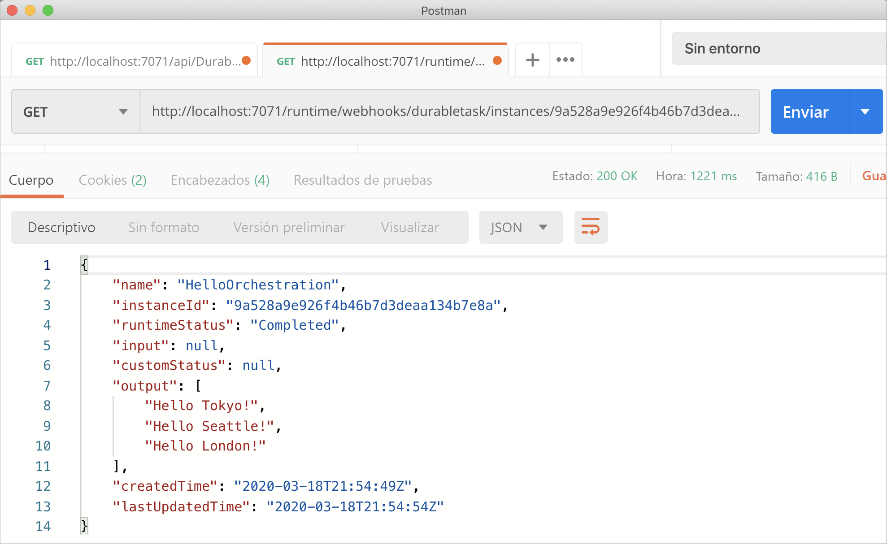
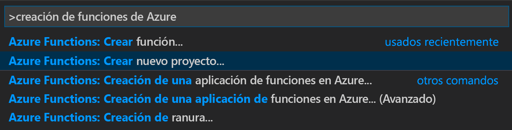
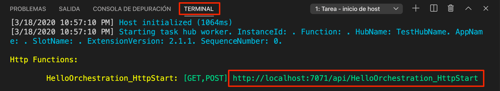
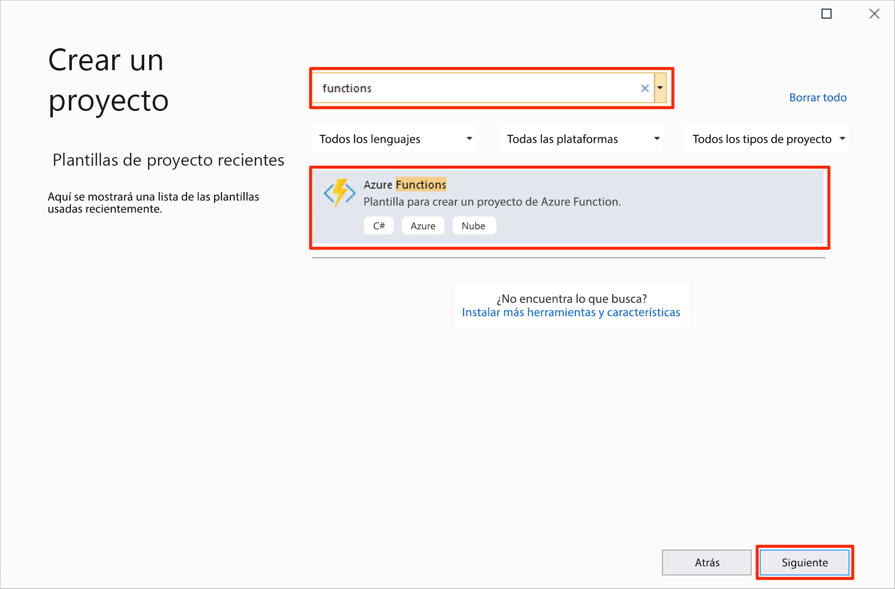
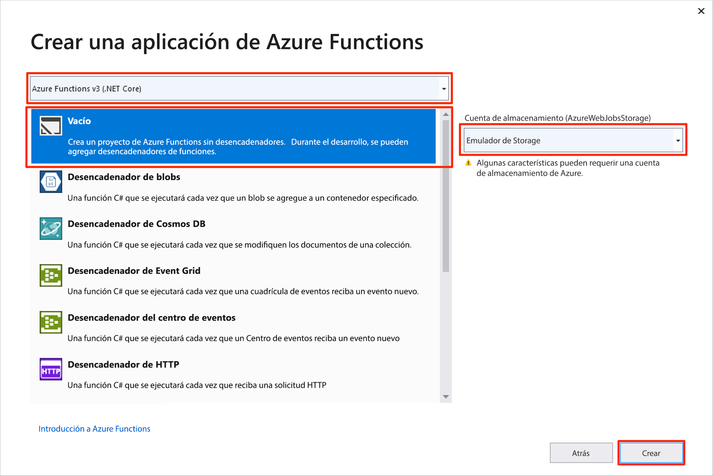
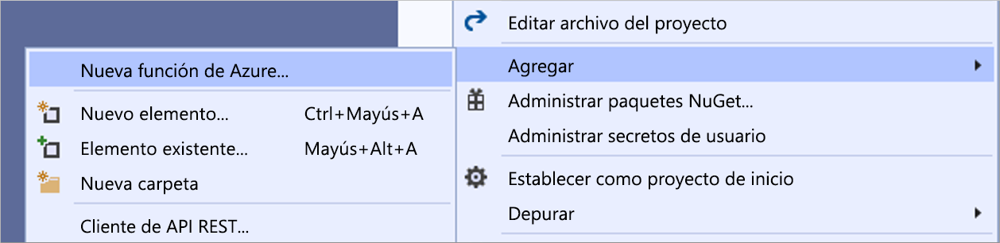

# <a name="create-your-first-durable-function-in-c"></a>Creación de su primera función durable en C\#

*Durable Functions* es una extensión de [Azure Functions](../functions-overview.md) que le permite escribir funciones con estado en un entorno sin servidor. La extensión administra el estado, establece puntos de control y reinicia en su nombre.

::: zone pivot="code-editor-vscode"

En este artículo aprenderá a usar Visual Studio Code con el fin de crear y probar localmente una función perdurable "Hola mundo".  Esta función organiza y encadena llamadas a otras funciones. Luego, publicará el código de función en Azure. Estas herramientas están disponibles como parte de la [extensión de Azure Functions](https://marketplace.visualstudio.com/items?itemName=ms-azuretools.vscode-azurefunctions) de VS Code.



## <a name="prerequisites"></a>Prerrequisitos

Para completar este tutorial:

* Instale [Visual Studio Code](https://code.visualstudio.com/download).

* Instale las siguientes extensiones de VS Code:
    - [Funciones de Azure](https://marketplace.visualstudio.com/items?itemName=ms-azuretools.vscode-azurefunctions)
    - [C#](https://marketplace.visualstudio.com/items?itemName=ms-dotnettools.csharp)

* Asegúrese de tener la versión más reciente de [Azure Functions Core Tools](../functions-run-local.md).

* Durable Functions requiere una cuenta de almacenamiento de Azure. Necesita una suscripción de Azure.

* Asegúrese de que tiene instalada la versión 3.1 o una posterior de [SDK de .NET Core](https://dotnet.microsoft.com/download).

[!INCLUDE [quickstarts-free-trial-note](../../../includes/quickstarts-free-trial-note.md)]

## <a name="create-your-local-project"></a><a name="create-an-azure-functions-project"></a>Creación del proyecto local 

En esta sección se usa Visual Studio Code para crear un proyecto local en Azure Functions. 

1. En Visual Studio Code, presione F1 (o Ctrl/Cmd+Mayús+P) para abrir la paleta de comandos. En la paleta de comandos, busque y seleccione `Azure Functions: Create New Project...`.

    

1. Elija una ubicación de carpeta vacía para el proyecto y elija **Seleccionar**.

1. Siguiendo las indicaciones, proporcione la información siguiente:

    | Prompt | Value | Descripción |
    | ------ | ----- | ----------- |
    | Seleccionar el lenguaje para el proyecto de la aplicación de funciones | C# | Cree un proyecto local de Functions en C#. |
    | Selección de una versión | Azure Functions v3 | Esta opción solo se ve si las herramientas principales no estén instaladas. En este caso, las herramientas principales se instalan la primera vez que se ejecuta la aplicación. |
    | Seleccionar una plantilla para la primera función de su proyecto | Omitir por ahora | |
    | Seleccionar cómo desea que se abra el proyecto | Abrir en la ventana actual | Vuelve a abrir VS Code en la carpeta seleccionada. |

Visual Studio Code instala Azure Functions Core Tools, en caso de que sea necesario. También crea el proyecto de una aplicación de funciones en una carpeta. Este proyecto contiene los archivos de configuración [host.json](../functions-host-json.md) y [local.settings.json](../functions-run-local.md#local-settings-file).

## <a name="add-functions-to-the-app"></a>Incorporación de funciones a la aplicación

En los pasos siguientes se usa una plantilla para crear el código de Durable Functions en el proyecto.

1. En la paleta de comandos, busque y seleccione `Azure Functions: Create Function...`.

1. Siguiendo las indicaciones, proporcione la información siguiente:

    | Prompt | Value | Descripción |
    | ------ | ----- | ----------- |
    | Seleccionar una plantilla para la función | DurableFunctionsOrchestration | Crear una orquestación de Durable Functions |
    | Proporcionar un nombre de función | HelloOrchestration | Nombre de la clase en la que se crean las funciones |
    | Proporcionar un espacio de nombres | Company.Function | Espacio de nombres de la clase generada |

1. Cuando VS Code le pida que seleccione una cuenta de almacenamiento, elija **Seleccionar cuenta de almacenamiento**. Siga las indicaciones y proporcione la siguiente información para crear una nueva cuenta de almacenamiento en Azure.

    | Prompt | Value | Descripción |
    | ------ | ----- | ----------- |
    | Seleccionar suscripción | *nombre de la suscripción* | Selección de su suscripción a Azure |
    | Seleccione una cuenta de almacenamiento | Creación de una cuenta de almacenamiento nueva |  |
    | Escriba el nombre de la nueva cuenta de almacenamiento | *nombre único* | Nombre de la cuenta de almacenamiento que se creará |
    | Selección de un grupo de recursos | *nombre único* | Nombre del grupo de recursos que se creará |
    | Seleccionar una ubicación | *region* | Seleccione una región cercana |

Se agrega al proyecto una clase que contiene las funciones nuevas. VS Code también agrega la cadena de conexión de la cuenta de almacenamiento a *local.settings.json* y una referencia al paquete NuGet [`Microsoft.Azure.WebJobs.Extensions.DurableTask`](https://www.nuget.org/packages/Microsoft.Azure.WebJobs.Extensions.DurableTask) para el archivo de proyecto *.csproj*.

Abra el nuevo archivo *HelloOrchestration.cs* para ver el contenido. Esta función Durable Functions es un ejemplo de una función sencilla de encadenamiento con los métodos siguientes:  

| Método | FunctionName | Descripción |
| -----  | ------------ | ----------- |
| **`RunOrchestrator`** | `HelloOrchestration` | Administra la orquestación de Durable Functions. En este caso, la orquestación se inicia, crea una lista y le agrega el resultado de tres llamadas a funciones.  Una vez completadas las tres llamadas a funciones, devuelve la lista. |
| **`SayHello`** | `HelloOrchestration_Hello` | Por ejemplo, la función devuelve un saludo. Es la función que contiene la lógica de negocios que se va a organizar. |
| **`HttpStart`** | `HelloOrchestration_HttpStart` | Una [función desencadenada por HTTP](../functions-bindings-http-webhook.md) que inicia una instancia de la orquestación y devuelve una respuesta de comprobación de estado. |

Ahora que ha creado un proyecto de función y una función durable, puede probarla en el equipo local.

## <a name="test-the-function-locally"></a>Prueba local de la función

Azure Functions Core Tools le permite ejecutar un proyecto de Azure Functions en el equipo de desarrollo local. Se le solicita que instale estas herramientas la primera vez que inicie una función de Visual Studio Code.

1. Para probar la función, establezca un punto de interrupción en el código de la función de la actividad `SayHello` y presione F5 para iniciar el proyecto de la aplicación de función. La salida de Core Tools aparece en el panel **Terminal**.

    > [!NOTE]
    > Consulte los [Diagnósticos de Durable Functions](durable-functions-diagnostics.md#debugging) para más información sobre la depuración.

1. En el panel **Terminal**, copie el punto de conexión de la dirección URL de la función desencadenada por HTTP.

    

1. Mediante una herramienta como [Postman](https://www.getpostman.com/) o [cURL](https://curl.haxx.se/), envíe una solicitud HTTP POST al punto de conexión de la dirección URL.

   La respuesta es el resultado inicial de la función HTTP que informa de que la orquestación durable se ha iniciado correctamente. No es aún el resultado final de la orquestación. La respuesta incluye algunas direcciones URL útiles. De momento, vamos a consultar el estado de la orquestación.

1. Copie el valor de la URL para `statusQueryGetUri` y péguelo en la barra de direcciones del explorador y ejecute la solicitud. Como alternativa también puede usar Postman para emitir la solicitud GET.

   La solicitud consultará la instancia de orquestación sobre el estado. Debe obtener una respuesta eventual que muestre que la instancia se ha completado, e incluye las salidas o resultados de la función durable. Su aspecto es similar a: 

    ```json
    {
        "name": "HelloOrchestration",
        "instanceId": "9a528a9e926f4b46b7d3deaa134b7e8a",
        "runtimeStatus": "Completed",
        "input": null,
        "customStatus": null,
        "output": [
            "Hello Tokyo!",
            "Hello Seattle!",
            "Hello London!"
        ],
        "createdTime": "2020-03-18T21:54:49Z",
        "lastUpdatedTime": "2020-03-18T21:54:54Z"
    }
    ```

1. Para detener la depuración, presione **Mayús + F5** en VS Code.

Después de comprobar que la función se ejecuta correctamente en el equipo local es el momento de publicar el proyecto en Azure.

[!INCLUDE [functions-create-function-app-vs-code](../../../includes/functions-sign-in-vs-code.md)]

[!INCLUDE [functions-publish-project-vscode](../../../includes/functions-publish-project-vscode.md)]

## <a name="test-your-function-in-azure"></a>Prueba de una función en Azure

1. Copie la dirección URL del desencadenador HTTP del panel **Salida**. La dirección URL que llama a la función desencadenada por HTTP debería tener el formato siguiente:

    `https://<functionappname>.azurewebsites.net/api/HelloOrchestration_HttpStart`

1. Pegue la dirección URL de la solicitud HTTP en la barra de direcciones del explorador. Debe obtener la misma respuesta de estado que antes cuando se usó la aplicación publicada.

## <a name="next-steps"></a>Pasos siguientes

Ha usado Visual Studio Code para crear y publicar una aplicación de función perdurable con C#.

> [!div class="nextstepaction"]
> [Más información sobre los patrones comunes de funciones durables](durable-functions-overview.md#application-patterns)

::: zone-end

::: zone pivot="code-editor-visualstudio"

En este artículo aprenderá a usar Visual Studio 2019 con el fin de crear y probar localmente una función perdurable "Hola mundo".  Esta función organiza y encadena llamadas a otras funciones. Luego, publicará el código de función en Azure. Estas herramientas están disponibles como parte de la carga de trabajo de desarrollo de Azure en Visual Studio 2019.


## <a name="prerequisites"></a>Prerrequisitos

Para completar este tutorial:

* Instale [Visual Studio 2019](https://visualstudio.microsoft.com/vs/). Asegúrese de que la carga de trabajo de **Desarrollo de Azure** también está instalada. Visual Studio 2017 también admite el desarrollo de Durable Functions, pero la interfaz de usuario y los pasos son distintos.

* Compruebe que tiene el [Emulador de Azure Storage](../../storage/common/storage-use-emulator.md) instalado y ejecutándose.

[!INCLUDE [quickstarts-free-trial-note](../../../includes/quickstarts-free-trial-note.md)]

## <a name="create-a-function-app-project"></a>Creación de un proyecto de aplicación de función

La plantilla de Azure Functions crea un proyecto que se puede publicar en una aplicación de función en Azure. Una aplicación de función permite agrupar funciones como una unidad lógica para facilitar la administración, la implementación, el escalado y el uso compartido de recursos.

1. En Visual Studio, seleccione **Nuevo** > **proyecto** en el menú **Archivo**.

1. En el cuadro de diálogo **Crear un proyecto**, busque `functions`, elija la plantilla de **Azure Functions** y, a continuación, seleccione **Siguiente**. 

    

1. Escriba un **Nombre de proyecto** y seleccione **Aceptar**. El nombre de proyecto debe ser válido como espacio de nombres de C#, por lo que no debe usar guiones bajos, guiones u otros caracteres no alfanuméricos.

1. En **Crear una aplicación de Azure Functions**, use la configuración especificada en la tabla que sigue a la imagen.

    

    | Configuración      | Valor sugerido  | Descripción                      |
    | ------------ |  ------- |----------------------------------------- |
    | **Versión** | Azure Functions 3.0 <br />(.NET Core) | Crea un proyecto de función que usa la versión 3.0 del entorno de ejecución de Azure Functions, que es compatible con .NET Core 3.1. Para más información, consulte [Cómo seleccionar un destino para versiones en tiempo de ejecución de Azure Functions](../functions-versions.md).   |
    | **Plantilla** | Vacío | De esta forma se crea una aplicación de función vacía. |
    | **Cuenta de almacenamiento**  | Emulador de Storage | Es necesaria una cuenta de almacenamiento para la administración del estado de función durable. |

4. Haga clic en **Crear** para crear un proyecto de función vacío. Este proyecto tiene los archivos de configuración básica necesarios para ejecutar las funciones.

## <a name="add-functions-to-the-app"></a>Incorporación de funciones a la aplicación

En los pasos siguientes se usa una plantilla para crear el código de Durable Functions en el proyecto.

1. Haga clic con el botón derecho en el proyecto en Visual Studio y seleccione **Agregar** > **Nueva función de Azure**.

    

1. Compruebe que en el menú Agregar está seleccionado **Función de Azure**, escriba un nombre para el archivo de C# y, a continuación, seleccione **Agregar**.

1. Seleccione la plantilla **Orquestación de Durable Functions** y seleccione **Aceptar**.

    

Una nueva función Durable Functions se agregará a la aplicación.  Abra el nuevo archivo .cs para ver el contenido. Esta función Durable Functions es un ejemplo de una función sencilla de encadenamiento con los métodos siguientes:  

| Método | FunctionName | Descripción |
| -----  | ------------ | ----------- |
| **`RunOrchestrator`** | `<file-name>` | Administra la orquestación de Durable Functions. En este caso, la orquestación se inicia, crea una lista y le agrega el resultado de tres llamadas a funciones.  Una vez completadas las tres llamadas a funciones, devuelve la lista. |
| **`SayHello`** | `<file-name>_Hello` | Por ejemplo, la función devuelve un saludo. Es la función que contiene la lógica de negocios que se va a organizar. |
| **`HttpStart`** | `<file-name>_HttpStart` | Una [función desencadenada por HTTP](../functions-bindings-http-webhook.md) que inicia una instancia de la orquestación y devuelve una respuesta de comprobación de estado. |

Ahora que ha creado un proyecto de función y una función durable, puede probarla en el equipo local.

## <a name="test-the-function-locally"></a>Prueba local de la función

Azure Functions Core Tools le permite ejecutar un proyecto de Azure Functions en el equipo de desarrollo local. Se le solicita que instale estas herramientas la primera vez que inicie una función de Visual Studio.

1. Para probar la función, presione F5. Si se le solicita, acepte la solicitud de Visual Studio para descargar e instalar las herramientas de Azure Functions Core (CLI). También es preciso que habilite una excepción de firewall para que las herramientas para controlen las solicitudes de HTTP.

2. Copie la dirección URL de la función de los resultados del runtime de Azure Functions.

    

3. Pegue la dirección URL de la solicitud HTTP en la barra de direcciones del explorador y ejecútela. A continuación se muestra la respuesta en el explorador para la solicitud GET local devuelta por la función:

    

    La respuesta es el resultado inicial de la función HTTP que informa de que la orquestación durable se ha iniciado correctamente.  No es aún el resultado final de la orquestación.  La respuesta incluye algunas direcciones URL útiles.  De momento, vamos a consultar el estado de la orquestación.

4. Copie el valor de la URL para `statusQueryGetUri`, péguelo en la barra de direcciones del explorador y ejecute la solicitud.

    La solicitud consultará la instancia de orquestación sobre el estado. Obtendrá una respuesta posible similar a la siguiente.  Este resultado nos muestra que la instancia se ha completado, e incluye las salidas o resultados de la función duradera.

    ```json
    {
        "instanceId": "d495cb0ac10d4e13b22729c37e335190",
        "runtimeStatus": "Completed",
        "input": null,
        "customStatus": null,
        "output": [
            "Hello Tokyo!",
            "Hello Seattle!",
            "Hello London!"
        ],
        "createdTime": "2019-11-02T07:07:40Z",
        "lastUpdatedTime": "2019-11-02T07:07:52Z"
    }
    ```

5. Para detener la depuración, presione **Mayús + F5**.

Después de comprobar que la función se ejecuta correctamente en el equipo local es el momento de publicar el proyecto en Azure.

## <a name="publish-the-project-to-azure"></a>Publicar el proyecto en Azure

Debe tener una aplicación de función en la suscripción de Azure para poder publicar el proyecto. Las aplicaciones de función se pueden crear directamente desde Visual Studio.

[!INCLUDE [Publish the project to Azure](../../../includes/functions-vstools-publish.md)]

## <a name="test-your-function-in-azure"></a>Prueba de una función en Azure

1. Copie la URL base de la aplicación de función de la página de perfil de publicación. Reemplace la parte `localhost:port` de la dirección URL que usó al probar la función localmente por la nueva URL base.

    La dirección URL que llama al desencadenador HTTP de la función durable debería tener el formato siguiente:

    `https://<APP_NAME>.azurewebsites.net/api/<FUNCTION_NAME>_HttpStart`

2. Pegue la dirección URL de la solicitud HTTP en la barra de direcciones del explorador. Debe obtener la misma respuesta de estado que antes cuando se usó la aplicación publicada.

## <a name="next-steps"></a>Pasos siguientes

Ha usado Visual Studio para crear y publicar una aplicación de función durable con C#.

> [!div class="nextstepaction"]
> [Más información sobre los patrones comunes de funciones durables](durable-functions-overview.md#application-patterns)

::: zone-end
