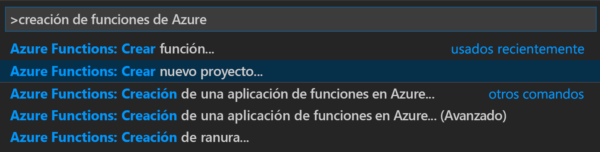
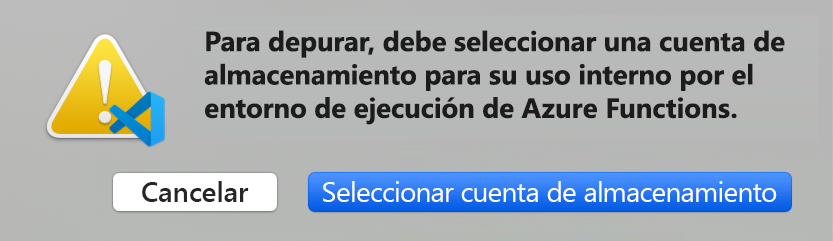
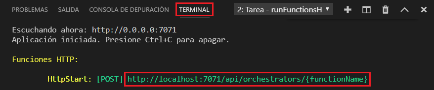

# <a name="create-your-first-durable-function-in-powershell"></a>Creación de la primera función durable en PowerShell

*Durable Functions* es una extensión de [Azure Functions](../functions-overview.md) que le permite escribir funciones con estado en un entorno sin servidor. La extensión administra el estado, establece puntos de control y reinicia en su nombre.

En este artículo, aprenderá a usar la extensión de Azure Functions para Visual Studio Code con el fin de crear y probar localmente una función durable "Hola mundo".  Esta función organizará y encadenará llamadas a otras funciones. Luego, publicará el código de función en Azure.


## <a name="prerequisites"></a>Requisitos previos

Para completar este tutorial:

* Instale [Visual Studio Code](https://code.visualstudio.com/download).

* Instale la extensión de VS Code [Azure Functions](https://marketplace.visualstudio.com/items?itemName=ms-azuretools.vscode-azurefunctions).

* Asegúrese de tener la versión más reciente de [Azure Functions Core Tools](../functions-run-local.md).

* Durable Functions requiere una cuenta de almacenamiento de Azure. Necesita una suscripción de Azure.

[!INCLUDE [quickstarts-free-trial-note](../../../includes/quickstarts-free-trial-note.md)]

## <a name="create-your-local-project"></a><a name="create-an-azure-functions-project"></a>Creación del proyecto local 

En esta sección se usa Visual Studio Code para crear un proyecto local en Azure Functions. 

1. En Visual Studio Code, presione F1 (o Ctrl/Cmd+Mayús+P) para abrir la paleta de comandos. En la paleta de comandos, busque y seleccione `Azure Functions: Create New Project...`.

    

1. Elija una ubicación de carpeta vacía para el proyecto y elija **Seleccionar**.

1. Siguiendo las indicaciones, proporcione la información siguiente:

    | Prompt | Value | Descripción |
    | ------ | ----- | ----------- |
    | Seleccionar el lenguaje para el proyecto de la aplicación de funciones | PowerShell | Cree un proyecto local de Functions en PowerShell. |
    | Selección de una versión | Azure Functions v3 | Esta opción solo se ve si las herramientas principales no estén instaladas. En este caso, las herramientas principales se instalan la primera vez que se ejecuta la aplicación. |
    | Seleccionar una plantilla para la primera función de su proyecto | Omitir por ahora | |
    | Seleccionar cómo desea que se abra el proyecto | Abrir en la ventana actual | Vuelve a abrir VS Code en la carpeta seleccionada. |

Visual Studio Code instala Azure Functions Core Tools, en caso de que sea necesario. También crea el proyecto de una aplicación de funciones en una carpeta. Este proyecto contiene los archivos de configuración [host.json](../functions-host-json.md) y [local.settings.json](../functions-run-local.md#local-settings-file).

También se crea un archivo package.json en la carpeta raíz.

### <a name="configure-function-app-to-use-powershell-7"></a>Configuración de una aplicación de funciones para que use PowerShell 7

Abra el archivo *local.settings.json* y confirme que un valor denominado `FUNCTIONS_WORKER_RUNTIME_VERSION` está establecido en `~7`. Si falta o está establecido en otro valor, actualice el contenido del archivo.

```json
{
  "IsEncrypted": false,
  "Values": {
    "AzureWebJobsStorage": "",
    "FUNCTIONS_WORKER_RUNTIME": "powershell",
    "FUNCTIONS_WORKER_RUNTIME_VERSION" : "~7"
  }
}
```

## <a name="create-your-functions"></a>Creación de las funciones

La aplicación de Durable Functions más básica contiene tres funciones:

* *Función de orquestador*: describe un flujo de trabajo que organiza otras funciones.
* *Función de actividad*: a la cual llama la función de orquestador, realiza el trabajo y, opcionalmente, devuelve un valor.
* *Función de cliente*: una función de Azure normal que inicia una función de orquestador. En este ejemplo se usa una función desencadenada por HTTP.

### <a name="orchestrator-function"></a>Función de orquestador

Se usa una plantilla para crear el código de la función de Durable Functions del proyecto.

1. En la paleta de comandos, busque y seleccione `Azure Functions: Create Function...`.

1. Siguiendo las indicaciones, proporcione la información siguiente:

    | Prompt | Value | Descripción |
    | ------ | ----- | ----------- |
    | Seleccionar una plantilla para la función | Orquestador de Durable Functions (versión preliminar) | Crear una orquestación de Durable Functions |
    | Proporcionar un nombre de función | HelloOrchestrator | Nombre de la función de Durable Functions |

Hemos agregado un orquestador para coordinar las funciones de actividad. Open *HelloOrchestrator/run.ps1* para ver la función del orquestador. Cada llamada al cmdlet `Invoke-ActivityFunction` invoca una función de actividad denominada `Hello`.

A continuación, agregará la función de actividad `Hello` a la que se hace referencia.

### <a name="activity-function"></a>Función de actividad

1. En la paleta de comandos, busque y seleccione `Azure Functions: Create Function...`.

1. Siguiendo las indicaciones, proporcione la información siguiente:

    | Prompt | Value | Descripción |
    | ------ | ----- | ----------- |
    | Seleccionar una plantilla para la función | Actividad de Durable Functions (versión preliminar) | Crear una función de actividad |
    | Proporcionar un nombre de función | Hola | Nombre de la función de actividad |

Ha agregado la función de actividad `Hello` que el orquestador invoca. Abra *Hello/run.ps1* para comprobar que toma un nombre como entrada y devuelve un saludo. Una función de actividad es donde realizará acciones como realizar una llamada a la base de datos o realizar un cálculo.

Por último, agregará una función desencadenada por HTTP que inicie la orquestación.

### <a name="client-function-http-starter"></a>Función de cliente (inicio de HTTP)

1. En la paleta de comandos, busque y seleccione `Azure Functions: Create Function...`.

1. Siguiendo las indicaciones, proporcione la información siguiente:

    | Prompt | Value | Descripción |
    | ------ | ----- | ----------- |
    | Seleccionar una plantilla para la función | Inicio de HTTP de Durable Functions (versión preliminar) | Crear una función de inicio de HTTP |
    | Proporcionar un nombre de función | HttpStart | Nombre de la función de actividad |
    | Nivel de autorización | Anónimas | Para la demostración, permita que se llame a la función sin autenticación. |

Ha agregado una función desencadenada por HTTP que inicia una orquestación. Abra *HttpStart/run.ps1* para ver que usa el cmdlet `Start-NewOrchestration` para iniciar una nueva orquestación. Luego, usa el cmdlet `New-OrchestrationCheckStatusResponse` para devolver una respuesta HTTP que contiene las direcciones URL que se pueden usar para supervisar y administrar la nueva orquestación.

Ahora tiene una aplicación de Durable Functions que se puede ejecutar localmente e implementar en Azure.

## <a name="test-the-function-locally"></a>Prueba local de la función

Azure Functions Core Tools le permite ejecutar un proyecto de Azure Functions en el equipo de desarrollo local. Se le solicita que instale estas herramientas la primera vez que inicie una aplicación de funciones desde Visual Studio Code.

1. Para probar la función, establezca un punto de interrupción en el código de la función de actividad de `Hello` (*Hello/run.ps1*). Presione F5 o seleccione `Debug: Start Debugging` en la paleta de comandos para iniciar el proyecto de aplicación de funciones. La salida de Core Tools aparece en el panel **Terminal**.

    > [!NOTE]
    > Consulte los [Diagnósticos de Durable Functions](durable-functions-diagnostics.md#debugging) para más información sobre la depuración.

1. Durable Functions requiere la ejecución de una cuenta de Azure Storage. Cuando VS Code le pida que seleccione una cuenta de almacenamiento, elija **Seleccionar cuenta de almacenamiento**.

    

1. Siga las indicaciones y proporcione la siguiente información para crear una nueva cuenta de almacenamiento en Azure.

    | Prompt | Value | Descripción |
    | ------ | ----- | ----------- |
    | Seleccionar suscripción | *nombre de la suscripción* | Selección de su suscripción a Azure |
    | Seleccione una cuenta de almacenamiento | Creación de una cuenta de almacenamiento nueva |  |
    | Escriba el nombre de la nueva cuenta de almacenamiento | *nombre único* | Nombre de la cuenta de almacenamiento que se creará |
    | Selección de un grupo de recursos | *nombre único* | Nombre del grupo de recursos que se creará |
    | Seleccionar una ubicación | *region* | Seleccione una región cercana |

1. En el panel **Terminal**, copie el punto de conexión de la dirección URL de la función desencadenada por HTTP.

    

1. Mediante el explorador web o una herramienta como [Postman](https://www.getpostman.com/) o [cURL](https://curl.haxx.se/), envíe una solicitud HTTP POST al punto de conexión de la dirección URL. Reemplace el último segmento por el nombre de la función de orquestador (`HelloOrchestrator`). La dirección URL debe ser similar a `http://localhost:7071/api/orchestrators/HelloOrchestrator`.

   La respuesta es el resultado inicial de la función HTTP que le informa de que la orquestación perdurable se ha iniciado correctamente. No es aún el resultado final de la orquestación. La respuesta incluye algunas direcciones URL útiles. De momento, vamos a consultar el estado de la orquestación.

1. Copie el valor de la URL para `statusQueryGetUri` y péguelo en la barra de direcciones del explorador y ejecute la solicitud. Como alternativa también puede usar Postman para emitir la solicitud GET.

   La solicitud consultará la instancia de orquestación sobre el estado. Debe obtener una respuesta eventual que muestre que la instancia se ha completado, e incluye las salidas o resultados de la función durable. Su aspecto es similar a: 

    ```json
    {
        "name": "HelloOrchestrator",
        "instanceId": "9a528a9e926f4b46b7d3deaa134b7e8a",
        "runtimeStatus": "Completed",
        "input": null,
        "customStatus": null,
        "output": [
            "Hello Tokyo!",
            "Hello Seattle!",
            "Hello London!"
        ],
        "createdTime": "2020-03-18T21:54:49Z",
        "lastUpdatedTime": "2020-03-18T21:54:54Z"
    }
    ```

1. Para detener la depuración, presione **Mayús + F5** en VS Code.

Después de comprobar que la función se ejecuta correctamente en el equipo local es el momento de publicar el proyecto en Azure.

[!INCLUDE [functions-create-function-app-vs-code](../../../includes/functions-sign-in-vs-code.md)]

## <a name="publish-the-project-to-azure"></a>Publicar el proyecto en Azure

En esta sección, va a crear una aplicación de funciones y los recursos relacionados en su suscripción de Azure y, después, va a implementar el código. 

> [!IMPORTANT]
> La publicación en una aplicación de función existente sobrescribe el contenido de esa aplicación en Azure. 


1. Seleccione el icono de Azure en la barra de actividades y después en el área **Azure: Functions**, seleccione el botón de **implementación en la aplicación de funciones**.

    

1. Escriba la siguiente información cuando se le indique:

    + **Seleccione la carpeta**: elija una carpeta en el área de trabajo o busque una que contenga la aplicación de funciones. No verá esta opción si ya tiene una aplicación de funciones válida abierta.

    + **Seleccione la suscripción**: elija la suscripción que desee usar. No se mostrará esta opción si solo tiene una suscripción.

    + **Seleccione la aplicación de funciones en Azure**: Elija `+ Create new Function App`. (No elija la opción `Advanced`, que no se trata en este artículo).
      
    + **Escriba un nombre único global para la aplicación de funciones**: Escriba un nombre que sea válido en una ruta de acceso de la dirección URL. El nombre que escriba se valida para asegurarse de que es único en Azure Functions. 

    + **Seleccione un entorno de ejecución**: Elija la versión de PowerShell que ha ejecutado localmente. Ejecute el comando `pwsh -version` para comprobar la versión.

        > [!NOTE]
        > Es posible que la extensión de VS Code de Azure Functions no admita todavía PowerShell 7. Si PowerShell 7 no está disponible como opción, seleccione PowerShell 6. x y [actualice la versión manualmente](#update-function-app-ps7) después de crear la aplicación de funciones.

    + **Seleccione una ubicación para los nuevos recursos**: Para mejorar el rendimiento, elija una [región](https://azure.microsoft.com/regions/) cerca de usted. 
    
1.  Cuando se complete, se crearán los siguientes recursos de Azure en la suscripción con nombres que se basan en el nombre de la aplicación de funciones:
    
    + Un grupo de recursos, que es un contenedor lógico de recursos relacionados.
    + Una cuenta de Azure Storage estándar, que mantiene el estado e información adicional sobre los proyectos.
    + Un plan de consumo, que define el host subyacente para su aplicación de funciones sin servidor. 
    + Una aplicación de funciones, que proporciona el entorno para ejecutar el código de función. Una aplicación de funciones permite agrupar funciones como una unidad lógica para facilitar la administración, la implementación y el uso compartido de recursos en el mismo plan de hospedaje.
    + Una instancia de Application Insights conectada a la aplicación de funciones, que realiza un seguimiento del uso de la función sin servidor.

    Una vez que se haya creado la aplicación de función se mostrará una notificación y se aplicará el paquete de implementación.

1. <a name="update-function-app-ps7"></a>Si no pudo seleccionar *PowerShell 7* cuando creó la aplicación de funciones, presione F1 (o Ctrl/Cmd+Mayús+P) para abrir la paleta de comandos. En la paleta de comandos, busque y seleccione `Azure Functions: Upload Local Settings...`. Siga las indicaciones para seleccionar la aplicación de funciones que creó. Si se le solicita que sobrescriba la configuración existente, seleccione *No a todo*.
    
1. Seleccione **View Output** (Ver salida) en esta notificación para ver la creación y los resultados de la implementación, incluidos los recursos de Azure que ha creado. Si se pierde la notificación, seleccione el icono de campana en la esquina inferior derecha para verlo de nuevo.

    


## <a name="test-your-function-in-azure"></a>Prueba de una función en Azure

1. Copie la dirección URL del desencadenador HTTP del panel **Salida**. La dirección URL que llama a la función desencadenada por HTTP debería tener el formato siguiente: `http://<functionappname>.azurewebsites.net/api/orchestrators/HelloOrchestrator`

2. Pegue la dirección URL de la solicitud HTTP en la barra de direcciones del explorador. Debe obtener la misma respuesta de estado que antes cuando se usó la aplicación publicada.

## <a name="next-steps"></a>Pasos siguientes

Ha usado Visual Studio Code para crear y publicar una aplicación de función perdurable con PowerShell.

> [!div class="nextstepaction"]
> [Más información sobre los patrones comunes de funciones durables](durable-functions-overview.md#application-patterns)
