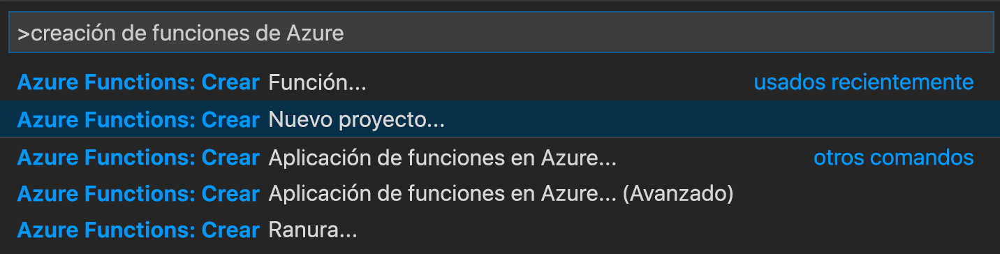
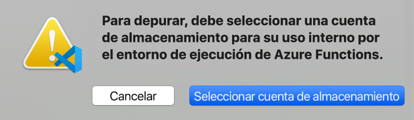

# <a name="create-your-first-durable-function-in-python"></a>Creación de la primera función durable en Python

*Durable Functions* es una extensión de [Azure Functions](../functions-overview.md) que le permite escribir funciones con estado en un entorno sin servidor. La extensión administra el estado, establece puntos de control y reinicia en su nombre.

En este artículo, aprenderá a usar la extensión de Azure Functions para Visual Studio Code con el fin de crear y probar localmente una función durable "Hola mundo".  Esta función organizará y encadenará llamadas a otras funciones. Luego, publicará el código de función en Azure.


## <a name="prerequisites"></a>Requisitos previos

Para completar este tutorial:

* Instale [Visual Studio Code](https://code.visualstudio.com/download).

* Instale la extensión de VS Code de [Azure Functions](https://marketplace.visualstudio.com/items?itemName=ms-azuretools.vscode-azurefunctions).

* Asegúrese de tener la versión más reciente de [Azure Functions Core Tools](../functions-run-local.md).

* Durable Functions requiere una cuenta de almacenamiento de Azure. Necesita una suscripción de Azure.

* Asegúrese de que tiene instalada la versión 3.6, 3.7 o 3.8 de [Python](https://www.python.org/).

[!INCLUDE [quickstarts-free-trial-note](../../../includes/quickstarts-free-trial-note.md)]

## <a name="create-your-local-project"></a><a name="create-an-azure-functions-project"></a>Creación del proyecto local 

En esta sección se usa Visual Studio Code para crear un proyecto local en Azure Functions. 

1. En Visual Studio Code, presione F1 (o Ctrl/Cmd+Mayús+P) para abrir la paleta de comandos. En la paleta de comandos, busque y seleccione `Azure Functions: Create New Project...`.

    

1. Elija una ubicación de carpeta vacía para el proyecto y elija **Seleccionar**.

1. Siguiendo las indicaciones, proporcione la información siguiente:

    | Prompt | Value | Descripción |
    | ------ | ----- | ----------- |
    | Seleccionar el lenguaje para el proyecto de la aplicación de funciones | Python | Cree un proyecto local de Functions en Python. |
    | Selección de una versión | Azure Functions v3 | Esta opción solo se ve si las herramientas principales no estén instaladas. En este caso, las herramientas principales se instalan la primera vez que se ejecuta la aplicación. |
    | Versión de Python | Python 3.6, 3.7 o 3.8 | VS Code creará un entorno virtual con la versión que seleccione. |
    | Seleccionar una plantilla para la primera función de su proyecto | Omitir por ahora | |
    | Seleccionar cómo desea que se abra el proyecto | Abrir en la ventana actual | Vuelve a abrir VS Code en la carpeta seleccionada. |

Visual Studio Code instala Azure Functions Core Tools, en caso de que sea necesario. También crea el proyecto de una aplicación de funciones en una carpeta. Este proyecto contiene los archivos de configuración [host.json](../functions-host-json.md) y [local.settings.json](../functions-run-local.md#local-settings-file).

También se crea un archivo requirements.txt en la carpeta raíz. Especifica los paquetes de Python necesarios para ejecutar la aplicación de funciones.

## <a name="install-azure-functions-durable-from-pypi"></a>Instalación de azure-functions-durable desde PyPI

Al crear el proyecto, la extensión de VS Code de Azure Functions ha creado automáticamente un entorno virtual con la versión de Python seleccionada. Activará este entorno virtual en un terminal e instalará algunas dependencias que necesitan Azure Functions y Durable Functions.

1. Abra `requirements.txt` en el editor y cambie su contenido por el siguiente:

    ```
    azure-functions
    azure-functions-durable>=1.0.0b6
    ```

1. Abra el terminal integrado del editor en la carpeta actual (`` Ctrl-Shift-` ``).

1. En el terminal integrado, active el entorno virtual en la carpeta actual:

    **Linux o macOS**

    ```bash
    source .venv/bin/activate
    ```

    **Windows**

    ```powershell
    .venv\scripts\activate
    ```

    

1. En el terminal integrado en el que está activado el entorno virtual, use PIP para instalar los paquetes que acaba de definir:

    ```bash
    python -m pip install -r requirements.txt
    ```

## <a name="create-your-functions"></a>Creación de las funciones

Una aplicación de Durable Functions básica contiene tres funciones:

* *Función de orquestador*: describe un flujo de trabajo que organiza otras funciones.
* *Función de actividad*: a la cual llama la función de orquestador, realiza el trabajo y, opcionalmente, devuelve un valor.
* *Función de cliente*: una función de Azure normal que inicia una función de orquestador. En este ejemplo se usa una función desencadenada por HTTP.

### <a name="orchestrator-function"></a>Función de orquestador

Se usa una plantilla para crear el código de la función de Durable Functions del proyecto.

1. En la paleta de comandos, busque y seleccione `Azure Functions: Create Function...`.

1. Siguiendo las indicaciones, proporcione la información siguiente:

    | Prompt | Value | Descripción |
    | ------ | ----- | ----------- |
    | Seleccionar una plantilla para la función | Orquestador de Durable Functions | Crear una orquestación de Durable Functions |
    | Proporcionar un nombre de función | HelloOrchestrator | Nombre de la función de Durable Functions |

Hemos agregado un orquestador para coordinar las funciones de actividad. Abra *HelloOrchestrator/\_\_init__.py* para ver la función de orquestador. Cada llamada a `context.call_activity` invoca una función de actividad denominada `Hello`.

A continuación, agregará la función de actividad `Hello` a la que se hace referencia.

### <a name="activity-function"></a>Función de actividad

1. En la paleta de comandos, busque y seleccione `Azure Functions: Create Function...`.

1. Siguiendo las indicaciones, proporcione la información siguiente:

    | Prompt | Value | Descripción |
    | ------ | ----- | ----------- |
    | Seleccionar una plantilla para la función | Actividad de Durable Functions | Crear una función de actividad |
    | Proporcionar un nombre de función | Hola | Nombre de la función de actividad |

Ha agregado la función de actividad `Hello` que el orquestador invoca. Abra *Hello/\_\_init__.py* para comprobar que toma un nombre como entrada y devuelve un saludo. Una función de actividad es donde realizará acciones como realizar una llamada a la base de datos o realizar un cálculo.

Por último, agregará una función desencadenada por HTTP que inicie la orquestación.

### <a name="client-function-http-starter"></a>Función de cliente (inicio de HTTP)

1. En la paleta de comandos, busque y seleccione `Azure Functions: Create Function...`.

1. Siguiendo las indicaciones, proporcione la información siguiente:

    | Prompt | Value | Descripción |
    | ------ | ----- | ----------- |
    | Seleccionar una plantilla para la función | Inicio de HTTP de Durable Functions | Crear una función de inicio de HTTP |
    | Proporcionar un nombre de función | DurableFunctionsHttpStart | Nombre de la función de actividad |
    | Nivel de autorización | Anónimas | Para la demostración, permita que se llame a la función sin autenticación. |

Ha agregado una función desencadenada por HTTP que inicia una orquestación. Open *DurableFunctionsHttpStart/\_\_init__.py* para ver que usa `client.start_new` para iniciar una nueva orquestación. A continuación, usa `client.create_check_status_response` para devolver una respuesta HTTP que contiene las direcciones URL que se pueden usar para supervisar y administrar la nueva orquestación.

Ahora tiene una aplicación de Durable Functions que se puede ejecutar localmente e implementar en Azure.

## <a name="test-the-function-locally"></a>Prueba local de la función

Azure Functions Core Tools le permite ejecutar un proyecto de Azure Functions en el equipo de desarrollo local. Si no las tiene instaladas, se le solicita que instale estas herramientas la primera vez que inicie una función de Visual Studio Code.

1. Para probar la función, establezca un punto de interrupción en el código de la función de actividad de `Hello` (*Hello/\_\_init__.py*). Presione F5 o seleccione `Debug: Start Debugging` en la paleta de comandos para iniciar el proyecto de aplicación de funciones. La salida de Core Tools aparece en el panel **Terminal**.

    > [!NOTE]
    > Consulte los [Diagnósticos de Durable Functions](durable-functions-diagnostics.md#debugging) para más información sobre la depuración.

1. Durable Functions requiere la ejecución de una cuenta de Azure Storage. Cuando VS Code le pida que seleccione una cuenta de almacenamiento, elija **Seleccionar cuenta de almacenamiento**.

    

1. Siga las indicaciones y proporcione la siguiente información para crear una nueva cuenta de almacenamiento en Azure.

    | Prompt | Value | Descripción |
    | ------ | ----- | ----------- |
    | Seleccionar suscripción | *nombre de la suscripción* | Selección de su suscripción a Azure |
    | Seleccione una cuenta de almacenamiento | Creación de una cuenta de almacenamiento nueva |  |
    | Escriba el nombre de la nueva cuenta de almacenamiento | *nombre único* | Nombre de la cuenta de almacenamiento que se creará |
    | Selección de un grupo de recursos | *nombre único* | Nombre del grupo de recursos que se creará |
    | Seleccionar una ubicación | *region* | Seleccione una región cercana |

1. En el panel **Terminal**, copie el punto de conexión de la dirección URL de la función desencadenada por HTTP.

    

1. Mediante el explorador web o una herramienta como [Postman](https://www.getpostman.com/) o [cURL](https://curl.haxx.se/), envíe una solicitud HTTP al punto de conexión de la dirección URL. Reemplace el último segmento por el nombre de la función de orquestador (`HelloOrchestrator`). La dirección URL debe ser similar a `http://localhost:7071/api/orchestrators/HelloOrchestrator`.

   La respuesta es el resultado inicial de la función HTTP que le informa de que la orquestación perdurable se ha iniciado correctamente. No es aún el resultado final de la orquestación. La respuesta incluye algunas direcciones URL útiles. De momento, vamos a consultar el estado de la orquestación.

1. Copie el valor de la URL para `statusQueryGetUri` y péguelo en la barra de direcciones del explorador y ejecute la solicitud. Como alternativa también puede usar Postman para emitir la solicitud GET.

   La solicitud consultará la instancia de orquestación sobre el estado. Debe obtener una respuesta eventual que muestre que la instancia se ha completado e incluya las salidas o los resultados de la función durable. Su aspecto es similar a: 

    ```json
    {
        "name": "HelloOrchestrator",
        "instanceId": "9a528a9e926f4b46b7d3deaa134b7e8a",
        "runtimeStatus": "Completed",
        "input": null,
        "customStatus": null,
        "output": [
            "Hello Tokyo!",
            "Hello Seattle!",
            "Hello London!"
        ],
        "createdTime": "2020-03-18T21:54:49Z",
        "lastUpdatedTime": "2020-03-18T21:54:54Z"
    }
    ```

1. Para detener la depuración, presione **Mayús + F5** en VS Code.

Después de comprobar que la función se ejecuta correctamente en el equipo local es el momento de publicar el proyecto en Azure.

[!INCLUDE [functions-create-function-app-vs-code](../../../includes/functions-sign-in-vs-code.md)]

[!INCLUDE [functions-publish-project-vscode](../../../includes/functions-publish-project-vscode.md)]

## <a name="test-your-function-in-azure"></a>Prueba de una función en Azure

1. Copie la dirección URL del desencadenador HTTP del panel **Salida**. La dirección URL que llama a la función desencadenada por HTTP debería tener el formato siguiente: `http://<functionappname>.azurewebsites.net/orchestrators/HelloOrchestrator`

2. Pegue la dirección URL de la solicitud HTTP en la barra de direcciones del explorador. Debe obtener la misma respuesta de estado que antes cuando se usó la aplicación publicada.

## <a name="next-steps"></a>Pasos siguientes

Ha usado Visual Studio Code para crear y publicar una aplicación de función perdurable con Python.

> [!div class="nextstepaction"]
> [Más información sobre los patrones comunes de funciones durables](durable-functions-overview.md#application-patterns)
