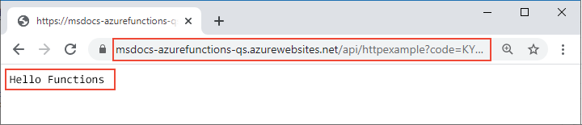

# <a name="connect-azure-functions-to-azure-storage-using-command-line-tools"></a>Conexión de Azure Functions a Azure Storage mediante herramientas de línea de comandos

En este artículo, integrará una cola de Azure Storage con la función y la cuenta de almacenamiento que creó en el artículo de inicio rápido anterior. Para lograr esta integración se usa un *enlace de salida* que escribe los datos de una solicitud HTTP en un mensaje de la cola. Completar este artículo no supone ningún costo adicional sobre el pequeño importe del inicio rápido anterior. Para más información acerca de los enlaces, consulte [Conceptos básicos sobre los enlaces y desencadenadores de Azure Functions](functions-triggers-bindings.md).

## <a name="configure-your-local-environment"></a>Configuración del entorno local

Antes de empezar, debe completar el artículo [Inicio rápido: Creación de un proyecto de Azure Functions desde la línea de comandos][previous-quickstart]. Si ya ha limpiado los recursos al final de ese artículo, vuelva a recorrer los pasos para crear de nuevo la aplicación de función y los recursos relacionados en Azure.

::: zone pivot="programming-language-csharp"  
Antes de empezar, debe completar el artículo [Inicio rápido: Creación de un proyecto de Azure Functions desde la línea de comandos](create-first-function-cli-csharp.md). Si ya ha limpiado los recursos al final de ese artículo, vuelva a recorrer los pasos para crear de nuevo la aplicación de función y los recursos relacionados en Azure.  
::: zone-end  
::: zone pivot="programming-language-javascript"  
Antes de empezar, debe completar el artículo [Inicio rápido: Creación de un proyecto de Azure Functions desde la línea de comandos](create-first-function-cli-node.md). Si ya ha limpiado los recursos al final de ese artículo, vuelva a recorrer los pasos para crear de nuevo la aplicación de función y los recursos relacionados en Azure.  
::: zone-end   
::: zone pivot="programming-language-java"  
Antes de empezar, debe completar el artículo [Inicio rápido: Creación de un proyecto de Azure Functions desde la línea de comandos](create-first-function-cli-java.md). Si ya ha limpiado los recursos al final de ese artículo, vuelva a recorrer los pasos para crear de nuevo la aplicación de función y los recursos relacionados en Azure.  
::: zone-end   
::: zone pivot="programming-language-typescript"  
Antes de empezar, debe completar el artículo [Inicio rápido: Creación de un proyecto de Azure Functions desde la línea de comandos](create-first-function-cli-typescript.md). Si ya ha limpiado los recursos al final de ese artículo, vuelva a recorrer los pasos para crear de nuevo la aplicación de función y los recursos relacionados en Azure.  
::: zone-end   
::: zone pivot="programming-language-python"  
Antes de empezar, debe completar el artículo [Inicio rápido: Creación de un proyecto de Azure Functions desde la línea de comandos](create-first-function-cli-python.md). Si ya ha limpiado los recursos al final de ese artículo, vuelva a recorrer los pasos para crear de nuevo la aplicación de función y los recursos relacionados en Azure.  
::: zone-end   
::: zone pivot="programming-language-powershell"  
Antes de empezar, debe completar el artículo [Inicio rápido: Creación de un proyecto de Azure Functions desde la línea de comandos](create-first-function-cli-powershell.md). Si ya ha limpiado los recursos al final de ese artículo, vuelva a recorrer los pasos para crear de nuevo la aplicación de función y los recursos relacionados en Azure.  
::: zone-end   

[!INCLUDE [functions-cli-get-storage-connection](../../includes/functions-cli-get-storage-connection.md)]

[!INCLUDE [functions-register-storage-binding-extension-csharp](../../includes/functions-register-storage-binding-extension-csharp.md)]

[!INCLUDE [functions-add-output-binding-cli](../../includes/functions-add-output-binding-cli.md)]

::: zone pivot="programming-language-csharp"  
[!INCLUDE [functions-add-storage-binding-csharp-library](../../includes/functions-add-storage-binding-csharp-library.md)]  
::: zone-end  
::: zone pivot="programming-language-java" 
[!INCLUDE [functions-add-output-binding-java-cli](../../includes/functions-add-output-binding-java-cli.md)]
::: zone-end   

Para más información sobre los enlaces, consulte [Conceptos básicos sobre los enlaces y desencadenadores de Azure Functions](functions-triggers-bindings.md) y [configuración de la cola de salida](functions-bindings-storage-queue-output.md#configuration).

## <a name="add-code-to-use-the-output-binding"></a>Adición de código para usar el enlace de salida

Con el enlace de cola definido, ahora puede actualizar la función para que reciba el parámetro de salida `msg` y escribir mensajes en la cola.

::: zone pivot="programming-language-python"     
[!INCLUDE [functions-add-output-binding-python](../../includes/functions-add-output-binding-python.md)]
::: zone-end  

::: zone pivot="programming-language-javascript"  
[!INCLUDE [functions-add-output-binding-js](../../includes/functions-add-output-binding-js.md)]
::: zone-end  

::: zone pivot="programming-language-typescript"  
[!INCLUDE [functions-add-output-binding-ts](../../includes/functions-add-output-binding-ts.md)]
::: zone-end  

::: zone pivot="programming-language-powershell"  
[!INCLUDE [functions-add-output-binding-powershell](../../includes/functions-add-output-binding-powershell.md)]  
::: zone-end

::: zone pivot="programming-language-csharp"  
[!INCLUDE [functions-add-storage-binding-csharp-library-code](../../includes/functions-add-storage-binding-csharp-library-code.md)]
::: zone-end 

::: zone pivot="programming-language-java"
[!INCLUDE [functions-add-output-binding-java-code](../../includes/functions-add-output-binding-java-code.md)]

[!INCLUDE [functions-add-output-binding-java-test-cli](../../includes/functions-add-output-binding-java-test-cli.md)]
::: zone-end

Observe que *no* necesita escribir código para la autenticación, para obtener una referencia de la cola ni para escribir datos. Todas estas tareas de integración se administran de manera adecuada en el entorno de ejecución de Azure Functions y en el enlace de salida de la cola.

[!INCLUDE [functions-run-function-test-local-cli](../../includes/functions-run-function-test-local-cli.md)]

[!INCLUDE [functions-extension-bundles-info](../../includes/functions-extension-bundles-info.md)]

## <a name="view-the-message-in-the-azure-storage-queue"></a>Visualización del mensaje en la cola de Azure Storage

[!INCLUDE [functions-add-output-binding-view-queue-cli](../../includes/functions-add-output-binding-view-queue-cli.md)]

## <a name="redeploy-the-project-to-azure"></a>Nueva implementación del proyecto en Azure

Ahora que ha comprobado localmente que la función escribió un mensaje en la cola de Azure Storage, puede volver a implementar el proyecto para actualizar el punto de conexión que se ejecuta en Azure.

::: zone pivot="programming-language-javascript,programming-language-typescript,programming-language-python,programming-language-powershell,programming-language-csharp" 
En la carpeta *LocalFunctionsProj*, use el comando [`func azure functionapp publish`](functions-run-local.md#project-file-deployment) para volver a implementar el proyecto y reemplace`<APP_NAME>` el nombre de la aplicación.

```
func azure functionapp publish <APP_NAME>
```
::: zone-end  

::: zone pivot="programming-language-java" 

En la carpeta de proyecto local, use el siguiente comando de Maven para volver a publicar el proyecto:
```
mvn azure-functions:deploy
```
::: zone-end

## <a name="verify-in-azure"></a>Comprobación en Azure

1. Como en el inicio rápido anterior, use un explorador o CURL para probar la función que ha vuelto a implementar.

    # <a name="browser"></a>[Browser](#tab/browser)
    
    Copie la **dirección URL de invocación** completa que se muestra en la salida del comando de publicación en una barra de direcciones del explorador, y anexe el parámetro de consulta `&name=Functions`. El explorador debe mostrar una salida similar a cuando ejecutó la función localmente.

    

    # <a name="curl"></a>[curl](#tab/curl)
    
    Ejecute [`curl`](https://curl.haxx.se/) con la **dirección URL de invocación**, y anexe el parámetro `&name=Functions`. La salida del comando será el texto "Hello Functions".
    
    

    --- 

1. Vuelva a examinar la cola de Storage, como se describe en la sección anterior, para comprobar que contiene el nuevo mensaje escrito en la cola.

## <a name="clean-up-resources"></a>Limpieza de recursos

Cuando haya terminado, use el siguiente comando para eliminar el grupo de recursos y todos los recursos que contiene para evitar incurrir en costos adicionales.

```azurecli
az group delete --name AzureFunctionsQuickstart-rg
```

## <a name="next-steps"></a>Pasos siguientes

Ha actualizado la función desencadenada por HTTP para escribir datos en una cola de almacenamiento. Ahora puede aprender más sobre el desarrollo de Functions desde la línea de comandos mediante Core Tools y la CLI de Azure:

+ [Uso de Azure Functions Core Tools](functions-run-local.md)  

+ [Enlaces y desencadenadores de Azure Functions](functions-triggers-bindings.md)

::: zone pivot="programming-language-csharp"  
+ [Ejemplos de proyectos de Function completos en C#](/samples/browse/?products=azure-functions&languages=csharp).

+ [Referencia para desarrolladores de C# de Azure Functions](functions-dotnet-class-library.md)  

[previous-quickstart]: create-first-function-cli-csharp.md

::: zone-end 
::: zone pivot="programming-language-javascript"  
+ [Ejemplos de proyectos de Function completos en JavaScript](/samples/browse/?products=azure-functions&languages=javascript).

+ [Guía para el desarrollador de JavaScript para Azure Functions](functions-reference-node.md)  

[previous-quickstart]: create-first-function-cli-javascript.md
::: zone-end  
::: zone pivot="programming-language-typescript"  
+ [Ejemplos de proyectos de Function completos en TypeScript](/samples/browse/?products=azure-functions&languages=typescript).

+ [Guía para desarrolladores de TypeScript para Azure Functions](functions-reference-node.md#typescript)  

[previous-quickstart]: create-first-function-cli-typescript.md
::: zone-end  
::: zone pivot="programming-language-python"  
+ [Ejemplos de proyectos de Function completos en Python](/samples/browse/?products=azure-functions&languages=python).

+ [Guía de Azure Functions para desarrolladores de Python](functions-reference-python.md)  

[previous-quickstart]: create-first-function-cli-python.md
::: zone-end  
::: zone pivot="programming-language-powershell"  
+ [Ejemplos de proyectos de Function completos en PowerShell](/samples/browse/?products=azure-functions&languages=azurepowershell).

+ [Guía para desarrolladores de PowerShell para Azure Functions](functions-reference-powershell.md) 

[previous-quickstart]: create-first-function-cli-powershell.md
::: zone-end
