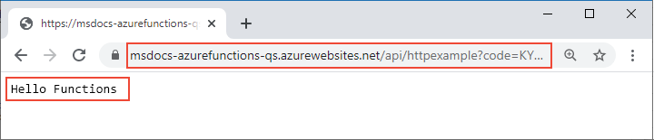

# <a name="quickstart-create-a-function-in-azure-that-responds-to-http-requests"></a>Inicio rápido: Creación de una función en Azure que responda a solicitudes HTTP

::: zone pivot="programming-language-csharp"  
En este artículo se usan herramientas de línea de comandos para crear una función basada en biblioteca de clases de C# que responda a solicitudes HTTP. Después de probar el código localmente, se implementa en el entorno sin servidor de Azure Functions. 
::: zone-end  
::: zone pivot="programming-language-javascript"
En este artículo se usan herramientas de línea de comandos para crear una función de JavaScript que responda a solicitudes HTTP. Después de probar el código localmente, se implementa en el entorno sin servidor de Azure Functions. 
::: zone-end
::: zone pivot="programming-language-typescript"
En este artículo se usan herramientas de línea de comandos para crear una función de TypeScript que responda a solicitudes HTTP. Después de probar el código localmente, se implementa en el entorno sin servidor de Azure Functions. 
::: zone-end   
::: zone pivot="programming-language-powershell"
En este artículo se usan herramientas de línea de comandos para crear una función de PowerShell que responda a solicitudes HTTP. Después de probar el código localmente, se implementa en el entorno sin servidor de Azure Functions. 
::: zone-end  
::: zone pivot="programming-language-python" 
En este artículo se usan herramientas de línea de comandos para crear una función de Python que responda a solicitudes HTTP. Después de probar el código localmente, se implementa en el entorno sin servidor de Azure Functions. 
::: zone-end  
::: zone pivot="programming-language-java" 
En este artículo se usan herramientas de línea de comandos para crear una función de Java que responda a solicitudes HTTP. Después de probar el código localmente, se implementa en el entorno sin servidor de Azure Functions. 
::: zone-end

Este inicio rápido supone un pequeño costo en su cuenta de Azure.

::: zone pivot="programming-language-csharp,programming-language-javascript,programming-language-typescript,programming-language-powershell,programming-language-python"  
También hay una [versión basada en Visual Studio Code](functions-create-first-function-vs-code.md) de este artículo.
::: zone-end  
::: zone pivot="programming-language-java"  
> [!NOTE]
> Si Maven no es la herramienta de desarrollo elegida, consulte nuestros tutoriales análogos para desarrolladores de Java con [Gradle](/azure/azure-functions/functions-create-first-java-gradle), [IntelliJ IDEA](/azure/developer/java/toolkit-for-intellij/quickstart-functions) y [Visual Studio Code](/azure/azure-functions/functions-create-first-function-vs-code?pivots=programming-language-java).
::: zone-end  

[!INCLUDE [functions-requirements-cli](../../includes/functions-requirements-cli.md)]

[!INCLUDE [functions-cli-verify-prereqs](../../includes/functions-cli-verify-prereqs.md)]

[!INCLUDE [functions-cli-create-venv](../../includes/functions-cli-create-venv.md)]

## <a name="create-a-local-function-project"></a>Creación de un proyecto de función local

En Azure Functions, un proyecto de función es un contenedor para una o varias funciones individuales que responden a un desencadenador específico. Todas las funciones de un proyecto comparten las mismas configuraciones locales y de hospedaje. En esta sección, se crea un proyecto de función que contiene una sola función.

::: zone pivot="programming-language-csharp,programming-language-javascript,programming-language-typescript,programming-language-powershell,programming-language-python"  
Ejecute el comando `func init`, de la manera siguiente, para crear un proyecto de funciones en una carpeta llamada *LocalFunctionProj* con el entorno de ejecución especificado:  
::: zone-end  
::: zone pivot="programming-language-python"  
```
func init LocalFunctionProj --python
```
::: zone-end  
::: zone pivot="programming-language-csharp"  
```
func init LocalFunctionProj --dotnet
```
::: zone-end  
::: zone pivot="programming-language-javascript"  
```
func init LocalFunctionProj --javascript
```
::: zone-end  
::: zone pivot="programming-language-typescript"  
```
func init LocalFunctionProj --typescript
```
::: zone-end  
::: zone pivot="programming-language-powershell"  
```
func init LocalFunctionProj --powershell
```
::: zone-end    
::: zone pivot="programming-language-java"  
En una carpeta vacía, ejecute el comando siguiente para generar el proyecto de Functions desde un [arquetipo Maven](https://maven.apache.org/guides/introduction/introduction-to-archetypes.html).

# <a name="bash"></a>[bash](#tab/bash)
```bash
mvn archetype:generate -DarchetypeGroupId=com.microsoft.azure -DarchetypeArtifactId=azure-functions-archetype 
```
# <a name="powershell"></a>[PowerShell](#tab/powershell)
```powershell
mvn archetype:generate "-DarchetypeGroupId=com.microsoft.azure" "-DarchetypeArtifactId=azure-functions-archetype" 
```
# <a name="cmd"></a>[Cmd](#tab/cmd)
```cmd
mvn archetype:generate "-DarchetypeGroupId=com.microsoft.azure" "-DarchetypeArtifactId=azure-functions-archetype" 
```
---

Maven le pide los valores necesarios para finalizar la generación del proyecto en la implementación.   
Indique los siguientes valores cuando se le solicite:

| Prompt | Value | Descripción |
| ------ | ----- | ----------- |
| **groupId** | `com.fabrikam` | Un valor que identifica de forma única su proyecto entre todos los demás y que sigue las [reglas de nomenclatura de paquetes](https://docs.oracle.com/javase/specs/jls/se6/html/packages.html#7.7) de Java. |
| **artifactId** | `fabrikam-functions` | Un valor que es el nombre del archivo jar, sin un número de versión. |
| **version** | `1.0-SNAPSHOT` | Elija el valor predeterminado. |
| **package** | `com.fabrikam.functions` | Un valor que es el paquete de Java para el código de función generado. Use el valor predeterminado. |

Escriba `Y` o presione Entrar para confirmar.

Maven crea los archivos del proyecto en una carpeta nueva llamada _artifactId_ que, en este ejemplo, es `fabrikam-functions`. 
::: zone-end  
Vaya a la carpeta del proyecto:

::: zone pivot="programming-language-csharp,programming-language-javascript,programming-language-typescript,programming-language-powershell,programming-language-python"  
```
cd LocalFunctionProj
```
::: zone-end  
::: zone pivot="programming-language-java"  
```
cd fabrikam-functions
```
::: zone-end  
Esta carpeta contiene varios archivos del proyecto, incluidos los archivos de configuración [local.settings.json](functions-run-local.md#local-settings-file) y [host.json](functions-host-json.md). Como *local.settings.json* puede contener secretos descargados de Azure, el archivo se excluye del control de código fuente de forma predeterminada en el archivo *.gitignore*.

[!INCLUDE [functions-cli-add-function](../../includes/functions-cli-add-function.md)]

### <a name="optional-examine-the-file-contents"></a>(Opcional) Examen del contenido del archivo

Si lo desea, puede ir a [Ejecución local de la función](#run-the-function-locally) y examine el contenido del archivo posteriormente.

::: zone pivot="programming-language-csharp"
#### <a name="httpexamplecs"></a>HttpExample.cs

*HttpExample.cs* contiene un método `Run` que recibe datos de solicitud en la variable `req` de tipo [HttpRequest](/dotnet/api/microsoft.aspnetcore.http.httprequest) que está decorado con **HttpTriggerAttribute**, que define el comportamiento del desencadenador. 

:::code language="csharp" source="~/functions-docs-csharp/http-trigger-template/HttpExample.cs":::

El objeto de devolución es un objeto [ActionResult](/dotnet/api/microsoft.aspnetcore.mvc.actionresult) que devuelve un mensaje de respuesta como [OkObjectResult](/dotnet/api/microsoft.aspnetcore.mvc.okobjectresult) (200) o [BadRequestObjectResult](/dotnet/api/microsoft.aspnetcore.mvc.badrequestobjectresult) (400). Para más información, vea [Enlaces y desencadenadores HTTP de Azure Functions](/azure/azure-functions/functions-bindings-http-webhook?tabs=csharp).
::: zone-end

::: zone pivot="programming-language-java"
#### <a name="functionjava"></a>Function.java
*Function.java* contiene un método `run` que recibe datos de solicitud en la variable `request` de tipo [HttpRequestMessage](/java/api/com.microsoft.azure.functions.httprequestmessage) que está decorada con la anotación [HttpTrigger](/java/api/com.microsoft.azure.functions.annotation.httptrigger), que define el comportamiento del desencadenador. 

:::code language="java" source="~/functions-quickstart-java/functions-add-output-binding-storage-queue/src/main/java/com/function/Function.java":::

El mensaje de respuesta lo genera la API [HttpResponseMessage.Builder](/java/api/com.microsoft.azure.functions.httpresponsemessage.builder).

#### <a name="pomxml"></a>pom.xml

La configuración de los recursos de Azure creados para hospedar la aplicación se define en el elemento **configuration** del complemento con un valor de **groupId** de `com.microsoft.azure` en el archivo pom.xml generado. Por ejemplo, el elemento de configuración siguiente indica a una implementación basada en Maven que cree una aplicación de función en el grupo de recursos `java-functions-group` de la región `westus`. La propia aplicación de función se ejecuta en Windows hospedada en el plan `java-functions-app-service-plan`, que, de forma predeterminada, es un plan de consumo sin servidor.    

:::code language="java" source="~/functions-quickstart-java/functions-add-output-binding-storage-queue/pom.xml" range="116-155":::

Puede cambiar esta configuración para controlar cómo se crean los recursos en Azure, por ejemplo, cambiando `runtime.os` de `windows` a `linux` antes de la implementación inicial. Para obtener una lista completa de los valores de configuración admitidos por el complemento Maven, consulte los [detalles de configuración](https://github.com/microsoft/azure-maven-plugins/wiki/Azure-Functions:-Configuration-Details).

#### <a name="functiontestjava"></a>FunctionTest.java

El arquetipo también genera una prueba unitaria para la función. Al cambiar la función para agregar enlaces o agregar nuevas funciones al proyecto, también deberá modificar las pruebas en el archivo *FunctionTest.java*.
::: zone-end  
::: zone pivot="programming-language-python"
#### <a name="__init__py"></a>\_\_init\_\_.py

*\_\_init\_\_.py* contiene una función `main()` de Python que se desencadena en función de la configuración de *function.json*.

:::code language="python" source="~/functions-quickstart-templates/Functions.Templates/Templates/HttpTrigger-Python/__init__.py":::

Con un desencadenador HTTP, la función recibe datos de solicitud en la variable `req`, como se define en *function.json*. `req` es una instancia de la [clase azure.functions.HttpRequest](/python/api/azure-functions/azure.functions.httprequest). El objeto devuelto, definido como `$return` en *function.json*, es una instancia de la [clase azure.functions.HttpResponse](/python/api/azure-functions/azure.functions.httpresponse). Para más información, vea [Enlaces y desencadenadores HTTP de Azure Functions](/azure/azure-functions/functions-bindings-http-webhook?tabs=python).
::: zone-end

::: zone pivot="programming-language-javascript"
#### <a name="indexjs"></a>index.js

*index.js* exporta una función que se desencadena según la configuración de *function.json*.

:::code language="javascript" source="~/functions-quickstart-templates/Functions.Templates/Templates/HttpTrigger-JavaScript/index.js":::

Con un desencadenador HTTP, la función recibe datos de solicitud en la variable `req`, como se define en *function.json*. El objeto devuelto, definido como `$return` en *function.json*, es la respuesta. Para más información, vea [Enlaces y desencadenadores HTTP de Azure Functions](/azure/azure-functions/functions-bindings-http-webhook?tabs=javascript).
::: zone-end

::: zone pivot="programming-language-typescript"
#### <a name="indexts"></a>index.ts

*index.ts* exporta una función que se desencadena de acuerdo con la configuración de *function.json*.

:::code language="typescript" source="~/functions-quickstart-templates/Functions.Templates/Templates/HttpTrigger-TypeScript/index.ts":::

Con un desencadenador HTTP, la función recibe datos de solicitud en la variable `req` de tipo **HttpRequest**, como se define en *function.json*. El objeto devuelto, definido como `$return` en *function.json*, es la respuesta. 
::: zone-end

::: zone pivot="programming-language-powershell"
#### <a name="runps1"></a>run.ps1

*run.ps1* define un script de función que se desencadena de acuerdo con la configuración de *function.json*.

:::code language="powershell" source="~/functions-quickstart-templates/Functions.Templates/Templates/HttpTrigger-PowerShell/run.ps1":::

Con un desencadenador HTTP, la función recibe los datos de solicitud pasados al parámetro `$Request` definido en *function.json*. El objeto devuelto, definido como `Response` en *function.json*, se pasa al cmdlet `Push-OutputBinding` como respuesta. 
::: zone-end

::: zone pivot="programming-language-javascript,programming-language-typescript,programming-language-python,programming-language-powershell"
#### <a name="functionjson"></a>function.json

*function.json* es un archivo de configuración que define la entrada y salida `bindings` de la función, lo que incluye el tipo de desencadenador. 
::: zone-end

::: zone pivot="programming-language-python"
Si lo desea, puede cambiar `scriptFile` para invocar otro un archivo de Python.

:::code language="json" source="~/functions-quickstart-templates/Functions.Templates/Templates/HttpTrigger-Python/function.json":::
::: zone-end

::: zone pivot="programming-language-javascript,programming-language-typescript"
:::code language="json" source="~/functions-quickstart-templates/Functions.Templates/Templates/HttpTrigger-JavaScript/function.json":::
::: zone-end

::: zone pivot="programming-language-powershell"
:::code language="json" source="~/functions-quickstart-templates/Functions.Templates/Templates/HttpTrigger-PowerShell/function.json":::
::: zone-end

::: zone pivot="programming-language-javascript,programming-language-typescript,programming-language-python,programming-language-powershell"  
Cada enlace requiere una dirección, un tipo y un nombre único. El desencadenador HTTP tiene un enlace de entrada de tipo [`httpTrigger`](functions-bindings-http-webhook-trigger.md) y un enlace de salida de tipo [`http`](functions-bindings-http-webhook-output.md).
::: zone-end  

[!INCLUDE [functions-run-function-test-local-cli](../../includes/functions-run-function-test-local-cli.md)]

::: zone pivot="programming-language-javascript,programming-language-typescript,programming-language-python,programming-language-powershell,programming-language-csharp"    
## <a name="create-supporting-azure-resources-for-your-function"></a>Creación de recursos auxiliares de Azure para la función

Antes de poder implementar el código de la función en Azure, debe crear tres recursos:

- Un grupo de recursos, que es un contenedor lógico de recursos relacionados.
- Una cuenta de almacenamiento, que mantiene el estado y otra información sobre los proyectos.
- Una aplicación de funciones, que proporciona el entorno para ejecutar el código de función. Una aplicación de funciones se asigna al proyecto de funciones y le permite agrupar funciones como una unidad lógica para facilitar la administración, la implementación y el uso compartido de recursos.

Use los siguientes comandos de la CLI de Azure para crear estos elementos. Cada comando proporciona una salida JSON al finalizar.

Si aún no lo ha hecho, inicie sesión en Azure con el comando [az login](/cli/azure/reference-index#az-login):

```azurecli
az login
```
    
Para crear un grupo de recursos, use el comando [az group create](/cli/azure/group#az-group-create). En el ejemplo siguiente se crea un grupo de recursos denominado `AzureFunctionsQuickstart-rg` en la región `westeurope`. (Por lo general, tanto los grupos de recursos como los recursos se crean en una región cercana y se utiliza alguna de las regiones disponibles del comando `az account list-locations`).

```azurecli
az group create --name AzureFunctionsQuickstart-rg --location westeurope
```

> [!NOTE]
> No se pueden hospedar aplicaciones de Windows y Linux en el mismo grupo de recursos. Si tiene un grupo de recursos existente llamado `AzureFunctionsQuickstart-rg` con una aplicación web o aplicación de función de Windows, debe usar un grupo de recursos diferente.
 
    
Cree una cuenta de almacenamiento de uso general en el grupo de recursos con el comando [az storage account create](/cli/azure/storage/account#az-storage-account-create). En el siguiente ejemplo, reemplace `<STORAGE_NAME>` por un nombre único global que sea adecuado. Los nombres deben contener entre 3 y 24 caracteres y solo letras minúsculas. `Standard_LRS` especifica una cuenta de uso general, que es [compatible con Functions](storage-considerations.md#storage-account-requirements).

```azurecli
az storage account create --name <STORAGE_NAME> --location westeurope --resource-group AzureFunctionsQuickstart-rg --sku Standard_LRS
```

Este inicio rápido solo le supondrá unos pequeños gastos a la cuenta de almacenamiento.
    
Cree la aplicación de funciones mediante el comando [az functionapp create](/cli/azure/functionapp#az-functionapp-create). En el ejemplo siguiente, reemplace `<STORAGE_NAME>` por el nombre de la cuenta que usó en el paso anterior y `<APP_NAME>` por un nombre único global que le resulte adecuado. `<APP_NAME>` también es el dominio DNS predeterminado de la aplicación de función. 
::: zone-end  

::: zone pivot="programming-language-python"  
Si usa Python 3.8, cambie `--runtime-version` a `3.8` y `--functions_version` a `3`.

Si usa Python 3.6, cambie `--runtime-version` a `3.6`.

```azurecli
az functionapp create --resource-group AzureFunctionsQuickstart-rg --os-type Linux --consumption-plan-location westeurope --runtime python --runtime-version 3.7 --functions-version 2 --name <APP_NAME> --storage-account <STORAGE_NAME>
```
::: zone-end  

::: zone pivot="programming-language-javascript,programming-language-typescript"  
Si usa Node.js 8, cambie también `--runtime-version` a `8`.


```azurecli
az functionapp create --resource-group AzureFunctionsQuickstart-rg --consumption-plan-location westeurope --runtime node --runtime-version 10 --functions-version 2 --name <APP_NAME> --storage-account <STORAGE_NAME>
```
::: zone-end  

::: zone pivot="programming-language-csharp"  
```azurecli
az functionapp create --resource-group AzureFunctionsQuickstart-rg --consumption-plan-location westeurope --runtime dotnet --functions-version 2 --name <APP_NAME> --storage-account <STORAGE_NAME>
```
::: zone-end  

::: zone pivot="programming-language-powershell"  
```azurecli
az functionapp create --resource-group AzureFunctionsQuickstart-rg --consumption-plan-location westeurope --runtime powershell --functions-version 2 --name <APP_NAME> --storage-account <STORAGE_NAME>
```
::: zone-end  

::: zone pivot="programming-language-javascript,programming-language-typescript,programming-language-python,programming-language-powershell,programming-language-csharp"  
Este comando crea una aplicación de funciones que se ejecuta en el entorno de ejecución del lenguaje especificado en el [plan de consumo de Azure Functions](functions-scale.md#consumption-plan), que es gratuito para la cantidad de uso que se realiza aquí. El comando también aprovisiona una instancia asociada de Azure Application Insights en el mismo grupo de recursos con la que puede supervisar la aplicación de funciones y ver registros. Para más información, consulte [Supervisión de Azure Functions](functions-monitoring.md). La instancia no incurrirá en ningún costo hasta que se active.
    
## <a name="deploy-the-function-project-to-azure"></a>Implementación del proyecto de función en Azure
::: zone-end  

::: zone pivot="programming-language-typescript"  
Antes de usar Core Tools para implementar el proyecto en Azure, creará una compilación lista para producción de archivos de JavaScript a partir de los archivos de origen de TypeScript.

El siguiente comando prepara el proyecto de TypeScript para la implementación:

```
npm run build:production 
```
::: zone-end  

::: zone pivot="programming-language-javascript,programming-language-typescript,programming-language-python,programming-language-powershell,programming-language-csharp"  
Con los recursos necesarios en vigor, ya está listo para implementar el proyecto de funciones local en la aplicación de funciones de Azure mediante el comando [func azure functionapp publish](functions-run-local.md#project-file-deployment). En el ejemplo siguiente, reemplace `<APP_NAME>` por el nombre de su aplicación.

```
func azure functionapp publish <APP_NAME>
```

Si aparece el error "Can't find app with name..." (No se encuentra la aplicación...), espere unos segundos e inténtelo de nuevo, ya que es posible que Azure no haya inicializado completamente la aplicación después del comando `az functionapp create` anterior.

El comando de publicación muestra un resultado similar a lo que se muestra a continuación (se ha truncado para que resulte más simple):

<pre>
...

Getting site publishing info...
Creating archive for current directory...
Performing remote build for functions project.

...

Deployment successful.
Remote build succeeded!
Syncing triggers...
Functions in msdocs-azurefunctions-qs:
    HttpExample - [httpTrigger]
        Invoke url: https://msdocs-azurefunctions-qs.azurewebsites.net/api/httpexample?code=KYHrydo4GFe9y0000000qRgRJ8NdLFKpkakGJQfC3izYVidzzDN4gQ==
</pre>

::: zone-end  
::: zone pivot="programming-language-java"  
## <a name="deploy-the-function-project-to-azure"></a>Implementación del proyecto de función en Azure

La primera vez que implementa un proyecto de funciones, se crea una aplicación de funciones y los recursos relacionados en Azure. La configuración de los recursos de Azure que se crean para hospedar la aplicación se define en el [archivo pom.xml](#pomxml). En este artículo, aceptará los valores predeterminados.

> [!TIP]
> Para crear una aplicación de función que se ejecute en Linux en lugar de Windows, cambie el elemento `runtime.os` del archivo pom.xml de `windows` a `linux`. La ejecución de Linux en un plan de consumo se admite en [estas regiones](https://github.com/Azure/azure-functions-host/wiki/Linux-Consumption-Regions). No puede tener aplicaciones que se ejecuten en Linux y aplicaciones que se ejecuten en Windows en el mismo grupo de recursos.

Antes de poder implementar, use el comando [az login](/cli/azure/authenticate-azure-cli) de la CLI de Azure para iniciar sesión en la suscripción de Azure. 

```azurecli
az login
```

Use el siguiente comando para implementar el proyecto en una nueva aplicación de funciones. 

```
mvn azure-functions:deploy
```

Esta operación crea los siguientes recursos en Azure:

+ Un grupo de recursos Se nombra como _java-functions-group_.
+ Una cuenta de almacenamiento Necesaria con Functions. El nombre se genera aleatoriamente según los requisitos de nombre de la cuenta de almacenamiento.
+ Plan de hospedaje. El hospedaje sin servidor de la aplicación de función en la región _westus_. El nombre es _java-functions-app-service-plan_.
+ Aplicación de funciones. Una aplicación de funciones es la unidad de implementación y ejecución de las funciones. El nombre se genera de forma aleatoria según el valor de _artifactId_, anexado con un número generado de forma aleatoria. 

La implementación empaqueta los archivos de proyecto y los implementa en la nueva aplicación de función mediante la [implementación de archivos ZIP](functions-deployment-technologies.md#zip-deploy). El código se ejecuta desde el paquete de implementación en Azure.
::: zone-end

## <a name="invoke-the-function-on-azure"></a>Invocación de la función en Azure

Como la función usa un desencadenador HTTP, para invocarla es preciso realizar una solicitud HTTP a su dirección URL en el explorador o con una herramienta como CURL. En ambas instancias, el parámetro de dirección URL `code` es la [clave de función](functions-bindings-http-webhook-trigger.md#authorization-keys) exclusiva que autoriza la invocación del punto de conexión de la función.

# <a name="browser"></a>[Browser](#tab/browser)

Copie la **dirección URL de invocación** completa que se muestra en la salida del comando de publicación en una barra de direcciones del explorador, y anexe el parámetro de consulta `&name=Functions`. El explorador debe mostrar una salida similar a cuando ejecutó la función localmente.




# <a name="curl"></a>[curl](#tab/curl)

Ejecute [`curl`](https://curl.haxx.se/) con la **dirección URL de invocación**, y anexe el parámetro `&name=Functions`. La salida del comando será el texto "Hello Functions".


---

> [!TIP]
> Para ver los registros casi en tiempo real de una aplicación de funciones publicada, use [Live Metrics Stream de Application Insights](functions-monitoring.md#streaming-logs).

## <a name="clean-up-resources"></a>Limpieza de recursos

Si continúa con el paso siguiente, [Adición de un enlace de salida de la cola de Azure Storage](functions-add-output-binding-storage-queue-cli.md), conserve todos los recursos intactos, ya que va a crear a partir de lo que ya ha hecho.

De lo contrario, use el siguiente comando para eliminar el grupo de recursos y todos los recursos que contiene para evitar incurrir en costos adicionales.

::: zone pivot="programming-language-javascript,programming-language-typescript,programming-language-python,programming-language-powershell,programming-language-csharp" 
```azurecli
az group delete --name AzureFunctionsQuickstart-rg
```
::: zone-end
::: zone pivot="programming-language-java"
```azurecli
az group delete --name java-functions-group
```
::: zone-end

## <a name="next-steps"></a>Pasos siguientes

> [!div class="nextstepaction"]
> [Conexión a una cola de Azure Storage](functions-add-output-binding-storage-queue-cli.md)
