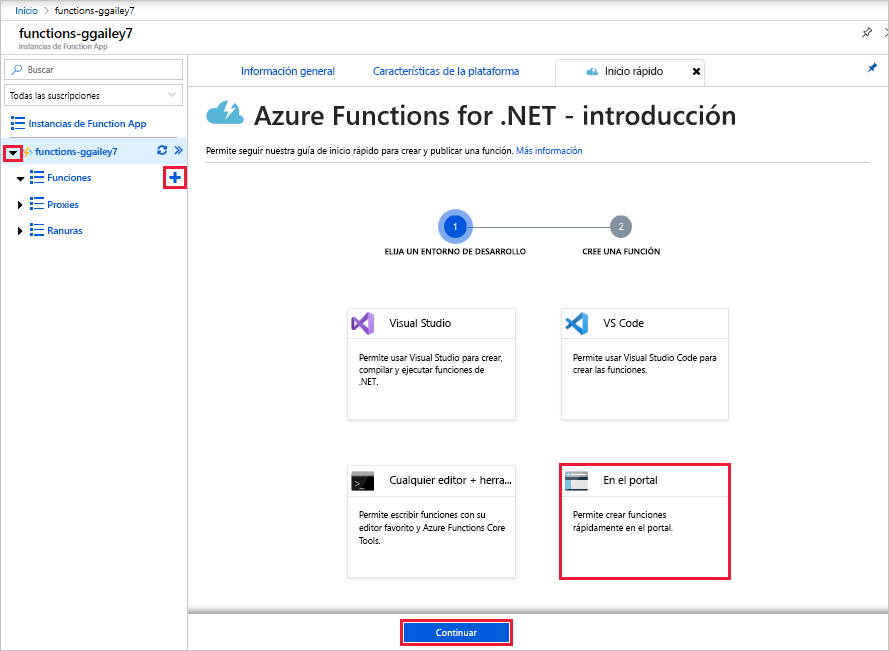
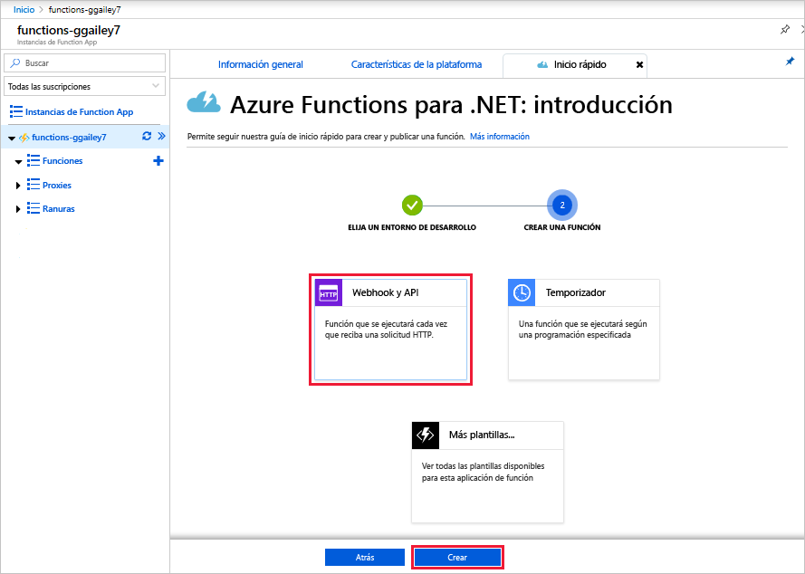

# Creación de su primera función en Azure Portal

Azure Functions permite ejecutar el código en un entorno sin servidor y sin necesidad de crear una máquina virtual (VM) ni publicar una aplicación web. En este artículo, aprenderá a usar Azure Functions para crear una función desencadenada por HTTP "Hola mundo" en Azure Portal.

[!INCLUDE [quickstarts-free-trial-note](../../includes/quickstarts-free-trial-note.md)]

Si es desarrollador de C#, debe considerar la [creación de la primera función en Visual Studio 2019](functions-create-your-first-function-visual-studio.md) en lugar de en el portal. 

## Inicio de sesión en Azure

Inicie sesión en [Azure Portal](https://portal.azure.com) con su cuenta de Azure.

## Creación de una aplicación de función

Debe tener una Function App para hospedar la ejecución de las funciones. Una aplicación de función permite agrupar funciones como una unidad lógica para facilitar la administración, la implementación, el escalado y el uso compartido de recursos.

[!INCLUDE [Create function app Azure portal](../../includes/functions-create-function-app-portal.md)]

Después, cree una función en la nueva aplicación de funciones.

## Crear una función desencadenada por HTTP

1. Expanda la nueva aplicación de funciones, seleccione el botón **+** situado junto a **Funciones**, elija **En el portal** y luego seleccione **Continuar**.

    

1. Elija **WebHook y API** y, a continuación, seleccione **Crear**.

    

   Se crea una función mediante una plantilla específica del idioma para una función desencadenada por HTTP.

Ahora, puede ejecutar la nueva función mediante el envío de una solicitud HTTP.

## Prueba de la función

1. En la nueva función, seleccione **</> Obtener la dirección URL de la función** en la parte superior. 

1. En el cuadro de diálogo **Obtener la dirección URL de la función**, seleccione **default (Function key)** [predeterminada (tecla de función)] en la lista desplegable y, a continuación, **Copiar**. 

    

1. Pegue la dirección URL de la función en la barra de direcciones de su explorador. Anexe el valor `&name=<your_name>` de la cadena de consulta al final de esta dirección URL y presione Entrar para ejecutar la solicitud. 

    El ejemplo siguiente muestra la respuesta en el explorador:

    

    La dirección URL de la solicitud incluye una clave que, de forma predeterminada, es necesaria para tener acceso a la función a través de HTTP.

1. Cuando se ejecuta la función, se escribe información de seguimiento en los registros. Para ver el resultado del seguimiento de la ejecución anterior, vuelva a la función en el portal y seleccione la flecha que encontrará en la parte inferior de la pantalla para expandir **Registros**.

   

## Limpieza de recursos

[!INCLUDE [Clean-up resources](../../includes/functions-quickstart-cleanup.md)]

## Pasos siguientes

[!INCLUDE [Next steps note](../../includes/functions-quickstart-next-steps.md)]

