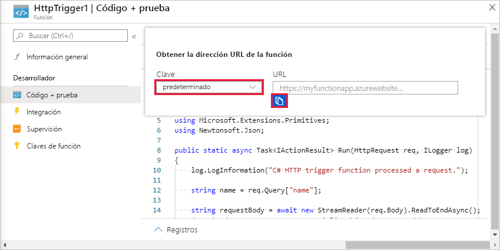
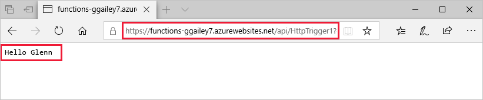

# Creación de su primera función en Azure Portal

Azure Functions permite ejecutar el código en un entorno sin servidor y sin necesidad de crear una máquina virtual (VM) ni publicar una aplicación web. En este artículo, aprenderá a usar Azure Functions para crear una función de desencadenador de HTTP "Hola mundo" en Azure Portal.

Es recomendable [desarrollar sus funciones localmente](functions-develop-local.md) y publicar en una aplicación de función en Azure.  
Use uno de los siguientes vínculos para empezar a trabajar con el entorno de desarrollo local y el idioma que elija:

| Visual Studio Code | Terminal y símbolo del sistema | Visual Studio |
| --- | --- | --- |
|  &bull;&nbsp;[Introducción a C#](./functions-create-first-function-vs-code.md?pivots=programming-language-csharp) &bull;&nbsp;[Introducción a Java](./functions-create-first-function-vs-code.md?pivots=programming-language-java) &bull;&nbsp;[Introducción a JavaScript](./functions-create-first-function-vs-code.md?pivots=programming-language-javascript) &bull;&nbsp;[Introducción a PowerShell](./functions-create-first-function-vs-code.md?pivots=programming-language-powershell) &bull;&nbsp;[Introducción a Python](./functions-create-first-function-vs-code.md?pivots=programming-language-python) |&bull;&nbsp;[Introducción a C#](./functions-create-first-azure-function-azure-cli.md?pivots=programming-language-csharp) &bull;&nbsp;[Introducción a Java](./functions-create-first-azure-function-azure-cli.md?pivots=programming-language-java) &bull;&nbsp;[Introducción a JavaScript](./functions-create-first-azure-function-azure-cli.md?pivots=programming-language-javascript) &bull;&nbsp;[Introducción a PowerShell](./functions-create-first-azure-function-azure-cli.md?pivots=programming-language-powershell) &bull;&nbsp;[Introducción a Python](./functions-create-first-azure-function-azure-cli.md?pivots=programming-language-python) | [Introducción a C#](functions-create-your-first-function-visual-studio.md) |

[!INCLUDE [quickstarts-free-trial-note](../../includes/quickstarts-free-trial-note.md)]

## Inicio de sesión en Azure

Inicie sesión en [Azure Portal](https://portal.azure.com) con su cuenta de Azure.

## Creación de una aplicación de función

Debe tener una Function App para hospedar la ejecución de las funciones. Una aplicación de función permite agrupar funciones como una unidad lógica para facilitar la administración, la implementación, el escalado y el uso compartido de recursos.

[!INCLUDE [Create function app Azure portal](../../includes/functions-create-function-app-portal.md)]

Después, cree una función en la nueva aplicación de funciones.

## Creación de una función de desencadenador de HTTP

1. En el menú de la izquierda de la ventana **Funciones**, seleccione **Funciones** y, a continuación, seleccione **Agregar** en el menú superior. 
 
1. En la ventana **Nueva función**, seleccione **Desencadenador de HTTP**.

    

1. En la ventana **Nueva función**, acepte el nombre predeterminado para la **nueva función** o escriba un nombre nuevo. 

1. En la lista desplegable **Nivel de autorización**, elija **Anónimo** y, a continuación, seleccione **Crear función**.

    Azure crea la función de desencadenador de HTTP. Ahora, puede ejecutar la nueva función mediante el envío de una solicitud HTTP.

## Prueba de la función

1. En la nueva función de desencadenador de HTTP, seleccione **Código y prueba** en el menú de la izquierda y, a continuación, seleccione **Obtener la dirección URL de la función** en el menú superior.

    

1. En el cuadro de diálogo **Obtener la dirección URL de la función**, seleccione **valor predeterminado** en la lista desplegable y, a continuación, seleccione el icono **Copiar al Portapapeles**. 

    

1. Pegue la dirección URL de la función en la barra de direcciones de su explorador. Anexe el valor `?name=<your_name>` de la cadena de consulta al final de esta dirección URL y presione Entrar para ejecutar la solicitud. 

    El ejemplo siguiente muestra la respuesta en el explorador:

    

    La dirección URL de la solicitud incluye una clave que, de forma predeterminada, es necesaria para tener acceso a la función a través de HTTP.

1. Cuando se ejecuta la función, se escribe información de seguimiento en los registros. Para ver los resultados del seguimiento, vuelva a la página **Código y prueba** en el portal y expanda la flecha **Registros** en la parte inferior de la página.

   

## Limpieza de recursos

[!INCLUDE [Clean-up resources](../../includes/functions-quickstart-cleanup.md)]

## Pasos siguientes

[!INCLUDE [Next steps note](../../includes/functions-quickstart-next-steps.md)]

