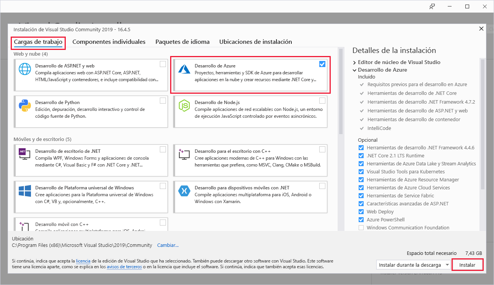

# Inicio rápido: Creación de la primera función de Azure mediante Visual Studio

Azure Functions permite ejecutar el código en un entorno sin servidor y sin necesidad de crear una máquina virtual ni publicar una aplicación web.

En este inicio rápido aprenderá a usar Visual Studio 2019 para crear y probar localmente una aplicación de funciones en C# desencadenada por HTTP "Hola mundo", que después publicará en Azure. 

Este inicio rápido está diseñado para Visual Studio 2019. 

## Prerrequisitos

Para completar este tutorial, instale antes [Visual Studio 2019](https://azure.microsoft.com/downloads/). Asegúrese de seleccionar la carga de trabajo de **desarrollo de Azure** durante la instalación. Si desea crear un proyecto de Azure Functions con Visual Studio 2017, debe instalar antes las [herramientas de Azure Functions más recientes](functions-develop-vs.md#check-your-tools-version).

[!INCLUDE [quickstarts-free-trial-note](../../includes/quickstarts-free-trial-note.md)]

## Creación de un proyecto de aplicación de función

[!INCLUDE [Create a project using the Azure Functions template](../../includes/functions-vstools-create.md)]

Visual Studio crea un proyecto y una clase que contiene código reutilizable para el tipo de función de desencadenador HTTP. El atributo de método `FunctionName` establece el nombre de la función que, de forma predeterminada, es `Function1`. El atributo `HttpTrigger` especifica que la función es desencadenada por una solicitud HTTP. El código reutilizable envía una respuesta HTTP que incluye un valor del cuerpo de la solicitud o de la cadena de consulta.

Amplíe las funcionalidades de la función con enlaces de entrada y salida, mediante la aplicación de los atributos adecuados al método. Para más información, consulte la sección [Desencadenadores y enlaces](functions-dotnet-class-library.md#triggers-and-bindings) de la [Referencia para desarrolladores de C# de Azure Functions](functions-dotnet-class-library.md).

Ahora que ha creado un proyecto de función y una función desencadenada por HTTP, puede probarla en el equipo local.

## Ejecución local de la función

Visual Studio se integra con Azure Functions Core Tools; de este modo puede probar las funciones localmente mediante el sistema en tiempo de ejecución completo de Azure Functions.  

[!INCLUDE [functions-run-function-test-local-vs](../../includes/functions-run-function-test-local-vs.md)]

Después de comprobar que la función se ejecuta correctamente en el equipo local es el momento de publicar el proyecto en Azure.

## Publicar el proyecto en Azure

Para poder publicar el proyecto, debe tener una aplicación de funciones en la suscripción de Azure. La publicación de Visual Studio crea una aplicación de funciones la primera vez que se publica el proyecto.

[!INCLUDE [Publish the project to Azure](../../includes/functions-vstools-publish.md)]

## Prueba de una función en Azure

1. Copie la URL base de la aplicación de funciones de la página de perfil **Publicar**. Reemplace la parte `localhost:port` de la dirección URL que usó al probar la función localmente por la nueva URL base. Agregue la cadena de consulta `?name=<YOUR_NAME>` a esta dirección URL y ejecute la solicitud.

    La dirección URL que llama a la función desencadenada por HTTP tiene el formato siguiente:

    `http://<APP_NAME>.azurewebsites.net/api/<FUNCTION_NAME>?name=<YOUR_NAME>`

2. Pegue la dirección URL de la solicitud HTTP en la barra de direcciones del explorador. La imagen siguiente muestra la respuesta en el explorador para la solicitud GET remota devuelta por la función:

    

## Limpieza de recursos

[!INCLUDE [Clean-up resources](../../includes/functions-quickstart-cleanup.md)]

## Pasos siguientes

En este inicio rápido, ha usado Visual Studio para crear y publicar una aplicación de funciones en C# en Azure con una función simple desencadenada por HTTP. 

Prosiga en el siguiente artículo para aprender a agregar un enlace de cola de Azure Storage a la función:
> [!div class="nextstepaction"]
> [Adición de un enlace de cola de Azure Storage a una función](functions-add-output-binding-storage-queue-vs.md)

