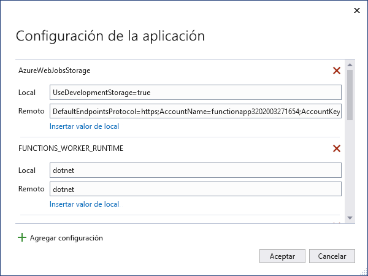

# <a name="develop-azure-functions-using-visual-studio"></a>Desarrollo de Azure Functions con Visual Studio  

Visual Studio le permite desarrollar, probar e implementar funciones de la biblioteca de clases C# en Azure. Si esta es la primera experiencia con Azure Functions, vea [Introducción a Azure Functions](functions-overview.md).

Visual Studio proporciona las ventajas siguientes al desarrollar funciones: 

* Editar, compilar y ejecutar funciones en el equipo de desarrollo local. 
* Publique su proyecto de Azure Functions directamente en Azure y cree recursos de Azure según sea necesario. 
* Use atributos de C# para declarar enlaces de función directamente en el código de C#.
* Desarrollar e implementar funciones de C# compiladas previamente. Las funciones compiladas previamente proporcionan un mejor rendimiento de arranque en frío que las funciones basadas en scripts de C#. 
* Programar las funciones en C# a la vez que se tienen todos los beneficios del desarrollo de Visual Studio. 

En este artículo se dan detalles sobre cómo usar Visual Studio para desarrollar funciones de biblioteca de clases C# y publicarlas en Azure. Antes de leer este artículo, le recomendamos que complete la [guía de inicio rápido de Functions para Visual Studio](functions-create-your-first-function-visual-studio.md). 

A menos que se indique lo contrario, los procedimientos y los ejemplos que se muestran son para Visual Studio 2019. 

## <a name="prerequisites"></a>Requisitos previos

- Herramientas de Azure Functions. Para agregar las herramientas de Azure Functions, asegúrese de incluir la carga de trabajo **Desarrollo de Azure** en la instalación de Visual Studio. Las herramientas de Azure Functions están disponibles en la carga de trabajo de desarrollo de Azure a partir de Visual Studio 2017.

- Los demás recursos que necesita, como una cuenta de Azure Storage, se crean en la suscripción durante el proceso de publicación.

- [!INCLUDE [quickstarts-free-trial-note](../../includes/quickstarts-free-trial-note.md)]

> [!NOTE]
> En Visual Studio 2017, la carga de trabajo de desarrollo de Azure instala las herramientas de Azure Functions como una extensión independiente. Al actualizar la instalación de Visual Studio 2017, también debe asegurarse de que usa la [versión más reciente](#check-your-tools-version) de las herramientas de Azure Functions. En las secciones siguientes se muestra cómo comprobar y, si es necesario, actualizar la extensión de herramientas de Azure Functions en Visual Studio 2017. 
>
> Omita estas secciones si usa Visual Studio 2019.

### <a name="check-your-tools-version-in-visual-studio-2017"></a><a name="check-your-tools-version"></a>Comprobar la versión de las herramientas en Visual Studio 2017

1. En el menú **Herramientas**, seleccione **Extensiones y actualizaciones**. Expanda **Herramientas** > **instaladas** y, después, elija **Azure Functions and Web Jobs Tools**.

    

1. Observe la **Versión** instalada y compárela con la versión más reciente que aparece en las [notas de la versión](https://github.com/Azure/Azure-Functions/blob/master/VS-AzureTools-ReleaseNotes.md). 

1. Si su versión es anterior, actualice las herramientas en Visual Studio como se muestra en la siguiente sección.

### <a name="update-your-tools-in-visual-studio-2017"></a>Actualización de las herramientas en Visual Studio 2017

1. En el cuadro de diálogo **Extensiones y actualizaciones**, expanda **Actualizaciones** > **Visual Studio Marketplace**, elija **Azure Functions and Web Jobs Tools** y seleccione **Actualizar**.

       

1. Después de descargar la actualización de las herramientas, seleccione **Cerrar** y cierre Visual Studio para desencadenar la actualización de las herramientas con el instalador VSIX.

1. En el instalador VSIX, elija **Modificar** para actualizar las herramientas. 

1. Una vez que se haya completado la actualización, elija **Cerrar** y reinicie Visual Studio.

> [!NOTE]  
> En Visual Studio 2019 y versiones posteriores, la extensión de herramientas de Azure Functions se actualiza como parte de Visual Studio.  

## <a name="create-an-azure-functions-project"></a>Creación de un proyecto de Azure Functions

[!INCLUDE [Create a project using the Azure Functions](../../includes/functions-vstools-create.md)]

Después de crear un proyecto de Azure Functions, la plantilla de proyecto crea un proyecto de C#, instala el paquete NuGet `Microsoft.NET.Sdk.Functions` y establece la plataforma de destino. El proyecto nuevo contiene los archivos siguientes:

* **host.json**: permite configurar el host de Functions. Esta configuración se aplica tanto cuando se ejecuta localmente como en Azure. Para más información, consulte la [referencia sobre host.json](functions-host-json.md).

* **local.settings.json**: mantiene la configuración que se usa cuando se ejecutan localmente las funciones. Esta configuración no se usa cuando se ejecuta en Azure. Para más información, consulte [Archivo de configuración local](#local-settings-file).

    >[!IMPORTANT]
    >Como el archivo local.settings.json puede contener secretos, debe excluirlo del control de código fuente del proyecto. Asegúrese de que la opción **Copiar en el directorio de salida** para este archivo esté establecida en **Copiar si es posterior**. 

Para más información, consulte [Proyecto de biblioteca de clases de Functions](functions-dotnet-class-library.md#functions-class-library-project).

[!INCLUDE [functions-local-settings-file](../../includes/functions-local-settings-file.md)]

Visual Studio no carga de forma automática la configuración de local.settings.json al publicar el proyecto. Para asegurarse de que esta configuración también existe en la aplicación de funciones de Azure, debe cargarla después de publicar el proyecto. Para obtener más información, vea [Configuración de aplicación de funciones](#function-app-settings). Los valores de una colección `ConnectionStrings` nunca se publican.

El código también puede leer los valores de configuración de la aplicación de funciones como variables de entorno. Para más información, consulte [Variables de entorno](functions-dotnet-class-library.md#environment-variables).

## <a name="configure-the-project-for-local-development"></a>Configuración del proyecto para el desarrollo local

El entorno de tiempo de ejecución de Functions usa internamente una cuenta de Azure Storage. Para todos los tipos de desencadenadores distintos de HTTP y webhooks, establezca la clave `Values.AzureWebJobsStorage` en una cadena de conexión de cuenta de Azure Storage válida. La aplicación de funciones también puede usar el [Emulador de Azure Storage](../storage/common/storage-use-emulator.md) para la configuración de conexión `AzureWebJobsStorage` que el proyecto necesita. Para usar el emulador, establezca el valor de `AzureWebJobsStorage` en `UseDevelopmentStorage=true`. Cambie esta configuración a una cadena de conexión de la cuenta de almacenamiento real antes de la implementación.

Para establecer la cadena de conexión de cuenta de almacenamiento:

1. En Visual Studio, seleccione **Ver** > **Cloud Explorer**.

2. En **Cloud Explorer**, expanda **Cuentas de almacenamiento** y, después, seleccione la cuenta de almacenamiento. En la pestaña **Propiedades**, copie el valor **Cadena de conexión principal**.

2. En el proyecto, abra el archivo local.settings.json y establezca el valor de la clave `AzureWebJobsStorage` en la cadena de conexión que ha copiado.

3. Repita el paso anterior para agregar claves únicas a la matriz `Values` de cualquier otra conexión necesaria para las funciones. 

## <a name="add-a-function-to-your-project"></a>Incorporación de una función al proyecto

En las funciones de biblioteca de clases C#, los enlaces que la función usa se definen mediante la aplicación de atributos en el código. Al crear los desencadenadores de funciones a partir de las plantillas proporcionadas, los atributos del desencadenador se aplican automáticamente. 

1. En el **Explorador de soluciones**, haga clic con el botón derecho en el nodo del proyecto y seleccione **Agregar** > **Nuevo elemento**. 

2. Seleccione **Función de Azure**, escriba un **nombre** para la clase y, luego, seleccione **Agregar**.

3. Elija el desencadenador, establezca las propiedades de enlace y seleccione **Crear**. En el ejemplo siguiente se muestra los valores para crear una función de desencadenador de Queue Storage. 

    

    En este ejemplo de desencadenador se usa una cadena de conexión con una clave denominada `QueueStorage`. Defina la configuración de esta cadena de conexión en el [archivo local.settings.json](functions-run-local.md#local-settings-file).

4. Examine la clase recién agregada. Verá un método `Run()` con el atributo `FunctionName`. Este atributo indica que el método es el punto de entrada de la función.

    Por ejemplo, la clase de C# siguiente representa una función de desencadenador de Queue Storage básica:

    ```csharp
    using System;
    using Microsoft.Azure.WebJobs;
    using Microsoft.Azure.WebJobs.Host;
    using Microsoft.Extensions.Logging;

    namespace FunctionApp1
    {
        public static class Function1
        {
            [FunctionName("QueueTriggerCSharp")]
            public static void Run([QueueTrigger("myqueue-items", 
                Connection = "QueueStorage")]string myQueueItem, ILogger log)
            {
                log.LogInformation($"C# Queue trigger function processed: {myQueueItem}");
            }
        }
    }
    ```

Se aplica un atributo específico de enlace a cada parámetro de enlace que se suministra al método de punto de entrada. El atributo toma la información de enlace como parámetros. En el ejemplo anterior, el primer parámetro tiene aplicado un atributo `QueueTrigger`, que indica una función de desencadenador de Queue Storage. El nombre de la cola y el valor de la cadena de conexión se pasan como parámetros en el atributo `QueueTrigger`. Para más información, consulte [Enlaces de Azure Queue Storage para Azure Functions](functions-bindings-storage-queue-trigger.md).

Use el procedimiento anterior para agregar más funciones al proyecto de aplicación de funciones. Cada función del proyecto puede tener un desencadenador diferente, pero una función no puede tener más de un desencadenador. Para más información, consulte [Conceptos básicos sobre los enlaces y desencadenadores de Azure Functions](functions-triggers-bindings.md).

## <a name="add-bindings"></a>Adición de enlaces

Al igual que sucede con los desencadenadores, los enlaces de entrada y salida se agregan a la función como atributos de enlace. Agregue los enlaces a una función como se indica a continuación:

1. Asegúrese de que ha [configurado el proyecto para desarrollo local](#configure-the-project-for-local-development).

2. Agregue el paquete de extensión de NuGet adecuado para el enlace concreto. 

   Para obtener más información, vea [Biblioteca de clases de C# con Visual Studio](./functions-bindings-register.md#local-csharp). Busque los requisitos del paquete NuGet específico del enlace en el artículo de referencia del enlace. Por ejemplo, buscar los requisitos del paquete para el desencadenador de Event Hubs en el [artículo de referencia Enlaces de Azure Event Hubs](functions-bindings-event-hubs.md).

3. Si hay valores de la aplicación que el enlace necesita, agréguelos a la colección `Values` del [archivo de configuración local](functions-run-local.md#local-settings-file). 

   La función usa estos valores cuando se ejecuta localmente. Cuando la función se ejecuta en la aplicación de funciones en Azure, usa los [valores de la aplicación de funciones](#function-app-settings).

4. Agregue el atributo de enlace apropiado para la firma del método. En el ejemplo siguiente, un mensaje de la cola desencadena la función y el enlace de salida, se crea un nuevo mensaje de la cola con el mismo texto en otra cola.

    ```csharp
    public static class SimpleExampleWithOutput
    {
        [FunctionName("CopyQueueMessage")]
        public static void Run(
            [QueueTrigger("myqueue-items-source", Connection = "AzureWebJobsStorage")] string myQueueItem, 
            [Queue("myqueue-items-destination", Connection = "AzureWebJobsStorage")] out string myQueueItemCopy,
            ILogger log)
        {
            log.LogInformation($"CopyQueueMessage function processed: {myQueueItem}");
            myQueueItemCopy = myQueueItem;
        }
    }
    ```
   La conexión con el almacenamiento en la cola se obtiene del valor `AzureWebJobsStorage`. Para más información, consulte el artículo de referencia del enlace concreto. 

[!INCLUDE [Supported triggers and bindings](../../includes/functions-bindings.md)]

## <a name="testing-functions"></a>Funciones de prueba

Azure Functions Core Tools le permite ejecutar un proyecto de Azure Functions en el equipo de desarrollo local. Para obtener más información, vea [Uso de Azure Functions Core Tools](functions-run-local.md). La primera vez que inicie una función desde Visual Studio Code se le solicitará que instale estas herramientas. 

Para probar la función en Visual Studio:

1. Presione F5. Si se le solicita, acepte la solicitud de Visual Studio para descargar e instalar las herramientas de Azure Functions Core (CLI). También es preciso que habilite una excepción de firewall para que las herramientas para controlen las solicitudes de HTTP.

2. Con el proyecto en ejecución, pruebe el código como probaría una función implementada. 

   Para más información, consulte [Estrategias para probar el código en Azure Functions](functions-test-a-function.md). Cuando Visual Studio se ejecuta en modo de depuración, los puntos de interrupción se alcanzan de la forma esperada.

<!---
For an example of how to test a queue triggered function, see the [queue triggered function quickstart tutorial](functions-create-storage-queue-triggered-function.md#test-the-function).  
-->


## <a name="publish-to-azure"></a>Publicación en Azure

Al publicar desde Visual Studio, se usa uno de dos métodos de implementación:

* [Web Deploy](functions-deployment-technologies.md#web-deploy-msdeploy): empaqueta e implementa aplicaciones Windows en cualquier servidor IIS.
* [Implementación ZIP con el paquete de ejecución habilitado](functions-deployment-technologies.md#zip-deploy): recomendada para implementaciones de Azure Functions.

Siga estos pasos para publicar el proyecto en una aplicación de funciones de Azure.

[!INCLUDE [Publish the project to Azure](../../includes/functions-vstools-publish.md)]

## <a name="function-app-settings"></a>Configuración de Function App

Como Visual Studio no carga esta configuración de forma automática al publicar el proyecto, cualquier configuración que agregue en el archivo local.settings.json también se debe agregar a la aplicación de funciones en Azure.

La manera más sencilla de cargar la configuración requerida en la aplicación de funciones en Azure consiste en seleccionar el vínculo **Administrar la configuración de Azure App Service** que aparece una vez que publica correctamente el proyecto.

:::image type="content" source="./media/functions-develop-vs/functions-vstools-app-settings.png" alt-text="Configuración en la ventana Publicar":::

Al seleccionar este vínculo se muestra el cuadro de diálogo **Configuración de la aplicación** para la aplicación de funciones, donde puede agregar una configuración de la aplicación nueva o modificar las existentes.



**Local** muestra un valor de configuración en el archivo local.settings.json y **Remoto** un valor actual de la aplicación de funciones de Azure. Elija **Agregar configuración** para crear una nueva configuración de aplicación. Use el vínculo **Insertar un valor desde Local** para copiar un valor de configuración para el campo **Remoto**. Los cambios pendientes se escriben en el archivo de configuración local y la aplicación de función cuando se selecciona **Aceptar**.

> [!NOTE]
> De forma predeterminada, el archivo local.settings.json no se ha insertado en el control de código fuente. Esto significa que si clona un proyecto de Functions local desde el control de código fuente, el proyecto no tiene el archivo local.settings.json. En este caso, debe crear manualmente el archivo local.settings.json en la raíz del proyecto para que el cuadro de diálogo **Configuración de la aplicación** funcione según lo previsto. 

También puede administrar la configuración de la aplicación en una de estas otras maneras:

* [Use Azure Portal](functions-how-to-use-azure-function-app-settings.md#settings).
* [Use la opción de publicación `--publish-local-settings` en Azure Functions Core Tools](functions-run-local.md#publish).
* [Uso de la CLI de Azure](/cli/azure/functionapp/config/appsettings#az-functionapp-config-appsettings-set).

## <a name="monitoring-functions"></a>Supervisión de funciones

La forma recomendada de supervisar la ejecución de las funciones es mediante la aplicación de función con Azure Application Insights. De forma predeterminada, cuando crea una aplicación de función en Azure Portal, esta integración se realiza automáticamente. Sin embargo, cuando se crea la aplicación de función durante la publicación de Visual Studio, no se lleva a cabo su integración en Azure.

[!INCLUDE [functions-connect-new-app-insights.md](../../includes/functions-connect-new-app-insights.md)]

Para más información, consulte [Supervisión de Azure Functions](functions-monitoring.md).

## <a name="next-steps"></a>Pasos siguientes

Para obtener más información sobre Azure Functions Core Tools,vea [Uso de Azure Functions Core Tools](functions-run-local.md).

Para obtener más información sobre el desarrollo de funciones como bibliotecas de clases de .NET, vea [Referencia para desarrolladores de C# de Azure Functions](functions-dotnet-class-library.md). Este artículo también tiene vínculos a ejemplos de cómo usar atributos para declarar los distintos tipos de vínculos compatibles con Azure Functions.    
