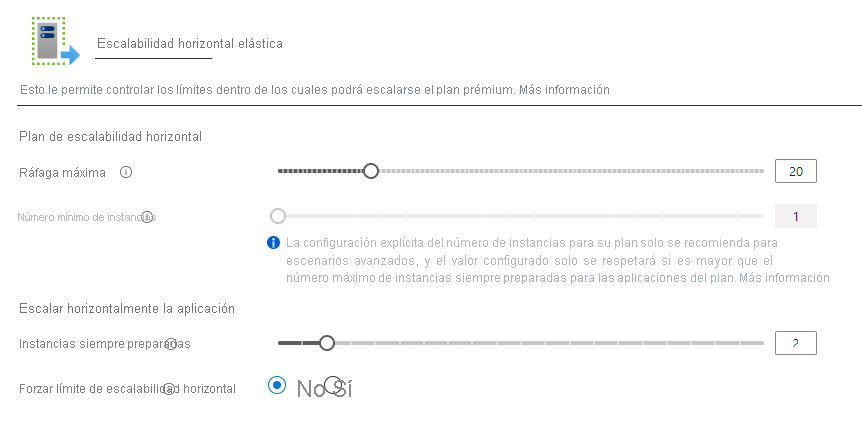

# <a name="azure-functions-premium-plan"></a>Plan prémium de Azure Functions

El plan Premium de Azure Functions (a veces denominado plan Elástico Premium) es una opción de hospedaje de las aplicaciones de funciones. El plan Premium cuenta con características como la conectividad de red virtual, arranques no en frío y hardware Premium.  Pueden implementarse varias aplicaciones de funciones en el mismo plan Premium. Este plan permite configurar el tamaño de la instancia de proceso, el tamaño del plan base y el tamaño del plan máximo.  Para ver una comparación del plan Premium y otros tipos de planes y hospedajes, consulte [Escalado y hospedaje de Azure Functions](functions-scale.md).

## <a name="create-a-premium-plan"></a>Creación de un plan Premium

[!INCLUDE [functions-premium-create](../../includes/functions-premium-create.md)]

También puede crear un plan Premium mediante [az functionapp plan create](/cli/azure/functionapp/plan#az-functionapp-plan-create) en la CLI de Azure. En el ejemplo siguiente se crea un plan de nivel _Elastic Premium 1_:

```azurecli-interactive
az functionapp plan create --resource-group <RESOURCE_GROUP> --name <PLAN_NAME> \
--location <REGION> --sku EP1
```

En este ejemplo, reemplace `<RESOURCE_GROUP>` por el grupo de recursos y `<PLAN_NAME>` por un nombre para el plan que sea único en el grupo de recursos. Especifique una [compatible `<REGION>`](https://azure.microsoft.com/global-infrastructure/services/?products=functions). Para crear un plan Premium que admita Linux, incluya la opción `--is-linux`.

Con el plan creado, puede usar [az functionapp create](/cli/azure/functionapp#az-functionapp-create) para crear la aplicación de funciones. En el portal, el plan y la aplicación se crean al mismo tiempo. Para ver un ejemplo de un script de la CLI de Azure completo, consulte [Creación de una aplicación de funciones en un plan Premium](scripts/functions-cli-create-premium-plan.md).

## <a name="features"></a>Características

Las siguientes características están disponibles para las aplicaciones de funciones implementadas en planes Premium.

### <a name="always-ready-instances"></a>Instancias siempre preparadas

Si hay un día en que no tiene lugar ningún evento ni ejecución en el plan de consumo, la aplicación puede reducirse horizontalmente a cero instancias. Cuando se produzcan nuevos eventos, será necesario especializar una nueva instancia con la aplicación que se ejecute en ella.  La especialización de nuevas instancias puede tardar algún tiempo dependiendo de la aplicación.  Esta latencia adicional de la primera llamada también suele denominarse "arranque en frío basado en la aplicación".

En el plan Premium, puede hacer que la aplicación previamente activada esté siempre preparada en un número concreto de instancias.  El número máximo de instancias siempre preparadas es 20.  Cuando los eventos empiezan a desencadenar la aplicación, siempre se enrutan primero a las instancias siempre preparadas.  A medida que la función se activa, las instancias adicionales se activarán como búferes.  Este búfer evita que las nuevas instancias necesarias durante el escalado se arranquen en frío.  Estas instancias almacenadas en búfer se denominan [instancias activadas previamente](#pre-warmed-instances).  Con la combinación de las instancias siempre preparadas y un búfer activado previamente, la aplicación puede eliminar eficazmente los arranques en frío.

> [!NOTE]
> Todos los planes Premium tendrán al menos una instancia activa y facturada en todo momento.

Puede configurar el número de instancias siempre preparadas en Azure Portal. Para ello, seleccione una aplicación de funciones en **Function App**, vaya a la pestaña **Características de la plataforma** y seleccione las opciones para **Escalar horizontalmente**. En la ventana de edición de la aplicación de funciones, las instancias siempre preparadas son específicas para esa aplicación.



Las instancias siempre preparadas para una aplicación también se pueden configurar con la CLI de Azure.

```azurecli-interactive
az resource update -g <resource_group> -n <function_app_name>/config/web --set properties.minimumElasticInstanceCount=<desired_always_ready_count> --resource-type Microsoft.Web/sites 
```

#### <a name="pre-warmed-instances"></a>Instancias activadas previamente

Las instancias activadas previamente son el número de instancias que se han activado como búferes durante los eventos de escalado y activación.  Las instancias activadas previamente siguen almacenándose en el búfer hasta que se alcanza el límite máximo de escalabilidad horizontal.  El número predeterminado de instancias activadas previamente es 1 y, para la mayoría de los escenarios, debería dejarse en 1.  Si una aplicación tiene un período de activación largo (como una imagen de contenedor personalizada), quizá debería aumentar el tamaño de búfer.  Una instancia activada previamente solo se activará después de que todas las instancias activas se hayan usado lo suficiente.

Tenga en cuenta este ejemplo que muestra cómo trabajan juntas las instancias siempre preparadas y las instancias activadas previamente.  Una aplicación de funciones Premium tiene configuradas cinco instancias siempre preparadas, y un valor predeterminado de una instancia activada previamente.  Cuando la aplicación está inactiva y no se desencadena ningún evento, la aplicación se aprovisionará y se ejecutará con cinco instancias.  

En cuanto se desencadene el primer desencadenador, las cinco instancias siempre preparadas se activarán y se asignará una instancia activada previamente adicional.  La aplicación se está ejecutando ahora con seis instancias aprovisionadas: las cinco instancias siempre preparadas y la sexta instancia de búfer inactiva y activada previamente.  Si la tasa de ejecuciones sigue aumentando, con el tiempo se usarán las cinco instancias activas.  Cuando la plataforma decide escalarse más allá de cinco instancias, se escala para usar la instancia activada previamente.  Cuando esto suceda, habrá seis instancias activas y se aprovisionará una séptima instancia de forma instantánea para rellenar el búfer activado previamente.  Esta secuencia de escalado y activación previa continuará hasta que se alcance el recuento de instancias máximo de la aplicación.  No se activará previamente ni se activará ninguna instancia que supere el número máximo.

Puede modificar el número de instancias activadas previamente para una aplicación mediante la CLI de Azure.

```azurecli-interactive
az resource update -g <resource_group> -n <function_app_name>/config/web --set properties.preWarmedInstanceCount=<desired_prewarmed_count> --resource-type Microsoft.Web/sites 
```

#### <a name="maximum-instances-for-an-app"></a>Número máximo de instancias para una aplicación

Además del [recuento de instancias máximo de un plan](#plan-and-sku-settings), puede configurar un máximo por aplicación.  El máximo de la aplicación se puede configurar mediante el [límite de escalabilidad de aplicaciones](./functions-scale.md#limit-scale-out).

### <a name="private-network-connectivity"></a>Conectividad de red privada

Las instancias de Azure Functions implementadas en un plan Premium tienen la ventaja de disfrutar de la [nueva integración con red virtual para aplicaciones web](../app-service/web-sites-integrate-with-vnet.md).  Cuando se configura, la aplicación puede comunicarse con los recursos de la red virtual o protegerse mediante puntos de conexión de servicio.  Las restricciones de IP también están disponibles en la aplicación para restringir el tráfico entrante.

Cuando se asigne una subred a la aplicación de funciones en un plan Premium, necesitará una subred con suficientes direcciones IP para cada posible instancia. Se requiere un bloque de direcciones IP con al menos 100 direcciones disponibles.

Para más información, consulte [Integración de una aplicación de funciones con una red virtual](functions-create-vnet.md).

### <a name="rapid-elastic-scale"></a>Escalado elástico rápido

Otras instancias de proceso se agregan automáticamente a la aplicación utilizando la misma lógica de escalado rápido que el plan de consumo. Las aplicaciones dentro del mismo plan de App Service se escalan de forma independiente entre sí y en función de las necesidades de una aplicación individual, pero las aplicaciones de Functions dentro del mismo plan de App Service sí comparten recursos de máquina virtual para contribuir a reducir los costes, siempre que sea posible. El número de aplicaciones asociadas a una máquina virtual depende de la superficie de cada aplicación y del tamaño de la máquina virtual en cuestión.

Para más información sobre el funcionamiento del escalado, consulte este artículo sobre el [escalado y hospedaje de funciones](./functions-scale.md#how-the-consumption-and-premium-plans-work).

### <a name="longer-run-duration"></a>Duración de la ejecución más larga

Azure Functions en un plan de consumo que impone un límite de 10 minutos en cada ejecución.  En el plan Premium, la duración de ejecución predeterminada es de 30 minutos para evitar ejecuciones descontroladas. Sin embargo, puede [modificar la configuración de host.json](./functions-host-json.md#functiontimeout) para que la duración sea ilimitada en las aplicaciones del plan Premium (60 minutos garantizados).

## <a name="plan-and-sku-settings"></a>Configuración del plan y la SKU

Cuando se crea un plan, hay dos configuraciones de tamaño de plan: el número mínimo de instancias (o tamaño de plan) y el límite máximo de ráfaga.

Si la aplicación necesita instancias que superan las instancias siempre preparadas, puede seguir realizando el escalado horizontal hasta que el número de instancias alcance el límite máximo de ráfaga.  Las instancias que superen el tamaño del plan solo se cobrarán cuando estén en ejecución y las tenga alquiladas.  Se hará todo lo posible por escalar horizontalmente la aplicación hasta el límite máximo definido.

Puede configurar el tamaño del plan y establecer valores máximos en Azure Portal seleccionando las opciones **Escalar horizontalmente** en el plan o una aplicación de funciones implementada en el plan (en **Características de la plataforma**).

También puede aumentar el límite máximo de ráfaga mediante la CLI de Azure:

```azurecli-interactive
az resource update -g <resource_group> -n <premium_plan_name> --set properties.maximumElasticWorkerCount=<desired_max_burst> --resource-type Microsoft.Web/serverfarms 
```

El mínimo de cada plan será al menos una instancia.  El número mínimo real de instancias se configurará automáticamente en función de las instancias siempre preparadas que hayan solicitado las aplicaciones del plan.  Por ejemplo, si la aplicación A solicita cinco instancias siempre preparadas y la aplicación B solicita dos instancias de este tipo en el mismo plan, el tamaño mínimo del plan se calculará como cinco.  La aplicación A se ejecutará en las 5 y la aplicación B solo se ejecutará en 2.

> [!IMPORTANT]
> Se le cobrará por cada instancia especificada en el número mínimo de instancias independientemente de si las funciones se ejecutan o no.

En la mayoría de los casos, este mínimo que se calculó automáticamente debe ser suficiente.  Sin embargo, el escalado que supere el mínimo se realiza de la mejor manera posible.  Es posible, aunque poco probable, que en una ocasión específica se retrase el escalado horizontal si las instancias adicionales no están disponibles.  Al establecer un valor mínimo superior al mínimo calculado automáticamente, se reservan instancias antes del escalado horizontal.

El aumento del mínimo calculado para un plan se puede realizar mediante la CLI de Azure.

```azurecli-interactive
az resource update -g <resource_group> -n <premium_plan_name> --set sku.capacity=<desired_min_instances> --resource-type Microsoft.Web/serverfarms 
```

### <a name="available-instance-skus"></a>SKU de instancias disponibles

Cuando cree o escale un plan, podrá elegir entre tres tamaños de instancia.  Se le facturará el número total de núcleos y de memoria consumida por segundo.  La aplicación puede escalar horizontalmente de forma automática en varias instancias cuando sea necesario.  

|SKU|Núcleos|Memoria|Storage|
|--|--|--|--|
|EP1|1|3,5 GB|250 GB|
|EP2|2|7 GB|250 GB|
|EP3|4|14 GB|250 GB|

### <a name="memory-utilization-considerations"></a>Consideraciones sobre el uso de memoria
La ejecución en un equipo con más memoria no siempre significa que la aplicación de funciones usará toda la memoria disponible.

Por ejemplo, una aplicación de funciones de JavaScript está restringida por el límite de memoria predeterminado en Node.js. Para aumentar este límite de memoria fijo, agregue la configuración de la aplicación `languageWorkers:node:arguments` con un valor de `--max-old-space-size=<max memory in MB>`.

## <a name="region-max-scale-out"></a>Escalabilidad horizontal máxima en regiones

A continuación se muestran los valores máximos de escalabilidad horizontal actualmente admitidos para un solo plan en cada región y configuración del sistema operativo. Para solicitar un aumento, abra una incidencia de soporte técnico.

Consulte la disponibilidad regional completa de Functions aquí: [Azure.com](https://azure.microsoft.com/global-infrastructure/services/?products=functions)

|Region| Windows | Linux |
|--| -- | -- |
|Centro de Australia| 20 | No disponible |
|Centro de Australia 2| 20 | No disponible |
|Este de Australia| 100 | 20 |
|Sudeste de Australia | 100 | 20 |
|Sur de Brasil| 60 | 20 |
|Centro de Canadá| 100 | 20 |
|Centro de EE. UU.| 100 | 20 |
|Este de Asia| 100 | 20 |
|Este de EE. UU. | 100 | 20 |
|Este de EE. UU. 2| 100 | 20 |
|Centro de Francia| 100 | 20 |
|Centro-oeste de Alemania| 100 | No disponible |
|Japón Oriental| 100 | 20 |
|Japón Occidental| 100 | 20 |
|Centro de Corea del Sur| 100 | 20 |
|Centro-Norte de EE. UU| 100 | 20 |
|Norte de Europa| 100 | 20 |
|Este de Noruega| 20 | 20 |
|Centro-sur de EE. UU.| 100 | 20 |
|Sur de la India | 100 | No disponible |
|Sudeste de Asia| 100 | 20 |
|Sur de Reino Unido| 100 | 20 |
|Oeste de Reino Unido| 100 | 20 |
|Oeste de Europa| 100 | 20 |
|Oeste de la India| 100 | 20 |
|Centro-Oeste de EE. UU.| 20 | 20 |
|Oeste de EE. UU.| 100 | 20 |
|Oeste de EE. UU. 2| 100 | 20 |

## <a name="next-steps"></a>Pasos siguientes

> [!div class="nextstepaction"]
> [Información sobre las opciones de escalado y hospedaje de Azure Functions](functions-scale.md)
