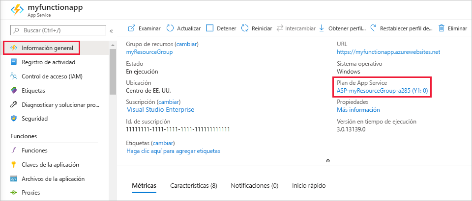

# <a name="azure-functions-scale-and-hosting"></a>Escalado y hospedaje de Azure Functions

Cuando crea una aplicación de funciones en Azure, debe elegir un plan de hospedaje para su aplicación. Hay tres planes de hospedaje básico disponibles para Azure Functions: [Plan de consumo](#consumption-plan), [plan Premium](#premium-plan) y [plan Dedicado (App Service)](#app-service-plan). Todos los planes de hospedaje tienen disponibilidad general (GA) en máquinas virtuales Linux y Windows.

El plan de hospedaje que elija determina los comportamientos siguientes:

* Cómo se escala la aplicación de funciones.
* Los recursos disponibles para cada instancia de aplicación de funciones.
* Compatibilidad con características avanzadas, como la conectividad con Azure Virtual Network.

Los planes de consumo y Prémium agregan automáticamente la capacidad de proceso cuando se ejecuta su código. La aplicación se escala horizontalmente cuando es necesario para administrar la carga, y se reduce horizontalmente cuando el código se deja de ejecutar. En el caso del plan de consumo, tampoco tiene que pagar para las VM inactivas ni la capacidad reservada de antemano.  

El plan Prémium proporciona características adicionales, como instancias de proceso prémium, la capacidad de conservar las instancias semiactivas indefinidamente y la conectividad de red virtual.

El plan de App Service le permite aprovechar la infraestructura dedicada que administra. Su aplicación de funciones no se escala en función de los eventos, lo que significa que nunca se reduce horizontalmente a cero. (Requiere que la configuración [Always On](#always-on) está habilitada).

Para obtener una comparación detallada entre los distintos planes de hospedaje (incluido el hospedaje basado en Kubernetes), consulte la [sección de la comparación entre planes de hospedaje](#hosting-plans-comparison).

## <a name="consumption-plan"></a>Plan de consumo

Cuando se usa el plan de consumo, las instancias del host de Azure Functions se agregan y quitan de forma dinámica según el número de eventos entrantes. Este plan sin servidor se escala automáticamente y solo se le cobra por los recursos de proceso cuando se ejecutan las funciones. En un plan de consumo, se agota el tiempo de espera de una ejecución de función tras un período de tiempo configurable.

La facturación se basa en el número de ejecuciones, el tiempo de ejecución y el uso de la memoria. La utilización es un agregado de todas las funciones dentro de la aplicación de función. Para más información, consulte la [página de precios de Azure Functions](https://azure.microsoft.com/pricing/details/functions/).

El plan de consumo es el plan de hospedaje predeterminado y ofrece las siguientes ventajas:

* Pague solo cuando se ejecutan las funciones
* Escale horizontalmente de forma automática, incluso durante períodos de gran carga

Las aplicaciones de funciones de la misma región se pueden asignar al mismo plan de consumo. No hay ningún inconveniente ni problema en el hecho de tener varias aplicaciones ejecutándose en el mismo plan de consumo. La asignación de varias aplicaciones al mismo plan de consumo no tiene ningún impacto en la resistencia, la escalabilidad o la confiabilidad de cada aplicación.

Para obtener más información sobre cómo calcular los costos cuando se ejecutan en un plan de consumo, vea [Descripción de los costos en un plan de consumo](functions-consumption-costs.md).

## <a name="premium-plan"></a><a name="premium-plan"></a>Plan Premium

Cuando se usa el plan Prémium, las instancias del host de Azure Functions se agregan y quitan según el número de eventos entrantes al igual que con el plan de consumo.  El plan Prémium admite las características siguientes:

* Instancias permanentemente semiactivas para evitar cualquier inicio en frío
* Conectividad de red virtual
* Duración de la ejecución ilimitada (60 minutos garantizados)
* Tamaños de la instancia Prémium (un núcleo, dos núcleos y cuatro instancias de núcleo)
* Precios más previsibles
* Asignación de aplicaciones de alta densidad para planes con varias aplicaciones de funciones

Para obtener información sobre cómo crear una aplicación de funciones en un plan Premium, consulte [Plan Premium de Azure Functions](functions-premium-plan.md).

En lugar de la facturación por ejecución y la memoria consumida, la facturación del plan Premium se basa en la cantidad de núcleos por segundo y en la memoria asignada en las instancias.  No hay ningún cargo de ejecución con el plan Premium. Debe haber al menos una instancia asignada en todo momento en cada plan. Esto da como resultado un costo mensual mínimo por plan activo, independientemente de si la función está activa o inactiva. Tenga en cuenta que todas las aplicaciones de función de un plan Premium comparten instancias asignadas.

Considere la posibilidad de elegir el plan Premium de Azure Functions en las siguientes situaciones:

* La aplicación de función se ejecuta de forma continua, o casi continua.
* Tiene un gran número de ejecuciones pequeñas y tiene una factura de ejecución alta, pero una factura de pocos GB por segundo en el plan de consumo.
* Necesita más opciones de CPU o memoria de las que proporciona el plan de consumo.
* Su código debe ejecutarse durante más tiempo del [máximo permitido](#timeout) en el plan de consumo.
* Necesita características que solo están disponibles en un plan Premium, como la conectividad de red virtual. 

## <a name="dedicated-app-service-plan"></a><a name="app-service-plan"></a>Plan dedicado (App Service)

Sus aplicaciones de funciones también pueden ejecutarse en las mismas máquinas virtuales dedicadas que otras aplicaciones de App Service (SKU básica, estándar, prémium y aislada).

Considere el plan de App Service en las situaciones siguientes:

* Tiene máquinas virtuales infrautilizadas que ya ejecutan otras instancias de App Service.
* Quiere proporcionar una imagen personalizada en la que ejecutar sus funciones.

Paga lo mismo por las aplicaciones de funciones en un plan de App Service que por otros recursos de App Service, como las aplicaciones web. Para más información acerca del funcionamiento del plan de App Service, consulte [Introducción detallada sobre los planes de Azure App Service](../app-service/overview-hosting-plans.md).

Con un plan de App Service, para escalar horizontalmente de forma manual, puede agregar más instancias de máquina virtual. También puede habilitar el escalado automático, aunque este sea más lento que la escala elástica del plan Premium. Para obtener más información, consulte [Escalación del recuento de instancias de forma manual o automática](../azure-monitor/platform/autoscale-get-started.md?toc=%2fazure%2fapp-service%2ftoc.json). También puede escalar verticalmente eligiendo un plan de App Service diferente. Vea [Escalado vertical de aplicaciones en Azure](../app-service/manage-scale-up.md) para obtener más información. 

Al ejecutar funciones de JavaScript en un plan de App Service, debe elegir un plan con menos vCPU. Para obtener más información, consulte [Elección de los planes de App Service de un solo núcleo](functions-reference-node.md#choose-single-vcpu-app-service-plans). 
<!-- Note: the portal links to this section via fwlink https://go.microsoft.com/fwlink/?linkid=830855 --> 

La ejecución en una instancia de [App Service Environment (ASE)](../app-service/environment/intro.md) permite aislar completamente las funciones y aprovechar las ventajas de tener un mayor número de instancias que el plan de App Service.

### <a name="always-on"></a><a name="always-on"></a> Always On

Si se ejecuta en un plan de App Service, debe habilitar la configuración **Always On** para que la aplicación de función se ejecute correctamente. En un plan de App Service, el tiempo de ejecución de las funciones queda inactivo después de unos minutos de inactividad, por lo que solo los desencadenadores HTTP podrán "reactivar" las funciones. Always On solo está disponible en un plan de App Service. En un plan de consumo, la plataforma activa automáticamente las aplicaciones de función.

[!INCLUDE [Timeout Duration section](../../includes/functions-timeout-duration.md)]


Incluso con Always On habilitado, el tiempo de espera de ejecución para las funciones individuales se controla mediante la opción `functionTimeout` en el archivo de proyecto [host.json](functions-host-json.md#functiontimeout).

## <a name="determine-the-hosting-plan-of-an-existing-application"></a>Determinación del plan de hospedaje de una aplicación existente

Para determinar el plan de hospedaje que usa la aplicación de funciones, consulte **Plan de App Service** en la pestaña **Introducción** de la aplicación de funciones en [Azure Portal](https://portal.azure.com). Para ver el plan de tarifa, seleccione el nombre del **Plan de App Service** y, a continuación, seleccione **Propiedades** en el panel izquierdo.



También puede usar la CLI de Azure para determinar el plan, como sigue:

```azurecli-interactive
appServicePlanId=$(az functionapp show --name <my_function_app_name> --resource-group <my_resource_group> --query appServicePlanId --output tsv)
az appservice plan list --query "[?id=='$appServicePlanId'].sku.tier" --output tsv
```  

Cuando el resultado de este comando es `dynamic`, la aplicación de función está en el plan de consumo. Cuando la salida de este comando es `ElasticPremium`, su aplicación de funciones está en el plan Prémium. Todos los demás valores indican los distintos niveles de un plan de App Service.

## <a name="storage-account-requirements"></a>Requisitos de la cuenta de almacenamiento

En cualquier plan, una aplicación de funciones requiere una cuenta de Azure Storage general que admita almacenamiento de Azure en blobs, colas, archivos y tablas. Esto es porque Azure Functions se basa en Azure Storage para realizar operaciones como la administración de desencadenadores y el registro de las ejecuciones de funciones, pero algunas cuentas de almacenamiento no admiten colas y tablas. Estas cuentas, que incluyen las cuentas de almacenamiento solo para blobs (incluido almacenamiento Premium) y las cuentas de almacenamiento de uso general con replicación de almacenamiento con redundancia de zona, se filtran horizontalmente de las selecciones de **Cuenta de almacenamiento** existentes cuando se crea una aplicación de función.

Los desencadenadores y enlaces para almacenar los datos de la aplicación también pueden usar la misma cuenta de almacenamiento que usa la aplicación de función. Sin embargo, para las operaciones que consumen muchos recursos de almacenamiento, debe usar una cuenta de almacenamiento independiente.  

Una misma cuenta de almacenamiento puede estar compartida entre varias aplicaciones de funciones sin que se produzcan problemas. (Un buen ejemplo es cuando se desarrollan varias aplicaciones en el entorno local mediante el Emulador de Azure Storage, que actúa como una cuenta de almacenamiento). 

<!-- JH: Does using a Premium Storage account improve perf? -->

Para obtener más información sobre los tipos de cuenta de almacenamiento, vea [Introducción de los servicios Azure Storage](../storage/common/storage-introduction.md#core-storage-services).

### <a name="in-region-data-residency"></a>Residencia de datos en la región

Cuando sea necesario que todos los datos del cliente permanezcan dentro de una única región, la cuenta de almacenamiento asociada a la aplicación de función debe ser una que tenga [redundancia en la región](../storage/common/storage-redundancy.md).  También se debe utilizar una cuenta de almacenamiento redundante en la región con [Azure Durable Functions](./durable/durable-functions-perf-and-scale.md#storage-account-selection) para Durable Functions.

Otros datos de clientes administrados por la plataforma solo se almacenarán dentro de la región al hospedarse en una instancia de App Service Environment de un equilibrador de carga interno (o ASE de ILB).  Puede encontrar más información en la sección sobre [redundancia de zona de ASE](../app-service/environment/zone-redundancy.md#in-region-data-residency).

## <a name="how-the-consumption-and-premium-plans-work"></a>Cómo funcionan los planes de consumo y premium

En los planes de consumo y Premium, la infraestructura de Azure Functions escala los recursos de CPU y memoria. Para ello, agrega instancias adicionales del host de Functions, según el número de eventos en los que se desencadenan sus funciones. Cada instancia del host de Functions del plan de consumo tiene una limitación de 1.5 GB de memoria y una CPU.  Una instancia del host es la aplicación de funciones completa, lo que significa que todas las funciones de una aplicación de funciones comparten recursos al mismo tiempo en una instancia y escala determinadas. Las aplicaciones de función que comparten el mismo plan de consumo se escalan de manera independiente.  En el plan Premium, el tamaño del plan determinará la memoria y la CPU disponibles para todas las aplicaciones de ese plan en esa instancia.  

Los archivos de código de función se almacenan en recursos compartidos de Azure Files en la cuenta de almacenamiento principal de la función. Al eliminarse la cuenta de almacenamiento principal de la aplicación de función, los archivos de código de función también se eliminan y no se pueden recuperar.

### <a name="runtime-scaling"></a>Escalado del entorno de tiempo de ejecución

Azure Functions usa un componente denominado *controlador de escala* para supervisar la tasa de eventos y determinar si se debe escalar o reducir horizontalmente. El controlador de escala usa la heurística para cada tipo de desencadenador. Por ejemplo, al usar un desencadenador de Azure Queue Storage, se escala en función de la longitud de la cola y la antigüedad del mensaje más antiguo de la cola.

La unidad de escala de Azure Functions es la aplicación de funciones. Al escalar horizontalmente la aplicación de función, se asignan recursos adicionales para ejecutar varias instancias del host de Azure Functions. Por el contrario, si la demanda se reduce, el controlador de escala elimina instancias del host de la función. El número de instancias se *reduce horizontalmente* hasta cero cuando no se ejecuta ninguna función en la aplicación de funciones.


### <a name="cold-start"></a>Arranque en frío

Una vez que la aplicación de funciones ha estado inactiva durante varios minutos, la plataforma puede escalar el número de instancias en las que la aplicación se ejecuta hasta cero. La siguiente solicitud tiene la latencia agregada al escalar de cero a uno. Esta latencia se conoce como _arranque en frío_. El número de dependencias que la aplicación de funciones debe cargar puede afectar el momento del arranque en frío. El arranque en frío es más problemático para las operaciones sincrónicas, como los desencadenadores HTTP que deben devolver una respuesta. Si los arranques en frío afectan a las funciones, considere la posibilidad de realizar las ejecuciones con un plan Premium o en un plan dedicado con la opción AlwaysOn habilitada.   

### <a name="understanding-scaling-behaviors"></a>Descripción de los comportamientos de escalado

El escalado puede variar en función de varios factores, y realizarse de forma diferente según el desencadenador y el idioma seleccionados. Hay algunas complejidades de los comportamientos del escalado que hay que tener en cuenta:

* Una aplicación de funciones única solo se escala horizontalmente hasta un máximo de 200 instancias. Una única instancia puede procesar más de un mensaje o solicitud a la vez, por lo que no hay un límite establecido en el número de ejecuciones simultáneas.  Puede [especificar un máximo inferior](#limit-scale-out) para limitar la escala según se requiera.
* En el caso de los desencadenadores HTTP, solo se asignan nuevas instancias como máximo una vez cada segundo.
* Para los desencadenadores que no son HTTP, solo se asignan nuevas instancias como máximo una vez cada 30 segundos. El escalado es más rápido cuando se ejecuta en un plan [Premium](#premium-plan).
* En el caso de los desencadenadores de Service Bus, use los derechos de _Administración_ en los recursos para obtener el escalado más eficaz. Con los derechos de _Escucha_, el escalado no es tan preciso porque la longitud de la cola no se puede utilizar para informar sobre las decisiones de escalado. Para más información sobre cómo establecer derechos en las directivas de acceso de Service Bus, consulte [Directivas de autorización de acceso compartido](../service-bus-messaging/service-bus-sas.md#shared-access-authorization-policies).
* Para los desencadenadores de Event Hubs, consulte la [guía de escalado](functions-bindings-event-hubs-trigger.md#scaling) en el artículo de referencia. 

### <a name="limit-scale-out"></a>Límite de escalabilidad horizontal

Es posible que desee restringir el número de instancias a las que una aplicación se escala horizontalmente.  Esto es más común en los casos en los que un componente de nivel inferior, como una base de datos, tiene un rendimiento limitado.  De forma predeterminada, las funciones del plan de consumo se escalarán horizontalmente hasta un máximo de 200 instancias, mientras que las funciones del plan Premium se escalarán horizontalmente hasta un máximo de 100 instancias.  Puede especificar un máximo inferior para una aplicación específica modificando el valor `functionAppScaleLimit`.  `functionAppScaleLimit` se puede establecer en 0 o NULL para Unrestricted o un valor válido entre 1 y el máximo de la aplicación.

```azurecli
az resource update --resource-type Microsoft.Web/sites -g <resource_group> -n <function_app_name>/config/web --set properties.functionAppScaleLimit=<scale_limit>
```

### <a name="best-practices-and-patterns-for-scalable-apps"></a>Procedimientos recomendados y patrones para aplicaciones escalables

Hay muchos aspectos de una aplicación de función que afectarán a cómo se escala esta, incluida la configuración del host, la superficie del sistema de tiempo de ejecución y la eficacia de los recursos.  Para obtener más información, consulte la [sección de escalabilidad del artículo sobre consideraciones de rendimiento](functions-best-practices.md#scalability-best-practices). También debe tener en cuenta cómo se comportan las conexiones a medida que la aplicación de función se escala. Para más información, consulte [How to manage connections in Azure Functions](manage-connections.md) (Administración de conexiones en Azure Functions).

Para obtener más información sobre el escalado en Python y Node.js, consulte la [Guía de Azure Functions para desarrolladores de Python: escalado y simultaneidad](functions-reference-python.md#scaling-and-concurrency) y la [Guía para desarrolladores de Node.js para Azure Functions: escalado y simultaneidad](functions-reference-node.md#scaling-and-concurrency).

### <a name="billing-model"></a>Modelo de facturación

La facturación de los diferentes planes se describe en detalle en la [página de precios de Azure Functions](https://azure.microsoft.com/pricing/details/functions/). El uso se agrega en el nivel de la aplicación de función, y solo se cuenta el tiempo que el código de la función está en ejecución. Estas son las unidades de facturación:

* **Consumo de recursos en gigabytes-segundo (GB-s)** . Se calcula como una combinación del tamaño de la memoria y el tiempo de ejecución de todas las funciones de una aplicación de función. 
* **Ejecuciones**. Se cuenta cada vez que se ejecuta una función en respuesta a un desencadenador de eventos.

Puede encontrar consultas útiles y obtener información sobre cómo comprender la factura de consumo [en las P+F sobre facturación](https://github.com/Azure/Azure-Functions/wiki/Consumption-Plan-Cost-Billing-FAQ).

[Azure Functions pricing page]: https://azure.microsoft.com/pricing/details/functions

## <a name="hosting-plans-comparison"></a>Comparación de planes de hospedaje

En la siguiente tabla de comparación se muestran todos los aspectos importantes que ayudan a elegir un plan de hospedaje para la aplicación de Azure Functions:

### <a name="plan-summary"></a>Resumen del plan
| | |
| --- | --- |  
|**[Plan de consumo](#consumption-plan)**| Escale de forma automática y pague los recursos de proceso solo cuando se ejecuten las funciones. En el plan de consumo, las instancias del host de Functions se agregan y quitan de forma dinámica según el número de eventos de entrada.<br/> ✔ Plan de hospedaje predeterminado.<br/>✔ Pague solo cuando se ejecutan las funciones.<br/>✔ Escale horizontalmente de forma automática, incluso durante períodos de una carga elevada.|  
|**[Plan Premium](#premium-plan)**|Cuando use el escalado automático en función de la demanda, use trabajos preparados previamente para ejecutar aplicaciones sin ningún retraso después de que estén inactivas, ejecutarlas en instancias más eficaces y conectarse a redes virtuales. Plantéese el uso del plan Premium de Azure Functions en las siguientes situaciones, además de todas las características del plan de App Service: <br/>✔ La aplicación de funciones se ejecuta de forma continua, o casi continua.<br/>✔ Tiene un gran número de ejecuciones pequeñas y tiene una factura de ejecuciones elevada, además de una factura de pocos GB por segundo en el plan de consumo.<br/>✔ Necesita más opciones de CPU o memoria de las que proporciona el plan de consumo.<br/>✔ Su código debe ejecutarse durante más tiempo del máximo permitido en el plan de consumo.<br/>✔ Necesita características que solo están disponibles en un plan Premium, como la conectividad de red virtual.|  
|**[Plan dedicado](#app-service-plan)** <sup>1</sup>|Ejecute sus funciones en un plan de App Service con las tarifas de plan de App Service normal. Buena opción para las operaciones de larga duración, así como para las situaciones en las que se requiere un escalado y costos más predictivos. Considere el plan de App Service en las situaciones siguientes:<br/>✔ Tiene máquinas virtuales infrautilizadas que ya ejecutan otras instancias de App Service.<br/>✔ Quiere proporcionar una imagen personalizada en la que ejecutar sus funciones.|  
|**[ASE](#app-service-plan)** <sup>1</sup>|App Service Environment (ASE) es una característica de App Service que proporciona un entorno completamente aislado y dedicado para ejecutar de forma segura las aplicaciones de App Service a gran escala. Las instancias de ASE son adecuadas para cargas de trabajo de aplicaciones que necesitan: <br/>✔ Una gran escala.<br/>✔ Aislamiento de proceso completo y acceso a redes seguro.<br/>✔ Alta utilización de memoria.|  
| **[Kubernetes](functions-kubernetes-keda.md)** | Kubernetes proporciona un entorno completamente aislado y dedicado que se ejecuta sobre la plataforma de Kubernetes.  Kubernetes resulta adecuado para cargas de trabajo de aplicaciones que necesitan: <br/>✔ Requisitos de hardware personalizados.<br/>✔ Aislamiento y acceso a redes seguro.<br/>✔ Capacidad de ejecutarse en entornos híbridos o de varias nubes.<br/>✔ Ejecutarse junto con aplicaciones y servicios de Kubernetes existentes.|  

<sup>1</sup> Para conocer los límites específicos de las distintas opciones de plan de App Service, consulte [Límites del plan de App Service](../azure-resource-manager/management/azure-subscription-service-limits.md#app-service-limits).

### <a name="operating-systemruntime"></a>Sistema operativo o entorno de ejecución

| | Linux<sup>1</sup><br/>Solo código | Windows<sup>2</sup><br/>Solo código | Linux<sup>1, 3</sup><br/>Contenedor de Docker |
| --- | --- | --- | --- |
| **[Plan de consumo](#consumption-plan)** | .NET Core<br/>Node.js<br/>Java<br/>Python | .NET Core<br/>Node.js<br/>Java<br/>PowerShell Core | No se admite  |
| **[Plan Premium](#premium-plan)** | .NET Core<br/>Node.js<br/>Java<br/>Python|.NET Core<br/>Node.js<br/>Java<br/>PowerShell Core |.NET Core<br/>Node.js<br/>Java<br/>PowerShell Core<br/>Python  | 
| **[Plan dedicado](#app-service-plan)** <sup>4</sup> | .NET Core<br/>Node.js<br/>Java<br/>Python|.NET Core<br/>Node.js<br/>Java<br/>PowerShell Core |.NET Core<br/>Node.js<br/>Java<br/>PowerShell Core<br/>Python |
| **[ASE](#app-service-plan)** <sup>4</sup> | .NET Core<br/>Node.js<br/>Java<br/>Python |.NET Core<br/>Node.js<br/>Java<br/>PowerShell Core  |.NET Core<br/>Node.js<br/>Java<br/>PowerShell Core<br/>Python | 
| **[Kubernetes](functions-kubernetes-keda.md)** | N/D | N/D |.NET Core<br/>Node.js<br/>Java<br/>PowerShell Core<br/>Python |

<sup>1</sup>Linux es el único sistema operativo admitido para la pila en tiempo de ejecución de Python.  
<sup>2</sup>Windows es el único sistema operativo admitido para la pila en tiempo de ejecución de PowerShell.   
<sup>3</sup>Linux es el único sistema operativo admitido para los contenedores de Docker.
<sup>4</sup> Para conocer los límites específicos de las distintas opciones de plan de App Service, consulte [Límites del plan de App Service](../azure-resource-manager/management/azure-subscription-service-limits.md#app-service-limits).

### <a name="scale"></a>Escala

| | Escalado horizontal | N.º máximo de instancias |
| --- | --- | --- |
| **[Plan de consumo](#consumption-plan)** | Basado en eventos. Escale horizontalmente de forma automática, incluso durante períodos de gran carga. La infraestructura de Azure Functions escala automáticamente los recursos de CPU y la memoria mediante la incorporación de instancias del host de Functions, según el número de eventos desencadenados por las funciones. | 200 |
| **[Plan Premium](#premium-plan)** | Basado en eventos. Escale horizontalmente de forma automática, incluso durante períodos de gran carga. La infraestructura de Azure Functions escala automáticamente los recursos de CPU y la memoria mediante la incorporación de instancias del host de Functions, según el número de eventos desencadenados por las funciones. |100|
| **[Plan dedicado](#app-service-plan)** <sup>1</sup> | Escalabilidad automática o manual |10-20|
| **[ASE](#app-service-plan)** <sup>1</sup> | Escalabilidad automática o manual |100 |
| **[Kubernetes](functions-kubernetes-keda.md)**  | Escalado automático basado en eventos para los clústeres de Kubernetes mediante [KEDA](https://keda.sh). | Varía&nbsp;por&nbsp;clúster.&nbsp;&nbsp;|

<sup>1</sup> Para conocer los límites específicos de las distintas opciones de plan de App Service, consulte [Límites del plan de App Service](../azure-resource-manager/management/azure-subscription-service-limits.md#app-service-limits).

### <a name="cold-start-behavior"></a>Comportamiento del arranque en frío

|    |    | 
| -- | -- |
| **[Plan de&nbsp;consumo](#consumption-plan)** | Las aplicaciones pueden escalarse a cero si están inactivas durante un período de tiempo, por lo que algunas solicitudes pueden tener una latencia adicional en el arranque.  El plan de consumo incluye algunas optimizaciones para reducir el tiempo de arranque en frío, incluida la extracción desde funciones de marcador de posición previamente preparadas que ya tienen en ejecución un host de función y procesos de lenguaje. |
| **[Plan Premium](#premium-plan)** | Instancias permanentemente preparadas para evitar cualquier arranque en frío. |
| **[Plan dedicado](#app-service-plan)** <sup>1</sup> | Cuando se ejecuta en un plan dedicado, el host de Functions se puede ejecutar de forma continua, lo que significa que el arranque en frío no es realmente un problema. |
| **[ASE](#app-service-plan)** <sup>1</sup> | Cuando se ejecuta en un plan dedicado, el host de Functions se puede ejecutar de forma continua, lo que significa que el arranque en frío no es realmente un problema. |
| **[Kubernetes](functions-kubernetes-keda.md)**  | Depende de la configuración de KEDA. Las aplicaciones se pueden configurar para ejecutarse de forma continua y arrancar en frío, o para escalarse a cero, lo que provoca un arranque en frío con los nuevos eventos. 

<sup>1</sup> Para conocer los límites específicos de las distintas opciones de plan de App Service, consulte [Límites del plan de App Service](../azure-resource-manager/management/azure-subscription-service-limits.md#app-service-limits).

### <a name="service-limits"></a>Límites de servicio

[!INCLUDE [functions-limits](../../includes/functions-limits.md)]

### <a name="networking-features"></a>Características de red

[!INCLUDE [functions-networking-features](../../includes/functions-networking-features.md)]

### <a name="billing"></a>Facturación

| | | 
| --- | --- |
| **[Plan de consumo](#consumption-plan)** | Solo paga por el tiempo durante el que se ejecutan las funciones. La facturación se basa en el número de ejecuciones, el tiempo de ejecución y el uso de la memoria. |
| **[Plan Premium](#premium-plan)** | El plan Premium se basa en la cantidad de núcleos por segundo y en la memoria usada en las instancias necesarias y preparadas previamente. Al menos una instancia por plan se debe mantener preparada en todo momento. Este plan ofrece precios más predecibles. |
| **[Plan dedicado](#app-service-plan)** <sup>1</sup> | Paga lo mismo por las aplicaciones de funciones en un plan de App Service que por otros recursos de App Service, como las aplicaciones web.|
| **[ASE](#app-service-plan)** <sup>1</sup> | Hay una tarifa plana mensual para una instancia de ASE que paga por la infraestructura y no cambia con el tamaño de la instancia de ASE. Además, existe un costo por cada vCPU del plan de App Service. Todas las aplicaciones hospedadas en una instancia de ASE están en el SKU de precios Aislado. |
| **[Kubernetes](functions-kubernetes-keda.md)**| Solo paga los costos del clúster de Kubernetes; no existe facturación adicional para Functions. La aplicación de funciones se ejecuta como una carga de trabajo de aplicación en el clúster, al igual que una aplicación normal. |

<sup>1</sup> Para conocer los límites específicos de las distintas opciones de plan de App Service, consulte [Límites del plan de App Service](../azure-resource-manager/management/azure-subscription-service-limits.md#app-service-limits).

## <a name="next-steps"></a>Pasos siguientes

+ [Inicio rápido: Creación de un proyecto de Azure Functions en Visual Studio Code](functions-create-first-function-vs-code.md)
+ [Tecnologías de implementación en Azure Functions](functions-deployment-technologies.md) 
+ [Guía para desarrolladores de Azure Functions](functions-reference.md)
