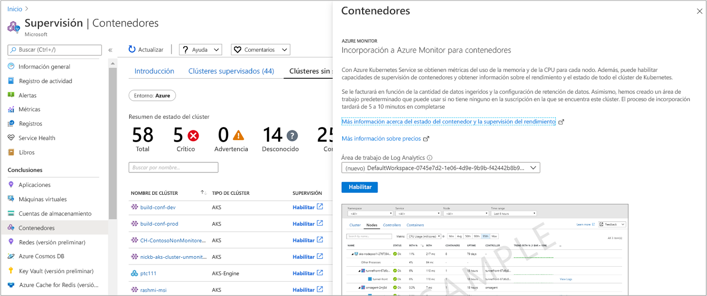

# <a name="configure-azure-red-hat-openshift-v3-with-azure-monitor-for-containers"></a>Configuración de Red Hat OpenShift en Azure v3.x con Azure Monitor para contenedores

>[!IMPORTANT]
> Red Hat OpenShift en Azure 3.11 se retirará en junio de 2022.
>
> A partir de octubre de 2020, ya no podrá crear nuevos clústeres de 3.11.
> Los clústeres existentes de 3.11 seguirán funcionando hasta junio de 2022, pero dejarán de admitirse después de esa fecha.
>
> Siga esta guía para [crear un clúster de la versión 4 de Red Hat OpenShift en Azure](https://docs.microsoft.com/azure/openshift/tutorial-create-cluster).
> Si tiene alguna pregunta específica, [póngase en contacto con nosotros](mailto:aro-feedback@microsoft.com).

Azure Monitor para contenedores proporciona una experiencia de supervisión enriquecida para los clústeres de Azure Kubernetes Service (AKS) y Motor de AKS. En este artículo se describe cómo habilitar la supervisión de clústeres de Kubernetes hospedados en [Red Hat OpenShift en Azure](../../openshift/intro-openshift.md) versión 3 y la última versión compatible de la versión 3, para lograr una experiencia de supervisión similar.

>[!NOTE]
>La compatibilidad con Red Hat OpenShift en Azure es una característica que se encuentra en versión preliminar pública en este momento.
>

Azure Monitor para contenedores puede habilitarse para implementaciones de Red Hat OpenShift en Azure nuevas, o en una o más implementaciones ya existentes, mediante los siguientes métodos admitidos:

- En el caso de un clúster existente desde Azure Portal o mediante una plantilla de Azure Resource Manager.
- En el caso de un clúster nuevo mediante una plantilla de Azure Resource Manager, o al crear un nuevo clúster mediante la [CLI de Azure](/cli/azure/openshift?view=azure-cli-latest#az-openshift-create).

## <a name="supported-and-unsupported-features"></a>Características admitidas y no admitidas

Azure Monitor para contenedores admite la supervisión de Red Hat OpenShift en Azure como se describe en el artículo de [introducción](container-insights-overview.md), excepto para las siguientes características:

- Datos en directo (versión preliminar)
- [Recopilación de métricas](container-insights-update-metrics.md) de nodos y pods de clúster, y almacenamiento de estos en la base de datos de métricas de Azure Monitor

## <a name="prerequisites"></a>Requisitos previos

- Un [área de trabajo de Log Analytics.](../platform/design-logs-deployment.md)

    Azure Monitor para contenedores admite un área de trabajo de Log Analytics en las regiones enumeradas en los [productos por región](https://azure.microsoft.com/global-infrastructure/services/?regions=all&products=monitor) de Azure. Para crear el área de trabajo, puede configurarla mediante [Azure Resource Manager](../samples/resource-manager-workspace.md), [PowerShell](../scripts/powershell-sample-create-workspace.md?toc=%2fpowershell%2fmodule%2ftoc.json) o en el [Azure Portal](../learn/quick-create-workspace.md).

- Para habilitar y acceder a las características de Azure Monitor para contenedores debe ser miembro, como mínimo, del rol *Colaborador* de la suscripción de Azure y miembro del rol [*Colaborador de Log Analytics*](../platform/manage-access.md#manage-access-using-azure-permissions) del área de trabajo de Log Analytics configurada con Azure Monitor para contenedores.

- Para ver los datos de supervisión, debe ser miembro del permiso de rol [*Lector de Log Analytics*](../platform/manage-access.md#manage-access-using-azure-permissions) en el área de trabajo de Log Analytics configurada con Azure Monitor para contenedores.

## <a name="identify-your-log-analytics-workspace-id"></a>Detección del identificador del área de trabajo de Log Analytics

 Para integrar en un área de trabajo de Log Analytics existente, empiece por detectar el identificador del recurso completo de su área de trabajo de Log Analytics. El identificador de recurso del área de trabajo es necesario para el parámetro `workspaceResourceId` cuando se habilita la supervisión mediante el método de plantilla de Azure Resource Manager.

1. Enumere todas las suscripciones a las que tiene acceso mediante la ejecución del siguiente comando:

    ```azurecli
    az account list --all -o table
    ```

    El resultado tendrá un aspecto similar al siguiente:

    ```azurecli
    Name                                  CloudName    SubscriptionId                        State    IsDefault
    ------------------------------------  -----------  ------------------------------------  -------  -----------
    Microsoft Azure                       AzureCloud   0fb60ef2-03cc-4290-b595-e71108e8f4ce  Enabled  True
    ```

1. Copie el valor de **SubscriptionId** .

1. Cambie a la suscripción que hospeda el área de trabajo de Log Analytics mediante la ejecución del siguiente comando:

    ```azurecli
    az account set -s <subscriptionId of the workspace>
    ```

1. Muestre la lista de áreas de trabajo de sus suscripciones en el formato JSON predeterminado mediante la ejecución del siguiente comando:

    ```
    az resource list --resource-type Microsoft.OperationalInsights/workspaces -o json
    ```

1. En la salida, busque el nombre del área de trabajo y copie el identificador de recurso completo de esa área de trabajo de Log Analytics en el campo **identificador** .

## <a name="enable-for-a-new-cluster-using-an-azure-resource-manager-template"></a>Habilitar para un nuevo clúster mediante una plantilla de Azure Resource Manager

Realice estos pasos para implementar un clúster de Red Hat OpenShift en Azure con la supervisión habilitada. Antes de continuar, revise el tutorial [Creación de un clúster de Red Hat OpenShift en Azure](../../openshift/tutorial-create-cluster.md) para comprender las dependencias que debe configurar de modo que su entorno esté configurado correctamente.

Este método incluye dos plantillas JSON. Una plantilla especifica la configuración para implementar el clúster con la supervisión habilitada y la otra contiene los valores de los parámetros que se configuran para especificar lo siguiente:

- El identificador de recurso del clúster de Red Hat OpenShift en Azure.

- El grupo de recursos en el que se implementa el clúster.

- [Identificador del inquilino de Azure Active Directory:](../../openshift/howto-create-tenant.md#create-a-new-azure-ad-tenant) se anotó después de realizar los pasos para crearlo o utilizar uno ya creado.

- [Identificador de la aplicación cliente de Azure Active Directory:](../../openshift/howto-aad-app-configuration.md#create-an-azure-ad-app-registration) se anotó después de realizar los pasos para crearlo o utilizar uno ya creado.

- [Secreto de cliente de Azure Active Directory:](../../openshift/howto-aad-app-configuration.md#create-a-client-secret) se anotó después de realizar los pasos para crearlo o utilizar uno ya creado.

- [Grupo de seguridad de Azure AD:](../../openshift/howto-aad-app-configuration.md#create-an-azure-ad-security-group) se anotó después de realizar los pasos para crearlo o utilizar uno ya creado.

- Identificador de recurso de un área de trabajo de Log Analytics existente. Consulte [Detección del identificador del área de trabajo de Log Analytics](#identify-your-log-analytics-workspace-id) para información sobre cómo obtener esta información.

- El número de nodos maestros que se crearán en el clúster.

- El número de nodos de proceso en el perfil del grupo de agentes.

- El número de nodos de infraestructura en el perfil del grupo de agentes.

Si no conoce el concepto de implementación de recursos mediante una plantilla, consulte:

- [Implementación de recursos con las plantillas de Resource Manager y Azure PowerShell](../../azure-resource-manager/templates/deploy-powershell.md)

- [Implementación de recursos con plantillas de Resource Manager y la CLI de Azure](../../azure-resource-manager/templates/deploy-cli.md)

Si decide usar la CLI de Azure, primero debe instalar y usar la CLI localmente. Debe ejecutar la versión 2.0.65 de la CLI de Azure o cualquier versión posterior. Para identificar la versión, ejecute `az --version`. Si necesita instalar o actualizar la CLI de Azure, consulte [Instalación de la CLI de Azure](/cli/azure/install-azure-cli).

1. Descargue y guarde en una carpeta local, la plantilla de Azure Resource Manager y el archivo de parámetros para crear un clúster con el complemento de supervisión con los siguientes comandos:

    `curl -LO https://raw.githubusercontent.com/microsoft/Docker-Provider/ci_dev/scripts/onboarding/aro/enable_monitoring_to_new_cluster/newClusterWithMonitoring.json`

    `curl -LO https://raw.githubusercontent.com/microsoft/Docker-Provider/ci_dev/scripts/onboarding/aro/enable_monitoring_to_new_cluster/newClusterWithMonitoringParam.json`

2. Inicio de sesión en Azure

    ```azurecli
    az login
    ```

    Si tiene acceso a varias suscripciones, ejecute `az account set -s {subscription ID}` y reemplace `{subscription ID}` por la suscripción que quiere usar.

3. Cree un grupo de recursos para el clúster si todavía no tiene uno. Para obtener una lista de regiones de Azure que admitan OpenShift en Azure, consulte [Regiones admitidas](../../openshift/supported-resources.md#azure-regions).

    ```azurecli
    az group create -g <clusterResourceGroup> -l <location>
    ```

4. Edite el archivo de parámetros JSON **newClusterWithMonitoringParam.json** y actualice los valores siguientes:

    - *ubicación*
    - *clusterName*
    - *aadTenantId*
    - *aadClientId*
    - *aadClientSecret*
    - *aadCustomerAdminGroupId*
    - *workspaceResourceId*
    - *masterNodeCount*
    - *computeNodeCount*
    - *infraNodeCount*

5. El paso siguiente implementa el clúster con la supervisión habilitada mediante la CLI de Azure.

    ```azurecli
    az group deployment create --resource-group <ClusterResourceGroupName> --template-file ./newClusterWithMonitoring.json --parameters @./newClusterWithMonitoringParam.json
    ```

    La salida debe ser similar a la siguiente:

    ```output
    provisioningState       : Succeeded
    ```

## <a name="enable-for-an-existing-cluster"></a>Habilitar para un clúster ya existente

Realice los siguientes pasos para habilitar la supervisión de un clúster de Red Hat OpenShift en Azure implementado en Azure. Puede hacerlo desde Azure Portal o mediante las plantillas proporcionadas.

### <a name="from-the-azure-portal"></a>Desde Azure Portal

1. Inicie sesión en [Azure Portal](https://portal.azure.com).

2. En el menú de Azure Portal o en la página principal, seleccione **Azure Monitor** . En la sección **Insights**  (Conclusiones), seleccione **Contenedores** .

3. En la página **Supervisión - Contenedores** , seleccione **Non-monitored clusters** (Clústeres sin supervisión).

4. En la lista de clústeres sin supervisión, busque el clúster y haga clic en **Habilitar** . Puede identificar los resultados en la lista buscando el valor **ARO** en la columna **TIPO DE CLÚSTER** .

5. En la página **Incorporación a Azure Monitor para contenedores** , si tiene un área de trabajo de Log Analytics ya existente en la misma suscripción que el clúster, selecciónela de la lista desplegable.  
    La lista preselecciona el área de trabajo y la ubicación predeterminadas en las que se implementa el clúster en la suscripción.

    

    >[!NOTE]
    >Si desea crear una área de trabajo de Log Analytics para almacenar los datos de supervisión del clúster, siga las instrucciones de [Creación de un área de trabajo de Log Analytics en Azure Portal](../learn/quick-create-workspace.md). Asegúrese de crear el área de trabajo en la misma suscripción en la que está implementado el clúster de RedHat OpenShift.

Después de habilitar la supervisión, pueden pasar unos 15 minutos hasta que pueda ver la métrica de estado del clúster.

### <a name="enable-using-an-azure-resource-manager-template"></a>Habilitación mediante una plantilla de Azure Resource Manager

Este método incluye dos plantillas JSON. Una plantilla especifica la configuración para habilitar la supervisión y la otra contiene los valores de los parámetros que se configuran para especificar lo siguiente:

- El identificador de recurso del clúster de RedHat OpenShift en Azure.

- El grupo de recursos en el que se implementa el clúster.

- Un área de trabajo de Log Analytics. Consulte [Detección del identificador del área de trabajo de Log Analytics](#identify-your-log-analytics-workspace-id) para información sobre cómo obtener esta información.

Si no conoce el concepto de implementación de recursos mediante una plantilla, consulte:

- [Implementación de recursos con las plantillas de Resource Manager y Azure PowerShell](../../azure-resource-manager/templates/deploy-powershell.md)

- [Implementación de recursos con plantillas de Resource Manager y la CLI de Azure](../../azure-resource-manager/templates/deploy-cli.md)

Si decide usar la CLI de Azure, primero debe instalar y usar la CLI localmente. Debe ejecutar la versión 2.0.65 de la CLI de Azure o cualquier versión posterior. Para identificar la versión, ejecute `az --version`. Si necesita instalar o actualizar la CLI de Azure, consulte [Instalación de la CLI de Azure](/cli/azure/install-azure-cli).

1. Descargue la plantilla y el archivo de parámetros para actualizar el clúster con el complemento de supervisión mediante el uso de los siguientes comandos:

    `curl -LO https://raw.githubusercontent.com/microsoft/Docker-Provider/ci_dev/scripts/onboarding/aro/enable_monitoring_to_existing_cluster/existingClusterOnboarding.json`

    `curl -LO https://raw.githubusercontent.com/microsoft/Docker-Provider/ci_dev/scripts/onboarding/aro/enable_monitoring_to_existing_cluster/existingClusterParam.json`

2. Inicio de sesión en Azure

    ```azurecli
    az login
    ```

    Si tiene acceso a varias suscripciones, ejecute `az account set -s {subscription ID}` y reemplace `{subscription ID}` por la suscripción que quiere usar.

3. Especifique la suscripción del clúster de Red Hat OpenShift en Azure.

    ```azurecli
    az account set --subscription "Subscription Name"  
    ```

4. Ejecute el siguiente comando para identificar la ubicación del clúster y el identificador de recurso:

    ```azurecli
    az openshift show -g <clusterResourceGroup> -n <clusterName>
    ```

5. Edite el archivo de parámetros JSON **existingClusterParam.json** y actualice los valores *aroResourceId* y *aroResourceLocation* . El valor de **workspaceResourceId** es el identificador de recurso completo del área de trabajo de Log Analytics e incluye el nombre del área de trabajo.

6. Para implementar con la CLI de Azure, ejecute los siguientes comandos:

    ```azurecli
    az group deployment create --resource-group <ClusterResourceGroupName> --template-file ./ExistingClusterOnboarding.json --parameters @./existingClusterParam.json
    ```

    La salida debe ser similar a la siguiente:

    ```output
    provisioningState       : Succeeded
    ```

## <a name="next-steps"></a>Pasos siguientes

- Con la supervisión habilitada para recopilar el estado y la utilización de recursos de su clúster de Red Hat OpenShift y las cargas de trabajo que se ejecutan en ellos, aprenda [a usar](container-insights-analyze.md) Azure Monitor para contenedores.

- De forma predeterminada, el agente en contenedores recopila los registros de contenedor stdout y stderr de todos los contenedores que se ejecutan en todos los espacios de nombres excepto kube-system. Para configurar la recopilación de registros de contenedor específica de uno o varios espacios de nombres determinados, consulte [Configuración del agente de Container Insights](container-insights-agent-config.md) para configurar las opciones de recopilación de datos que desee en el archivo de configuraciones ConfigMap.

- Para extraer y analizar las métricas de Prometheus desde el clúster, consulte [Configuración de la extracción de métricas de Prometheus](container-insights-prometheus-integration.md).

- Para aprender a detener la supervisión del clúster con Azure Monitor para contenedores, consulte [Cómo detener la supervisión del clúster de Red Hat OpenShift en Azure](./container-insights-optout-openshift-v3.md).