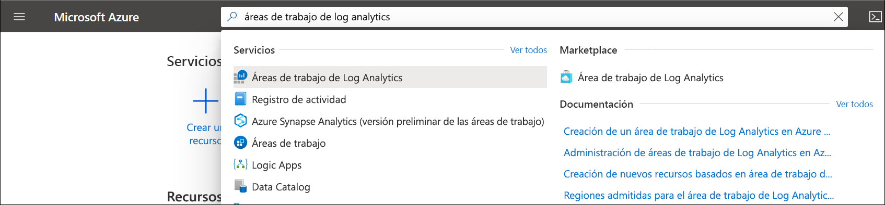
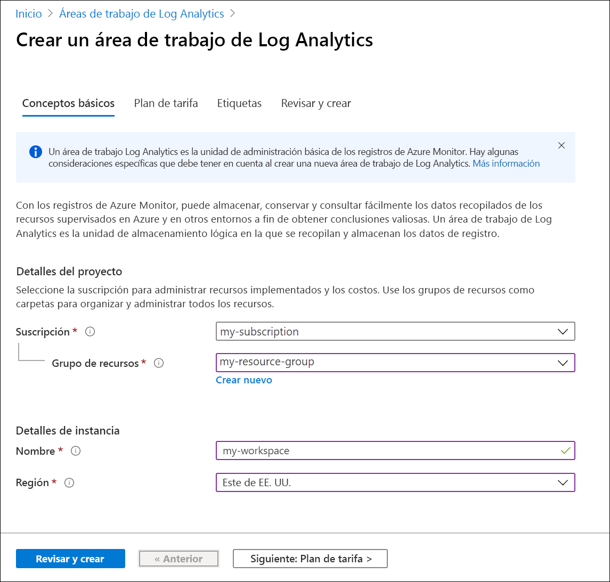
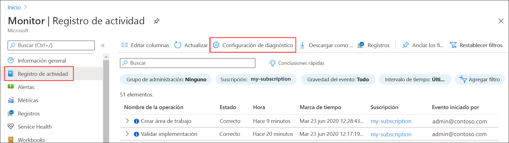
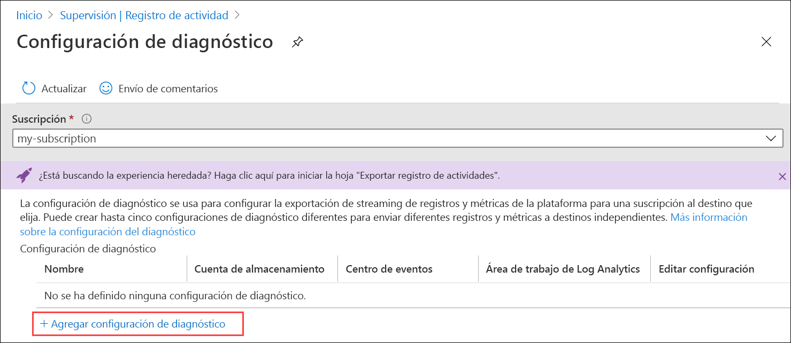

# Envío del registro de actividad de Azure al área de trabajo de Log Analytics mediante Azure Portal
El registro de actividad es un registro de la plataforma de Azure que proporciona información de los eventos en el nivel de suscripción. Este registro incluye información como, por ejemplo, cuándo se modificó un recurso o cuándo se inició una máquina virtual. Puede ver el registro de actividad en Azure Portal o recuperar entradas con PowerShell y la CLI. En este inicio rápido se muestra cómo usar Azure Portal para crear un área de trabajo de Log Analytics y una configuración de diagnóstico para enviar el registro de actividad a los registros de Azure Monitor donde podrá analizarlo mediante [consultas de registro](../log-query/log-query-overview.md) y habilitar otras características como [alertas de registro](../platform/alerts-log-query.md) y [libros](../platform/workbooks-overview.md). 

## Inicio de sesión en Azure Portal
Inicie sesión en Azure Portal en [https://portal.azure.com](https://portal.azure.com). 

## Creación de un área de trabajo de Log Analytics
En Azure Portal, busque y seleccione **Áreas de trabajo de Log Analytics**. 

  
Haga clic en **Agregar** y proporcione los valores de **Grupo de recursos**, **Nombre** del área de trabajo y **Ubicación**. El nombre del área de trabajo debe ser único en todas las suscripciones de Azure.

Haga clic en **Revisar y crear** para revisar la configuración y, a continuación, en **Crear** para crear el área de trabajo. Se seleccionará el plan de tarifa predeterminado **Pago por uso**, que no incurrirá en ningún cargo hasta que comience a recopilar una cantidad de datos suficiente. No se aplica ningún cargo por la recopilación del registro de actividad.

## Creación de la configuración de diagnóstico
En Azure Portal, busque y seleccione **Monitor**. 

Seleccione **Registro de actividad**. Verá los eventos recientes de la suscripción actual. Haga clic en **Configuración de diagnóstico** para ver la configuración de diagnóstico de la suscripción.

Haga clic en **Agregar configuración de diagnóstico** para crear una nueva configuración. 

Escriba un nombre, por ejemplo, *Enviar el registro de actividad al área de trabajo*. Seleccione cada una de las categorías. Seleccione **Enviar a Log Analytics** como único destino y, a continuación, especifique el área de trabajo que ha creado. Haga clic en **Guardar** para crear la configuración de diagnóstico y cierre la página.

## Generación de datos del registro
Solo se enviarán las nuevas entradas del registro de actividad al área de trabajo de Log Analytics, por lo que deberá realizar algunas acciones en la suscripción para que se registren, como iniciar o detener una máquina virtual, o crear o modificar otro recurso. Es posible que tenga que esperar unos minutos para que se cree la configuración de diagnóstico y los datos se escriban inicialmente en el área de trabajo. Después de este retraso, todos los eventos escritos en el registro de actividad se enviarán al área de trabajo en cuestión de segundos.

## Recuperación de datos con una consulta de registro

Seleccione **Registros** en el menú **Azure Monitor**. Cierre la página **Consultas de ejemplo**. Si el ámbito no está establecido en el área de trabajo que ha creado, haga clic en **Seleccionar ámbito** y búsquelo.

En la ventana de consulta, escriba `AzureActivity` y haga clic en **Ejecutar**. Se trata de una consulta simple que devuelve todos los registros de la tabla *AzureActivity*, que contiene todos los registros enviados desde el registro de actividad.

Expanda uno de los registros para ver sus propiedades detalladas.

Pruebe una consulta más compleja, como `AzureActivity | summarize count() by CategoryValue`, que proporcione un recuento de eventos resumidos por categoría.

## Pasos siguientes
En este inicio rápido, ha configurado el registro de actividad que se va a enviar a un área de trabajo de Log Analytics. Ahora puede configurar el resto de datos que se van a recopilar en el área de trabajo, donde podrá analizarlos juntos mediante [consultas de registro](../log-query/log-query-overview.md) de Azure Monitor y podrá aprovechar características como [alertas de registro](../platform/alerts-log-query.md) y [libros](../platform/workbooks-overview.md). A continuación, debe recopilar [registros de recursos](../platform/resource-logs.md) de los recursos de Azure que complementen los datos del registro de actividad lo cual proporcionará información sobre las operaciones que se realizaron en cada recurso.

> [!div class="nextstepaction"]
> [Recopilación y análisis de registros de recurso con Azure Monitor](tutorial-resource-logs.md)
