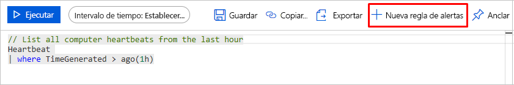
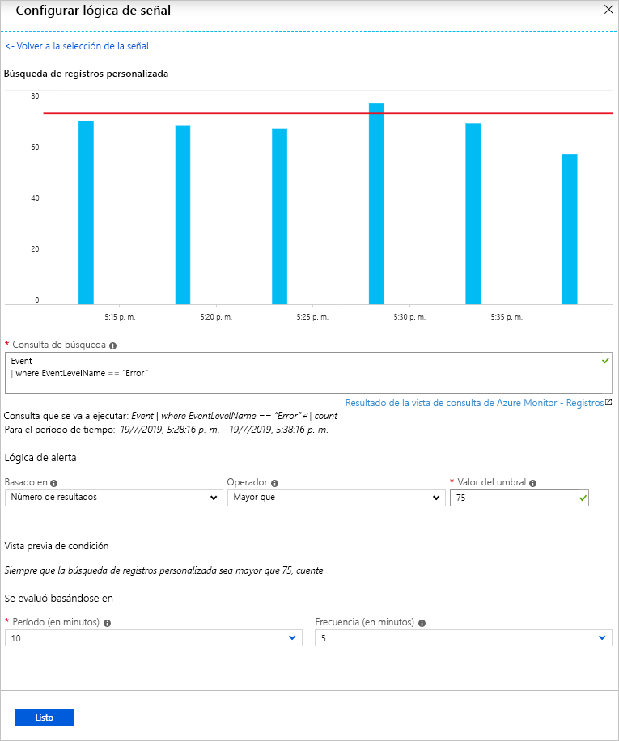
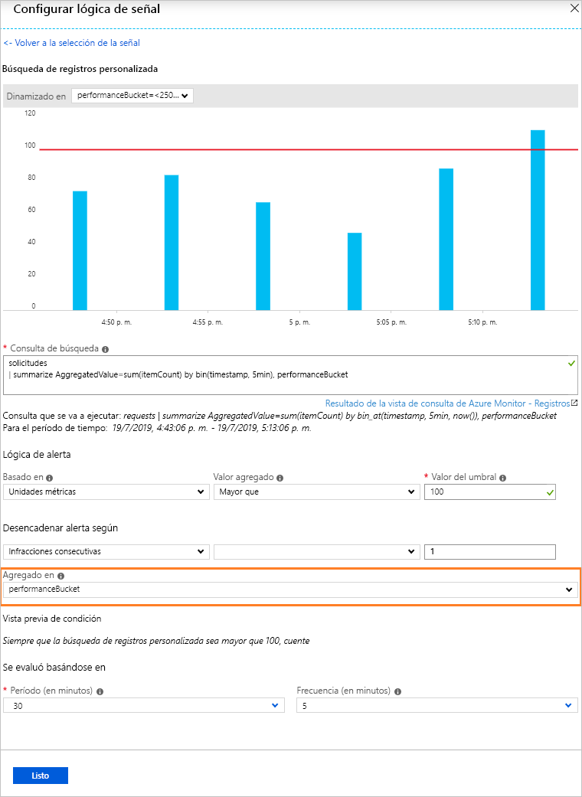
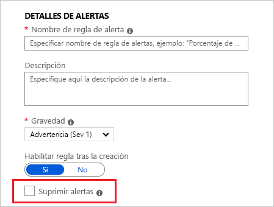
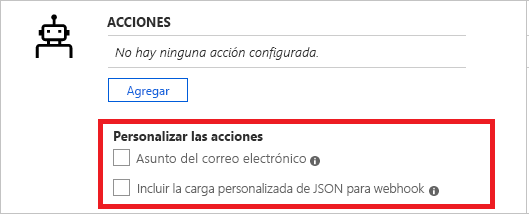
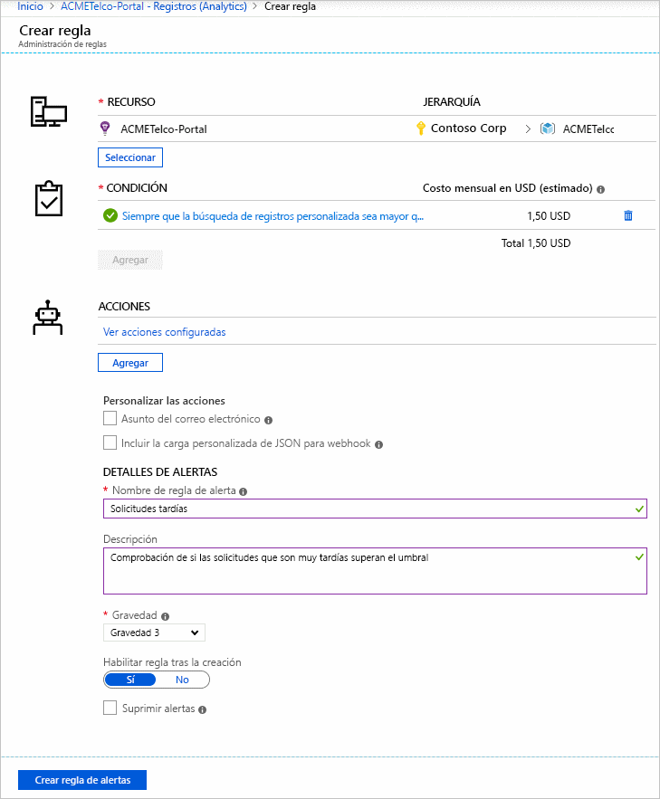
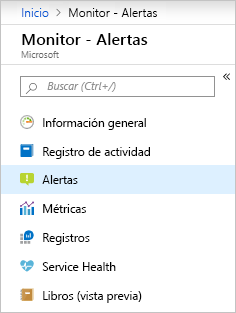
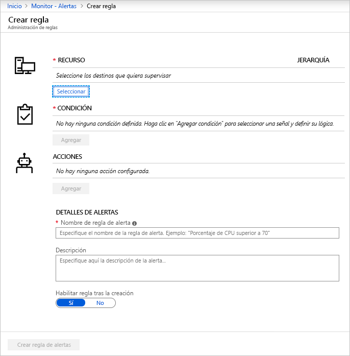
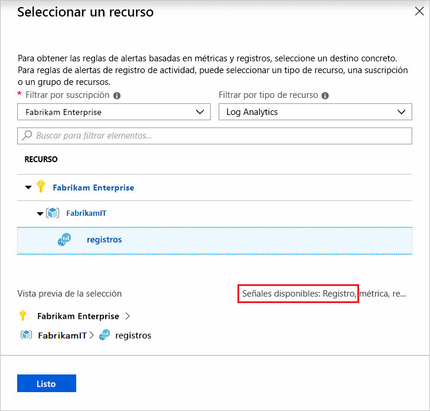
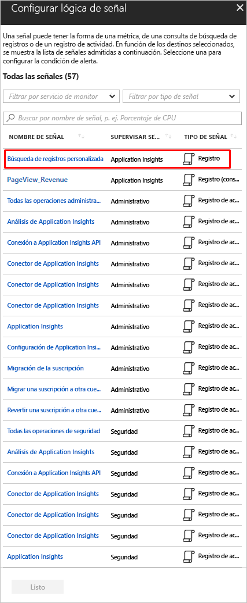

# <a name="create-view-and-manage-log-alerts-using-azure-monitor"></a>Creación, visualización y administración de alertas de registro mediante Azure Monitor

## <a name="overview"></a>Información general

Las alertas de registro permiten a los usuarios usar una consulta de [Log Analytics](../log-query/log-analytics-tutorial.md) para evaluar los registros de los recursos según una frecuencia establecida y activar una alerta en función de los resultados. Las reglas pueden desencadenar una o varias acciones mediante [grupos de acciones](./action-groups.md). [Obtenga más información sobre la funcionalidad y la terminología de las alertas de registro](alerts-unified-log.md).

En este artículo se muestra cómo crear y administrar alertas de registro con Azure Monitor. Las reglas de alertas se definen mediante tres componentes:
- Destino: un recurso de Azure específico que se va a supervisar.
- Criterios: lógica que se va a evaluar. Si se cumple, se activa la alerta.  
- Acción: notificaciones o automatización: correo electrónico, SMS, webhook, etc.

También puede crear reglas de alertas de registro mediante plantillas de Azure Resource Manager, que se describen en [otro artículo](alerts-log-create-templates.md).

> [!NOTE]
> Los datos de registro de un [área de trabajo de Log Analytics](../log-query/log-analytics-tutorial.md) se pueden enviar al almacén de métricas de Azure Monitor. Las alertas de métricas tienen [diferentes comportamientos](alerts-metric-overview.md), lo que puede ser más conveniente en función de los datos con los que esté trabajando. Para saber más sobre cómo se pueden enrutar los registros a las métricas, vea [Alerta de métricas para los registros](alerts-metric-logs.md).

## <a name="create-a-log-alert-rule-with-the-azure-portal"></a>Creación de una regla de alertas de registro en Azure Portal

A continuación se indican los pasos para empezar a escribir consultas para las alertas:

1. Vaya al recurso para el que le gustaría crear la alerta.
1. En **Supervisar**, seleccione **Registros**.
1. Consulte los datos de registro que pueden indicar el problema. Puede usar el [tema de ejemplos de consultas de alertas](../log-query/example-queries.md) para comprender qué puede detectar, o bien puede [empezar a escribir su propia consulta](../log-query/log-analytics-tutorial.md). Además, [aprenda a crear consultas de alertas optimizadas](alerts-log-query.md).
1. Presione el botón "+ Nueva regla de alertas" para iniciar el flujo de creación de alerta.

    

> [!NOTE]
> Se recomienda crear alertas a gran escala si se usa el modo de acceso a los recursos para los registros, que se ejecuta en varios recursos mediante un ámbito de grupo de recursos o de suscripción. Las alertas a gran escala reducen la sobrecarga de administración de las reglas. Para poder establecer como destino los recursos, incluya la columna de identificador de recurso en los resultados. [Obtenga más información sobre la división de alertas por dimensiones](alerts-unified-log.md#split-by-alert-dimensions).

### <a name="log-alert-for-log-analytics-and-application-insights"></a>Alerta de registro para Log Analytics y Application Insights

1. Si la sintaxis de la consulta es correcta, los datos históricos de la consulta aparecen como un gráfico, con la opción para cambiar el período del gráfico de las últimas seis horas a la última semana.
 
    Si los resultados de la consulta contienen datos resumidos o columnas específicas del [proyecto](/azure/kusto/query/projectoperator) sin una columna de tiempo, el gráfico muestra un valor único.

    

1. Elija el intervalo de tiempo durante el que se va a evaluar la condición especificada, mediante la opción [**Período**](alerts-unified-log.md#query-time-range).

1. Las alertas de registro pueden basarse en dos tipos de [**medidas**](alerts-unified-log.md#measure):
    1. **Número de resultados** - número de registros devueltos por la consulta.
    1. **Unidades métricas** - *valor agregado* que se calcula mediante expresiones de agrupación de resumen elegidas y la selección de [bin()](/azure/kusto/query/binfunction). Por ejemplo:

    ```Kusto
    // Reported errors
    union Event, Syslog // Event table stores Windows event records, Syslog stores Linux records
    | where EventLevelName == "Error" // EventLevelName is used in the Event (Windows) records
    or SeverityLevel== "err" // SeverityLevel is used in Syslog (Linux) records
    | summarize AggregatedValue = count() by Computer, bin(TimeGenerated, 15m)
    ```

1. En la lógica de alerta de unidades métricas, puede especificar cómo [dividir las alertas por dimensiones](alerts-unified-log.md#split-by-alert-dimensions) mediante la opción **Agregado en**. La expresión de agrupación de filas debe ser única y estar ordenada.

    > [!NOTE]
    > Como [bin()](/azure/kusto/query/binfunction) puede generar intervalos de tiempo distintos, el servicio de alerta convertirá automáticamente la función [bin()](/azure/kusto/query/binfunction) en la función [bin_at()](/azure/kusto/query/binatfunction) con el valor adecuado en tiempo de ejecución para garantizar resultados con un punto fijo.

    > [!NOTE]
    > La división por dimensiones de alerta solo está disponible en la versión scheduledQueryRules API actual. Si usa la versión [Alert API de Log Analytics heredada](api-alerts.md), tendrá que cambiar a la nueva. [Más información sobre cómo cambiar](./alerts-log-api-switch.md). Las alertas orientadas a recursos a gran escala solo se admiten en la versión `2020-05-01-preview` y versiones posteriores de la API.

    

1. A continuación, basándose en los datos de la vista previa, establezca los valores de [**Operador**, **Valor de umbral**](alerts-unified-log.md#threshold-and-operator) y [**Frecuencia**](alerts-unified-log.md#frequency).

1. Si lo desea, puede establecer un valor en [Número de infracciones que desencadenarán la alerta](alerts-unified-log.md#number-of-violations-to-trigger-alert) mediante **Infracciones totales o consecutivas**.

1. Seleccione **Listo**. 

1. Defina los valores de **Nombre de la regla de alertas** y **Descripción**, y seleccione el valor de **Gravedad** de la alerta. Estos detalles se usan en todas las acciones de alerta. Además, puede elegir activar la regla de alertas al crearla si selecciona **Habilitar regla tras la creación**.

1. Elija si desea suprimir las acciones de la regla durante un tiempo después de que se active una alerta con la opción [**Desactivar alertas**](alerts-unified-log.md#state-and-resolving-alerts). La regla seguirá ejecutándose y creará alertas, pero no se desencadenarán las acciones para evitar ruido. El valor de silenciar acciones debe ser mayor que la frecuencia de la alerta para que resulte efectivo.

    

1. Especifique si la regla de alertas debe desencadenar uno o varios [**grupos de acciones**](action-groups.md#webhook) cuando se cumpla la condición de alerta.

    > [!NOTE]
    > Para conocer los límites de las acciones que se pueden realizar, vea [Límites de servicio de suscripción de Azure](../../azure-resource-manager/management/azure-subscription-service-limits.md).  

1. Si lo desea, puede personalizar las acciones de las reglas de alertas de registro:

    - **Asunto del correo electrónico personalizado**: invalida el *asunto del correo electrónico* de las acciones de correo electrónico. No se puede modificar el cuerpo del mensaje de correo y este campo **no es para la dirección de correo electrónico**.
    - **Incluir carga de JSON personalizada**: invalida el JSON de webhook que usan los grupos de acciones, suponiendo que el grupo de acciones contenga una acción de webhook. Obtenga más información sobre las [acciones del webhook para las alertas de registro](./alerts-log-webhook.md).

    

1. Si todos los campos están correctamente configurados, se puede hacer clic en el botón **Crear regla de alertas** y se crea una alerta.

    En cuestión de minutos, se activa la alerta y se desencadena tal como se describió anteriormente.

    

#### <a name="creating-log-alert-for-log-analytics-and-application-insights-from-the-alerts-management"></a>Creación de una alerta de registro para Log Analytics y Application Insights desde la administración de alertas

> [!NOTE]
> Actualmente no se admite la creación desde la administración de alertas para los registros orientados a recursos.

1. En el [portal](https://portal.azure.com/), seleccione **Monitor** y, a continuación, **Alertas**.

    

1. Seleccione **Nueva regla de alertas**. 

    

1. Aparece el panel **Crear alerta**. Tiene cuatro partes: 
    - el recurso al que se aplica la alerta,
    - la condición que se va a comprobar,
    - la acción que se realizará si la condición es verdadera,
    - los detalles para asignar un nombre y una descripción de la alerta. 

    

1. Presione el botón **Seleccionar recurso**. Para filtrar, elija los valores de *Suscripción* y *Tipo de recurso*, y seleccione un recurso. Asegúrese de que el recurso tiene registros disponibles.

   

1. Después, use el botón de agregar **Condición** para ver la lista de opciones de señal disponibles para el recurso. Seleccione la opción **Custom log search** (Búsqueda de registros personalizada).

   

   > [!NOTE]
   > En el portal de alertas se enumeran las consultas guardadas desde Log Analytics y Application Insights, que se pueden usar como consultas de alertas de plantilla.

1. Una vez seleccionada la consulta de alerta, escríbala, péguela o edítela en el campo **Consulta de búsqueda**.

1. Continúe con los siguientes pasos descritos en la [última sección](#log-alert-for-log-analytics-and-application-insights).

### <a name="log-alert-for-all-other-resource-types"></a>Alerta de registro para los demás tipos de recursos

> [!NOTE]
> Actualmente no hay cargos adicionales por la versión `2020-05-01-preview` de la API y las alertas de registro orientadas a los recursos.  Los precios de las características en versión preliminar se anunciarán en el futuro y se avisará antes del inicio de la facturación. Si decide seguir usando la nueva versión de la API y las alertas de registro orientadas a los recursos después del período de aviso, se le facturará según la tarifa aplicable.

1. Comience en la pestaña **Condición**:

    1. Compruebe que los valores de [**Medida**](alerts-unified-log.md#measure), [**Tipo de agregación**](alerts-unified-log.md#aggregation-type) y [**Granularidad de agregación**](alerts-unified-log.md#aggregation-granularity) son correctos. 
        1. De forma predeterminada, la regla cuenta el número de resultados de los últimos cinco minutos.
        1. Si se detectan resultados de consulta resumidos, la regla se actualizará automáticamente en unos segundos para capturarlos.

    1. Elija la [división de alertas por dimensiones](alerts-unified-log.md#split-by-alert-dimensions), si es necesario: 
       - En **Resource ID column** (Columna de id. de recurso) se selecciona automáticamente la columna, si se detecta, y se cambia el contexto de la alerta activada al recurso del registro. 
       - Se puede anular la selección de **Resource ID column** (Columna de id. de recurso) para activar alertas en grupos de recursos o suscripciones. La anulación de la selección resulta útil cuando los resultados se basan en consultas entre recursos; por ejemplo, una consulta que comprueba si en el 80 % de las máquinas virtuales del grupo de recursos se está dando un uso intensivo de la CPU.
       - También se pueden seleccionar hasta seis divisiones adicionales para cualquier tipo de columna de número o de texto mediante la tabla de dimensiones.
       - Las alertas se activan por separado en función de la división que se basa en combinaciones únicas; la carga útil de alertas incluye esta información.
    
        

    1. En el gráfico de **Vista previa** se muestran los resultados de las evaluaciones de consulta a lo largo del tiempo. Puede cambiar el período del gráfico o seleccionar series temporales diferentes resultado de la división de alertas únicas por dimensiones.

        

    1. A continuación, basándose en los datos de la vista previa, establezca los valores de **Lógica de alerta**: [**Operador**, **Valor de umbral**](alerts-unified-log.md#threshold-and-operator) y [**Frecuencia**](alerts-unified-log.md#frequency).

        

    1. Si lo desea, puede establecer un valor en [**Número de infracciones que desencadenarán la alerta**](alerts-unified-log.md#number-of-violations-to-trigger-alert), en la sección **Opciones avanzadas**.
    
        

1. En la pestaña **Acciones**, seleccione o cree los [grupos de acciones](action-groups.md) necesarios.

    

1. En la pestaña **Detalles**, defina los valores de **Detalles de la regla de alertas** y **Detalles del proyecto**. Si lo desea, puede activar o desactivar las opciones **Start running now** (Empezar a ejecutar ahora) o [**Silenciar acciones**](alerts-unified-log.md#state-and-resolving-alerts) y definir el período durante el que se silenciarán las acciones después de que se active la regla de alertas.

    > [!NOTE]
    > Las reglas de alertas de registro actualmente no tienen estado y activan una acción cada vez que se crea una alerta, a menos que se hayan silenciado.

    

1. En la pestaña **Etiquetas**, configure las etiquetas necesarias en el recurso de la regla de alertas.

    

1. En la pestaña **Revisar y crear**, se ejecutará una validación y se informará de cualquier problema. Revise y apruebe la definición de la regla.
1. Si todos los campos son correctos, seleccione el botón **Crear** y complete la creación de la regla de alertas. Todas las alertas pueden verse en la administración de alertas.
 
    

## <a name="view--manage-log-alerts-in-azure-portal"></a>Visualización y administración de las alertas de registro en Azure Portal

1. En el [portal](https://portal.azure.com/), seleccione el recurso pertinente o el servicio **Monitor**. Seleccione **Alertas** en la sección Supervisión.

1. La administración de alertas muestra todas las alertas que se han activado. [Obtenga más información sobre la administración de alertas](alerts-managing-alert-instances.md).

    > [!NOTE]
    > Actualmente, las reglas de alertas de registro [no tienen estado y no se resuelven](alerts-unified-log.md#state-and-resolving-alerts).

1. Seleccione el botón **Administrar reglas de alertas** en la barra superior para editar reglas:

    

## <a name="managing-log-alerts-using-powershell"></a>Administración de alertas de registro con PowerShell

[!INCLUDE [updated-for-az](../../../includes/updated-for-az.md)]

> [!NOTE]
> Actualmente no se admite PowerShell en la versión `2020-05-01-preview` de la API.

Los cmdlets de PowerShell que se enumeran a continuación están disponibles para administrar reglas con la [API Reglas de consulta programadas](/rest/api/monitor/scheduledqueryrules/).

- [New-AzScheduledQueryRule](/powershell/module/az.monitor/new-azscheduledqueryrule): cmdlet de PowerShell para crear una nueva regla de alerta de registro.
- [Set-AzScheduledQueryRule](/powershell/module/az.monitor/set-azscheduledqueryrule): cmdlet de PowerShell para actualizar una regla de alerta de registro.
- [New-AzScheduledQueryRuleSource](/powershell/module/az.monitor/new-azscheduledqueryrulesource): cmdlet de PowerShell para crear o actualizar el objeto que especifica los parámetros de origen para una alerta de registro. Se usa como entrada en los cmdlets [New-AzScheduledQueryRule](/powershell/module/az.monitor/new-azscheduledqueryrule) y [Set-AzScheduledQueryRule](/powershell/module/az.monitor/set-azscheduledqueryrule).
- [New-AzScheduledQueryRuleSchedule](/powershell/module/az.monitor/new-azscheduledqueryruleschedule): cmdlet de PowerShell para crear o actualizar el objeto que especifica los parámetros de programación para una alerta de registro. Se usa como entrada en los cmdlets [New-AzScheduledQueryRule](/powershell/module/az.monitor/new-azscheduledqueryrule) y [Set-AzScheduledQueryRule](/powershell/module/az.monitor/set-azscheduledqueryrule).
- [New-AzScheduledQueryRuleAlertingAction](/powershell/module/az.monitor/new-azscheduledqueryrulealertingaction): cmdlet de PowerShell para crear o actualizar el objeto que especifica los parámetros de acción para una alerta de registro. Se usa como entrada en los cmdlets [New-AzScheduledQueryRule](/powershell/module/az.monitor/new-azscheduledqueryrule) y [Set-AzScheduledQueryRule](/powershell/module/az.monitor/set-azscheduledqueryrule).
- [New-AzScheduledQueryRuleAznsActionGroup](/powershell/module/az.monitor/new-azscheduledqueryruleaznsactiongroup): cmdlet de PowerShell para crear o actualizar el objeto que especifica los parámetros de grupos para una alerta de registro. Se usa como entrada en el cmdlet [New-AzScheduledQueryRuleAlertingAction](/powershell/module/az.monitor/new-azscheduledqueryrulealertingaction).
- [New-AzScheduledQueryRuleTriggerCondition](/powershell/module/az.monitor/new-azscheduledqueryruletriggercondition): cmdlet de PowerShell para crear o actualizar el objeto que especifica los parámetros de condición de desencadenador para una alerta de registro. Se usa como entrada en el cmdlet [New-AzScheduledQueryRuleAlertingAction](/powershell/module/az.monitor/new-azscheduledqueryrulealertingaction).
- [New-AzScheduledQueryRuleLogMetricTrigger](/powershell/module/az.monitor/new-azscheduledqueryrulelogmetrictrigger): cmdlet de PowerShell para crear o actualizar el objeto que especifica los parámetros de condición de desencadenador para una [alerta de registro de tipo de medida de métrica](./alerts-unified-log.md#calculation-of-measure-based-on-a-numeric-column-such-as-cpu-counter-value). Se usa como entrada en el cmdlet [New-AzScheduledQueryRuleTriggerCondition](/powershell/module/az.monitor/new-azscheduledqueryruletriggercondition).
- [Get-AzScheduledQueryRule](/powershell/module/az.monitor/get-azscheduledqueryrule): cmdlet de PowerShell para enumerar las reglas de alerta de registro o una regla de alerta de registro específica
- [Update-AzScheduledQueryRule](/powershell/module/az.monitor/update-azscheduledqueryrule): cmdlet de PowerShell para habilitar o deshabilitar la regla de alerta de registro
- [Remove-AzScheduledQueryRule](/powershell/module/az.monitor/remove-azscheduledqueryrule): cmdlet de PowerShell para eliminar una regla de alerta de registro

> [!NOTE]
> Los cmdlets de PowerShell de ScheduledQueryRules solo pueden administrar las reglas creadas en la [API Reglas de consulta programadas](/rest/api/monitor/scheduledqueryrules/) actual. Las reglas de alertas de registro creadas con [Alert API de Log Analytics](api-alerts.md) heredada solo se pueden administrar con PowerShell después de [cambiar a la API Reglas de consulta programadas](alerts-log-api-switch.md).

Estos son los pasos de ejemplo para crear una regla de alertas de registro mediante PowerShell:

```powershell
$source = New-AzScheduledQueryRuleSource -Query 'Heartbeat | summarize AggregatedValue = count() by bin(TimeGenerated, 5m), _ResourceId' -DataSourceId "/subscriptions/a123d7efg-123c-1234-5678-a12bc3defgh4/resourceGroups/contosoRG/providers/microsoft.OperationalInsights/workspaces/servicews"

$schedule = New-AzScheduledQueryRuleSchedule -FrequencyInMinutes 15 -TimeWindowInMinutes 30

$metricTrigger = New-AzScheduledQueryRuleLogMetricTrigger -ThresholdOperator "GreaterThan" -Threshold 2 -MetricTriggerType "Consecutive" -MetricColumn "_ResourceId"

$triggerCondition = New-AzScheduledQueryRuleTriggerCondition -ThresholdOperator "LessThan" -Threshold 5 -MetricTrigger $metricTrigger

$aznsActionGroup = New-AzScheduledQueryRuleAznsActionGroup -ActionGroup "/subscriptions/a123d7efg-123c-1234-5678-a12bc3defgh4/resourceGroups/contosoRG/providers/microsoft.insights/actiongroups/sampleAG" -EmailSubject "Custom email subject" -CustomWebhookPayload "{ `"alert`":`"#alertrulename`", `"IncludeSearchResults`":true }"

$alertingAction = New-AzScheduledQueryRuleAlertingAction -AznsAction $aznsActionGroup -Severity "3" -Trigger $triggerCondition

New-AzScheduledQueryRule -ResourceGroupName "contosoRG" -Location "Region Name for your Application Insights App or Log Analytics Workspace" -Action $alertingAction -Enabled $true -Description "Alert description" -Schedule $schedule -Source $source -Name "Alert Name"
```

También puede crear la alerta de registro con una [plantilla y archivos de parámetros](./alerts-log-create-templates.md) mediante PowerShell:

```powershell
Connect-AzAccount

Select-AzSubscription -SubscriptionName <yourSubscriptionName>

New-AzResourceGroupDeployment -Name AlertDeployment -ResourceGroupName ResourceGroupofTargetResource `
  -TemplateFile mylogalerttemplate.json -TemplateParameterFile mylogalerttemplate.parameters.json
```

## <a name="managing-log-alerts-using-cli"></a>Administración de alertas de registro con la CLI

> [!NOTE]
> La compatibilidad con la CLI de Azure solo está disponible para la versión `2020-05-01-preview` y versiones posteriores de scheduledQueryRules API. La versión anterior de la API puede usar la CLI de Azure Resource Manager con plantillas, como se describe a continuación. Si usa la versión [Alert API de Log Analytics](api-alerts.md) heredada, deberá cambiar a usar la CLI. [Más información sobre cómo cambiar](./alerts-log-api-switch.md).

En las secciones anteriores se describía cómo crear, ver y administrar las reglas de alertas de registro mediante Azure Portal. En esta sección se describe cómo hacer lo mismo con la multiplataforma [CLI de Azure](/cli/azure/get-started-with-azure-cli). La forma más rápida de comenzar a utilizar la CLI de Azure es a través de [Azure Cloud Shell](../../cloud-shell/overview.md). En este artículo, usaremos Cloud Shell.

1. En Azure Portal, seleccione **Cloud Shell**.

1. En el símbolo del sistema, puede usar los comandos con la opción ``--help`` para obtener más información sobre el comando y cómo usarlo. Por ejemplo, el comando siguiente muestra la lista de comandos disponibles para crear, ver y administrar alertas de registro:

    ```azurecli
    az monitor scheduled-query --help
    ```

1. Puede crear una regla de alertas de registro que supervise el número de errores de eventos del sistema:

    ```azurecli
    az monitor scheduled-query create -g {ResourceGroup} -n {nameofthealert} --scopes {vm_id} --condition "count \'union Event, Syslog | where TimeGenerated > ago(1h) | where EventLevelName == \"Error\" or SeverityLevel== \"err\"\' > 2" --description {descriptionofthealert}
    ```

1. Puede ver todas las alertas de registro de un grupo de recursos con el siguiente comando:

    ```azurecli
    az monitor scheduled-query list -g {ResourceGroup}
    ```

1. Puede ver los detalles de una regla de alertas de registro determinada usando el nombre o el identificador del recurso de la regla:

    ```azurecli
    az monitor scheduled-query show -g {ResourceGroup} -n {AlertRuleName}
    ```

    ```azurecli
    az monitor scheduled-query show --ids {RuleResourceId}
    ```

1. Puede deshabilitar una regla de alertas de registro con el comando siguiente:

    ```azurecli
    az monitor scheduled-query update -g {ResourceGroup} -n {AlertRuleName} --enabled false
    ```

1. Puede eliminar una regla de alertas de registro con el comando siguiente:

    ```azurecli
    az monitor scheduled-query delete -g {ResourceGroup} -n {AlertRuleName}
    ```

También puede usar la CLI de Azure Resource Manager con archivos de [plantillas](./alerts-log-create-templates.md):

```azurecli
az login

az group deployment create \
    --name AlertDeployment \
    --resource-group ResourceGroupofTargetResource \
    --template-file mylogalerttemplate.json \
    --parameters @mylogalerttemplate.parameters.json
```

Si se crea correctamente, se devuelve 201. Si se actualiza correctamente, se devuelve 200.

## <a name="next-steps"></a>Pasos siguientes

* Obtenga información sobre las [alertas de registro](./alerts-unified-log.md).
* Cree alertas de registro con [plantillas de Azure Resource Manager](./alerts-log-create-templates.md).
* Conozca las [acciones de webhook para alertas de registro](./alerts-log-webhook.md).
* Obtenga más información sobre las [consultas de registro](../log-query/log-query-overview.md).