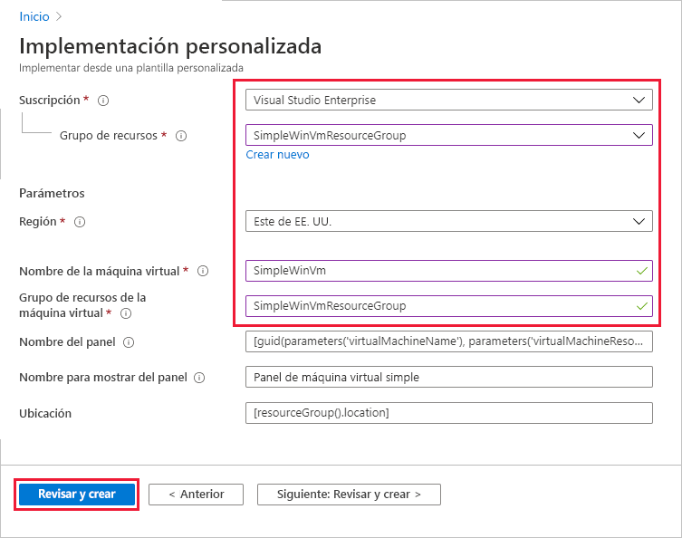
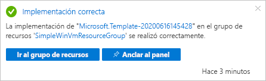
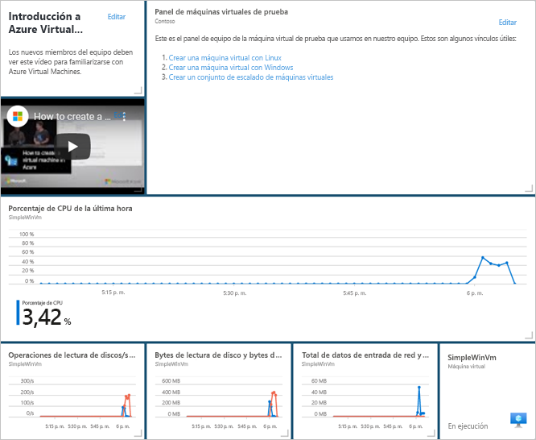
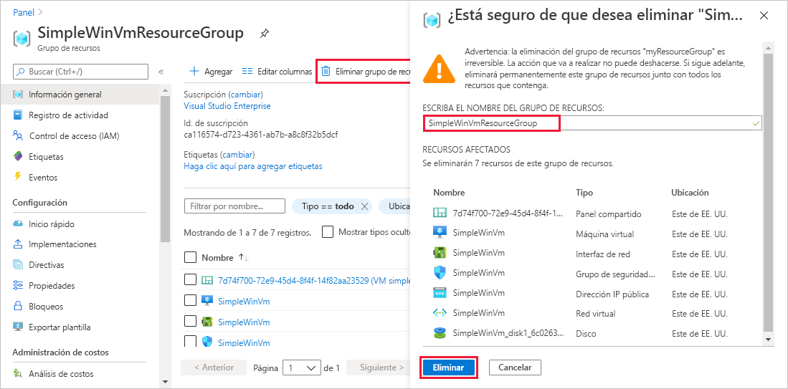

# <a name="quickstart-create-a-dashboard-in-the-azure-portal-by-using-an-arm-template"></a>Inicio rápido: Creación de un panel en el Azure Portal mediante una plantilla de ARM

En Azure Portal, un panel es una vista organizada de los recursos en la nube. Este inicio rápido se centra en el proceso de implementación de una plantilla de Azure Resource Manager para crear un panel. El panel muestra el rendimiento de una máquina virtual y algunos vínculos e información estática.

[!INCLUDE [About Azure Resource Manager](../../includes/resource-manager-quickstart-introduction.md)]

Si su entorno cumple los requisitos previos y está familiarizado con el uso de plantillas de Resource Manager, seleccione el botón **Implementar en Azure**. La plantilla se abrirá en Azure Portal.

[](https://portal.azure.com/#create/Microsoft.Template/uri/https%3A%2F%2Fraw.githubusercontent.com%2FAzure%2Fazure-quickstart-templates%2Fmaster%2F101-azure-portal-dashboard%2Fazuredeploy.json)

## <a name="prerequisites"></a>Requisitos previos

- Si no tiene una suscripción a Azure, cree una [cuenta gratuita](https://azure.microsoft.com/free/?WT.mc_id=A261C142F) antes de empezar.
- Una máquina virtual existente.

## <a name="create-a-virtual-machine"></a>Creación de una máquina virtual

El panel que se crea en la siguiente parte de este inicio rápido requiere que haya una máquina virtual. Cree una máquina virtual siguiendo estos pasos.

1. En Azure Portal, seleccione Cloud Shell.

    

1. Copie el comando siguiente y escríbalo en el símbolo del sistema para crear un grupo de recursos.

    ```powershell
    New-AzResourceGroup -Name SimpleWinVmResourceGroup -Location EastUS
    ```

    

1. Copie el comando siguiente y escríbalo en el símbolo del sistema para crear una máquina virtual en el grupo de recursos.

    ```powershell
    New-AzVm `
        -ResourceGroupName "SimpleWinVmResourceGroup" `
        -Name "SimpleWinVm" `
        -Location "East US" 
    ```

1. Escriba un nombre de usuario y una contraseña para la máquina virtual. Se trata de un nombre de usuario y una contraseña nuevos; no es, por ejemplo, la cuenta que usa para iniciar sesión en Azure. Para más información, consulte los [requisitos de nombre de usuario](../virtual-machines/windows/faq.md#what-are-the-username-requirements-when-creating-a-vm) y los [requisitos de contraseña](../virtual-machines/windows/faq.md#what-are-the-password-requirements-when-creating-a-vm).

    Ahora se inicia la implementación de la máquina virtual y normalmente tarda unos minutos en completarse. Una vez finalizada la implementación, pase a la sección siguiente.

## <a name="review-the-template"></a>Revisión de la plantilla

La plantilla usada en este inicio rápido forma parte de las [plantillas de inicio rápido de Azure](https://azure.microsoft.com/resources/templates/101-azure-portal-dashboard/). La plantilla de este artículo es demasiado larga para mostrarse aquí. Para ver la plantilla, consulte [azuredeploy.json](https://raw.githubusercontent.com/Azure/azure-quickstart-templates/master/101-azure-portal-dashboard/azuredeploy.json). En la plantilla se define un recurso de Azure, [Microsoft.portal/dashboards](/azure/templates/microsoft.portal/dashboards). Cree un panel en Azure Portal.

## <a name="deploy-the-template"></a>Implementación de la plantilla

1. Seleccione la imagen siguiente para iniciar sesión en Azure y abrir una plantilla.

    [](https://portal.azure.com/#create/Microsoft.Template/uri/https%3A%2F%2Fraw.githubusercontent.com%2FAzure%2Fazure-quickstart-templates%2Fmaster%2F101-azure-portal-dashboard%2Fazuredeploy.json)

1. Seleccione o escriba los siguientes valores y, a continuación, seleccione **Revisar y crear**.

    

    A menos que se especifique otra cosa, use los valores predeterminados para crear el panel.

    * **Suscripción**: seleccione una suscripción de Azure.
    * **Grupo de recursos**: seleccione **SimpleWinVmResourceGroup**.
    * **Ubicación**: seleccione **Este de EE. UU**.
    * **Nombre de máquina virtual**: escriba **SimpleWinVm**.
    * **Grupo de recursos de máquina virtual**: escriba **SimpleWinVmResourceGroup**.

1. Seleccione **Crear** o **Comprar**. Una vez implementado correctamente el panel, recibirá una notificación:

    

Se ha usado Azure Portal para implementar la plantilla. Además de Azure Portal, también puede usar Azure PowerShell, CLI de Azure y API REST. Para obtener información sobre otros métodos de implementación, consulte [Implementación de plantillas](../azure-resource-manager/templates/deploy-powershell.md).

## <a name="review-deployed-resources"></a>Revisión de los recursos implementados

Compruebe que el panel se ha creado correctamente y que puede ver los datos de la máquina virtual.

1. En Azure Portal, seleccione **Panel**.

    

1. En la página del panel, seleccione **Simple VM Dashboard**.

    

1. Revise el panel en el que se creó la plantilla de ARM. Puede ver que parte del contenido es estático, pero también hay gráficos que muestran el rendimiento de la máquina virtual que creó al principio.

    

## <a name="clean-up-resources"></a>Limpieza de recursos

Si desea quitar la máquina virtual y el panel asociado, elimine el grupo de recursos que los contiene.

1. En el Azure Portal, busque **SimpleWinVmResourceGroup** y selecciónelo en los resultados de la búsqueda.

1. En la página **SimpleWinVmResourceGroup**, seleccione **Eliminar grupo de recursos**, escriba el nombre del grupo de recursos para confirmar y, a continuación, seleccione **Eliminar**.

    

## <a name="next-steps"></a>Pasos siguientes

Para más información acerca de los paneles en Azure Portal, consulte:

> [!div class="nextstepaction"]
> [Creación y uso compartido de paneles en Azure Portal](azure-portal-dashboards.md)