# <a name="quickstart-create-azure-resource-manager-templates-with-visual-studio-code"></a>Inicio rápido: Creación de plantillas de Azure Resource Manager con Visual Studio Code

Las herramientas de Azure Resource Manager para Visual Studio Code proporcionan compatibilidad con lenguajes, fragmentos de código de los recursos y la finalización automática de los recursos. Además, ayudan a crear y validar plantillas de Azure Resource Manager. En este inicio rápido, usará la extensión para crear una plantilla de Azure Resource Manager desde cero. Al hacerlo, utilizará las funcionalidades de las extensiones, como los fragmentos de código de las plantillas de Resource Manager, la validación, las finalizaciones y la compatibilidad con archivos de parámetros.

Para completar este inicio rápido, necesita [Visual Studio Code](https://code.visualstudio.com/) con la [extensión de herramientas de Azure Resource Manager](https://marketplace.visualstudio.com/items?itemName=msazurermtools.azurerm-vscode-tools) instalada. También necesita la [CLI de Azure](https://docs.microsoft.com/cli/azure/?view=azure-cli-latest) o el [módulo de Azure PowerShell](https://docs.microsoft.com/powershell/azure/new-azureps-module-az?view=azps-3.7.0) instalados y autenticados.

Si no tiene una suscripción a Azure, cree una [cuenta gratuita](https://azure.microsoft.com/free/) antes de empezar.

## <a name="create-an-arm-template"></a>Creación de una plantilla de Resource Manager

Cree y abra con Visual Studio Code un archivo llamado *azuredeploy.json*. Escriba `arm` en el editor de código, lo cual inicia fragmentos de código de Azure Resource Manager para aplicar la técnica scaffolding a una plantilla de Resource Manager.

Seleccione `arm!` para crear una plantilla limitada a la implementación de un grupo de recursos de Azure.

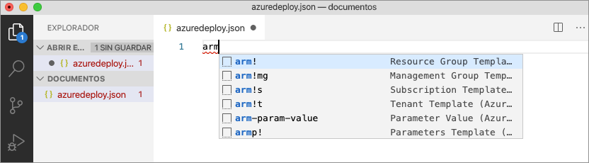

Este fragmento de código crea los bloques de creación básicos para una plantilla de Resource Manager.

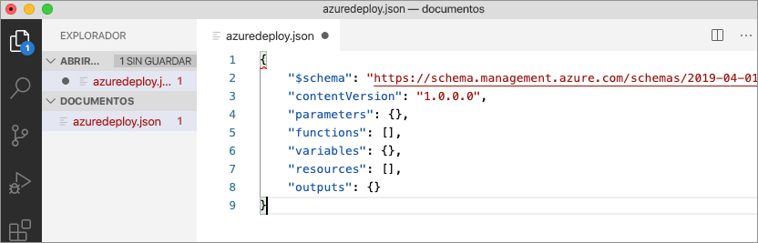

Tenga en cuenta que el modo de lenguaje de Visual Studio Code ha cambiado de *JSON* a la *plantilla de Azure Resource Manager*. La extensión incluye un servidor de lenguaje específico para plantillas de Resource Manager que proporciona una validación específica para estas plantillas, finalización y otros servicios de lenguaje.


## <a name="add-an-azure-resource"></a>Incorporación de un recurso de Azure

La extensión incluye fragmentos de código para muchos recursos de Azure. Estos fragmentos se pueden usar para agregar fácilmente recursos a la implementación de la plantilla.

Coloque el cursor en el bloque **resources** de la plantilla, escriba `storage` y seleccione el fragmento de código *arm-storage*.

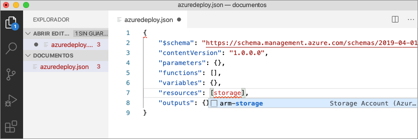

Esta acción agrega un recurso de almacenamiento a la plantilla.

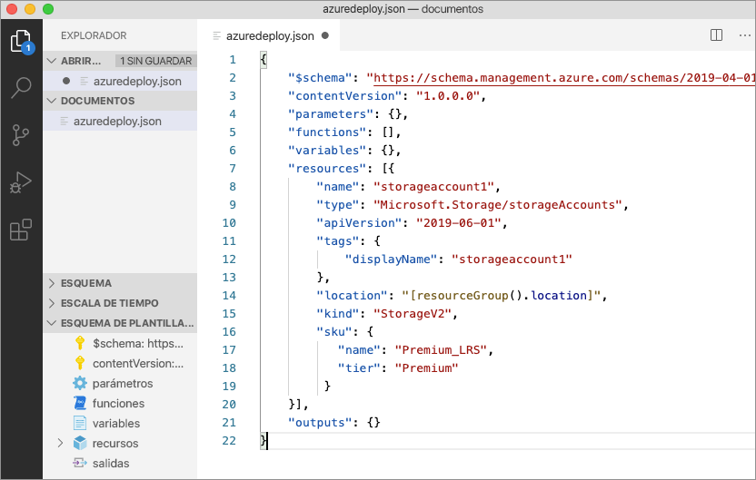

La tecla **TAB** se puede usar para recorrer las distintas propiedades configurables de la cuenta de almacenamiento.

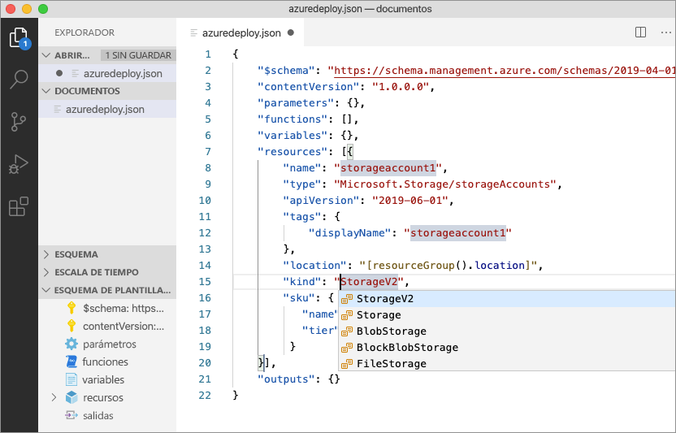

## <a name="completion-and-validation"></a>Finalización y validación

Una de las funcionalidades más eficaces de la extensión es su integración con los esquemas de Azure. Estos esquemas proporcionan a la extensión funcionalidades de validación y finalización de recursos. Vamos a modificar la cuenta de almacenamiento para ver tanto la validación como la finalización en acción. 

En primer lugar, actualice el tipo de cuenta de almacenamiento a un valor no válido, como `megaStorage`. Tenga en cuenta que esta acción genera una advertencia que indica que `megaStorage` no es un valor válido.

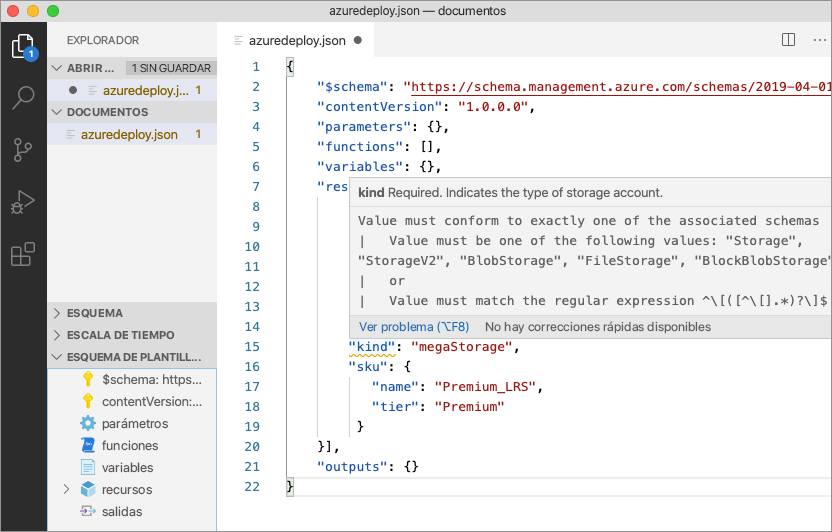

Para usar las funcionalidades de finalización, quite `megaStorage`, coloque el cursor dentro de las comillas dobles y presione `ctrl` + `space`. Esta acción presenta una lista de finalización de valores válidos.

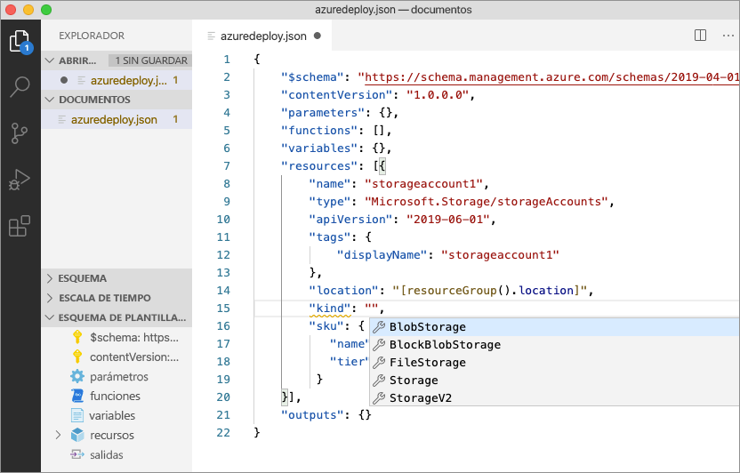

## <a name="add-template-parameters"></a>Incorporación de parámetros de plantilla

Ahora cree y use un parámetro para especificar el nombre de la cuenta de almacenamiento.

Coloque el cursor en el bloque de parámetros, agregue un retorno de carro, escriba `par` y seleccione el fragmento de código `arm-param-value`. Esta acción agrega un parámetro genérico a la plantilla.

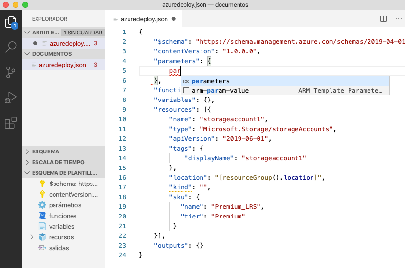

Actualice el nombre del parámetro a `storageAccountName` y la descripción a `Storage Account Name`.

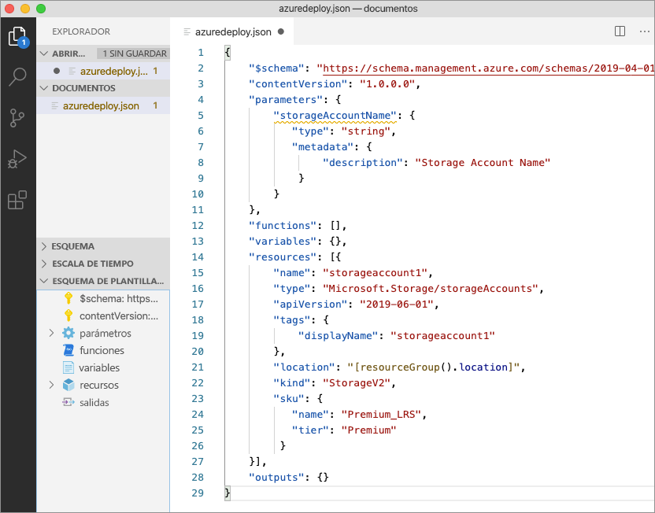

Los nombres de cuenta de Azure Storage tienen una longitud mínima de 3 caracteres, mientras que el máximo son 24. Agregue `minLength` y `maxLength` al parámetro y especifique los valores adecuados.

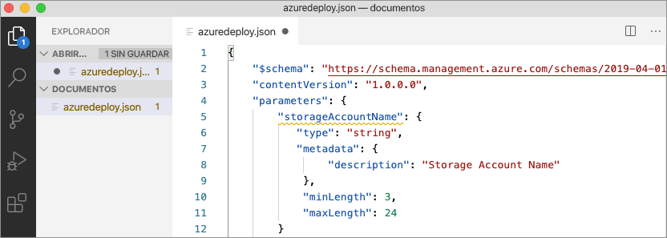

Ahora, en el recurso de almacenamiento, actualice la propiedad name para usar el parámetro. Para ello, quite el valor actual de la propiedad. Escriba una comilla doble y un corchete de apertura `[`, que genera una lista de funciones de la plantilla de Resource Manager. Seleccione *parameters* en la lista. 

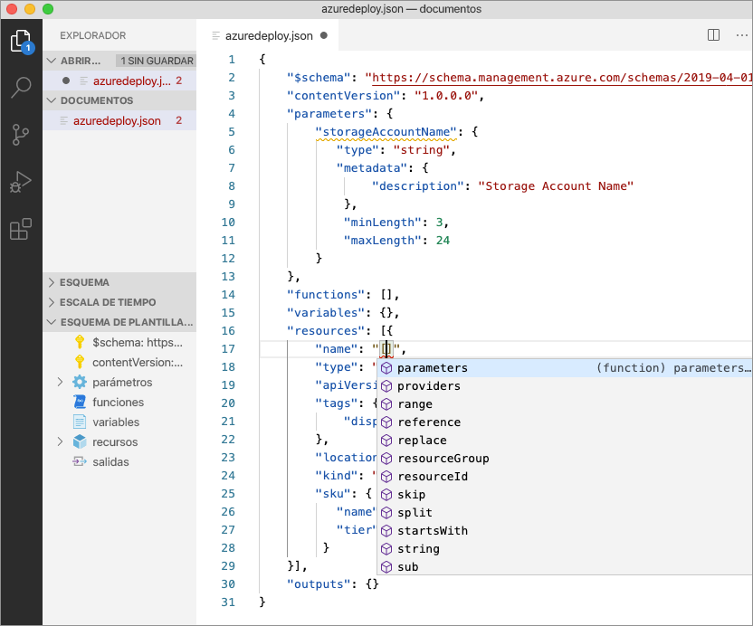

Al escribir una comilla simple `'` dentro de los paréntesis se genera una lista de todos los parámetros definidos en la plantilla, en este caso, *storageAccountName*. Seleccione el parámetro.

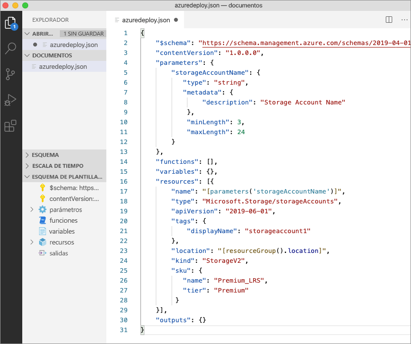

## <a name="create-a-parameter-file"></a>Creación de un archivo de parámetros

Los archivos de parámetros de las plantillas de Resource Manager permiten almacenar valores de parámetro específicos del entorno y usarlos como un grupo en el momento de la implementación. Por ejemplo, puede tener un archivo de parámetros con valores específicos para un entorno de prueba y otro para un entorno de producción.

La extensión facilita la creación de un archivo de parámetros a partir de las plantillas existentes. Para ello, haga clic con el botón derecho en la plantilla en el editor de código y seleccione `Select/Create Parameter File`.

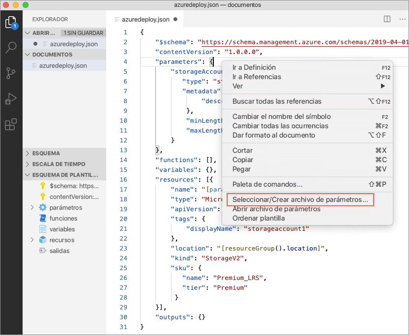

Seleccione `New` > `All Parameters` > Seleccione el nombre y la ubicación del archivo de parámetros.

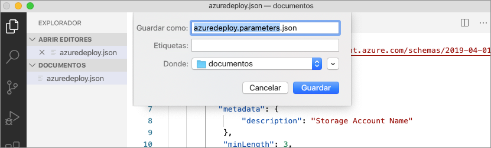

Esta acción crea un archivo de parámetros y lo asigna a la plantilla a partir de la que se creó. La asignación de archivos de la plantilla o parámetro actuales se puede ver y modificar en la barra de estado de Visual Studio Code mientras la plantilla esté seleccionada.


Ahora que el archivo de parámetros se ha asignado a la plantilla, la extensión se valida tanto en la plantilla como en el archivo de parámetros a la vez. Para ver esta validación en la práctica, agregue un valor de dos caracteres al parámetro `storageAccountName` del archivo de parámetros y guarde el archivo.

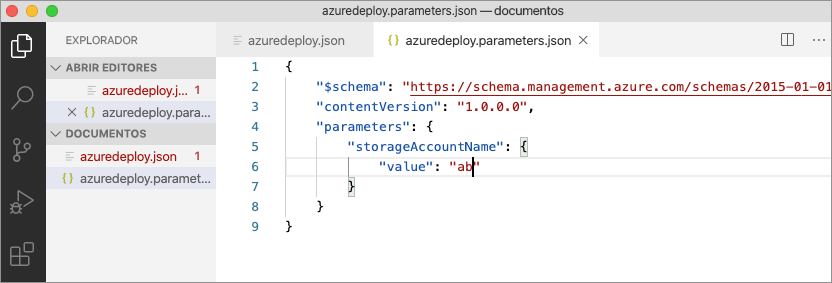

Vuelva a la plantilla de Resource Manager y observe que aparece un error que indica que el valor no cumple los criterios de los parámetros.

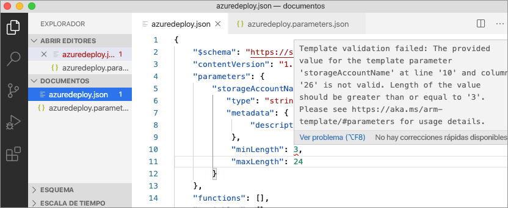

Actualice el valor a algo adecuado, guarde el archivo y vuelva a la plantilla. Observe que se ha resuelto el error en el parámetro.

## <a name="deploy-the-template"></a>Implementación de la plantilla

Abra el terminal de Visual Studio Code integrado con la combinación de teclas `ctrl` + ```` ` ```` y use la CLI de Azure o el módulo de Azure PowerShell para implementar la plantilla.

# <a name="cli"></a>[CLI](#tab/CLI)

```azurecli
az group create --name arm-vscode --location eastus

az deployment group create --resource-group arm-vscode --template-file azuredeploy.json --parameters azuredeploy.parameters.json
```

# <a name="powershell"></a>[PowerShell](#tab/PowerShell)

```azurepowershell
New-AzResourceGroup -Name arm-vscode -Location eastus

New-AzResourceGroupDeployment -ResourceGroupName arm-vscode -TemplateFile ./azuredeploy.json -TemplateParameterFile ./azuredeploy.parameters.json
```
---

## <a name="clean-up-resources"></a>Limpieza de recursos

Cuando los recursos de Azure dejen de ser necesarios, use la CLI de Azure o el módulo de Azure PowerShell para eliminar el grupo de recursos y el recurso del servidor del inicio rápido.

# <a name="cli"></a>[CLI](#tab/CLI)

```azurecli
az group delete --name arm-vscode
```

# <a name="powershell"></a>[PowerShell](#tab/PowerShell)

```azurepowershell
Remove-AzResourceGroup -Name arm-vscode
```
---

## <a name="next-steps"></a>Pasos siguientes

> [!div class="nextstepaction"]
> [Tutoriales para principiantes](./template-tutorial-create-first-template.md)
