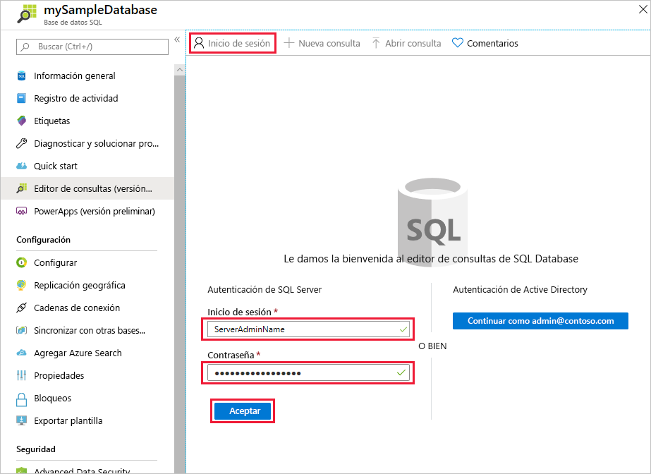
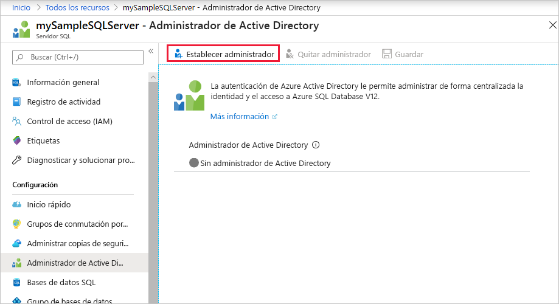
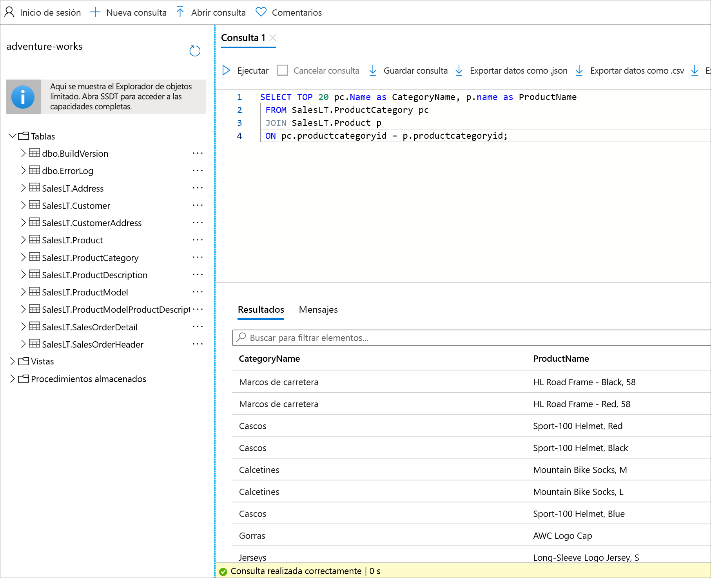

# <a name="quickstart-use-the-azure-portals-query-editor-to-query-an-azure-sql-database"></a>Inicio rápido: Uso del editor de consultas de Azure Portal para consultar una base de datos de Azure SQL Database
[!INCLUDE[appliesto-sqldb](../includes/appliesto-sqldb.md)]

El editor de consultas es una herramienta de Azure Portal para ejecutar consultas SQL en una base de datos de Azure SQL Database o en un almacenamiento de datos de Azure SQL Data Warehouse. 

En este inicio rápido, usará el editor de consultas para ejecutar consultas Transact-SQL (T-SQL) en una base de datos.

## <a name="prerequisites"></a>Requisitos previos

Para completar este inicio rápido se necesita la base de datos de ejemplo AdventureWorksLT. Si no tiene una copia de trabajo de la base de datos de ejemplo AdventureWorksLT en Azure SQL Database, en el siguiente inicio rápido se crea:

- [Inicio rápido: Creación de una base de datos de Azure SQL Database mediante Azure Portal, PowerShell o la CLI de Azure](single-database-create-quickstart.md) 

### <a name="configure-network-settings"></a>Configuración de la red

Si obtiene uno de los siguientes errores en el editor de consultas: *La configuración de la red local puede estar impidiendo que el editor de consultas emita consultas. Haga clic aquí para obtener instrucciones sobre cómo establecer la configuración de la red*, o *No se ha podido establecer una conexión con el servidor. Esto puede indicar un problema con la configuración del firewall local o con la configuración del proxy de red*, la información importante a continuación debería ayudarle a resolver el problema:

> [!IMPORTANT]
> El editor de consultas usa los puertos 443 y 1443 para comunicarse. Asegúrese de que ha habilitado el tráfico HTTPS saliente en estos puertos. También tiene que [agregar la dirección IP saliente a las reglas de firewall permitidas del servidor](firewall-create-server-level-portal-quickstart.md) para acceder a las bases de datos y los almacenamientos de datos.


## <a name="open-the-sql-database-query-editor"></a>Apertura del editor de consultas de SQL Database

1. Inicie sesión en [Azure Portal](https://portal.azure.com/) y seleccione la base de datos que desea consultar.

2. En el menú de **Base de datos SQL**, seleccione **Editor de consultas (versión preliminar)** .

    


## <a name="establish-a-connection-to-the-database"></a>Establecimiento de una conexión con la base de datos

Aunque haya iniciado sesión en el portal, tiene que proporcionar las credenciales para acceder a la base de datos. Puede realizar la conexión mediante la autenticación de SQL o Azure Active Directory para conectarse a la base de datos.

### <a name="connect-using-sql-authentication"></a>Conexión con la autenticación de SQL

1. En la página **Inicio de sesión**, en **Autenticación de SQL Server**, escriba un **Inicio de sesión** y **Contraseña** para un usuario que tenga acceso a la base de datos. Si no está seguro, use el inicio de sesión y la contraseña para el administrador de servidor del servidor de la base de datos.

    

2. Seleccione **Aceptar**.


### <a name="connect-using-azure-active-directory"></a>Clientes que usan Azure Active Directory

La configuración de un administrador de Azure Active Directory (Azure AD) le permite usar una identidad única para iniciar sesión en Azure Portal y en la base de datos. Para conectarse a la base de datos mediante Azure AD, siga los pasos que se indican a continuación con el fin de configurar un administrador de Azure AD para su instancia de SQL Server.

> [!NOTE]
> * Las cuentas de correo electrónico (por ejemplo, outlook.com, gmail.com, yahoo.com, etc.) aún no se admiten como administradores de Azure AD. Asegúrese de elegir un usuario creado de forma nativa en Azure AD o que esté federado en Azure AD.
> * El iniciar sesión del administrador de Azure AD no funciona con cuentas que tengan habilitada la autenticación en 2 fases.

#### <a name="set-an-active-directory-admin-for-the-server"></a>Establecimiento de un administrador de Active Directory para el servidor

1. En Azure Portal, seleccione la instancia de SQL Server.

2. En el menú **SQL Server**, seleccione **Administrador de Active Directory**.

3. En la barra de herramientas de la página **Administrador de Active Directory** de SQL Server, seleccione **Establecer administrador** y elija un usuario o grupo como administrador de Azure AD.

    

4. En la página **Agregar administrador**, en el cuadro de búsqueda, escriba el usuario o grupo que desea buscar, selecciónelo como administrador y, a continuación, elija el botón **Seleccionar**.

5. De nuevo en la barra de herramientas de la página **Administrador de Active Directory** de SQL Server, seleccione **Guardar**.

### <a name="connect-to-the-database"></a>Conectarse a la base de datos

6. En el menú de **SQL Server**, seleccione **Bases de datos SQL** y, después, seleccione la base de datos.

7. En el menú de **Base de datos SQL**, seleccione **Editor de consultas (versión preliminar)** . En la página **Inicio de sesión**, en la etiqueta **Autenticación de Active Directory**, aparece un mensaje que indica que ha iniciado sesión si es un administrador de Azure AD. Seleccione el botón **Continuar como** *\<your user or group ID>* . Si la página indica que no ha iniciado sesión correctamente, puede que tenga que actualizarla.

## <a name="query-a-database-in-sql-database"></a>Consulta de una base de datos en SQL Database

Las consultas de ejemplo siguientes se deben ejecutar correctamente en la base de datos de ejemplo AdventureWorksLT.

### <a name="run-a-select-query"></a>Ejecución de una consulta SELECT

1. Pegue la siguiente consulta en el editor de consultas:

   ```sql
    SELECT TOP 20 pc.Name as CategoryName, p.name as ProductName
    FROM SalesLT.ProductCategory pc
    JOIN SalesLT.Product p
    ON pc.productcategoryid = p.productcategoryid;
   ```

2. Seleccione **Ejecutar** y, a continuación, revise los resultados en el panel **Resultados**.

   

3. Tiene la opción de guardar la consulta como un archivo .sql o exportar los datos devueltos como un archivo .json, .csv o .xml.

### <a name="run-an-insert-query"></a>Ejecución de una consulta INSERT

Ejecute la siguiente instrucción T-SQL [INSERT](/sql/t-sql/statements/insert-transact-sql/) para agregar un nuevo producto en la tabla `SalesLT.Product`.

1. Reemplace la consulta anterior por esta otra.

    ```sql
    INSERT INTO [SalesLT].[Product]
           ( [Name]
           , [ProductNumber]
           , [Color]
           , [ProductCategoryID]
           , [StandardCost]
           , [ListPrice]
           , [SellStartDate]
           )
    VALUES
           ('myNewProduct'
           ,123456789
           ,'NewColor'
           ,1
           ,100
           ,100
           ,GETDATE() );
   ```


2. Seleccione **Ejecutar** para insertar una nueva fila en la tabla `Product`. El panel **Mensajes** muestra **Consulta realizada correctamente: Filas afectadas: 1**.


### <a name="run-an-update-query"></a>Ejecución de una consulta UPDATE

Ejecute la siguiente instrucción T-SQL [UPDATE](/sql/t-sql/queries/update-transact-sql/) para modificar el nuevo producto.

1. Reemplace la consulta anterior por esta otra.

   ```sql
   UPDATE [SalesLT].[Product]
   SET [ListPrice] = 125
   WHERE Name = 'myNewProduct';
   ```

2. Seleccione **Ejecutar** para actualizar la fila especificada en la tabla `Product`. El panel **Mensajes** muestra **Consulta realizada correctamente: Filas afectadas: 1**.

### <a name="run-a-delete-query"></a>Ejecución de una consulta DELETE

Ejecute la siguiente instrucción T-SQL [DELETE](/sql/t-sql/statements/delete-transact-sql/) para quitar el nuevo producto.

1. Reemplace la consulta anterior por esta:

   ```sql
   DELETE FROM [SalesLT].[Product]
   WHERE Name = 'myNewProduct';
   ```

2. Seleccione **Ejecutar** para eliminar la fila especificada en la tabla `Product`. El panel **Mensajes** muestra **Consulta realizada correctamente: Filas afectadas: 1**.


## <a name="query-editor-considerations"></a>Consideraciones acerca del Editor de consultas

Hay algunos aspectos que debe conocer al trabajar con el Editor de consultas.

* El editor de consultas usa los puertos 443 y 1443 para comunicarse. Asegúrese de que ha habilitado el tráfico HTTPS saliente en estos puertos. También deberá agregar la dirección IP saliente a las reglas de firewall permitidas del servidor para acceder a las bases de datos y los almacenes de datos.

* Si tiene una conexión Private Link, el editor de consultas funciona sin necesidad de agregar la dirección IP del cliente al firewall de SQL Database.

* Al presionar la tecla **F5**, se actualiza la página del editor de consultas y se perderá cualquier consulta en la que se esté trabajando.

* El editor de consultas no puede conectarse a una base de datos `master`.

* La ejecución de consultas tienen un tiempo de expiración de 5 minutos.

* El Editor de consultas solo admite la proyección cilíndrica de tipos de datos geográficos.

* No hay compatibilidad con IntelliSense para las tablas y vistas de la base de datos, pero el editor admite autocompletar en los nombres que ya se han escrito.


## <a name="next-steps"></a>Pasos siguientes

Para más información sobre las instrucciones Transact-SQL (T-SQL) que se admiten en Azure SQL Database, consulte [Resolución de diferencias de Transact-SQL durante la migración a SQL Database](transact-sql-tsql-differences-sql-server.md).
