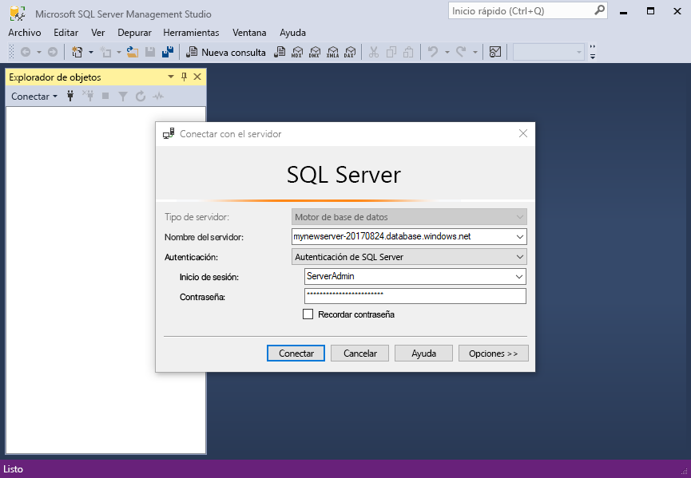
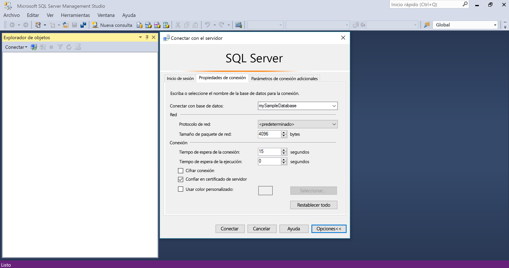
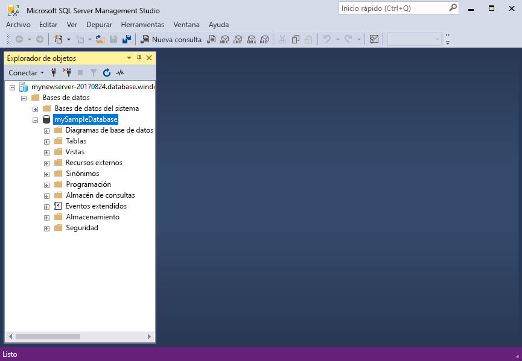
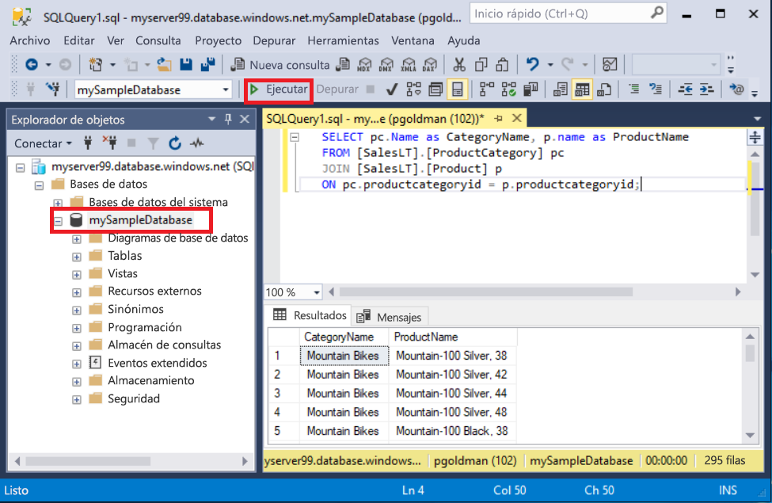
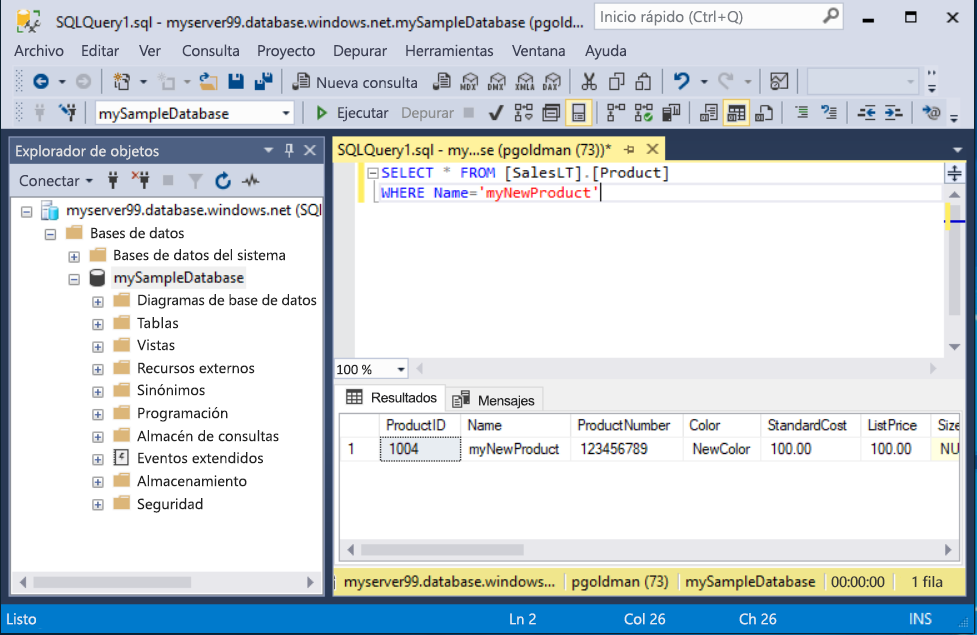

# <a name="quickstart-use-ssms-to-connect-to-and-query-azure-sql-database-or-azure-sql-managed-instance"></a>Inicio rápido: Use SSMS para conectarse a Azure SQL Database o Instancia administrada de Azure SQL y consultarlos
[!INCLUDE[appliesto-sqldb-sqlmi](../includes/appliesto-sqldb-sqlmi.md)]

En este inicio rápido aprenderá a usar SQL Server Management Studio (SSMS) para conectarse a Azure SQL Database o Instancia administrada de Azure SQL y a ejecutar consultas.

## <a name="prerequisites"></a>Requisitos previos

Para completar este inicio rápido son necesarios los siguientes elementos:

- [SQL Server Management Studio (SSMS)](/sql/ssms/download-sql-server-management-studio-ssms/).

- Una base de datos de Azure SQL Database. Puede utilizar uno de estos inicios rápidos para crear y configurar una base de datos en Azure SQL Database:

  || SQL Database | Instancia administrada de SQL | SQL Server en máquina virtual de Azure |
  |:--- |:--- |:---|:---|
  | Crear| [Portal](single-database-create-quickstart.md) | [Portal](../managed-instance/instance-create-quickstart.md) | [Portal](../virtual-machines/windows/sql-vm-create-portal-quickstart.md)
  || [CLI](scripts/create-and-configure-database-cli.md) | [CLI](https://medium.com/azure-sqldb-managed-instance/working-with-sql-managed-instance-using-azure-cli-611795fe0b44) |
  || [PowerShell](scripts/create-and-configure-database-powershell.md) | [PowerShell](../managed-instance/scripts/create-configure-managed-instance-powershell.md) | [PowerShell](../virtual-machines/windows/sql-vm-create-powershell-quickstart.md)
  | Configuración | [Regla de firewall de IP en el nivel de servidor](firewall-create-server-level-portal-quickstart.md)| [Conectividad desde una máquina virtual](../managed-instance/connect-vm-instance-configure.md)|
  |||[Conectividad desde el sitio](../managed-instance/point-to-site-p2s-configure.md) | [Conectarse a SQL Server](../virtual-machines/windows/sql-vm-create-portal-quickstart.md)
  |Cargar datos|Adventure Works cargado por inicio rápido|[Restauración de World Wide Importers](../managed-instance/restore-sample-database-quickstart.md) | [Restauración de World Wide Importers](../managed-instance/restore-sample-database-quickstart.md) |
  |||Restauración o importación de Adventure Works a partir del archivo [BACPAC](database-import.md) desde [GitHub](https://github.com/Microsoft/sql-server-samples/tree/master/samples/databases/adventure-works)| Restauración o importación de Adventure Works a partir del archivo [BACPAC](database-import.md) desde [GitHub](https://github.com/Microsoft/sql-server-samples/tree/master/samples/databases/adventure-works)|
  |||

  > [!IMPORTANT]
  > Los scripts de este artículo se escriben para utilizar la base de datos Adventure Works. Con una instancia administrada, debe importar la base de datos Adventure Works en una base de datos de instancia o modificar los scripts de este artículo para utilizar la base de datos Wide World Importers.

Si simplemente desea ejecutar algunas consultas ad hoc sin instalar SSMS, consulte [Inicio rápido: Uso del editor de consultas de Azure Portal para consultar una base de datos en Azure SQL Database](connect-query-portal.md).

## <a name="get-server-connection-information"></a>Obtención de información de conexión del servidor

Obtenga la información de conexión que necesita para conectarse a su base de datos. Para completar este inicio rápido necesitará el nombre completo del [servidor](logical-servers.md) o el nombre de host, el nombre de la base de datos y la información de inicio de sesión.

1. Inicie sesión en [Azure Portal](https://portal.azure.com/).

2. Vaya a la **base de datos** o a la **instancia administrada** que desea consultar.

3. En la página **Información general**, revise el nombre completo del servidor junto a **Nombre del servidor** para su base de datos de SQL Database o el nombre completo (o la dirección IP) del servidor junto a **Host** para una instancia administrada de SQL o la instancia de SQL Server en su máquina virtual. Para copiar el nombre del servidor o nombre de host, mantenga el cursor sobre él y seleccione el icono **Copiar**.

> [!NOTE]
> Para obtener información de la conexión de SQL Server en una máquina virtual de Azure, consulte [Conexión a SQL Server](../virtual-machines/windows/sql-vm-create-portal-quickstart.md#connect-to-sql-server)

## <a name="connect-to-your-database"></a>Conectarse a la base de datos

En SSMS, conéctese a su servidor.

> [!IMPORTANT]
> Un servidor escucha el puerto 1433. Para conectarse a un servidor desde detrás de un firewall corporativo, el firewall debe tener abierto este puerto.

1. Abra SSMS.

2. Aparecerá el cuadro de diálogo **Conectar con el servidor** . Escriba la siguiente información:

   | Configuración      | Valor sugerido    | Descripción |
   | ------------ | ------------------ | ----------- |
   | **Tipo de servidor** | Motor de base de datos | Valor requerido. |
   | **Nombre del servidor** | Nombre completo del servidor | Algo como: **servername.database.windows.net**. |
   | **Autenticación** | Autenticación de SQL Server | En este tutorial se usa la autenticación de SQL. |
   | **Inicio de sesión** | Identificador de usuario de la cuenta de administrador del servidor | El identificador de usuario de la cuenta de administrador del servidor que se usó para crear el servidor. |
   | **Contraseña** | Contraseña segura de la cuenta de administrador | La contraseña de la cuenta de administrador del servidor que se usó para crear el servidor. |
   ||||

     

3. Seleccione **Opciones** en el cuadro de diálogo **Conectar con el servidor**. En el menú desplegable **Conectar con el servidor**, seleccione **mySampleDatabase**. Al completar el inicio rápido en la [sección Prerrequisitos](#prerequisites) se crea una base de datos AdventureWorksLT denominada mySampleDatabase. Si la copia de trabajo de la base de datos AdventureWorks tiene un nombre diferente a mySampleDatabase, selecciónelo en su lugar.

     

4. Seleccione **Conectar**. Se abre la ventana del Explorador de objetos.

5. Para ver los objetos de la base de datos, expanda **Bases de datos** y luego expanda el nodo de su base de datos.

     

## <a name="query-data"></a>Consultar datos

Ejecute el código Transact-SQL [SELECT](/sql/t-sql/queries/select-transact-sql/) para consultar los 20 primeros productos por categoría.

1. En el Explorador de objetos, haga clic con el botón derecho en **mySampleDatabase** y seleccione **Nueva consulta**. Se abre una ventana de consulta conectada a la base de datos.

2. Pegue la consulta SQL siguiente en la ventana de consulta:

   ```sql
   SELECT pc.Name as CategoryName, p.name as ProductName
   FROM [SalesLT].[ProductCategory] pc
   JOIN [SalesLT].[Product] p
   ON pc.productcategoryid = p.productcategoryid;
   ```

3. En la barra de herramienta, seleccione **Ejecutar** para ejecutar la consulta y recuperar los datos de las tablas `Product` y `ProductCategory`.

    

### <a name="insert-data"></a>Insertar datos

Ejecute el código Transact-SQL [INSERT](/sql/t-sql/statements/insert-transact-sql/) para crear un nuevo producto en la tabla `SalesLT.Product`.

1. Reemplace la consulta anterior por esta otra.

   ```sql
   INSERT INTO [SalesLT].[Product]
           ( [Name]
           , [ProductNumber]
           , [Color]
           , [ProductCategoryID]
           , [StandardCost]
           , [ListPrice]
           , [SellStartDate] )
     VALUES
           ('myNewProduct'
           ,123456789
           ,'NewColor'
           ,1
           ,100
           ,100
           ,GETDATE() );
   ```

2. Seleccione **Ejecutar** para insertar una nueva fila en la tabla `Product`. El panel **Mensajes** muestra **(1 fila afectada)** .

#### <a name="view-the-result"></a>Ver el resultado

1. Reemplace la consulta anterior por esta otra.

   ```sql
   SELECT * FROM [SalesLT].[Product]
   WHERE Name='myNewProduct'
   ```

2. Seleccione **Execute**(Ejecutar). Aparecen los siguientes resultados.

   

### <a name="update-data"></a>Actualización de datos

Ejecute el código Transact-SQL [UPDATE](/sql/t-sql/queries/update-transact-sql?view=sql-server-ver15) para modificar el nuevo producto.

1. Reemplace la consulta anterior por esta que devuelve el nuevo registro creado anteriormente:

   ```sql
   UPDATE [SalesLT].[Product]
   SET [ListPrice] = 125
   WHERE Name = 'myNewProduct';
   ```

2. Seleccione **Ejecutar** para actualizar la fila especificada en la tabla `Product`. El panel **Mensajes** muestra **(1 fila afectada)** .

### <a name="delete-data"></a>Eliminación de datos

Ejecute el código Transact-SQL [DELETE](/sql/t-sql/statements/delete-transact-sql/) para eliminar el nuevo producto.

1. Reemplace la consulta anterior por esta otra.

   ```sql
   DELETE FROM [SalesLT].[Product]
   WHERE Name = 'myNewProduct';
   ```

2. Seleccione **Ejecutar** para eliminar la fila especificada en la tabla `Product`. El panel **Mensajes** muestra **(1 fila afectada)** .

## <a name="next-steps"></a>Pasos siguientes

- Para más información sobre SSMS, consulte [SQL Server Management Studio](/sql/ssms/sql-server-management-studio-ssms/).
- Para conectarse y consultar mediante Azure Portal, consulte [Conexión y consulta con el editor de consultas SQL de Azure Portal](connect-query-portal.md).
- Para conectarse y consultar con Visual Studio, vea [Conexión y consultas con Visual Studio Code](connect-query-vscode.md).
- Para conectarse y consultar con .NET, vea [Conexión y consultas con .NET](connect-query-dotnet-visual-studio.md).
- Para conectarse y consultar con PHP, vea [Conexión y consultas con PHP](connect-query-php.md).
- Para conectarse y consultar con Node.js, vea [Conexión y consultas con Node.js](connect-query-nodejs.md).
- Para conectarse y consultar con Java, vea [Conexión y consultas con Java](connect-query-java.md).
- Para conectarse y consultar con Python, vea [Conexión y consultas con Python](connect-query-python.md).
- Para conectarse y consultar con Ruby, vea [Conexión y consultas con Ruby](connect-query-ruby.md).
