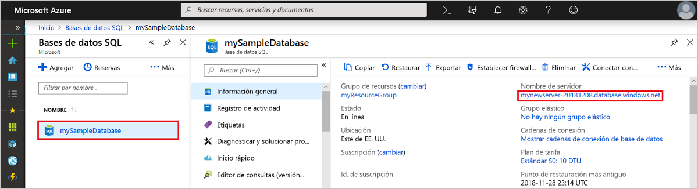

# Inicio rápido: Creación de una regla de firewall de nivel a servidor mediante Azure Portal
[!INCLUDE[appliesto-sqldb](../includes/appliesto-sqldb.md)]

Este inicio rápido le guía en la creación de una [regla de firewall de nivel de servidor](firewall-configure.md) en Azure SQL Database mediante Azure Portal para que pueda conectarse a [servidores de SQL Server lógicos](logical-servers.md), bases de datos únicas y grupos elásticos, y sus bases de datos. Una regla de firewall es necesaria para conectarse desde otros recursos de Azure y desde recursos locales. Las reglas de firewall de nivel de servidor no se aplican a Instancia administrada de Azure SQL.

## Requisitos previos

En este inicio rápido se usan los recursos creados en [Creación de una base de datos única mediante Azure Portal](single-database-create-quickstart.md) como punto de partida.

## Inicio de sesión en Azure Portal

Inicie sesión en [Azure Portal](https://portal.azure.com/).

## Creación de una regla de firewall de IP de nivel de servidor

 SQL Database crea un firewall en el nivel de servidor para bases de datos únicas y agrupadas. Este firewall evita que las aplicaciones cliente se conecten al servidor o a cualquiera de sus bases de datos, a menos que se cree una regla de firewall de IP para abrir el firewall. Para una conexión desde una dirección IP fuera de Azure, cree una regla de firewall para una dirección IP específica o para el intervalo de direcciones al desee conectarse. Para más información acerca de las reglas de firewall de IP en los niveles de base de datos y de servidor, consulte [Reglas de firewall de IP de los niveles de servidor y de base de datos](firewall-configure.md).

> [!NOTE]
> Azure SQL Database se comunica a través del puerto 1433. Si intenta conectarse desde una red corporativa, es posible que el firewall de la red no permita el tráfico saliente a través del puerto 1433. En ese caso no podrá conectarse al servidor, salvo que el departamento de TI abra el puerto 1433.
> [!IMPORTANT]
> Una regla de firewall de 0.0.0.0 permite que todos los servicios de Azure pasen a través de la regla de firewall de nivel de servidor e intenten conectarse a una base de datos a través del servidor.

Siga estos pasos para crear una regla de firewall de IP de nivel de servidor para la dirección IP de su cliente y habilite la conectividad externa mediante el firewall de Azure SQL Database solo para su dirección IP.

1. Cuando se haya terminado la implementación de la [base de datos](#prerequisites), seleccione **Bases de datos SQL** en el menú de la izquierda y, después, elija **mySampleDatabase** en la página **Bases de datos SQL**. Se abre la página de información general de la base de datos, que muestra el nombre completo del servidor (por ejemplo, **mynewserver-20170824.database.windows.net**) y proporciona opciones para otras configuraciones.

2. Copie este nombre de servidor completo para conectarse a su servidor y a sus bases de datos en otras guías de inicio rápido.

   

3. Seleccione **Establecer el firewall del servidor** en la barra de herramientas. Se abre la página **Configuración del firewall** del servidor.

   

4. Elija **Agregar IP de cliente** en la barra de herramientas para agregar la dirección IP actual a la nueva regla de firewall de IP en el nivel de servidor. Esta regla de firewall puede abrir el puerto 1433 para una única dirección IP o un intervalo de direcciones IP.

   > [!IMPORTANT]
   > De forma predeterminada, el acceso a través del firewall de Azure SQL Database está deshabilitado para todos los servicios de Azure. Elija **ACTIVADO** en esta página si desea habilitar el acceso para todos los servicios de Azure.
   >

5. Seleccione **Guardar**. Se crea una regla de firewall de IP en el nivel de servidor para el puerto 1433 de la dirección IP actual en el servidor.

6. Cierre la página **Configuración de firewall**.

Mediante SQL Server Management Studio o cualquier otra herramienta que elija, ahora puede conectarse al servidor y a sus bases de datos desde esta dirección IP, usando la cuenta de administrador del servidor creada con anterioridad.

## Limpieza de recursos

Guarde estos recursos si desea volver a la sección [Pasos siguientes](#next-steps) y aprender a conectarse y consultar la base de datos mediante una serie de métodos diferentes. Sin embargo, si desea eliminar los recursos que ha creado en esta guía de inicio rápido, siga estos pasos.

1. En el menú izquierdo de Azure Portal, seleccione **Grupos de recursos** y **myResourceGroup**.
2. En la página del grupo de recursos, seleccione **Eliminar**, escriba **myResourceGroup** en el cuadro de texto y, después, seleccione **Eliminar**.

## Pasos siguientes

- Ahora que tiene una base de datos, puede [conectarse y realizar consultas](connect-query-content-reference-guide.md) con las herramientas o lenguajes que prefiera, incluidas:
  - [Conexión y consulta con SQL Server Management Studio](connect-query-ssms.md)
  - [Conexión y consulta de datos con Azure Data Studio](/sql/azure-data-studio/quickstart-sql-database?toc=/azure/sql-database/toc.json)
- Para aprender a diseñar su primera base de datos, crear tablas e insertar datos, consulte uno de estos tutoriales:
  - [Diseño de la primera base de datos única de Azure SQL Database mediante SSMS](design-first-database-tutorial.md)
  - [Diseño de una base de datos única en Azure SQL Database y conexión con C# y ADO.NET](design-first-database-csharp-tutorial.md)
