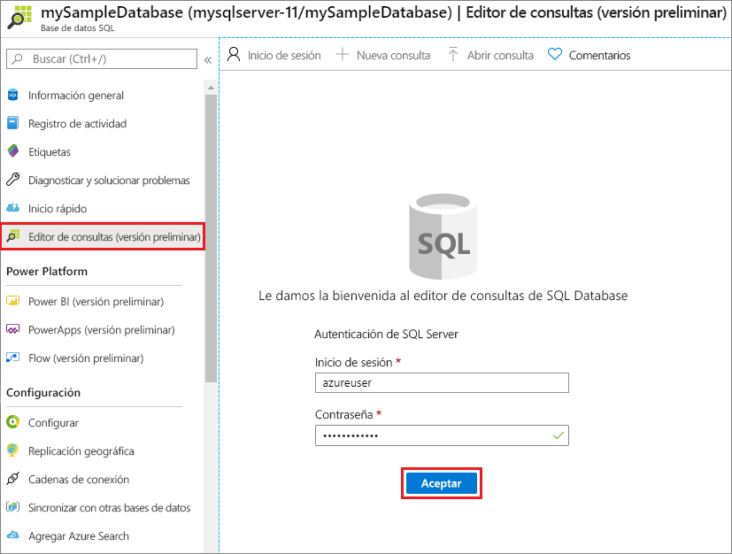

# <a name="quickstart-create-an-azure-sql-database-single-database"></a>Inicio rápido: Creación de una base de datos única de Azure SQL Database

En este inicio rápido, va a crear una [base de datos única](single-database-overview.md) en Azure SQL Database mediante Azure Portal, un script de PowerShell o un script de la CLI de Azure. A continuación, realizará una consulta de la base de datos mediante el **editor de consultas** en Azure Portal.


## <a name="prerequisite"></a>Requisito previo

- Una suscripción de Azure activa. En caso de no tener ninguna, [cree una cuenta gratuita](https://azure.microsoft.com/free/).

## <a name="create-a-single-database"></a>Crear una base de datos única

En este inicio rápido se crea una base de datos única en el [nivel de proceso sin servidor](serverless-tier-overview.md).

# <a name="portal"></a>[Portal](#tab/azure-portal)

Para crear una base de datos única en Azure Portal, este inicio rápido se inicia en la página Azure SQL.

1. Vaya a la página [Seleccione una opción de implementación de SQL](https://portal.azure.com/#create/Microsoft.AzureSQL).
1. En **Bases de datos SQL**, deje **Tipo de recurso** establecido en **Base de datos única** y seleccione **Crear**.

   

1. En la pestaña **Básico** del formulario **Create SQL Database**, en **Detalles del proyecto**, seleccione la **suscripción** de Azure correcta.
1. En **Grupo de recursos**, seleccione **Crear nuevo**, escriba *miGrupoDeRecursos* y seleccione **Aceptar**.
1. En **Nombre de la base de datos**, escriba *miBaseDeDatosDeEjemplo*.
1. En **Servidor**, seleccione **Crear nuevo** y rellene el formulario **Nuevo servidor** con los valores siguientes:
   - **Nombre del servidor**: Escriba *miServidorSql* y agregue algunos caracteres para que el nombre sea único. No se puede proporcionar un nombre de servidor exacto para usar porque los nombres de los servidores deben ser globalmente únicos para todos los servidores en Azure, no solo únicos dentro de una suscripción. Por lo tanto, escriba algo como mysqlserver12345 y el portal le permite saber si está disponible o no.
   - **Inicio de sesión del administrador del servidor**: escriba *usuarioazure*.
   - **Contraseña**: escriba una contraseña que cumpla los requisitos y escríbala de nuevo en el campo **Confirmar contraseña**.
   - **Ubicación**: Seleccione una ubicación en la lista desplegable.

   Seleccione **Aceptar**.

1. Deje **¿Quiere usar un grupo elástico de SQL?** establecido en **No**.
1. En **Proceso y almacenamiento**, seleccione **Configurar base de datos**.
1. En este inicio rápido se usa una base de datos sin servidor, por lo que debe seleccionar **Sin servidor** y, después, seleccionar **Aplicar**. 

      

1. Seleccione **Siguiente: Redes** en la parte inferior de la página.

   

1. En la pestaña **Redes**, en **Método de conectividad**, seleccione **Punto de conexión público**.
1. En **Reglas de firewall**, establezca **Agregar dirección IP del cliente actual** en **Sí**. Deje la opción **Permitir que los servicios y recursos de Azure accedan a este grupo de servidores** establecida en **No**.
1. Seleccione **Siguiente: Configuración adicional** en la parte inferior de la página.

   
  

1. En la pestaña **Configuración adicional**, en la sección **Orígenes de datos**, en **Usar datos existentes**, seleccione **Ejemplo**. Esto crea una base de datos de ejemplo AdventureWorksLT, por lo que hay algunas tablas y datos para consultar y experimentar, en lugar de una base de datos vacía.
1. En la parte inferior de la página, seleccione **Revisar y crear**.

   

1. En la página **Revisar y crear**, después de revisar, seleccione **Crear**.

# <a name="azure-cli"></a>[CLI de Azure](#tab/azure-cli)

## <a name="launch-azure-cloud-shell"></a>Inicio de Azure Cloud Shell

Azure Cloud Shell es un shell interactivo gratuito que puede usar para ejecutar los pasos de este artículo. Tiene las herramientas comunes de Azure preinstaladas y configuradas para usarlas en la cuenta. 

Para abrir Cloud Shell, seleccione **Pruébelo** en la esquina superior derecha de un bloque de código. También puede ir a [https://shell.azure.com](https://shell.azure.com) para iniciar Cloud Shell en una pestaña independiente del explorador. Seleccione **Copiar** para copiar los bloques de código, péguelos en Cloud Shell y, luego, presione **Entrar** para ejecutarlos.

## <a name="set-parameter-values"></a>Establecer Valores de parámetros

Los siguientes valores se usan en los comandos siguientes para crear la base de datos y los recursos necesarios. Los nombres de servidor deben ser únicos globalmente en todo Azure, por lo que la función $RANDOM se usa para crear el nombre del servidor. Reemplace los valores 0.0.0.0 del intervalo de direcciones IP para que coincidan con su entorno específico.

```azurecli-interactive
# Set the resource group name and location for your server
resourceGroupName=myResourceGroup
location=eastus

# Set an admin login and password for your database
adminlogin=azureuser
password=Azure1234567!

# Set a server name that is unique to Azure DNS (<server_name>.database.windows.net)
serverName=server-$RANDOM

# Set the ip address range that can access your database
startip=0.0.0.0
endip=0.0.0.0
```

## <a name="create-a-resource-group"></a>Crear un grupo de recursos

Para crear un grupo de recursos, use el comando [az group create](/cli/azure/group). Un grupo de recursos de Azure es un contenedor lógico en el que se implementan y se administran los recursos de Azure. En el ejemplo siguiente, se crea un grupo de recursos denominado *myResourceGroup* en la ubicación *eastus*:

```azurecli-interactive
az group create --name $resourceGroupName --location $location
```

## <a name="create-a-server"></a>Creación de un servidor

Cree un servidor con el comando [az sql server create](/cli/azure/sql/server).

```azurecli-interactive
az sql server create \
    --name $serverName \
    --resource-group $resourceGroupName \
    --location $location  \
    --admin-user $adminlogin \
    --admin-password $password
```


## <a name="configure-a-firewall-rule-for-the-server"></a>Configuración de una regla de firewall del servidor

Cree una regla de firewall con el comando[az sql server firewall-rule create](/cli/azure/sql/server/firewall-rule).

```azurecli-interactive
az sql server firewall-rule create \
    --resource-group $resourceGroupName \
    --server $serverName \
    -n AllowYourIp \
    --start-ip-address $startip \
    --end-ip-address $endip
```


## <a name="create-a-single-database"></a>Crear una base de datos única

Cree una base de datos en el servidor con el comando[az sql db create](/cli/azure/sql/db). En el siguiente código se crea


```azurecli-interactive
az sql db create \
    --resource-group $resourceGroupName \
    --server $serverName \
    --name mySampleDatabase \
    --sample-name AdventureWorksLT \
    --edition GeneralPurpose \
    --compute-model Serverless \
    --family Gen5 \
    --capacity 2
```


# <a name="powershell"></a>[PowerShell](#tab/azure-powershell)

Puede crear un grupo de recursos, un servidor y una base de datos única mediante Windows PowerShell.

## <a name="launch-azure-cloud-shell"></a>Inicio de Azure Cloud Shell

Azure Cloud Shell es un shell interactivo gratuito que puede usar para ejecutar los pasos de este artículo. Tiene las herramientas comunes de Azure preinstaladas y configuradas para usarlas en la cuenta. 

Para abrir Cloud Shell, seleccione **Pruébelo** en la esquina superior derecha de un bloque de código. También puede ir a [https://shell.azure.com](https://shell.azure.com) para iniciar Cloud Shell en una pestaña independiente del explorador. Seleccione **Copiar** para copiar los bloques de código, péguelos en Cloud Shell y, luego, presione **Entrar** para ejecutarlos.

## <a name="set-parameter-values"></a>Establecer Valores de parámetros

Los siguientes valores se usan en los comandos siguientes para crear la base de datos y los recursos necesarios. Los nombres de servidor deben ser únicos globalmente en todo Azure, por lo que la el cmdlet Get-Random se usa para crear el nombre del servidor. Reemplace los valores 0.0.0.0 del intervalo de direcciones IP para que coincidan con su entorno específico.

```azurepowershell-interactive
   # Set variables for your server and database
   $resourceGroupName = "myResourceGroup"
   $location = "eastus"
   $adminLogin = "azureuser"
   $password = "Azure1234567!"
   $serverName = "mysqlserver-$(Get-Random)"
   $databaseName = "mySampleDatabase"

   # The ip address range that you want to allow to access your server
   $startIp = "0.0.0.0"
   $endIp = "0.0.0.0"

   # Show randomized variables
   Write-host "Resource group name is" $resourceGroupName
   Write-host "Server name is" $serverName
```


## <a name="create-resource-group"></a>Creación de un grupo de recursos

Cree un grupo de recursos de Azure con [New-AzResourceGroup](/powershell/module/az.resources/new-azresourcegroup). Un grupo de recursos es un contenedor lógico en el que se implementan y se administran los recursos de Azure.

```azurepowershell-interactive
   Write-host "Creating resource group..."
   $resourceGroup = New-AzResourceGroup -Name $resourceGroupName -Location $location -Tag @{Owner="SQLDB-Samples"}
   $resourceGroup
```


## <a name="create-a-server"></a>Creación de un servidor

Cree un servidor con el cmdlet [New-AzSqlServer](/powershell/module/az.sql/new-azsqlserver).

```azurepowershell-interactive
  Write-host "Creating primary server..."
   $server = New-AzSqlServer -ResourceGroupName $resourceGroupName `
      -ServerName $serverName `
      -Location $location `
      -SqlAdministratorCredentials $(New-Object -TypeName System.Management.Automation.PSCredential `
      -ArgumentList $adminLogin, $(ConvertTo-SecureString -String $password -AsPlainText -Force))
   $server
```

## <a name="create-a-firewall-rule"></a>Creación de una regla de firewall

Cree una regla de firewall de servidor con el cmdlet [New-AzSqlServerFirewallRule](/powershell/module/az.sql/new-azsqlserverfirewallrule).

```azurepowershell-interactive
   Write-host "Configuring server firewall rule..."
   $serverFirewallRule = New-AzSqlServerFirewallRule -ResourceGroupName $resourceGroupName `
      -ServerName $serverName `
      -FirewallRuleName "AllowedIPs" -StartIpAddress $startIp -EndIpAddress $endIp
   $serverFirewallRule
```


## <a name="create-a-single-database"></a>Crear una base de datos única

Cree una base de datos única con el cmdlet [New-AzSqlDatabase](/powershell/module/az.sql/new-azsqldatabase).

```azurepowershell-interactive
   Write-host "Creating a gen5 2 vCore serverless database..."
   $database = New-AzSqlDatabase  -ResourceGroupName $resourceGroupName `
      -ServerName $serverName `
      -DatabaseName $databaseName `
      -Edition GeneralPurpose `
      -ComputeModel Serverless `
      -ComputeGeneration Gen5 `
      -VCore 2 `
      -MinimumCapacity 2 `
      -SampleName "AdventureWorksLT"
   $database
```

---


## <a name="query-the-database"></a>Consulta de la base de datos

Una vez que haya creado la base de datos, use el **editor de consultas (versión preliminar)** en Azure Portal para conectarse a la base de datos y realizar consultas en los datos.

1. En el portal, busque y seleccione **Bases de datos SQL** y, a continuación, seleccione su base de datos en la lista.
1. En la página de su base de datos, seleccione **Editor de consultas (versión preliminar)** en el menú de la izquierda.
1. Escriba la información de inicio de sesión del administrador del servidor y seleccione **Aceptar**.

   

1. Escriba la siguiente consulta en el panel del **Editor de consultas**.

   ```sql
   SELECT TOP 20 pc.Name as CategoryName, p.name as ProductName
   FROM SalesLT.ProductCategory pc
   JOIN SalesLT.Product p
   ON pc.productcategoryid = p.productcategoryid;
   ```

1. Seleccione **Ejecutar** y examine los resultados de la consulta en el panel **Resultados**.

   

1. Cierre la página **Editor de consultas** y seleccione **Aceptar** cuando se le pida que descarte los cambios que no se hayan guardado.

## <a name="clean-up-resources"></a>Limpieza de recursos

Mantenga el grupo de recursos, el servidor y la base de datos única para los pasos siguientes y aprenda a conectarse y consultar la base de datos con distintos métodos.

Cuando haya terminado de usar estos recursos, puede eliminar el grupo de recursos que creó, lo que también eliminará el servidor y la base de datos única que se encuentran del grupo.

### <a name="portal"></a>[Portal](#tab/azure-portal)

Para eliminar **myResourceGroup** y todos sus recursos con Azure Portal:

1. En el portal, busque y seleccione **Grupos de recursos** y, después, seleccione **myResourceGroup** en la lista.
1. En la página del grupo de recursos, seleccione **Eliminar grupo de recursos**.
1. En **Escriba el nombre del grupo de recursos** escriba *myResourceGroup* y luego seleccione **Eliminar**.

### <a name="azure-cli"></a>[CLI de Azure](#tab/azure-cli)

Para eliminar el grupo de recursos y todos sus respectivos recursos, ejecute el siguiente comando de la CLI de Azure con el nombre del grupo de recursos:

```azurecli-interactive
az group delete --name $resourceGroupName
```

### <a name="powershell"></a>[PowerShell](#tab/azure-powershell)

Para eliminar el grupo de recursos y todos sus respectivos recursos, ejecute el siguiente cmdlet de PowerShell con el nombre del grupo de recursos:

```azurepowershell-interactive
Remove-AzResourceGroup -Name $resourceGroupName
```

---

## <a name="next-steps"></a>Pasos siguientes

[Conéctese y consulte](connect-query-content-reference-guide.md) la base de datos con diferentes herramientas e idiomas:
> [!div class="nextstepaction"]
> [Conexión y consulta con SQL Server Management Studio](connect-query-ssms.md)
>
> [Conexión y consulta de datos con Azure Data Studio](/sql/azure-data-studio/quickstart-sql-database?toc=/azure/sql-database/toc.json)

¿Quiere optimizar y ahorrar en el gasto en la nube?

> [!div class="nextstepaction"]
> [Comience a analizar los costos con Cost Management](https://docs.microsoft.com/azure/cost-management-billing/costs/quick-acm-cost-analysis?WT.mc_id=costmanagementcontent_docsacmhorizontal_-inproduct-learn)
