# Inicio rápido: Creación de una instancia administrada de SQL Managed Instance
[!INCLUDE[appliesto-sqlmi](../includes/appliesto-sqlmi.md)]

En este inicio rápido se le enseña a crear una instancia administrada de [Azure SQL Managed Instance](sql-managed-instance-paas-overview.md) en Azure Portal.

> [!IMPORTANT]
> Para conocer las limitaciones, consulte las [regiones admitidas](resource-limits.md#supported-regions) y los [tipos de suscripción admitidos](resource-limits.md#supported-subscription-types).

## Creación de una instancia administrada

Para crear una instancia administrada, siga estos pasos: 

### Inicio de sesión en Azure Portal

Si no tiene una suscripción a Azure, [cree una cuenta gratuita](https://azure.microsoft.com/free/).

1. Inicie sesión en [Azure Portal](https://portal.azure.com/).
1. Seleccione **Azure SQL** en el menú de la izquierda de Azure Portal. Si **Azure SQL** no está en la lista, seleccione **Todos los servicios** y escriba **Azure SQL** en el cuadro de búsqueda.
1. Seleccione **+ Agregar** para abrir la página **Select SQL deployment option** (Seleccionar la opción de implementación de SQL). Para ver información adicional acerca de una instancia administrada de Azure SQL Managed Instance, seleccione **Mostrar detalles** en el icono **SQL Managed Instance**.
1. Seleccione **Crear**.

   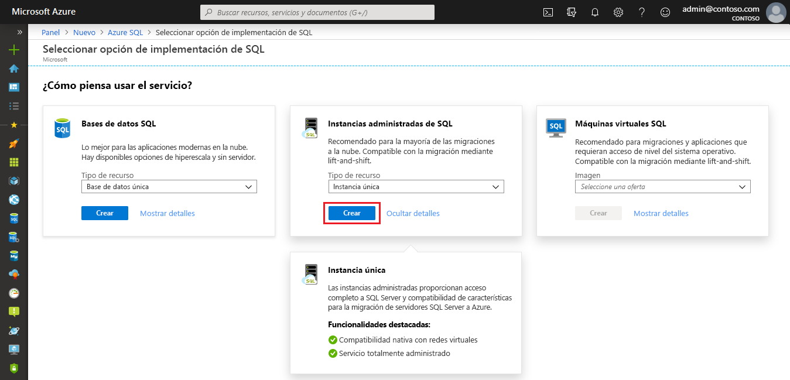

4. Use las pestañas del formulario de aprovisionamiento **Crear instancia administrada de Azure SQL** para agregar la información obligatoria y la opcional. En las siguientes secciones se describen estas pestañas.

### Pestaña Aspectos básicos

- Rellene la información obligatoria necesaria en la pestaña **Aspectos básicos**. Es un conjunto mínimo de información para aprovisionar una instancia administrada.

   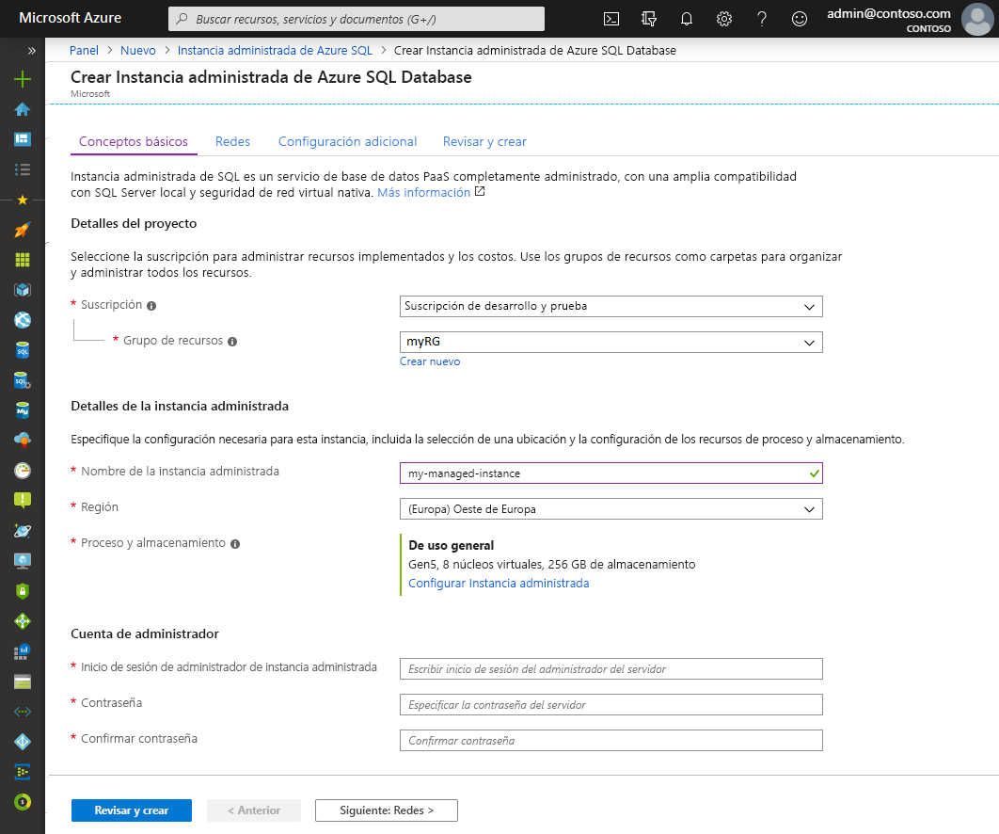

   Use la tabla siguiente como referencia para obtener la información necesaria en esta pestaña.

   | Configuración| Valor sugerido | Descripción |
   | ------ | --------------- | ----------- |
   | **Suscripción** | Su suscripción. | Una suscripción en la que tenga permiso para crear recursos. |
   | **Grupos de recursos** | un grupo de recursos nuevo o existente.|Para conocer cuáles son los nombres de grupo de recursos válidos, consulte el artículo [Convenciones de nomenclatura](/azure/architecture/best-practices/resource-naming).|
   | **Nombre de la instancia administrada** | Cualquier nombre válido.|Para conocer cuáles son los nombres válidos, consulte el artículo [Convenciones de nomenclatura](/azure/architecture/best-practices/resource-naming).|
   | **Región** |La región en la que desea crear la instancia administrada.|Para obtener información sobre las regiones, consulte [Regiones de Azure](https://azure.microsoft.com/regions/).|
   | **Inicio de sesión de administrador de la instancia administrada** | Cualquier nombre de usuario válido. | Para conocer cuáles son los nombres válidos, consulte el artículo [Convenciones de nomenclatura](/azure/architecture/best-practices/resource-naming). No utilice "serveradmin", ya es un rol de nivel de servidor reservado.|
   | **Contraseña** | Cualquier contraseña válida.| La contraseña debe tener al menos 16 caracteres de largo y cumplir con los [requisitos de complejidad definidos](../../virtual-machines/windows/faq.md#what-are-the-password-requirements-when-creating-a-vm).|

- Seleccione **Configurar instancia administrada**  para cambiar el tamaño de los recursos de almacenamiento y de proceso, así como para revisar los planes de tarifa. Utilice los controles deslizantes o cuadros de texto para especificar la cantidad de almacenamiento y el número de núcleos virtuales. Cuando haya terminado, seleccione **Aplicar** para guardar las opciones que haya elegido. 

   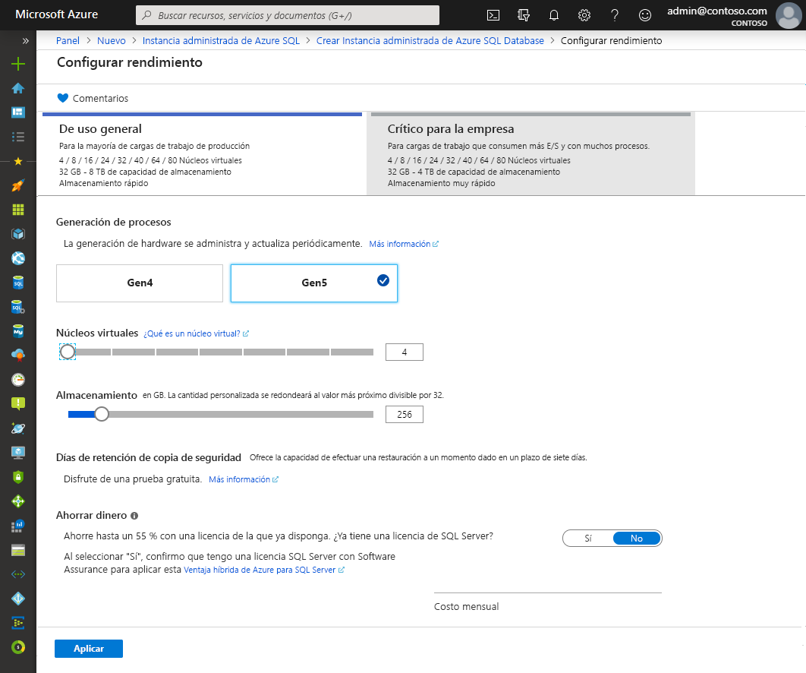

- Para examinar las opciones antes de crear una instancia administrada de SQL, puede seleccionar **Revisar y crear**. O bien, configure las opciones de red seleccionando **Siguiente: Redes**.

### Pestaña Redes

- Rellene la información opcional de la pestaña **Redes**. Si omite esta información, el portal aplicará la configuración predeterminada.

   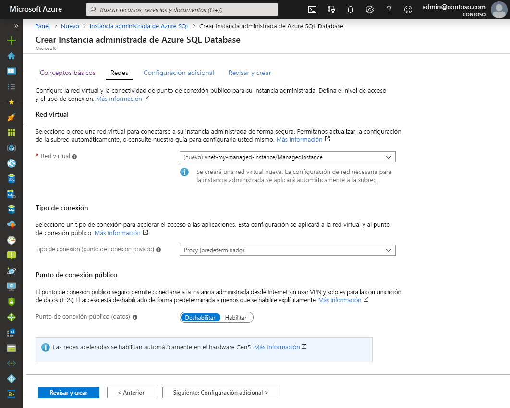

   Use la tabla siguiente como referencia para obtener la información necesaria en esta pestaña.

   | Configuración| Valor sugerido | Descripción |
   | ------ | --------------- | ----------- |
   | **Red virtual** | Seleccione **Crear una nueva red virtual** o una subred y red virtual válidas.| Si hay una red o subred que no esté disponible, se debe [modificar para cumplir los requisitos de la red](vnet-existing-add-subnet.md) antes de seleccionarla como destino de la nueva instancia administrada. Para más información acerca de los requisitos necesarios para configurar el entorno de red de una instancia administrada de SQL, consulte el artículo en el que se indica cómo [configurar una red virtual para una instancia administrada de Azure SQL](connectivity-architecture-overview.md). |
   | **Tipo de conexión** | Elija entre los tipos de conexión proxy y redirigir.|Para más información acerca de los tipos de conexión, consulte el artículo sobre el [tipo de conexión de Instancia administrada de Azure SQL](../database/connectivity-architecture.md#connection-policy).|
   | **Punto de conexión público**  | Seleccione **Habilitar**. | Para que se pueda acceder a una instancia administrada mediante el punto de conexión de datos público, es preciso habilitar esta opción. | 
   | **Permitir acceso desde** (si la opción **Punto de conexión público**  está habilitada) | Seleccione una de las opciones.   |La experiencia del portal permite configurar un grupo de seguridad con un punto de conexión público.     En función del escenario, seleccione una de las siguientes opciones:   <ul> <li>**Servicios de Azure**: esta opción es aconsejable cuando se establece conexión desde Power BI u otro servicio multiinquilino. </li> <li> **Internet**: se usa para realizar pruebas cuando se desee poner en marcha rápidamente una instancia administrada. No es aconsejable para entornos de producción. </li> <li> **Sin acceso**: esta opción crea una regla de seguridad **Denegar**. Modifique esta regla para que se pueda acceder a la instancia administrada mediante un punto de conexión público. </li> </ul>   Para más información acerca de la seguridad de los puntos de conexión públicos, consulte el artículo sobre el [uso de Instancia administrada de Azure SQL de forma segura con puntos de conexión públicos](public-endpoint-overview.md).|

- Para revisar las opciones antes de crear una instancia administrada, seleccione **Revisar y crear**. O bien, configure más opciones personalizadas, para lo que debe seleccionar **Siguiente: Configuración adicional**.

### Configuración adicional

- Rellene la información opcional de la pestaña **Configuración adicional**. Si omite esta información, el portal aplicará la configuración predeterminada.

   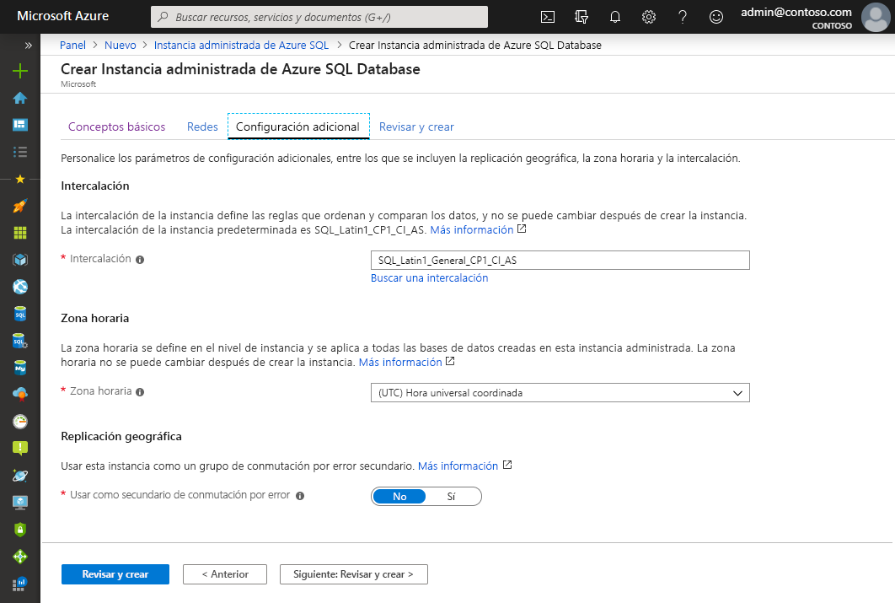

   Use la tabla siguiente como referencia para obtener la información necesaria en esta pestaña.

   | Configuración| Valor sugerido | Descripción |
   | ------ | --------------- | ----------- |
   | **Intercalación** | Elija la intercalación que desea usar para la instancia administrada. Si migra bases de datos desde SQL Server, compruebe la intercalación de origen mediante `SELECT SERVERPROPERTY(N'Collation')` y use ese valor.| Para obtener información acerca de las intercalaciones, consulte [Configurar o cambiar la intercalación del servidor](https://docs.microsoft.com/sql/relational-databases/collations/set-or-change-the-server-collation).|   
   | **Zona horaria** | Seleccione la zona horaria que la instancia administrada observará.|Para más información, consulte las [zonas horarias](timezones-overview.md).|
   | **Use as failover secondary** (Usar como secundaria de conmutación por error) | Seleccione **Sí**. | Habilite esta opción para usar la instancia administrada como secundaria del grupo de conmutación por error.|
   | **Instancia administrada de SQL principal** (si en **Usar como secundario de conmutación por error** se ha seleccionado **Sí**) | Elija la instancia administrada principal existente que se unirá en la misma zona DNS con la instancia administrada que está creando. | Este paso habilitará la configuración posterior a la creación del grupo de conmutación por error. Para más información, consulte el [Tutorial: Adición de una instancia administrada a un grupo de conmutación por error](failover-group-add-instance-tutorial.md).|

## Revisar y crear

1. Para revisar las opciones antes de crear una instancia administrada, seleccione la pestaña **Revisar y crear**.

   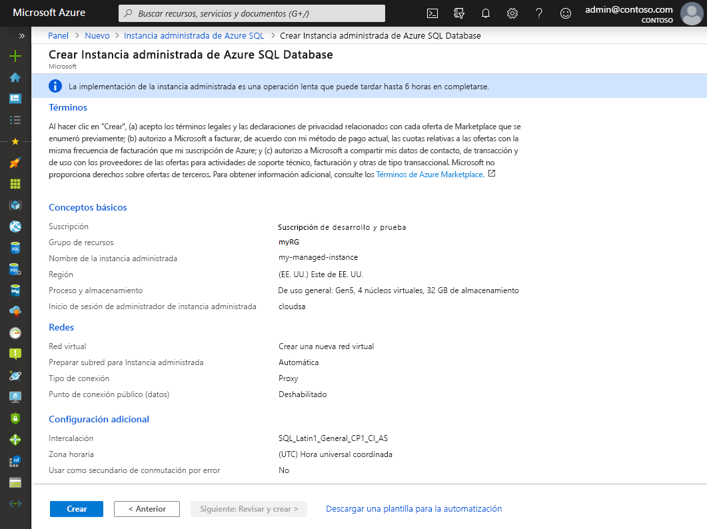

1. Seleccione **Crear** para iniciar el aprovisionamiento de la instancia administrada.

> [!IMPORTANT]
> La implementación de una instancia administrada es una operación de ejecución prolongada. La implementación de la primera instancia en la subred suele tardar mucho más que la implementación en una subred en la que ya existen instancias administradas. Para conocer los tiempos de aprovisionamiento medios, consulte el apartado sobre las [operaciones de administración de Instancia administrada de SQL](sql-managed-instance-paas-overview.md#management-operations).

## Supervisión del progreso de la implementación

1. Seleccione el icono **Notificaciones** para ver el estado de la implementación.

   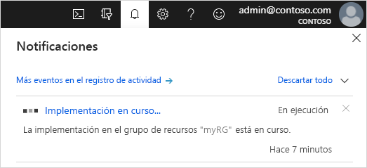

1. Seleccione **Implementación en curso**  en la notificación para abrir la ventana de la instancia administrada de SQL y supervisar el progreso de la implementación. 

> [!TIP]
> Si ha cerrado el explorador web o ya no está en la pantalla de progreso de la implementación, siga estos pasos para buscar esa pantalla:
> 1. En Azure Portal, abra el grupo de recursos (en la pestaña **Aspectos básicos**) en el que va a implementar SQL Managed Instance.
> 2. Seleccione **Implementaciones**.
> 3. Seleccione la operación de implementación de la instancia administrada de SQL en curso.

> [!IMPORTANT]
> - La creación de SQL Managed Instance es una operación que puede tardar varias horas en finalizar, en función de determinadas circunstancias. Para saber el tiempo que habitualmente tarde en crearse, consulte la sección [Duración de las operaciones de administración](management-operations-overview.md#management-operations-duration).
> - El inicio de la creación de SQL Managed Instance se puede retrasar cuando existan otras operaciones que afecten a la ejecución prolongada, como operaciones de restauración o escalado de larga duración en otras instancias administradas de la misma subred. Para más información, consulte la sección [Impacto de las operaciones de administración](management-operations-overview.md#management-operations-cross-impact).
> - Para poder obtener el estado de creación de instancia administrada, tiene que tener **permisos de lectura** para el grupo de recursos. Si no tiene este permiso o lo revoca mientras la instancia administrada se encuentra en proceso de creación, es posible que SQL Managed Instance no se vea en la lista de implementaciones del grupo de recursos.
>

## Visualización de los recursos creados

Tras una implementación correcta de una instancia administrada, para ver los recursos creados:

1. Abra el grupo de recursos de la instancia administrada. 

   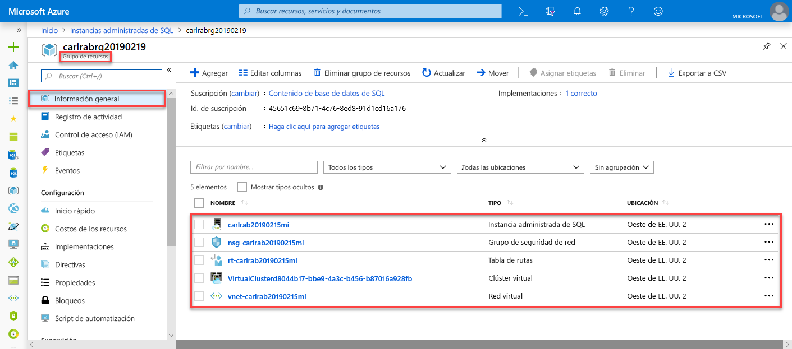

## Visualización y ajuste de la configuración de red

Para ajustar la configuración de red de forma opcional, revise lo siguiente:

1. Seleccione la tabla de rutas para revisar la ruta definida por el usuario (UDR) que se creó automáticamente.

   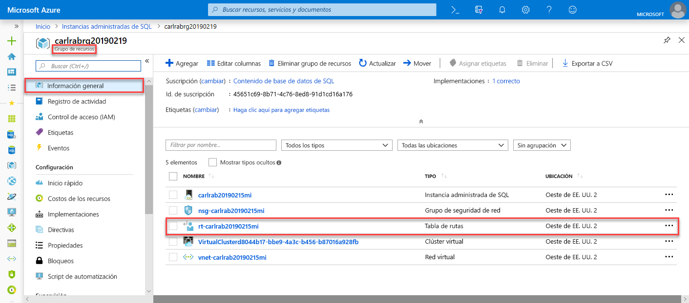

2. En la tabla de rutas, revise las entradas desde las que se enruta el tráfico hacia la red virtual de la instancia administrada de SQL y dentro de esta. Si crea o configura una tabla de rutas de forma manual, asegúrese de crear estas entradas en ella.

   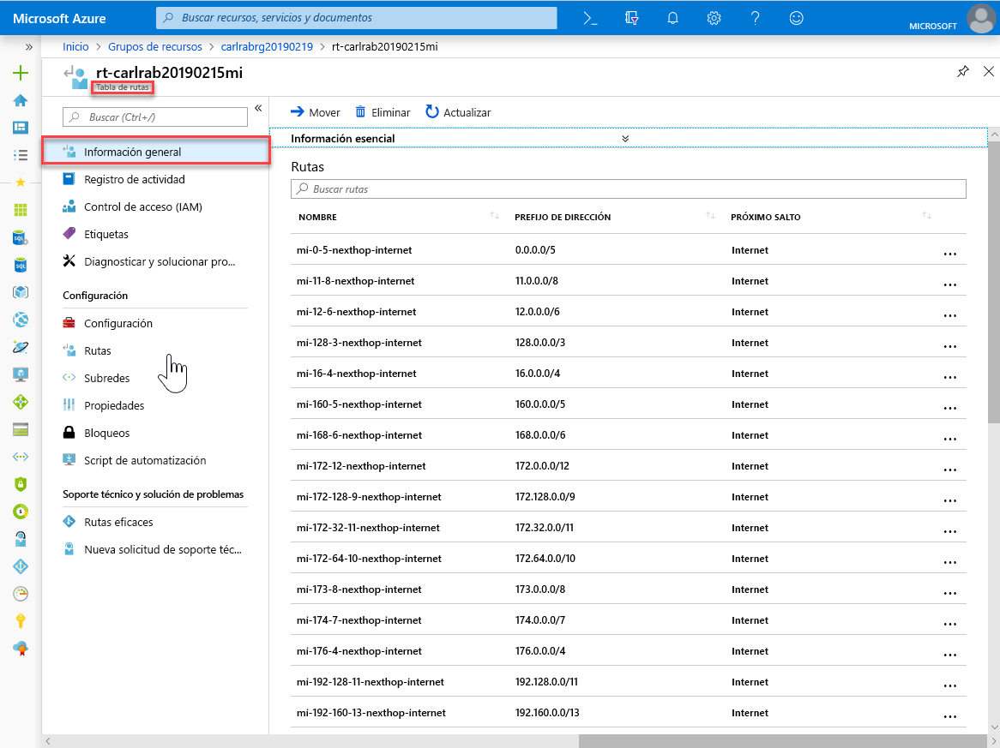

3. Vuelva al grupo de recursos y seleccione el grupo de seguridad de red.

   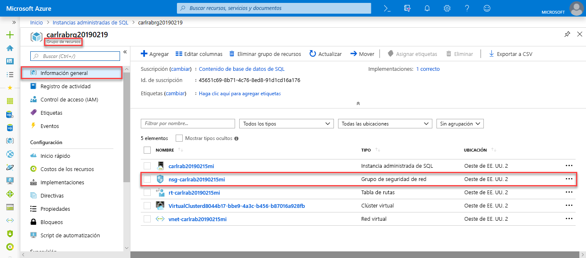

4. Revise las reglas de seguridad entrantes y salientes. 

   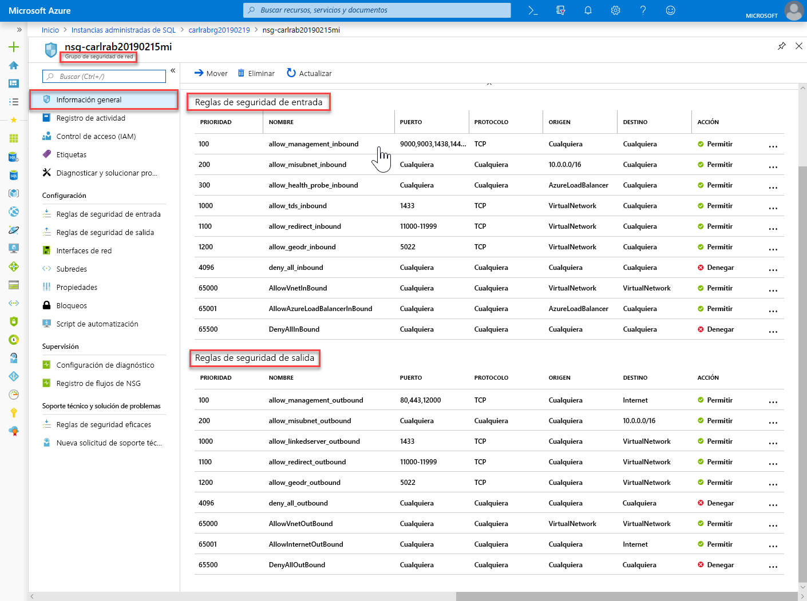

> [!IMPORTANT]
> Si ha configurado un punto de conexión público para SQL Managed Instance, es preciso que abra los puertos necesarios para que haya tráfico de red que permita establecer conexiones a SQL Managed Instance desde la red pública de Internet. Para más información, consulte [Configuración de un punto de conexión público para SQL Managed Instance](public-endpoint-configure.md#allow-public-endpoint-traffic-on-the-network-security-group).
>

## Recuperación de los detalles de conexión en la instancia administrada de SQL

Para conectarse a SQL Managed Instance, siga estos pasos para recuperar el nombre de host y el nombre de dominio completo (FQDN):

1. Vuelva al grupo de recursos y seleccione su instancia administrada.

   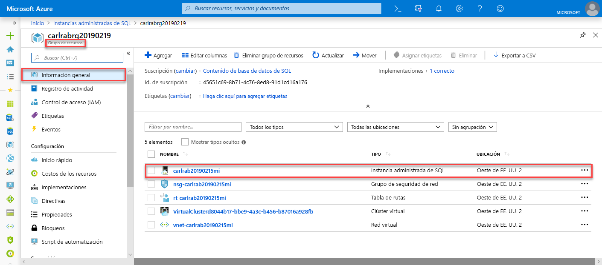

2. En la pestaña **Información general**, busque la propiedad **Host**. Copie el nombre de host de la instancia administrada para usarla en el siguiente inicio rápido.

   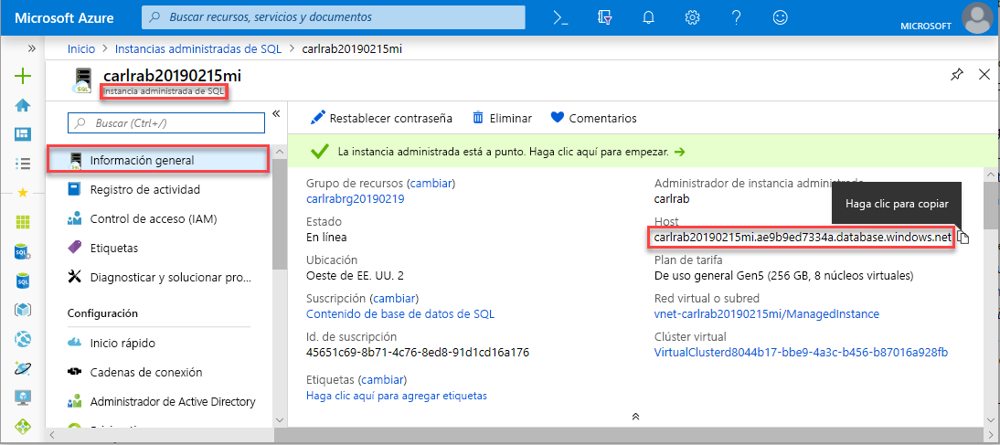

   El valor copiado representa un nombre de dominio completo (FQDN) que se puede usar para conectarse a una instancia administrada de SQL. Es similar al siguiente ejemplo de dirección: *your_host_name.a1b2c3d4e5f6.database.windows.net*.

## Pasos siguientes

Para más información sobre cómo conectarse a SQL Managed Instance:
- Para información general sobre las opciones de conexión de las aplicaciones, consulte [Conexión de las aplicaciones a Instancia administrada de SQL](connect-application-instance.md).
- Para ver un inicio rápido que muestre cómo conectarse a SQL Managed Instance desde una máquina virtual de Azure, consulte el documento sobre la [configuración de la conexión a una máquina virtual de Azure](connect-vm-instance-configure.md).
- Para ver un inicio rápido que muestre cómo conectarse a SQL Managed Instance desde un equipo cliente local mediante una conexión de punto a sitio, consulte el artículo acerca de la [configuración de una conexión de punto a sitio](point-to-site-p2s-configure.md).

Para restaurar una base de datos de SQL Server desde un entorno local a SQL Managed Instance: 
- Use [Azure Database Migration Service para la migración](../../dms/tutorial-sql-server-to-managed-instance.md) para realizar la restauración de un archivo de copia de seguridad de base de datos. 
- Use el [comando T-SQL RESTORE](restore-sample-database-quickstart.md) para realizar la restauración desde un archivo de copia de seguridad de base de datos.

Para obtener información acerca de la supervisión avanzada del rendimiento de las bases de datos de Instancia administrada de SQL con inteligencia para la solución de problemas integrada, consulte [Supervisión de instancias de Azure SQL Database mediante Azure SQL Analytics](../../azure-monitor/insights/azure-sql.md).
