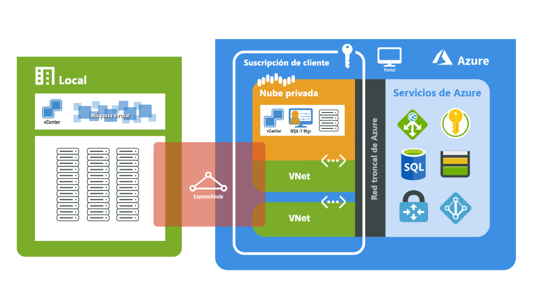

# ¿Qué es Azure VMware Solution?

Azure VMware Solution le proporciona nubes privadas en Azure. Las nubes privadas contienen clústeres de vSphere, creados a partir de una infraestructura de Azure sin sistema operativo dedicada. Puede escalar los clústeres de nube privada de 3 a 16 hosts, con la funcionalidad para tener varios clústeres en una sola nube privada. Todas las nubes privadas se aprovisionan con vCenter Server, vSAN, vSphere y NSX-T. Puede migrar cargas de trabajo de sus entornos locales, crear o implementar nuevas máquinas virtuales y consumir servicios de Azure desde sus nubes privadas.

Azure VMware Solution es una solución validada de VMware con validación y pruebas continuas de sus mejoras y actualizaciones. Microsoft administra y mantiene el software y la infraestructura de la nube privada, lo que le permite centrarse en desarrollar y ejecutar cargas de trabajo en sus nubes privadas.

En el diagrama siguiente se muestra la adyacencia entre las nubes privadas y las redes virtuales en Azure, los servicios de Azure y los entornos locales. El acceso a la red desde nubes privadas a servicios o redes virtuales de Azure proporciona una integración controlada mediante Acuerdo de Nivel de Servicio de los puntos de conexión de servicio de Azure. El acceso a la nube privada desde entornos locales usa ExpressRoute Global Reach para lograr una conexión privada y segura.

## Hosts, clústeres y nubes privadas

Las nubes privadas y los clústeres de Azure VMware Solution se crean a partir de un host de infraestructura de Azure hiperconvergida completa. Los hosts de gama alta tienen 576 GB de RAM y dos procesadores Intel de 18 núcleos a 2,3 GHz. Los hosts de gama alta tienen dos grupos de discos vSAN con un nivel total de capacidad de vSAN sin procesar de 15,36 TB (SSD) y un nivel de caché de vSAN de 3,2 TB (NVMe).

Las nubes privadas nuevas se implementan desde Azure Portal o la CLI de Azure.

## Redes

[!INCLUDE [avs-networking-description](includes/azure-vmware-solution-networking-description.md)]

Para más información sobre las redes y la interconectividad, consulte el artículo acerca de los [conceptos de redes](concepts-networking.md).

## Acceso y seguridad

Para mejorar la seguridad, las nubes privadas de Azure VMware Solution usan el control de acceso basado en rol de vSphere. Las funcionalidades LDAP del inicio de sesión único de vSphere se pueden integrar con Azure Active Directory. Para más información sobre la identidad y los privilegios, consulte el artículo en el que se explican los [conceptos de acceso e identidad](concepts-identity.md).

El cifrado de datos en reposo de vSAN está habilitado de forma predeterminada y se usa para proporcionar seguridad del almacén de datos de vSAN. Se describe con más detalle en el artículo acerca de los [conceptos de almacenamiento](concepts-storage.md).

## Mantenimiento del ciclo de vida del host y del software

Las actualizaciones periódicas del software de VMware y de la nube privada de Azure VMware Solution garantizan que las nubes privadas disfruten de la seguridad, estabilidad y los conjuntos de características más recientes. Puede encontrar más información sobre el mantenimiento y las actualizaciones de la plataforma en el artículo en el que se explican los [conceptos de la actualización](concepts-upgrades.md).

## Supervisión de una nube privada

Una vez que se ha implementado Azure VMware Solution en la suscripción, se generan [registros de Azure Monitor](../azure-monitor/overview.md) automáticamente. Además, puede recopilar registros en cada una de las máquinas virtuales dentro de la nube privada. Puede [descargar e instalar el agente de MMA](../azure-monitor/platform/log-analytics-agent.md#installation-options) en máquinas virtuales Linux y Windows que se ejecutan en las nubes privadas de Azure VMware Solution, así como habilitar la [extensión Azure Diagnostics](../azure-monitor/platform/diagnostics-extension-overview.md). Incluso puede ejecutar las mismas consultas que se ejecutan normalmente en las máquinas virtuales. Para más información sobre cómo crear consultas, consulte el apartado en que se indica [cómo escribir consultas](../azure-monitor/log-query/log-query-overview.md#how-can-i-learn-how-to-write-queries). Los patrones de supervisión dentro de Azure VMware Solution son similares a los de Azure Virtual Machines en la plataforma IaaS. Para información adicional y de procedimientos, consulte [Supervisión de máquinas virtuales de Azure con Azure Monitor](../azure-monitor/insights/monitor-vm-azure.md).

## Pasos siguientes

El siguiente paso es obtener información sobre los [conceptos clave clústeres y nubes privadas](concepts-private-clouds-clusters.md).

<!-- LINKS - external -->

<!-- LINKS - internal -->
[concepts-private-clouds-clusters]: ./concepts-private-clouds-clusters.md
