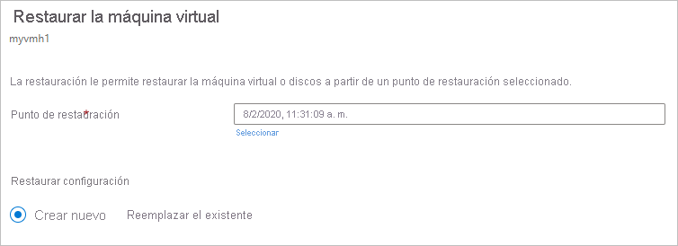
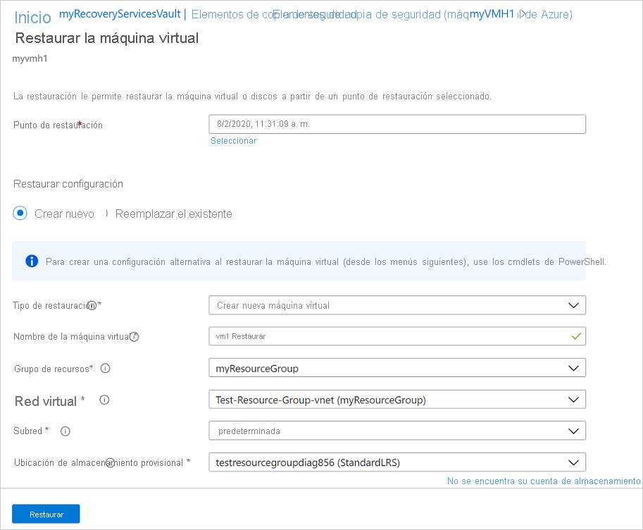
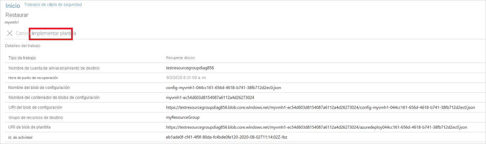
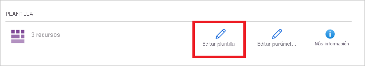
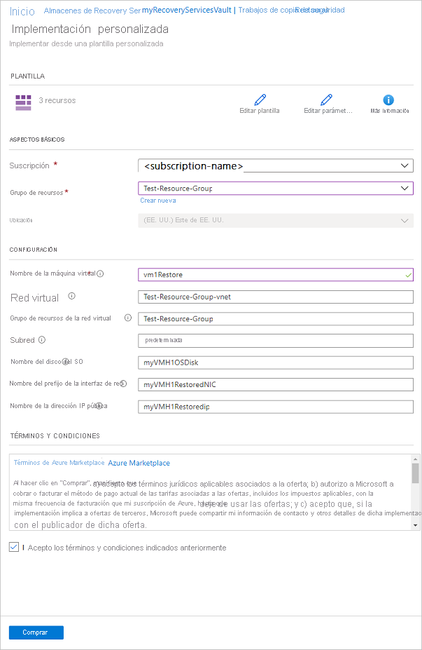
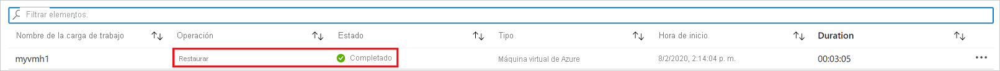

# <a name="how-to-restore-azure-vm-data-in-azure-portal"></a>Restauración de datos de máquinas virtuales de Azure en Azure Portal

En este artículo se describe cómo restaurar los datos de una máquina virtual de Azure a partir de los puntos de recuperación almacenados en los almacenes de [Azure Backup](backup-overview.md) Recovery Services.

## <a name="restore-options"></a>Opciones de restauración

En Azure Backup, se puede restaurar una máquina virtual de varias formas.

**Opción de restauración** | **Detalles**
--- | ---
**Crear una máquina virtual** | Crea y pone en funcionamiento rápidamente una máquina virtual básica a partir de un punto de restauración.<br/><br/> Puede especificar un nombre para la máquina virtual, seleccionar el grupo de recursos y la red virtual (VNet) en que se va a colocar y especificar una cuenta de almacenamiento para la máquina virtual restaurada. La nueva máquina virtual debe crearse en la misma región que la máquina virtual de origen.<br><br>Si se produce un error en la restauración de una máquina virtual porque una SKU de máquina virtual de Azure no estaba disponible en la región especificada de Azure, o debido a cualquier otro problema, Azure Backup de todos modos restaurará los discos del grupo de recursos especificado.
**Restaurar disco** | Restaura un disco de máquina virtual, que luego se puede usar para crear una máquina virtual.<br/><br/> Azure Backup proporciona una plantilla para ayudar a personalizar y crear una máquina virtual. <br/><br> El trabajo de restauración genera una plantilla que puede descargar y usar para especificar la configuración de una máquina virtual personalizada y crear una máquina virtual.<br/><br/> Los discos se copian en el grupo de recursos que especifique.<br/><br/> Como alternativa, puede conectar el disco a una máquina virtual existente o crear una máquina virtual mediante PowerShell.<br/><br/> Esta opción es útil si desea personalizar la máquina virtual, agregar la configuración que no existía en el momento de la copia de seguridad o agregar valores que deben configurarse mediante la plantilla o PowerShell.
**Reemplazar el existente** | Puede restaurar un disco y usarlo para reemplazar un disco en la máquina virtual existente.<br/><br/> La máquina virtual actual debe existir. Si se ha eliminado, esta opción no se puede usar.<br/><br/> Azure Backup toma una instantánea de la máquina virtual existente antes de reemplazar el disco, y la almacena en la ubicación de almacenamiento provisional especificada. Los discos existentes conectados a la máquina virtual se reemplazan por el punto de restauración seleccionado.<br/><br/> La instantánea se copia en el almacén y se conserva de acuerdo con la directiva de retención. <br/><br/> Después de la operación de reemplazo de disco, el disco original se conserva en el grupo de recursos. Puede optar por eliminar manualmente los discos originales si no son necesarios. <br/><br/>El reemplazo de los existentes se admite para máquinas virtuales administradas sin cifrar, incluidas las máquinas virtuales [creadas con imágenes personalizadas](https://azure.microsoft.com/resources/videos/create-a-custom-virtual-machine-image-in-azure-resource-manager-with-powershell/). No se admite para máquinas virtuales clásicas.<br/><br/> Si el punto de restauración tiene más o menos discos que la máquina virtual actual, el número de discos del punto de restauración solo reflejará la configuración de la máquina virtual.<br><br> También se admite el reemplazo de instancias existentes para las máquinas virtuales con recursos vinculados, como [identidades administradas asignadas por el usuario](../active-directory/managed-identities-azure-resources/overview.md) o [Key Vault](../key-vault/general/overview.md).
**Entre regiones (región secundaria)** | La restauración entre regiones puede usarse para restaurar VM de Azure en la región secundaria, que es una [región emparejada de Azure](../best-practices-availability-paired-regions.md#what-are-paired-regions).<br><br> Puede restaurar todas las VM de Azure del punto de recuperación seleccionado si la copia de seguridad se realiza en la región secundaria.<br><br> Esta característica está disponible para las opciones siguientes:<br> <li> [Crear una máquina virtual](#create-a-vm) <br> <li> [Restaurar discos](#restore-disks) <br><br> Actualmente no se admite la opción [Reemplazar los discos existentes](#replace-existing-disks).<br><br> Permisos<br> La operación de restauración en la región secundaria pueden llevarla a cabo los administradores de copias de seguridad y los administradores de aplicaciones.

> [!NOTE]
> También puede recuperar archivos y carpetas específicos en una máquina virtual de Azure. [Más información](backup-azure-restore-files-from-vm.md).

## <a name="storage-accounts"></a>Cuentas de almacenamiento

Algunos detalles sobre las cuentas de almacenamiento:

- **Create VM** (Crear VM): cuando se crea una máquina virtual, se coloca en la cuenta de almacenamiento especificada.
- **Restaurar disco**: al restaurar un disco, se copia en la cuenta de almacenamiento especificada. El trabajo de restauración genera una plantilla que puede descargar y usar para especificar la configuración personalizada de la máquina virtual. Esta plantilla se coloca en la cuenta de almacenamiento especificada.
- **Reemplazar disco**: al reemplazar el disco de una máquina virtual existente, Azure Backup toma una instantánea de esta máquina virtual antes de reemplazarlo. La instantánea también se copia en el almacén de Recovery Services a través de la transferencia de datos, como proceso en segundo plano. Sin embargo, una vez completada la fase de la instantánea, se desencadena la operación de reemplazo de discos. Después de la operación de reemplazo de discos, los discos de la máquina virtual de Azure de origen se quedan en el grupo de recursos especificado para la operación y los VHD se almacenan en la cuenta de almacenamiento especificada. Puede optar por eliminar o conservar estos VHD y discos.
- **Ubicación de la cuenta de almacenamiento**: la cuenta de almacenamiento debe estar en la misma región que el almacén. Solo se muestran estas cuentas. Si no hay ninguna cuenta de almacenamiento en la ubicación, debe crear una.
- **Storage type** (Tipo de almacenamiento): no se admite Blob Storage.
- **Redundancia de almacenamiento**: No se admite almacenamiento con redundancia de zona (ZRS). La información de replicación y redundancia de la cuenta se muestra entre paréntesis después del nombre de la cuenta.
- **Almacenamiento premium**:
  - al restaurar máquinas virtuales que no sean premium, no se admiten cuentas de almacenamiento premium.
  - Al restaurar máquinas virtuales administradas, no se admiten cuentas de almacenamiento premium configuradas con reglas de red.

## <a name="before-you-start"></a>Antes de comenzar

Para restaurar una máquina virtual (crear una máquina virtual), asegúrese de tener los [permisos](backup-rbac-rs-vault.md#mapping-backup-built-in-roles-to-backup-management-actions) de control de acceso basado en roles (RBAC de Azure) correctos para la operación de restauración de la máquina virtual.

Si no tiene permisos, puede [restaurar un disco](#restore-disks) y, luego, [usar la plantilla](#use-templates-to-customize-a-restored-vm) que se generó como parte de la operación de restauración para crear una máquina virtual.

## <a name="select-a-restore-point"></a>Seleccione un punto de restauración

1. En el almacén asociado a la máquina virtual que quiere restaurar, seleccione **Elementos de copia de seguridad** > **Máquina virtual de Azure**.
1. Seleccione una máquina virtual. En el panel de la máquina virtual, se muestran de forma predeterminada los puntos de recuperación de los treinta últimos días. Puede mostrar puntos de recuperación anteriores a treinta días o filtrar para buscar puntos de recuperación según fechas, intervalos de tiempo y distintos tipos de coherencia de instantáneas.
1. Para restaurar la máquina virtual, haga clic en **Restaurar VM**.

    

1. Seleccione un punto de restauración para usarlo en la recuperación.

## <a name="choose-a-vm-restore-configuration"></a>Elección de la configuración de restauración de una máquina virtual

1. En **Restaurar máquina virtual**, seleccione una opción de restauración:
    - **Crear nuevo**: Utilice esta opción si desea crear una máquina virtual. Puede crear una máquina virtual con una configuración básica, o bien restaurar un disco y crear una máquina virtual personalizada.
    - **Reemplazar el existente**. Use esta opción si desea reemplazar los discos de una máquina virtual existente.

        

1. Especifique la configuración de la opción de restauración seleccionada.

## <a name="create-a-vm"></a>Crear una VM

Como una de las [opciones de restauración](#restore-options), puede crear una máquina virtual rápidamente con una configuración básica a partir de un punto de restauración.

1. En **Restaurar máquina virtual** > **Crear nuevo** > **Tipo de restauración**, seleccione **Crear una máquina virtual**.
1. En **Nombre de máquina virtual**, especifique una máquina virtual que no exista en la suscripción.
1. En **Grupo de recursos**, seleccione un grupo de recursos existente para la nueva máquina virtual, o cree uno con un nombre único global. Si asigna un nombre que ya existe, Azure asigna al grupo el mismo nombre que la máquina virtual.
1. En **Red virtual**, seleccione la red virtual en el que se colocará la máquina virtual. Se muestran todas las redes virtuales asociadas con la suscripción. Seleccione la subred. De forma predeterminada se selecciona la primera subred.
1. En **Ubicación de almacenamiento provisional**, especifique la cuenta de almacenamiento de la máquina virtual. [Más información](#storage-accounts).

    

1. Seleccione **Restaurar** para desencadenar la operación de restauración.

## <a name="restore-disks"></a>Restauración de los discos

Como una de las [opciones de restauración](#restore-options), puede crear un disco a partir de un punto de restauración. Después, con el disco, puede realizar alguna de las siguientes acciones:

- Use la plantilla que se generó durante la operación de restauración para personalizar la configuración y desencadene la implementación de la máquina virtual. Editará la configuración de plantilla predeterminada y enviará la plantilla para la implementación de la máquina virtual.
- [Conecte los discos restaurados](../virtual-machines/windows/attach-managed-disk-portal.md) a una máquina virtual existente.
- [Cree una máquina virtual](./backup-azure-vms-automation.md#create-a-vm-from-restored-disks) a partir de los discos restaurados mediante PowerShell.

1. En **Restaurar configuración** > **Crear nuevo** > **Tipo de restauración**, seleccione **Restaurar discos**.
1. En **Grupo de recursos**, seleccione un grupo de recursos existente para los discos restaurados o cree uno con un nombre único global.
1. En **Ubicación de almacenamiento provisional**, especifique la cuenta de almacenamiento en la que copiar los discos duros virtuales. [Más información](#storage-accounts).

    

1. Seleccione **Restaurar** para desencadenar la operación de restauración.

Cuando la máquina virtual usa discos administrados y selecciona la opción **Crear máquina virtual**, Azure Backup no usa la cuenta de almacenamiento especificada. En el caso de **Restaurar discos** y **Restauración instantánea**, la cuenta de almacenamiento solo se usa para almacenar la plantilla. Los discos administrados se crean en el grupo de recursos especificado.
Cuando la máquina virtual usa discos no administrados, se restauran como blobs en la cuenta de almacenamiento.

### <a name="use-templates-to-customize-a-restored-vm"></a>Uso de plantillas para personalizar una máquina virtual restaurada

Una vez restaurado el disco, use la plantilla generada como parte de la operación de restauración para personalizar y crear una máquina virtual:

1. En **Trabajos de copia de seguridad**, seleccione el trabajo de restauración correspondiente.

1. En **Restaurar**, seleccione **Implementar plantilla** para iniciar la implementación de la plantilla.

    

1. Para personalizar la configuración de la máquina virtual proporcionada en la plantilla, seleccione **Editar plantilla**. Si quiere agregar más personalizaciones, seleccione **Editar parámetros**.
    - [Obtenga más información](../azure-resource-manager/templates/deploy-portal.md#deploy-resources-from-custom-template) sobre cómo implementar recursos desde una plantilla personalizada.
    - [Obtenga más información](../azure-resource-manager/templates/template-syntax.md) sobre la creación de plantillas.

   

1. Escriba los valores personalizados para la máquina virtual, acepte los **Términos y condiciones** y seleccione **Compra**.

   

## <a name="replace-existing-disks"></a>Reemplazar los discos existentes

Como una de las [opciones de restauración](#restore-options), puede reemplazar un disco de máquina virtual existente con el punto de restauración seleccionado. [Revise](#restore-options) todas las opciones de restauración.

1. En **Restaurar configuración**, seleccione **Reemplazar el existente**.
1. En **Tipo de restauración**, seleccione **Reemplazar discos**. Este es el punto de restauración que se utilizará para reemplazar discos de máquina virtual existentes.
1. En **Ubicación de ensayo**, especifique dónde se deben guardar las instantáneas de los discos administrados actuales durante el proceso de restauración. [Más información](#storage-accounts).

   

## <a name="cross-region-restore"></a>Restauración entre regiones

Restauración entre regiones (CRR), una de las [opciones de restauración](#restore-options), permite restaurar VM de Azure en una región secundaria, que es una región emparejada de Azure.

Para incorporar la característica durante la versión preliminar, lea la [sección Antes de comenzar](./backup-create-rs-vault.md#set-cross-region-restore).

Para ver si la opción CRR está habilitada, siga las instrucciones de [Configuración de la restauración entre regiones](backup-create-rs-vault.md#configure-cross-region-restore).

### <a name="view-backup-items-in-secondary-region"></a>Ver los elementos de copia de seguridad de la región secundaria

Si la opción CRR está habilitada, puede ver los elementos de copia de seguridad de la región secundaria.

1. En el portal, vaya a **Almacén de Recovery Services** > **Elementos de copia de seguridad**.
1. Seleccione **Región secundaria** para ver los elementos de la región secundaria.

    

    

### <a name="restore-in-secondary-region"></a>Restauración en la región secundaria

La experiencia del usuario de restauración de la región secundaria será similar a la de restauración de la región primaria. Al configurar los detalles en el panel Restaurar configuración para configurar la restauración, se le pedirá que proporcione solo los parámetros de la región secundaria.


>[!NOTE]
>La red virtual de la región secundaria debe asignarse de forma única y no se puede usar para otras máquinas virtuales de ese grupo de recursos.


- Para restaurar y crear una VM, consulte [Crear una VM](#create-a-vm).
- Para realizar la restauración como un disco, consulte [Restaurar discos](#restore-disks).

>[!NOTE]
>
>- Una vez que se desencadena la restauración y se está en la fase de transferencia de datos, no se puede cancelar el trabajo de restauración.
>- La característica de restauración entre regiones restaura las máquinas virtuales de Azure habilitadas para CMK (claves administradas por el cliente), de las que no se realiza ninguna copia de seguridad en un almacén de Recovery Services habilitado para CMK, como sí sucede con las máquinas virtuales habilitadas para CMK en la región secundaria.
>- Los roles de Azure necesarios para restaurar en la región secundaria son los mismos que los de la región primaria.

### <a name="monitoring-secondary-region-restore-jobs"></a>Supervisión de trabajos de restauración en la región secundaria

1. En el portal, vaya a **Almacén de Recovery Services** > **Trabajos de copia de seguridad**.
1. Seleccione **Región secundaria** para ver los elementos de la región secundaria.

    

## <a name="restoring-unmanaged-vms-and-disks-as-managed"></a>Restauración de discos y máquinas virtuales no administrados como administrados

Se le proporciona una opción para restaurar los [discos no administrados](../storage/common/storage-disaster-recovery-guidance.md#azure-unmanaged-disks) como [discos administrados](../virtual-machines/windows/managed-disks-overview.md) durante la restauración. De forma predeterminada, las máquinas virtuales o los discos no administrados se restauran como discos o máquinas virtuales no administrados. Sin embargo, ahora es posible restaurarlos como máquinas virtuales o discos administrados, si decide hacerlo. Estas restauraciones no se desencadenan desde la fase de instantánea, sino únicamente desde la fase de almacén. Esta característica no está disponible para las máquinas virtuales cifradas no administradas.


## <a name="restore-vms-with-special-configurations"></a>Restauración de una máquina virtual con configuraciones especiales

Hay una serie de escenarios comunes en los que es posible que deba restaurar las máquinas virtuales.

**Escenario** | **Guía**
--- | ---
**Restauración de máquinas virtuales con la ventaja de uso híbrido** | Si una máquina virtual Windows usa [licencias de la ventaja de uso híbrido (HUB)](../virtual-machines/windows/hybrid-use-benefit-licensing.md), restaure los discos y cree una máquina virtual mediante la plantilla proporcionada (con **Tipo de licencia** establecido en **Windows_Server**) o con PowerShell.  Esta configuración también se puede aplicar después de crear la máquina virtual.
**Restauración de máquinas virtuales durante un desastre del centro de datos de Azure** | Si el almacén usa el almacenamiento con redundancia geográfica (GRS) y el centro de datos principal para la máquina virtual deja de funcionar, Azure Backup admite la restauración de máquinas virtuales de copia de seguridad en el centro de datos emparejado. Seleccione una cuenta de almacenamiento en el centro de datos emparejado y realice la restauración de la forma habitual. Azure Backup usa el servicio de proceso de la ubicación emparejada para crear la máquina virtual restaurada. [Obtenga más información](/azure/architecture/resiliency/recovery-loss-azure-region) sobre la resistencia del centro de datos.<br><br> Si el almacén usa GRS, puede elegir la nueva característica, [restauración entre regiones](#cross-region-restore). De este modo, puede restaurar en una segunda región en los casos en los que se produzca una interrupción completa o parcial, o incluso sin interrupción.
**Restauración de una máquina virtual de un controlador de dominio único en un dominio único** | Restaure la máquina virtual como cualquier otra. Observe lo siguiente:<br/><br/> Desde la perspectiva de Active Directory, una máquina virtual de Azure es como cualquier otra.<br/><br/> El modo de restauración de servicios de directorio (DSRM) también está disponible, de modo que todos los escenarios de recuperación de Active Directory son viables. [Obtenga más información](#post-restore-steps) sobre las consideraciones de copia de seguridad y restauración para controladores de dominio virtualizados.
**Restauración de una máquina virtual de un controlador de varios dominios en un dominio único** | Cuando se pueda acceder a otros controladores de dominio del mismo dominio a través de la red, el controlador de dominio se podrá restaurar como cualquier máquina virtual. Si se trata del último controlador de dominio que queda en el dominio o bien se lleva a cabo una recuperación en una red aislada, use una [recuperación de bosques](/windows-server/identity/ad-ds/manage/ad-forest-recovery-single-domain-in-multidomain-recovery).
**Restauración de varios dominios en un solo bosque** | Se recomienda una [recuperación de bosques](/windows-server/identity/ad-ds/manage/ad-forest-recovery-single-domain-in-multidomain-recovery).
**Restauración con reconstrucción completa** | La principal diferencia entre las máquinas virtuales de Azure y los hipervisores locales es que no hay ninguna consola de máquina virtual disponible en Azure. Se necesita una consola para determinados escenarios, como para la recuperación mediante una copia de seguridad de reconstrucción completa (BMR). Sin embargo, la restauración de una VM desde el almacén es una sustitución completa para una BMR.
**Restauración de máquinas virtuales con configuraciones de red especiales** | Las configuraciones de red especiales incluyen máquinas virtuales que usan equilibrio de carga interno o externo, varias NIC o varias direcciones IP reservadas. Restaure estas máquinas virtuales con la [opción Restaurar disco](#restore-disks). Esta opción realiza una copia de los discos duros virtuales en la cuenta de almacenamiento especificada y, luego, crea una máquina virtual con un equilibrador de carga [interno](../load-balancer/load-balancer-get-started-ilb-arm-ps.md) o [externo](../load-balancer/quickstart-create-standard-load-balancer-powershell.md), [varias NIC](../virtual-machines/windows/multiple-nics.md) o [varias direcciones IP reservadas](../virtual-network/virtual-network-multiple-ip-addresses-powershell.md), según la configuración.
**Grupo de seguridad de red (NSG) en la NIC o la subred** | La copia de seguridad de máquinas virtuales de Azure admite la copia de seguridad y la restauración de información de NSG en el nivel de red virtual, subred y NIC.
**Máquinas virtuales ancladas por zona** | Si realiza una copia de seguridad de una máquina virtual de Azure anclada a una zona (con Azure Backup), puede restaurarla en la misma zona en que estaba anclada. [Más información](../availability-zones/az-overview.md)
**Restauración de una máquina virtual en un conjunto de disponibilidad** | Al restaurar una máquina virtual desde el portal, no hay ninguna opción para elegir un conjunto de disponibilidad. Una máquina virtual restaurada no tiene un conjunto de disponibilidad. Si usa la opción del disco de restauración, puede [especificar un conjunto de disponibilidad](../virtual-machines/windows/tutorial-availability-sets.md) al crear una máquina virtual desde el disco con la plantilla proporcionada o mediante PowerShell.
**Restauración de máquinas virtuales especiales como máquinas virtuales de SQL** | Si va a realizar una copia de seguridad de una máquina virtual de SQL mediante la copia de seguridad de máquina virtual de Azure y después usa la opción para restaurar la VM o crea una VM después de restaurar los discos, la máquina virtual recién creada debe estar registrada con el proveedor SQL, como se mencionó [aquí](../azure-sql/virtual-machines/windows/sql-vm-resource-provider-register.md?tabs=azure-cli%2Cbash). Esto convertirá la máquina virtual restaurada en una máquina virtual de SQL.

## <a name="track-the-restore-operation"></a>Seguimiento de la operación de restauración

Una vez que se desencadene la operación de restauración, el servicio de copia de seguridad crea un trabajo para realizar su seguimiento. Azure Backup muestra las notificaciones sobre el trabajo en el portal. Si no están visibles, seleccione el símbolo **Notificaciones** y luego elija **Más eventos en el registro de actividad** para ver el estado del proceso de restauración.


 Realice un seguimiento de la restauración como sigue:

1. Para ver las operaciones del trabajo, seleccione el hipervínculo notificaciones. Como alternativa, en el almacén, seleccione **Trabajos de copia de seguridad** y, a continuación, seleccione la máquina virtual correspondiente.

    

1. Para supervisar el progreso de la restauración, seleccione cualquier trabajo de restauración con el estado **En curso**. Aparece la barra de progreso que muestra información sobre el progreso de la restauración:

    - **Tiempo estimado de restauración**: proporciona inicialmente el tiempo necesario para completar la operación de restauración. A medida que la operación avanza, el tiempo necesario se reduce y llega a cero una vez que la operación de restauración finaliza.
    - **Porcentaje de restauración**: muestra el porcentaje de la operación de restauración que ha realizado.
    - **Número de bytes transferidos**: si va a restaurar mediante la creación de una máquina virtual, muestra los bytes transferidos en relación con el número total de bytes que se van a transferir.

## <a name="post-restore-steps"></a>Pasos posteriores a la restauración

Se deben tener en cuenta varios aspectos después de restaurar una máquina virtual:

- Las extensiones existentes durante la configuración de copia de seguridad están instaladas, pero no habilitadas. Si ve un problema, vuelva a instalar las extensiones.
- Si la máquina virtual de copia de seguridad tenía una dirección IP estática, la máquina virtual restaurada tendrá una dirección IP dinámica para evitar conflictos. Puede [agregar una dirección IP estática a la máquina virtual restaurada](/powershell/module/az.network/set-aznetworkinterfaceipconfig#description).
- Una máquina virtual restaurada no tiene un conjunto de disponibilidad. Si usa la opción del disco de restauración, puede [especificar un conjunto de disponibilidad](../virtual-machines/windows/tutorial-availability-sets.md) al crear una máquina virtual desde el disco con la plantilla proporcionada o mediante PowerShell.
- Si usa una distribución de Linux basada en cloud-init, como Ubuntu, la contraseña se bloquea después de la restauración por motivos de seguridad. Use la extensión VMAccess en la máquina virtual restaurada para [restablecer la contraseña](../virtual-machines/troubleshooting/reset-password.md). Se recomienda usar claves SSH en estas distribuciones, por lo que no es necesario restablecer la contraseña después de la restauración.
- Si no puede acceder a la VM una vez restaurada ya que se ha interrumpido la relación de la VM con el controlador de dominio, siga los pasos que se describen a continuación para devolver la VM:
  - Conecte un disco del sistema operativo como disco de datos a una máquina virtual recuperada.
  - Si se detecta que el agente de Azure no responde, instale manualmente el agente de máquina virtual, para lo que puede seguir este [vínculo](../virtual-machines/troubleshooting/install-vm-agent-offline.md).
  - Habilite el acceso de la consola serie en la máquina virtual para que la línea de comandos pueda acceder a la máquina virtual.

  ```cmd
    bcdedit /store <drive letter>:\boot\bcd /enum
    bcdedit /store <VOLUME LETTER WHERE THE BCD FOLDER IS>:\boot\bcd /set {bootmgr} displaybootmenu yes
    bcdedit /store <VOLUME LETTER WHERE THE BCD FOLDER IS>:\boot\bcd /set {bootmgr} timeout 5
    bcdedit /store <VOLUME LETTER WHERE THE BCD FOLDER IS>:\boot\bcd /set {bootmgr} bootems yes
    bcdedit /store <VOLUME LETTER WHERE THE BCD FOLDER IS>:\boot\bcd /ems {<<BOOT LOADER IDENTIFIER>>} ON
    bcdedit /store <VOLUME LETTER WHERE THE BCD FOLDER IS>:\boot\bcd /emssettings EMSPORT:1 EMSBAUDRATE:115200
    ```

  - Cuando la máquina virtual se vuelva a generar, use Azure Portal para restablecer la contraseña y la cuenta del administrador local
  - Use el acceso de Serial Console y CMD para separar la máquina virtual del dominio

    ```cmd
    cmd /c "netdom remove <<MachineName>> /domain:<<DomainName>> /userD:<<DomainAdminhere>> /passwordD:<<PasswordHere>> /reboot:10 /Force"
    ```

- Una vez que la VM se haya separado y reiniciado, podrá usar correctamente el protocolo de escritorio remoto para conectar la VM con las credenciales de administrador local y volver a unir la VM al dominio de forma satisfactoria.

## <a name="backing-up-restored-vms"></a>Copia de seguridad de máquinas virtuales restauradas

- Si restauró una máquina virtual en el mismo grupo de recursos con el mismo nombre que la máquina virtual de copia de seguridad original, la copia de seguridad seguirá en la máquina virtual después de la restauración.
- Si restauró la máquina virtual en otro grupo de recursos o especificó un nombre diferente para la máquina virtual restaurada, debe configurar la copia de seguridad de la máquina virtual restaurada.

## <a name="next-steps"></a>Pasos siguientes

- Si experimenta dificultades durante el proceso de restauración, [revise](backup-azure-vms-troubleshoot.md#restore) los problemas y errores habituales.
- Una vez restaurada la máquina virtual, obtenga información sobre [administración de máquinas virtuales](backup-azure-manage-vms.md).