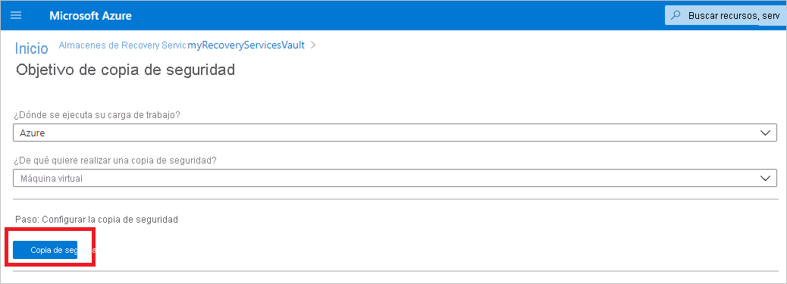
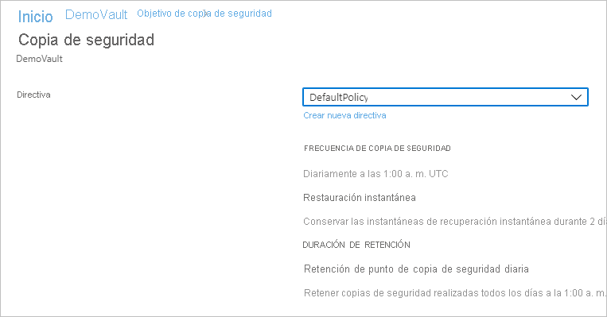
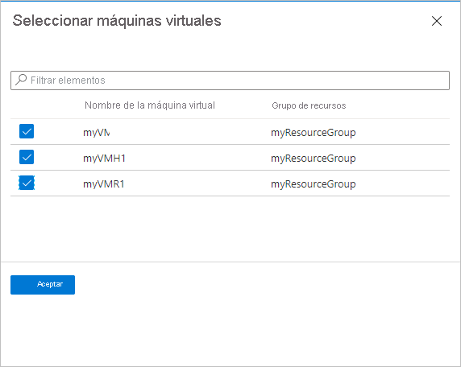
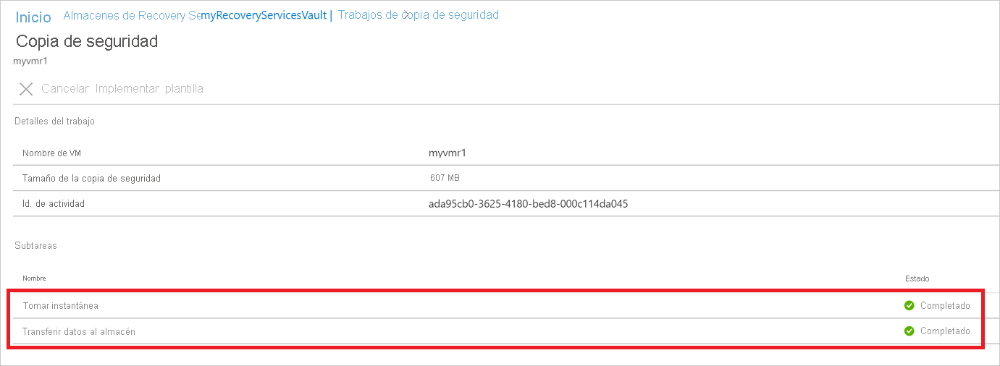

# Copia de seguridad de máquinas virtuales de Azure en un almacén de Recovery Services

En este artículo se describe cómo realizar una copia de seguridad de VM de Azure en un almacén de Recovery Services con el servicio [Azure Backup](backup-overview.md).

En este artículo aprenderá a:

> [!div class="checklist"]
>
> * Prepare las máquinas virtuales de Azure.
> * Crear un almacén.
> * Detecte VM y configure una directiva de copia de seguridad.
> * Habilite la copia de seguridad de VM de Azure.
> * Realizar la copia de seguridad inicial.

> [!NOTE]
> EN Este artículo describe cómo configurar un almacén y seleccionar VM para hacer una copia de seguridad. Resulta útil si desea realizar copias de seguridad de varias máquinas virtuales. Como alternativa, puede [realizar una copia de seguridad de una VM de Azure](backup-azure-vms-first-look-arm.md) directamente desde la configuración de la VM.

## Antes de comenzar

* [Revise](backup-architecture.md#architecture-built-in-azure-vm-backup) la arquitectura de copia de seguridad de máquinas virtuales de Azure.
* [Más información sobre](backup-azure-vms-introduction.md) la copia de seguridad de máquinas virtuales de Azure y la extensión de reserva.
* [Revise la matriz de compatibilidad](backup-support-matrix-iaas.md) antes de configurar la copia de seguridad.

Además, hay un par de cosas que puede que deba hacer en algunas circunstancias:

* **Instalar el agente de máquina virtual en la máquina virtual**: Azure Backup realiza una copia de seguridad de máquinas virtuales de Azure instalando una extensión en el agente de máquina virtual de Azure que se ejecuta en la máquina. Si la VM se creó a partir de una imagen de Azure Marketplace, el agente se instala y se ejecuta. Si crea una máquina virtual personalizada o migra una máquina local, es posible que deba [instalar el agente manualmente](#install-the-vm-agent).

[!INCLUDE [How to create a Recovery Services vault](../../includes/backup-create-rs-vault.md)]

### Modificar la replicación de almacenamiento

De forma predeterminada, los almacenes usan el [almacenamiento con redundancia geográfica (GRS)](../storage/common/storage-redundancy.md).

* Si el almacén es su mecanismo principal de copia de seguridad, le recomendamos que use GRS.
* Puede usar el [almacenamiento con redundancia local (LRS) ](../storage/common/storage-redundancy.md?toc=/azure/storage/blobs/toc.json) si busca una opción más barata.

Modifique el tipo de replicación de almacenamiento como se indica a continuación:

1. En la sección **Configuración** del nuevo almacén, seleccione **Propiedades**.
2. En **Propiedades**, en **Configuración de copia de seguridad**, seleccione **Actualizar**.
3. Seleccione el tipo de replicación almacenamiento y seleccione **Guardar**.

      

> [!NOTE]
   > No puede modificar el tipo de replicación de almacenamiento después de configurar el almacén y si este contiene elementos de copia de seguridad. Si quiere hacer esto, debe volver a crear el almacén.

## Aplicar una directiva de copia de seguridad

Configurar una directiva de copia de seguridad para el almacén.

1. En el almacén, seleccione **+ Copia de seguridad** en la sección **Introducción**.

   

1. En **Objetivo de copia de seguridad** >  **¿Dónde se ejecuta su carga de trabajo?** , seleccione **Azure**. En **What do you want to back up?** (¿De qué desea realizar una copia de seguridad?), seleccione **Máquina virtual** >  **Aceptar**. Esto registra la extensión de la máquina virtual en el almacén.

   

1. En **Directiva de copia de seguridad**, seleccione la directiva que desea asociar al almacén.
    * La directiva predeterminada hace una copia de seguridad de la VM una vez al día. Asimismo, las copias de seguridad diarias se conservan durante 30 días. Las instantáneas de recuperación instantánea se conservan durante dos días.

      

    * Si no quiere usar la directiva predeterminada, seleccione **Crear nueva** y cree una directiva personalizada tal como se describe en el siguiente procedimiento.

1. En **Máquinas virtuales**, seleccione **Agregar**.

      

1. El panel **Seleccionar máquinas virtuales** se abrirá. Seleccione las VM de las que quiere hacer una copia de seguridad con la directiva. Después, seleccione **Aceptar**.

   * Las VM seleccionadas son validadas.
   * Solo se puede seleccionar máquinas virtuales de la región en que se encuentre el almacén.
   * Las copias de seguridad de las máquinas virtuales solo se pueden realizar en un almacén individual.

     

    >[!NOTE]
    > Todas las máquinas virtuales de la misma región y suscripción que el almacén están disponibles para configurar la copia de seguridad. Al configurar la copia de seguridad, puede navegar al nombre de la máquina virtual y su grupo de recursos aunque no tenga el permiso necesario en esas máquinas virtuales. Si la máquina virtual está en estado de eliminación temporal, no se verá en esta lista. Si necesita volver a proteger la máquina virtual, debe esperar a que el período de eliminación temporal expire o recuperar la máquina virtual de la lista de eliminación temporal. Para más información, consulte el [artículo sobre la eliminación temporal de máquinas virtuales](soft-delete-virtual-machines.md#soft-delete-for-vms-using-azure-portal).

1. En **Copia de seguridad**, seleccione **Habilitar copia de seguridad** . Esto implementa la directiva en el almacén y las máquinas virtuales, e instala la extensión de copia de seguridad en el agente de máquina virtual que se ejecuta en la máquina virtual de Azure.

Después de habilitar la copia de seguridad:

* El servicio Backup instala la extensión de copia de seguridad tanto si la máquina virtual está en ejecución como si no lo está.
* Una copia de seguridad inicial se ejecutará según la programación de copia de seguridad.
* Cuando se ejecuten las copias de seguridad, tenga en cuenta que:
  * Una VM que se está ejecutando tiene una mayor oportunidad de capturar un punto de recuperación coherente con la aplicación.
  * Sin embargo, incluso si la VM está desactivada, se hace una copia de seguridad. Esa VM se conoce como una VM sin conexión. En este caso, el punto de recuperación será coherente frente a bloqueos.
* No se necesita conectividad de salida explícita para permitir la copia de seguridad de máquinas virtuales de Azure.

### Creación de una directiva personalizada

Si creó una nueva directiva de copia de seguridad, complete la configuración de la misma.

1. En **Nombre de directiva**, especifique un nombre descriptivo.
2. En **Programación de copia de seguridad**, especifique cuándo se deben realizar las copias de seguridad. Puede realizar copias de seguridad diarias o semanales para VM de Azure.
3. En **Restauración instantánea**, especifique cuánto tiempo quiere conservar las instantáneas localmente para la restauración instantánea.
    * Cuando realice la restauración, los discos de la VM con copia de seguridad se copian desde el almacén a través de la red, hasta la ubicación de almacenamiento de recuperación. Con la restauración instantánea, puede aprovechar las instantáneas almacenadas localmente y que se tomaron durante un trabajo de copia de seguridad, sin esperar a que los datos de la copia de seguridad se transfieran al almacén.
    * Puede conservar las instantáneas para la restauración instantánea durante uno y cinco días. Dos días es la configuración predeterminada.
4. En el **rango de retención** , especifique cuánto tiempo quiere conservar sus puntos de copia de seguridad diarios o semanales.
5. En **Retención del punto de copia de seguridad mensual** y **Retención del punto de copia de seguridad anual**, especifique si quiere mantener una copia de seguridad mensual o anual de sus copias de seguridad diarias o semanales.
6. Seleccione **Aceptar** para guardar la directiva.

    

> [!NOTE]
   > Azure Backup no admite el ajuste automático del reloj para los cambios de horario de verano para realizar copias de seguridad de máquinas virtuales de Azure. A medida que se produzcan cambios horarios, modifique las directivas de copia de seguridad manualmente según sea necesario.

## Desencadenar la copia de seguridad inicial

La copia de seguridad inicial se ejecutará según la programación, peor puede ejecutarla inmediatamente de la manera siguiente:

1. En el menú del almacén, seleccione **Elementos de copia de seguridad**.
2. En **Elementos de copia de seguridad**, seleccione **Máquina virtual de Azure**.
3. En la lista **Elementos de copia de seguridad**, seleccione el botón de puntos suspensivos (...).
4. Seleccione **Hacer copia de seguridad ahora**.
5. En **Realizar copia de seguridad ahora**, use el control del calendario para seleccionar el último día que debería retenerse el punto de recuperación. Después, seleccione **Aceptar**.
6. Supervise las notificaciones del portal. Puede supervisar el progreso del trabajo en el panel del almacén > **Trabajos de copia de seguridad** > **En curso**. Según el tamaño de la máquina virtual, la creación de la copia de seguridad inicial puede tardar un tiempo.

## Comprobar el estado del trabajo de copia de seguridad

Los detalles del trabajo de la copia de seguridad de cada una de las máquinas virtuales constan de dos fases: la fase **Instantánea** y, después, la fase **Transferir datos al almacén**. 
La primera de estas fases garantiza la disponibilidad de un punto de recuperación almacenado junto con los discos para realizar **Restauraciones instantáneas** y está disponibles un máximo de cinco días, en función del valor de conservación de instantáneas que haya configurado el usuario. Transferir datos al almacén crea un punto de recuperación en el almacén para la retención a largo plazo. La transferencia de datos al almacén solo comienza una vez que se completa la fase de instantánea.

  

Existen dos **tareas secundarias** que se ejecutan en el back-end; una de ellas se usa en el trabajo de copia de seguridad del front-end que se puede comprobar desde el panel de detalles de la **Tarea de copia de seguridad** como se indica a continuación:

  

La fase de **Transferencia de datos al almacén** puede tardar varios días en completarse, según el tamaño de los discos, la actividad de cada disco y otros factores.

El estado del trabajo puede variar según los siguientes escenarios:

**Instantánea** | **Transferir los datos al almacén** | **Estado del trabajo**
--- | --- | ---
Completed | En curso | En curso
Completed | Omitido | Completed
Completed | Completed | Completed
Completed | Con error | Completado con advertencia
Con error | Con error | Con error

Con esta capacidad y para la misma VM, se pueden ejecutar dos copias de seguridad en paralelo, pero en cualquier fase (instantánea, transferir datos al almacén) solo se puede ejecutar una subtarea. Por lo tanto, si un trabajo de copia de seguridad en curso produce un error en la copia de seguridad del día siguiente, este se evitará con esta funcionalidad de desacoplamiento. Las copias de seguridad del día siguiente pueden tener una instantánea completada, mientras que la opción **Transferir datos al almacén** se omite si el trabajo de copia de seguridad de un día anterior está en curso.
El punto de recuperación incremental creado en el almacén capturará toda la rotación desde el último punto de recuperación creado en ese almacén. Esto no costará nada al usuario.

## Pasos opcionales

### Instalar el agente de máquina virtual

Azure Backup realiza una copia de seguridad de máquinas virtuales de Azure instalando una extensión en el agente de máquina virtual de Azure que se ejecuta en la máquina. Si la VM se creó a partir de una imagen de Azure Marketplace, el agente se instala y se ejecuta. Si creó una VM personalizada o migra una máquina local, es posible que deba instalar el agente manualmente.

**VM** | **Detalles**
--- | ---
**Windows** | 1. [Descargue e instale](https://go.microsoft.com/fwlink/?LinkID=394789&clcid=0x409) el archivo MSI del agente.   2. Realice la instalación con permisos de administrador en el equipo.   3. Compruebe la instalación. En *C:\WindowsAzure\Packages* en la VM, haga clic con el botón derecho en **WaAppAgent.exe** > **Propiedades**. En la pestaña **Detalles**, la **versión del producto** debe ser 2.6.1198.718 o superior.   Si va a actualizar el agente, asegúrese de que no se ejecuta ninguna operación de copia de seguridad y [vuelva a instalar el agente](https://go.microsoft.com/fwlink/?LinkID=394789&clcid=0x409).
**Linux** | Realice la instalación con un paquete de RPM o DEB del repositorio de paquetes de su distribución. Este es el método preferido para instalar y actualizar el agente Linux de Azure. Todos los [proveedores de distribución aprobada](../virtual-machines/linux/endorsed-distros.md) integran el paquete de agente Linux de Azure en sus imágenes y repositorios. El agente está disponible en [GitHub](https://github.com/Azure/WALinuxAgent), pero no se recomienda instalarlo desde allí.   Si va a actualizar el agente, asegúrese de que no se ejecuta ninguna operación de copia de seguridad y actualice los archivos binarios.

## Pasos siguientes

* Solucione todos los problemas que se produzcan con los [agentes de VM de Azure](backup-azure-troubleshoot-vm-backup-fails-snapshot-timeout.md) o con la [copia de seguridad de VM de Azure](backup-azure-vms-troubleshoot.md).
* [Restaure](backup-azure-arm-restore-vms.md) las VM de Azure.
