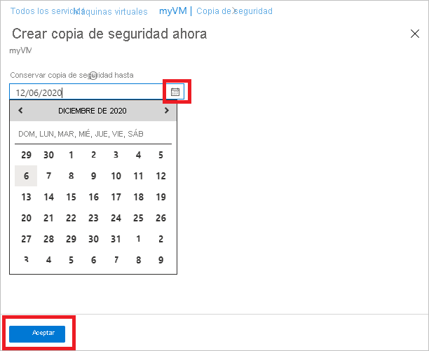

# Administración de las copias de seguridad de máquina virtual de Azure con el servicio Azure Backup

En este artículo se describe cómo administrar máquinas virtuales (VM) de Azure cuya copia de seguridad se realiza con el [servicio Azure Backup](backup-overview.md). El artículo también resume la información de copia de seguridad que puede encontrar en el panel del almacén.

En Azure Portal, el panel Almacén de Recovery Services proporciona acceso a información sobre el almacén, como:

* La última copia de seguridad, que también es el punto de restauración más reciente
* La directiva de copia de seguridad.
* El tamaño total de todas las instantáneas de copia de seguridad.
* El número de máquinas virtuales habilitadas para la copia de seguridad.

Puede administrar copias de seguridad mediante el panel y por medio de la exploración en profundidad hasta las máquinas virtuales individuales. Para empezar las copias de seguridad de la máquina, abra el almacén en el panel.

## Visualización de máquinas virtuales en el panel

Para ver las máquinas virtuales en el panel:

1. Inicie sesión en [Azure Portal](https://portal.azure.com/).
1. En el menú izquierdo, seleccione **Todos los servicios**.

    

1. En el cuadro de diálogo **Todos los servicios**, escriba *Recovery Services*. La lista de recursos se filtra en función de lo que especifique. En la lista de recursos, seleccione **Almacenes de Recovery Services**.

    

    Aparece la lista de almacenes de Recovery Services de la suscripción.

1. Para facilitar su uso, seleccione el icono de anclaje situado junto al nombre del almacén y seleccione **Anclar al panel**.
1. Abra el panel del almacén.

    

1. En el icono **Elementos de copia de seguridad**, seleccione **Máquina virtual de Azure**.

    

1. En el panel **Elementos de copia de seguridad**, puede ver la lista de máquinas virtuales protegidas. En este ejemplo, el almacén protege una máquina virtual: *myVMR1*.  

    

1. Desde el panel de elementos del almacén, puede modificar las directivas de copia de seguridad, ejecutar una copia de seguridad a petición, detener o reanudar la protección de las máquinas virtuales, eliminar los datos de copia de seguridad, ver los puntos de restauración y ejecutar una restauración.

    

## Administración de la directiva de copia de seguridad de una máquina virtual

### Modificación de la directiva de copia de seguridad

Para modificar una directiva de copia de seguridad existente:

1. Inicie sesión en [Azure Portal](https://portal.azure.com/). Abra el panel del almacén.
2. En **Administrar > Directivas de copia de seguridad**, seleccione la directiva de copia de seguridad para el tipo **Máquina virtual de Azure**.
3. Seleccione **Modificar** y cambie la configuración.

### Modificación de la directiva de copia de seguridad

Para administrar una directiva de copia de seguridad:

1. Inicie sesión en [Azure Portal](https://portal.azure.com/). Abra el panel del almacén.
2. En el icono **Elementos de copia de seguridad**, seleccione **Máquina virtual de Azure**.

    

3. En la hoja **Elementos de copia de seguridad**, puede ver la lista de máquinas virtuales protegidas y el estado de la última copia de seguridad con la hora de los puntos de restauración más recientes.

    

4. Desde el panel del elemento del almacén, puede seleccionar una directiva de copia de seguridad.

   * Para cambiar las directivas, seleccione una diferente y, después, seleccione **Guardar**. La nueva directiva se aplica inmediatamente en el almacén.

     

## Ejecución de una copia de seguridad a petición

Puede ejecutar una copia de seguridad a petición de una máquina virtual después de configurar su protección. Tenga en cuenta estos detalles:

* Si está pendiente la copia de seguridad inicial, la copia de seguridad a petición creará una copia completa de la máquina virtual en el almacén de Recovery Services.
* Si se ha completado la copia de seguridad inicial, una copia de seguridad a petición solo enviará los cambios respecto a la instantánea anterior al almacén de Recovery Services. Es decir, las copias de seguridad posteriores siempre son incrementales.
* La duración de retención para una copia de seguridad a petición es el valor de retención que especificó al desencadenar la copia de seguridad diaria.

> [!NOTE]
> El servicio de Azure Backup admite hasta nueve copias de seguridad a petición al día, pero Microsoft recomienda no más de cuatro copias de seguridad diarias a petición para garantizar el máximo rendimiento.

Para desencadenar una copia de seguridad a petición:

1. En el [panel del elemento del almacén](#view-vms-on-the-dashboard), en **Elemento protegido**, seleccione **Elemento de copia de seguridad**.

    

2. En **Tipo de administración de copias de seguridad**, seleccione **Azure Virtual Machine**. Aparece el panel **Elemento de copia de seguridad (Azure Virtual Machine)** .
3. Seleccione una máquina virtual y, después, **Crear copia de seguridad ahora** para crear una copia de seguridad a petición. Aparece el panel **Crear copia de seguridad ahora**.
4. En el campo **Conservar copia de seguridad hasta**, especifique una fecha para la copia de seguridad que se conservará.

    

5. Seleccione **Aceptar** para ejecutar el trabajo de copia de seguridad.

Para realizar un seguimiento del progreso del trabajo, en el panel del almacén, seleccione el icono **Trabajos de copia de seguridad**.

## Eliminar la protección de una máquina virtual

Hay dos formas de detener la protección de una máquina virtual:

* **Detener la protección y conservar los datos de copia de seguridad**. Esta opción detendrá la protección para todos los trabajos de copia de seguridad futuros de la máquina virtual. Sin embargo, el servicio Azure Backup conservará los puntos de recuperación de los que se ha realizado una copia de seguridad.  Deberá pagar para mantener los puntos de recuperación en el almacén (consulte [Precios de Azure Backup](https://azure.microsoft.com/pricing/details/backup/) para obtener detalles). Podrá restaurar la máquina virtual si es necesario. Si decide reanudar la protección de máquina virtual, podrá usar la opción *Reanudar copia de seguridad*.
* **Detener la protección y eliminar los datos de copia de seguridad**. Esta opción hará que todos los trabajos de copia de seguridad futuros dejen de proteger la máquina virtual y eliminará todos los puntos de recuperación. No podrá restaurar la máquina virtual ni usar la opción *Reanudar copia de seguridad*.

>[!NOTE]
>Si elimina un origen de datos sin detener las copias de seguridad, las nuevas copias de seguridad producirán errores. Los puntos de recuperación anteriores expirarán según la directiva, pero siempre se mantendrá el punto de recuperación más reciente hasta que detenga la copia de seguridad y elimine los datos.
>

### Detener la protección y conservar los datos de copia de seguridad

Para detener la protección y conservar los datos de una máquina virtual:

1. En el [panel del elemento del almacén](#view-vms-on-the-dashboard), seleccione **Detener copia de seguridad**.
2. Elija **Retener datos de copia de seguridad** y confirme su selección según sea necesario. Agregue un comentario si lo desea. Si no está seguro del nombre del elemento, mantenga el mouse sobre el signo de exclamación para verlo.

    

Una notificación le confirma que se han detenido los trabajos de copia de seguridad.

### Detener la protección y eliminar los datos de copia de seguridad

Para detener la protección y eliminar los datos de una máquina virtual:

1. En el [panel del elemento del almacén](#view-vms-on-the-dashboard), seleccione **Detener copia de seguridad**.
2. Elija **Eliminar datos de la copia de seguridad** y confirme su selección según sea necesario. Escriba el nombre del elemento de copia de seguridad y agregue un comentario si lo desea.

    

> [!NOTE]
> Una vez completada la operación de eliminación, los datos de copia de seguridad se conservarán durante 14 días en el [estado de eliminación temporal](./soft-delete-virtual-machines.md).  Además, también puede [habilitar o deshabilitar la eliminación temporal](./backup-azure-security-feature-cloud.md#enabling-and-disabling-soft-delete).

## Reanudación de la protección de una máquina virtual

Si ha elegido la opción para [detener la protección y conservar los datos de copia de seguridad](#stop-protection-and-retain-backup-data) durante la detención de la protección de la máquina virtual, puede usar **Reanudar copia de seguridad**. Esta opción no está disponible si elige la opción [Detener la protección y eliminar los datos de copia de seguridad](#stop-protection-and-delete-backup-data) o [Eliminar datos de la copia de seguridad](#delete-backup-data).

Para reanudar la protección para una máquina virtual:

1. En el [panel del elemento del almacén](#view-vms-on-the-dashboard), seleccione **Reanudar copia de seguridad**.

2. Siga los pasos de [Administrar directivas de copia de seguridad](#manage-backup-policy-for-a-vm) para asignar la directiva para la máquina virtual. No es necesario elegir la directiva de protección inicial de la máquina virtual.
3. Después de aplicar la directiva de copia de seguridad a la máquina virtual, consulte el siguiente mensaje:

    

## Eliminación de datos de copia de seguridad

Hay dos formas de eliminar los datos de copia de seguridad de una máquina virtual:

* En el panel de un elemento del almacén, seleccione Detener copia de seguridad y siga las instrucciones para la opción de [detención de la protección y eliminación de los datos de copia de seguridad](#stop-protection-and-delete-backup-data).

  

* En el panel del elemento del almacén, seleccione Eliminar datos de la copia de seguridad. Esta opción estaría habilitada si hubiera elegido la opción de [Detener la protección y conservar los datos de copia de seguridad](#stop-protection-and-retain-backup-data) durante la detención de la protección de la máquina virtual.

  

  * En el [panel del elemento del almacén](#view-vms-on-the-dashboard), seleccione **Eliminar copia de seguridad**.
  * Escriba el nombre del elemento de copia de seguridad para confirmar que desea eliminar los puntos de recuperación.

    

  * Para eliminar los datos de copia de seguridad para el elemento, seleccione **Eliminar**. Un mensaje de notificación le confirma que se han eliminado los datos de copia de seguridad.

Para proteger los datos, Azure Backup incluye la característica de eliminación temporal. Con la eliminación temporal, incluso después de que se elimine la copia de seguridad (todos los puntos de recuperación) de una máquina virtual, los datos de copia de seguridad se conservan durante otros 14 días. Para más información, consulte la [documentación sobre eliminación temporal](./backup-azure-security-feature-cloud.md).

  > [!NOTE]
  > Si elimina los datos de copia de seguridad, se eliminarán todos los puntos de recuperación asociados. No puede elegir puntos de recuperación específicos para su eliminación.

### Elemento de copia de seguridad en el que ya no existe el origen de datos principal

* Si las máquinas virtuales de Azure configuradas para Azure Backup se eliminan o se mueven sin detener la protección, los trabajos de copia de seguridad programados y a petición (ad hoc) generarán el error UserErrorVmNotFoundV2. La comprobación previa de la copia de seguridad aparecerá como crítica solo para los trabajos de copia de seguridad a petición con errores (no se muestran los trabajos programados con errores).
* Estos elementos de copia de seguridad permanecen activos en el sistema que se adhiere a la directiva de copia de seguridad y retención establecida por el usuario. Los datos de copia de seguridad de estas máquinas virtuales de Azure se conservarán según la directiva de retención. Los puntos de recuperación expirados (excepto el punto de recuperación más reciente) se limpian según el intervalo de retención establecido en la directiva de copia de seguridad.
* Si los datos o elementos de copia de seguridad de los recursos de eliminación ya no son necesarios, ya que el punto de recuperación más reciente se mantiene indefinidamente y al usuario se le cobra según los precios de copia de seguridad aplicables, se recomienda eliminar los elementos de copia de seguridad en los que ya no exista el origen de datos principal para evitar costos adicionales.

## Pasos siguientes

* Obtenga información sobre cómo [crear la copia de seguridad de máquinas virtuales de Azure desde la configuración de la máquina virtual](backup-azure-vms-first-look-arm.md).
* Aprenda a [restaurar máquinas virtuales](backup-azure-arm-restore-vms.md).
* Aprenda a [supervisar las copias de seguridad de las máquinas virtuales de Azure](./backup-azure-monitoring-built-in-monitor.md).
