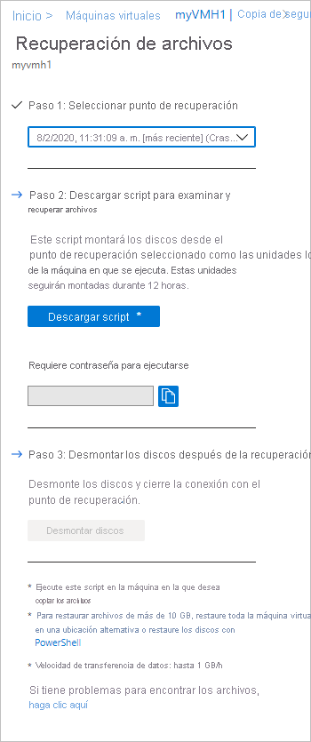
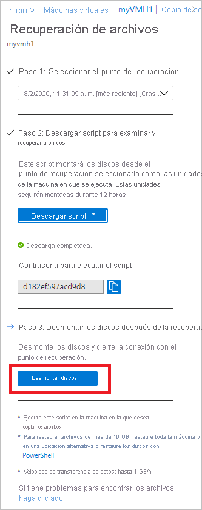

# <a name="recover-files-from-azure-virtual-machine-backup"></a>Recuperación de archivos desde una copia de seguridad de máquina virtual de Azure

Azure Backup ofrece la funcionalidad de restauración de [discos y máquinas virtuales de Azure](./backup-azure-arm-restore-vms.md) desde copias de seguridad de máquina virtual de Azure, también conocidos como puntos de recuperación. En este artículo se explica cómo recuperar archivos y carpetas desde una copia de seguridad de máquina virtual de Azure. La restauración de archivos y carpetas está disponible unicamente para las máquinas virtuales de Azure implementadas con el modelo de Resource Manager y protegidas en un almacén de Recovery Services.


> [!NOTE]
> Esta característica está disponible en las máquinas virtuales de Azure implementadas con el modelo de Resource Manager y protegidas en un almacén de Recovery Services.
> No es posible recuperar archivos a partir de una copia de seguridad de máquina virtual cifrada.
>


## <a name="step-1-generate-and-download-script-to-browse-and-recover-files"></a>Paso 1: Generar y descargar el script para examinar y recuperar archivos

Para restaurar archivos o carpetas desde el punto de recuperación, vaya a la máquina virtual y realice los pasos siguientes:

1. Inicie sesión en [Azure Portal](https://portal.Azure.com) y, en el panel izquierdo, seleccione **Máquinas virtuales**. En la lista de máquinas virtuales, seleccione la que desee para abrir su panel.

2. En el menú de la máquina virtual, seleccione **Backup** para abrir el panel de Backup.

    

3. En el menú del panel de Backup, seleccione **Recuperación de archivos**.

    

    Se abre el menú **Recuperación de archivos**.

    

4. En el menú desplegable **Seleccionar punto de recuperación**, elija el punto de recuperación que contiene los archivos que desee. De forma predeterminada, el punto de recuperación más reciente ya está seleccionado.

5. Seleccione **Descargar ejecutable** (para máquinas virtuales Windows de Azure) o **Descargar script** (para máquinas virtuales Linux de Azure, se genera un script de Python) si desea descargar el software para copiar archivos desde el punto de recuperación.

    

    Azure descarga el archivo ejecutable o el script en el equipo local.

    

    Para ejecutar el archivo ejecutable o el script como administrador, se recomienda guardar el archivo descargado en el equipo.

6. El archivo ejecutable o el script están protegido con contraseña y es obligatoria. En el menú **Recuperación de archivos**, seleccione el botón de copia para cargar la contraseña en la memoria.

    


## <a name="step-2-ensure-the-machine-meets-the-requirements-before-executing-the-script"></a>Paso 2: Asegurarse de que la máquina cumple los requisitos antes de ejecutar el script

Una vez que el script se haya descargado correctamente, asegúrese de que tiene el equipo correcto para ejecutarlo. La máquina virtual en la que pretende ejecutar el script no debe tener ninguna de las siguientes configuraciones no admitidas. Si tiene alguna de esas configuraciones, elija una máquina alternativa preferiblemente de la misma región que cumpla los requisitos.  

### <a name="dynamic-disks"></a>Discos dinámicos

No se puede ejecutar el script ejecutable en la máquina virtual con cualquiera de las siguientes características:

- Volúmenes que abarquen varios discos (volúmenes distribuidos y seccionados).
- Volúmenes que toleren errores (volúmenes reflejados y RAID-5) en discos dinámicos.

### <a name="windows-storage-spaces"></a>Espacios de almacenamiento de Windows

No se puede ejecutar el ejecutable descargado en la máquina virtual que está configurada para espacios de almacenamiento de Windows.

### <a name="virtual-machine-backups-having-large-disks"></a>Copias de seguridad de máquinas virtuales con discos de gran tamaño

Si el equipo del que se ha realizado una copia de seguridad tiene un gran número de discos (>16) o discos grandes (>4 TB cada uno), no se recomienda ejecutar el script en la misma máquina para la restauración, ya que tendrá un impacto significativo en la máquina virtual. En su lugar, se recomienda tener una máquina virtual independiente solo para la recuperación de archivos (máquinas virtuales D2v3 de Azure VM) y, después, cerrarla cuando no sea necesaria. 

## <a name="step-3-os-requirements-to-successfully-run-the-script"></a>Paso 3: Requisitos del sistema operativo para ejecutar el script correctamente

La máquina virtual en la que desea ejecutar el script descargado debe cumplir los siguientes requisitos.

### <a name="for-windows-os"></a>Para sistemas operativos Windows

En la siguiente tabla se muestra la compatibilidad entre los sistemas operativos de servidor y equipo. Al recuperar archivos, no podrá restaurar archivos a una versión anterior o posterior del sistema operativo. Por ejemplo, no puede restaurar un archivo de una máquina virtual Windows Server 2016 a una Windows Server 2012 o un equipo con Windows 8. Puede restaurar archivos de una máquina virtual al mismo sistema operativo de servidor o a uno de cliente compatible.

|Sistema operativo de servidor | Sistema operativo de cliente compatible  |
| --------------- | ---- |
| Windows Server 2019    | Windows 10 |
| Windows Server 2016    | Windows 10 |
| Windows Server 2012 R2 | Windows 8.1 |
| Windows Server 2012    | Windows 8  |
| Windows Server 2008 R2 | Windows 7   |

### <a name="for-linux-os"></a>Para SO Linux

En Linux, el sistema operativo del equipo usado para restaurar archivos debe admitir el sistema de archivos de la máquina virtual protegida. Al seleccionar un equipo para ejecutar el script, asegúrese de que este tiene un sistema operativo compatible y utiliza una de las versiones de la tabla siguiente:

|SO Linux | Versiones  |
| --------------- | ---- |
| Ubuntu | 12.04 y posterior |
| CentOS | 6.5 y posterior  |
| RHEL | 6.7 y posterior |
| Debian | 7 y posterior |
| Oracle Linux | 6.4 y posterior |
| SLES | 12 y posterior |
| openSUSE | 42.2 y posterior |

> [!NOTE]
> Hemos identificado algunos problemas al ejecutar el script de recuperación de archivos en máquinas con el sistema operativo SLES 12 SP4 y se están investigando con el equipo de SLES.
> Actualmente, la ejecución del script de recuperación de archivos funciona en máquinas con versiones de sistema operativo de SLES 12 SP2 y SP3.
>

El script también requiere los componentes Python y Bash para realizar la ejecución y la conexión al punto de recuperación con seguridad.

|Componente | Versión  |
| --------------- | ---- |
| Bash | 4 y posterior |
| Python | 2.6.6 y posterior  |
| TLS | Se debe admitir 1.2  |

## <a name="step-4-access-requirements-to-successfully-run-the-script"></a>Paso 4: Requisitos de acceso para ejecutar el script correctamente

Si lo hace en un equipo con acceso restringido, asegúrese de que hay acceso a los siguientes recursos:

- `download.microsoft.com`
- Direcciones URL del servicio de recuperación (GEO-NAME hace referencia a la región donde reside el almacén de Recovery Services)
  - `https://pod01-rec2.GEO-NAME.backup.windowsazure.com` (Para todas las regiones públicas de Azure)
  - `https://pod01-rec2.GEO-NAME.backup.windowsazure.cn` (Para Azure China 21Vianet)
  - `https://pod01-rec2.GEO-NAME.backup.windowsazure.us` (Para Azure US Gov)
  - `https://pod01-rec2.GEO-NAME.backup.windowsazure.de` (Para Azure Alemania)
- Puertos de salida 53 (DNS), 443, 3260

> [!NOTE]
>
> El archivo de script que descargó en el paso 1 [anterior](#step-1-generate-and-download-script-to-browse-and-recover-files) tendrá **geo-name** en el nombre del archivo. Use ese **geo-name** para rellenar la dirección URL. El nombre del script descargado comenzará por: \'VMname\'\_\'geoname\'_\'GUID\'.<br><br>
> Por ejemplo, si el nombre de archivo del script es *ContosoVM_wcus_12345678*, **geo-name** es *wcus* y la dirección URL será:<br> <https://pod01-rec2.wcus.backup.windowsazure.com>
>

En el caso de Linux, el script requiere los componentes "open-iscsi" e "lshw" para conectar con el punto de recuperación. Si los componentes no existen en el equipo donde se ejecuta el script, este solicita permiso para instalarlos. Otorgue el consentimiento para instalar los componentes necesarios.

El acceso a `download.microsoft.com` es necesario para descargar los componentes que se utilizan para crear un canal seguro entre la máquina donde se ejecuta el script y los datos en el punto de recuperación.


## <a name="step-5-running-the-script-and-identifying-volumes"></a>Paso 5: Ejecución del script e identificar volúmenes

### <a name="for-windows"></a>Para Windows

Después de cumplir todos los requisitos enumerados en los pasos 2, 3 y 4, copie el script que se encuentra en la ubicación descargada (normalmente, la carpeta Descargas), haga clic con el botón derecho en el archivo ejecutable o el script y ejecútelo con credenciales de administrador. Cuando se le solicite, escriba la contraseña o péguela de la memoria y presione Entrar. Una vez que se escriba la contraseña válida, el script se conecta al punto de recuperación.

  


Al ejecutar el archivo ejecutable, el sistema operativo monta los nuevos volúmenes y asigna letras de unidad. Puede usar el Explorador de Windows o el Explorador de archivos para buscar esas unidades. Las letras de unidad asignadas a los volúmenes no pueden ser las mismas que las de la máquina virtual original. Sin embargo, se conserva el nombre del volumen. Por ejemplo, si el volumen de la máquina virtual original era "Data Disk (E:`\`)", ese volumen se puede conectar al equipo local como "Data Disk ('cualquier letra':`\`)". Busque en todos los volúmenes que se mencionan en la salida del script hasta que encuentre sus archivos o carpeta.  

   

**Para máquinas virtuales de las que se ha hecho una copia de seguridad con discos de gran tamaño (Windows)**

Si el proceso de recuperación de archivos se bloquea después de ejecutar el script de restauración de archivos (los discos no se montan nunca o se montan pero no aparecen los volúmenes), realice los pasos siguientes:
  
1. Asegúrese de que el sistema operativo sea Windows Server 2012 o posterior.
2. Asegúrese de que las claves del Registro se establecen como se sugiere a continuación en el servidor de restauración y asegúrese de reiniciar el servidor. El número situado junto al GUID puede oscilar entre 0001 y 0005. En el ejemplo siguiente, es 0004. Navegue por la ruta de acceso de la clave del Registro hasta la sección de parámetros.

    

```registry
- HKEY_LOCAL_MACHINE\SYSTEM\CurrentControlSet\Services\Disk\TimeOutValue – change this from 60 to 1200
- HKEY_LOCAL_MACHINE\SYSTEM\ControlSet001\Control\Class\{4d36e97b-e325-11ce-bfc1-08002be10318}\0003\Parameters\SrbTimeoutDelta – change this from 15 to 1200
- HKEY_LOCAL_MACHINE\SYSTEM\ControlSet001\Control\Class\{4d36e97b-e325-11ce-bfc1-08002be10318}\0003\Parameters\EnableNOPOut – change this from 0 to 1
- HKEY_LOCAL_MACHINE\SYSTEM\ControlSet001\Control\Class\{4d36e97b-e325-11ce-bfc1-08002be10318}\0003\Parameters\MaxRequestHoldTime - change this from 60 to 1200
```

### <a name="for-linux"></a>Para Linux

En el caso de las máquinas Linux, se genera un script de Python. Descargue el script y cópielo en el servidor Linux pertinente o compatible. Es posible que haya que modificar los permisos para ejecutarlo con ```chmod +x <python file name>```. Luego se ejecuta el archivo de Python con ```./<python file name>```.


En Linux, los volúmenes del punto de recuperación se montan en la carpeta en que se ejecuta el script. Los discos conectados, los volúmenes y las rutas de acceso de montaje correspondientes se muestran según corresponda. Los usuarios con acceso en el nivel raíz pueden ver estas rutas de acceso de montaje. Examine los volúmenes mencionados en la salida del script.

  


**Para máquinas virtuales de las que se ha hecho una copia de seguridad con discos de gran tamaño (Linux)**

Si el proceso de recuperación de archivos se bloquea después de ejecutar el script de restauración de archivos (los discos no se montan nunca o se montan pero no aparecen los volúmenes), realice los pasos siguientes:

1. En el archivo /etc/iscsi/iscsid.conf, cambie la configuración de:
    - `node.conn[0].timeo.noop_out_timeout = 5` a `node.conn[0].timeo.noop_out_timeout = 30`
2. Tras realizar los cambios anteriores, vuelva a ejecutar el script. Si hay errores transitorios, asegúrese de que haya un intervalo de entre 20 y 30 minutos entre las ejecuciones para evitar ráfagas sucesivas de solicitudes que afecten a la preparación del destino. Este intervalo entre ejecuciones garantizará que el destino está listo para la conexión desde el script.
3. Después de la recuperación de archivos, asegúrese de volver al portal y seleccione **Desmontar discos** en los puntos de recuperación en los que no se pudieron montar los volúmenes. En esencia, este paso limpiará cualquier proceso o sesión y aumentará la posibilidad de recuperación.


#### <a name="lvmraid-arrays-for-linux-vms"></a>Matrices LVM/RAID (para máquinas virtuales Linux)

En Linux, las matrices Logical Volume Manager (LVM)/RAID del software se usan para administrar volúmenes lógicos en varios discos. En caso de que la máquina virtual Linux protegida use las matrices LVM o RAID, no podrá ejecutar el script en la misma máquina virtual.<br>
En su lugar, ejecútelo en cualquier otra máquina que tenga un sistema operativo compatible y que admita el sistema de archivos de la máquina virtual protegida.<br>
En la salida del script siguiente se muestran los volúmenes y los discos de las matrices LVM o RAID con el tipo de partición.

   

Para poner en línea estas particiones, ejecute los comandos de las secciones siguientes.

#### <a name="for-lvm-partitions"></a>Para particiones de LVM

Una vez que se ejecuta el script, las particiones de LVM se montan en los discos o volúmenes físicos especificados en la salida del script. El proceso consiste en lo siguiente:

1. Obtenga la lista única de nombres de grupos de volúmenes de los discos o volúmenes físicos.
2. A continuación, enumere los volúmenes lógicos de esos grupos de volúmenes.
3. A continuación, monte los volúmenes lógicos en una ruta de acceso deseada.

##### <a name="listing-volume-group-names-from-physical-volumes"></a>Enumeración de los nombres de grupos de volúmenes de volúmenes físicos

Para enumerar los nombres de grupos de volúmenes:

```bash
pvs -o +vguuid
```

Este comando enumerará todos los volúmenes físicos (incluidos los presentes antes de ejecutar el script), los nombres de los grupos de volúmenes correspondientes y los identificadores de usuario únicos (UUID) del grupo de volúmenes. A continuación se muestra un resultado de ejemplo del comando.

```bash
PV         VG        Fmt  Attr PSize   PFree    VG UUID

  /dev/sda4  rootvg    lvm2 a--  138.71g  113.71g EtBn0y-RlXA-pK8g-de2S-mq9K-9syx-B29OL6

  /dev/sdc   APPvg_new lvm2 a--  <75.00g   <7.50g njdUWm-6ytR-8oAm-8eN1-jiss-eQ3p-HRIhq5

  /dev/sde   APPvg_new lvm2 a--  <75.00g   <7.50g njdUWm-6ytR-8oAm-8eN1-jiss-eQ3p-HRIhq5

  /dev/sdf   datavg_db lvm2 a--   <1.50t <396.50g dhWL1i-lcZS-KPLI-o7qP-AN2n-y2f8-A1fWqN

  /dev/sdd   datavg_db lvm2 a--   <1.50t <396.50g dhWL1i-lcZS-KPLI-o7qP-AN2n-y2f8-A1fWqN
```

La primera columna (PV) muestra el volumen físico, las columnas siguientes muestran el nombre del grupo de volúmenes, el formato, los atributos, el tamaño, el espacio libre y el identificador único del grupo de volúmenes correspondientes. La salida del comando muestra todos los volúmenes físicos. Consulte la salida del script e identifique los volúmenes relacionados con la copia de seguridad. En el ejemplo anterior, la salida del script habría mostrado/dev/sdf y /dev/sdd. Por lo tanto, el grupo de volúmenes *datavg_db* pertenece al script y el grupo de volúmenes *Appvg_new* pertenece a la máquina. La idea final es asegurarse de que un nombre de grupo de volúmenes único debe tener un identificador único.

###### <a name="duplicate-volume-groups"></a>Duplicación de grupos de volúmenes

Hay escenarios en los que los nombres de los grupos de volúmenes pueden tener dos UUID después de ejecutar el script. Esto significa que los nombres de los grupos de volúmenes de la máquina donde se ejecutó el script y de la máquina virtual para la que se ha realizado una copia de seguridad son los mismos. En tal caso, es necesario cambiar el nombre de los grupos de volúmenes de las máquinas virtuales de las que se ha realizado una copia de seguridad. Observe el ejemplo siguiente.

```bash
PV         VG        Fmt  Attr PSize   PFree    VG UUID

  /dev/sda4  rootvg    lvm2 a--  138.71g  113.71g EtBn0y-RlXA-pK8g-de2S-mq9K-9syx-B29OL6

  /dev/sdc   APPvg_new lvm2 a--  <75.00g   <7.50g njdUWm-6ytR-8oAm-8eN1-jiss-eQ3p-HRIhq5

  /dev/sde   APPvg_new lvm2 a--  <75.00g   <7.50g njdUWm-6ytR-8oAm-8eN1-jiss-eQ3p-HRIhq5

  /dev/sdg   APPvg_new lvm2 a--  <75.00g  508.00m lCAisz-wTeJ-eqdj-S4HY-108f-b8Xh-607IuC

  /dev/sdh   APPvg_new lvm2 a--  <75.00g  508.00m lCAisz-wTeJ-eqdj-S4HY-108f-b8Xh-607IuC

  /dev/sdm2  rootvg    lvm2 a--  194.57g  127.57g efohjX-KUGB-ETaH-4JKB-MieG-EGOc-XcfLCt
```

La salida del script habría sido /dev/sdg, /dev/sdh, /dev/sdm2 como se indica anteriormente. Por lo tanto, los nombres de VG correspondientes son Appvg_new y rootvg. Sin embargo, los mismos nombres también están presentes en la lista de VG de la máquina. Se puede observar que un nombre de VG tiene dos UUID.

Ahora se deben cambiar los nombres de VG para los volúmenes basados en el script, por ejemplo /dev/sdg, /dev/sdh y /dev/sdm2. Para cambiar el nombre del grupo de volúmenes, use el comando siguiente:

```bash
vgimportclone -n rootvg_new /dev/sdm2
vgimportclone -n APPVg_2 /dev/sdg /dev/sdh
```

Ahora todos los nombres de VG tienen identificadores únicos.

###### <a name="active-volume-groups"></a>Grupos de volúmenes activos

Asegúrese de que los grupos de volúmenes correspondientes a los volúmenes del script están activos. El comando siguiente se usa para mostrar los grupos de volúmenes activos. Compruebe si los grupos de volúmenes relacionados con el script están presentes en esta lista.

```bash
vgdisplay -a
```  

De lo contrario, active el grupo de volúmenes mediante el siguiente comando.

```bash
#!/bin/bash
vgchange –a y  <volume-group-name>
```

##### <a name="listing-logical-volumes-within-volume-groups"></a>Enumeración de volúmenes lógicos dentro de grupos de volúmenes

Tras obtener la lista única de grupos de volúmenes activos relacionados con el script, se pueden enumerar los volúmenes lógicos presentes en esos grupos de volúmenes mediante el siguiente comando.

```bash
#!/bin/bash
lvdisplay <volume-group-name>
```

Este comando muestra la ruta de acceso de cada volumen lógico como "LV Path".

##### <a name="mounting-logical-volumes"></a>Montaje de volúmenes lógicos

Para montar los volúmenes lógicos en la ruta de acceso de su elección:

```bash
#!/bin/bash
mount <LV path from the lvdisplay cmd results> </mountpath>
```

> [!WARNING]
> No utilice "mount-a". Este comando monta todos los dispositivos descritos en "/etc/fstab". Esto podría hacer que se montaran dispositivos duplicados. Los datos se pueden redirigir a dispositivos creados por un script, que no los conserva y, por tanto, podría producirse una pérdida de datos.

#### <a name="for-raid-arrays"></a>Para matrices RAID

El siguiente comando muestra los detalles sobre todos los discos RAID:

```bash
#!/bin/bash
mdadm –detail –scan
```

 El disco RAID pertinente se muestra como `/dev/mdm/<RAID array name in the protected VM>`.

Use el comando Montar si el disco RAID tiene volúmenes físicos:

```bash
#!/bin/bash
mount [RAID Disk Path] [/mountpath]
```

Si el disco RAID tiene otra LVM configurada, utilice el procedimiento anterior para las particiones de LVM, pero con el nombre de volumen en lugar del nombre de disco RAID.

## <a name="step-6-closing-the-connection"></a>Paso 6: Cierre de la conexión

Después de identificar los archivos y copiarlos en una ubicación de almacenamiento local, quite (o desmonte) las unidades adicionales. Para desmontar las unidades, en el menú **Recuperación de archivos** de Azure Portal, seleccione **Desmontar discos**.



Cuando los discos estén desmontados, recibirá un mensaje. Puede tardar unos minutos en actualizarse la conexión para que pueda quitar los discos.

En Linux, cuando se corta la conexión con el punto de recuperación, el sistema operativo no elimina las rutas de acceso de montaje correspondientes automáticamente. Las rutas de acceso de montaje adoptan la forma de volúmenes "huérfanos" y se pueden ver, pero se genera un error al acceder a los archivos o al escribir en ellos. Se pueden quitar manualmente. Cuando el script se ejecuta, este identifica todos los volúmenes existentes desde todos los puntos de recuperación anteriores y los limpia, aunque con consentimiento previo.

> [!NOTE]
> Asegúrese de que la conexión se cierra después de restaurar los archivos necesarios. Esto es importante, especialmente en el escenario en el que la máquina en la que se ejecuta el script también está configurada para la copia de seguridad. Si la conexión continúa abierta, la copia de seguridad posterior puede generar un error "UserErrorUnableToOpenMount". Esto sucede porque se entiende que las unidades o volúmenes montados están disponibles y, al acceder a ellos, podrían producir un error debido a que el almacenamiento subyacente, es decir, el servidor de destino iSCSI, no está disponible. La limpieza de la conexión quitará estas unidades o volúmenes, por lo que no estarán disponibles durante la copia de seguridad.

## <a name="security"></a>Seguridad

En esta sección se habla de las diversas medidas de seguridad tomadas para la implementación de recuperación de archivos de copias de seguridad de máquinas virtuales de Azure.

### <a name="feature-flow"></a>Flujo de característica

Esta característica se ha creado para tener acceso a los datos de la máquina virtual en la cantidad mínima de pasos y sin necesidad de restaurar toda la máquina virtual o los discos de la máquina virtual. Un script (que monta el volumen de recuperación durante la ejecución como se muestra a continuación) proporciona acceso a los datos de la máquina virtual y constituye la piedra angular de todas las implementaciones de seguridad:

  

### <a name="security-implementations"></a>Implementaciones de seguridad

#### <a name="select-recovery-point-who-can-generate-script"></a>Selección del punto de recuperación (quién puede generar el script)

El script proporciona acceso a los datos de la máquina virtual y es importante regular quién puede generarlo primero. Es necesario iniciar sesión en Azure Portal y contar con la [autorización de Azure RBAC](backup-rbac-rs-vault.md#mapping-backup-built-in-roles-to-backup-management-actions) para generar el script.

La recuperación de archivos necesita el mismo nivel de autorización según sea necesario para la restauración de máquina virtual y de discos. En otras palabras, solo los usuarios autorizados que pueden ver los datos de la máquina virtual, pueden generar el script.

El script generado se firma con el certificado oficial de Microsoft para el servicio Azure Backup. Cualquier manipulación del script supondrá la inhabilitación de la firma y cualquier intento de ejecutarlo hará que el sistema operativo lo resalte como riesgo potencial.

#### <a name="mount-recovery-volume-who-can-run-script"></a>Montaje del volumen de recuperación (quién puede ejecutar el script)

Solo un administrador puede ejecutar el script y debe hacerlo en modo elevado. El script solo ejecuta un conjunto de pasos generado previamente y no acepta la entrada desde ningún origen externo.

Para ejecutar el script, se requiere una contraseña que solo puede ver el usuario autorizado en el momento de generarse el script en Azure Portal, o bien en PowerShell o la CLI. De esta forma, se garantiza que el usuario autorizado que descarga el script sea también responsable de su ejecución.

#### <a name="browse-files-and-folders"></a>Examen de archivos y carpetas

Para examinar los archivos y carpetas, el script usa el iniciador iSCSI de la máquina y se conecta al punto de recuperación configurado como destino iSCSI. Aquí puede imaginar escenarios en los que se intenta imitar o suplantar todos los componentes o cualquiera de ellos.

Usamos el mecanismo de autenticación CHAP mutua para que los componentes se autentiquen entre sí. Esto significa que un iniciador falso lo tiene muy difícil para conectarse al destino iSCSI, mientras que un destino falso lo tiene muy difícil para conectarse a la máquina donde se ejecuta el script.

El flujo de datos entre el servicio de recuperación y la máquina se protege mediante la creación de un túnel TLS seguro a través de TCP ([TLS 1.2 se debe admitir](#step-3-os-requirements-to-successfully-run-the-script) en la máquina donde se ejecuta el script).

Cualquier lista de control de acceso (ACL) a archivos presente en la máquina virtual principal o de la que se ha hecho una copia de seguridad se conserva también en el sistema de archivos montado.

El script proporciona acceso de solo lectura a un punto de recuperación y solo es válido durante 12 horas. Si desea quitar el acceso antes, inicie sesión en Azure Portal, PowerShell o la CLI y **desmonte los discos** para ese punto de recuperación concreto. El script se invalidará inmediatamente.


## <a name="next-steps"></a>Pasos siguientes

- Más información sobre cómo [restaurar archivos mediante PowerShell](./backup-azure-vms-automation.md#restore-files-from-an-azure-vm-backup)
- Obtenga información sobre cómo [restaurar archivos mediante la CLI de Azure](./tutorial-restore-files.md).
- Una vez restaurada la máquina virtual, obtenga información sobre cómo [administrar copias de seguridad](./backup-azure-manage-vms.md).
