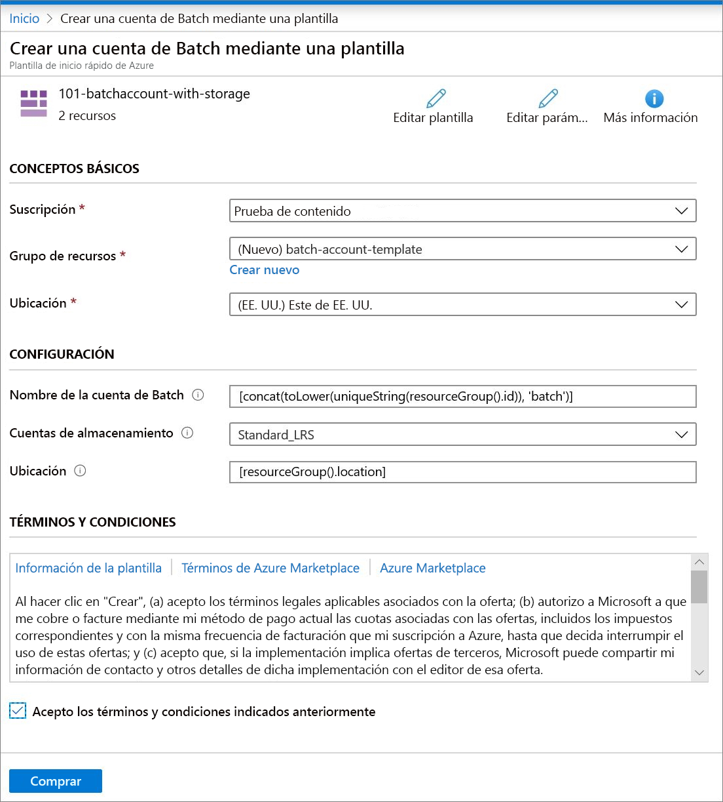

# Inicio rápido: Creación de una cuenta de Batch mediante una plantilla de ARM

Para crear recursos de proceso (grupos de nodos de proceso) y trabajos de Batch se necesita una cuenta de Batch. Puede vincular una cuenta de Azure Storage con su cuenta de Batch, lo que resulta útil para implementar aplicaciones y almacenar datos de entrada y salida para la mayoría de las cargas de trabajo del mundo real. En este inicio rápido se muestra cómo usar una plantilla de Azure Resource Manager para crear una cuenta de Batch, incluido el almacenamiento. Tras completar esta guía de inicio rápido, entenderá los conceptos clave del servicio Batch y estará listo para probar dicho servicio con cargas de trabajo más realistas y a mayor escala.

[!INCLUDE [About Azure Resource Manager](../../includes/resource-manager-quickstart-introduction.md)]

Si su entorno cumple los requisitos previos y está familiarizado con el uso de plantillas de Resource Manager, seleccione el botón **Implementar en Azure**. La plantilla se abrirá en Azure Portal.

## Prerrequisitos

Debe contar con una suscripción de Azure activa.

- [!INCLUDE [quickstarts-free-trial-note](../../includes/quickstarts-free-trial-note.md)]

## Revisión de la plantilla

La plantilla usada en este inicio rápido forma parte de las [plantillas de inicio rápido de Azure](https://azure.microsoft.com/resources/templates/101-batchaccount-with-storage/).

:::code language="json" source="~/quickstart-templates/101-batchaccount-with-storage/azuredeploy.json":::

En la plantilla se definen dos recursos de Azure:

- [Microsoft.Storage/storageAccounts](/azure/templates/microsoft.storage/storageaccounts): Crea una cuenta de almacenamiento.
- [Microsoft.Batch/batchAccounts](/azure/templates/microsoft.batch/batchaccounts): Crea una cuenta de Batch.

## Implementación de la plantilla

1. Seleccione la imagen siguiente para iniciar sesión en Azure y abrir una plantilla. La plantilla crea una cuenta de Azure Batch y una cuenta de almacenamiento.

   

1. Seleccione o escriba los siguientes valores.

   

   - **Suscripción**: seleccione una suscripción de Azure.
   - **Grupo de recursos**: seleccione **Crear nuevo**, escriba un nombre único para el grupo de recursos y, a continuación, haga clic en **Aceptar**.
   - **Ubicación**: seleccione una ubicación. Por ejemplo, **Centro de EE. UU**.
   - **Nombre de la cuenta de Batch**: Deje el valor predeterminado.
   - **Storage Accountsku** (SKU de la cuenta de almacenamiento): seleccione un tipo de cuenta de almacenamiento. Por ejemplo, **Standard_LRS**.
   - **Ubicación**: deje el valor predeterminado para que los recursos estén en la misma ubicación que el grupo de recursos.
   - Acepto los términos y condiciones indicados anteriormente: **Seleccionar**.

1. Seleccione **Comprar**.

Transcurridos unos minutos, verá una notificación que dice que la cuenta de Batch se ha creado correctamente.

En este ejemplo, Azure Portal se usa para implementar la plantilla. Además de Azure Portal, también puede usar Azure PowerShell, la CLI de Azure y API REST. Para obtener información sobre otros métodos de implementación, consulte [Implementación de plantillas](../azure-resource-manager/templates/deploy-powershell.md).

## Validación de la implementación

Para validar la implementación en Azure Portal, vaya al grupo de recursos que ha creado. En la pantalla **Información general**, confirme que la cuenta de Batch y la cuenta de almacenamiento existen.

## Limpieza de recursos

Si tiene pensado seguir trabajando con otros [tutoriales](./tutorial-parallel-dotnet.md), considere la posibilidad de dejar estos recursos activos. O bien, si ya no los necesita, puede [eliminar el grupo de recursos](../azure-resource-manager/management/delete-resource-group.md?tabs=azure-portal#delete-resource-group), que también eliminará la cuenta de Batch y la cuenta de almacenamiento que ha creado.

## Pasos siguientes

En este inicio rápido, ha creado una cuenta de Batch y una cuenta de almacenamiento. Para más información acerca de Azure Batch, continúe con los tutoriales de Azure Batch.

> [!div class="nextstepaction"]
> [Tutoriales de Azure Batch](./tutorial-parallel-dotnet.md)
