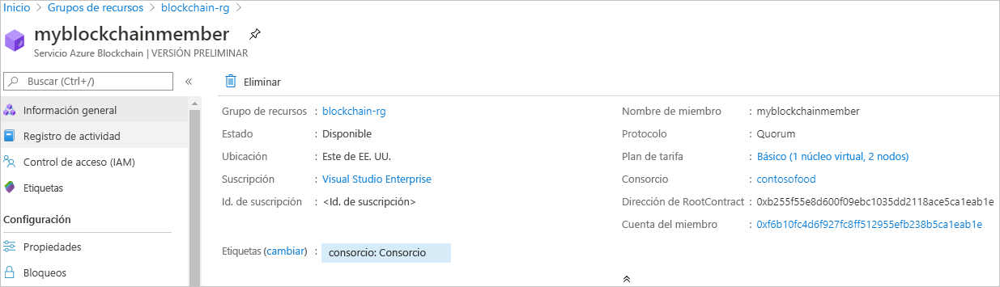

# Inicio rápido: Creación de un miembro de Azure Blockchain Service mediante una plantilla de ARM

En este inicio rápido, va a implementar un miembro y un consorcio de cadena de bloques nuevos en Azure Blockchain Service mediante una plantilla de Azure Resource Manager (plantilla de ARM). Un miembro de Azure Blockchain Service es un nodo de la cadena de bloques en una red de cadenas de bloques del consorcio privado. Al aprovisionar un miembro, puede crear una red de consorcio o unirse a ella. Necesita al menos un miembro para una red de consorcio. El número de miembros de la cadena de bloques que necesitan los participantes depende de su escenario. Los participantes del consorcio pueden tener uno o varios miembros de la cadena de bloques o pueden compartir miembros con otros participantes. Para más información sobre los consorcios, consulte [Consorcio de Azure Blockchain Service](consortium.md).

[!INCLUDE [About Azure Resource Manager](../../../includes/resource-manager-quickstart-introduction.md)]

Si su entorno cumple los requisitos previos y está familiarizado con el uso de plantillas de Resource Manager, seleccione el botón **Implementar en Azure**. La plantilla se abrirá en Azure Portal.

## Requisitos previos

Si no tiene una suscripción a Azure, cree una cuenta [gratuita](https://azure.microsoft.com/free/) antes de empezar.

## Revisión de la plantilla

La plantilla usada en este inicio rápido forma parte de las [plantillas de inicio rápido de Azure](https://azure.microsoft.com/resources/templates/201-blockchain-asaservice/).

:::code language="json" source="~/quickstart-templates/201-blockchain-asaservice/azuredeploy.json" range="1-84" highlight="52-80":::

Recursos de Azure definidos en la plantilla:

* [**Microsoft.Blockchain/blockchainMembers**](/azure/templates/microsoft.blockchain/blockchainmembers)

## Implementación de la plantilla

1. Seleccione el vínculo siguiente para iniciar sesión en Azure y abrir una plantilla.

    

1. Especifique la configuración del miembro de Azure Blockchain Service.

    Configuración | Descripción
    --------|------------
    Suscripción | Seleccione la suscripción de Azure que quiere usar con el servicio. Si tiene varias suscripciones, elija aquella en la que se factura el recurso.
    Resource group | Cree un nombre de grupo de recursos o use uno existente en la suscripción.
    Location | Elija una ubicación para crear el miembro. Todos los miembros del consorcio deben estar en la misma ubicación. Las ubicaciones disponibles para la implementación son *westeurope, eastus, southeastasia, westeurope, northeurope, westus2* y *japaneast*. Es posible que las características no estén disponibles en algunas regiones. Azure Blockchain Data Manager está disponible en las siguientes regiones de Azure: Este de EE. UU. y Oeste de Europa.
    Nombre del miembro | Elija un nombre único para el miembro de Azure Blockchain Service. El nombre del miembro de la cadena de bloques solo puede contener letras minúsculas y números. El primer carácter debe ser una letra. El valor debe tener entre 2 y 20 caracteres.
    Nombre del consorcio | Escriba un nombre único. Para más información sobre los consorcios, consulte [Consorcio de Azure Blockchain Service](consortium.md).
    Contraseña del miembro | cifrar la clave privada de la cuenta de Ethereum que se crea para el miembro. Usará la cuenta del miembro y la contraseña de la cuenta del miembro para la administración del consorcio.
    Nivel de SKU | El plan de tarifa del nuevo servicio. Elija entre los niveles **Estándar** y **Básico**. Use el nivel *Básico* para desarrollo, pruebas y prueba de concepto. Use el nivel *Estándar* para las implementaciones de nivel de producción. También debe usar el nivel *Estándar* si va a utilizar Blockchain Data Manager o va a enviar un gran volumen de transacciones privadas. Después de la creación de un miembro, no se puede cambiar el plan de tarifa entre básico y estándar.
    Nombre de SKU | La configuración de nodo y el costo del nuevo servicio.

1. Seleccione **Comprar** para implementar la plantilla.

  Azure Portal se usa aquí para implementar la plantilla. También puede usar Azure PowerShell, la CLI de Azure o la API REST. Para obtener información sobre otros métodos de implementación, consulte [Implementación de plantillas](../../azure-resource-manager/templates/deploy-powershell.md).

## Revisión de los recursos implementados

Puede usar Azure Portal para ver los detalles del miembro de Azure Blockchain Service implementado. En el portal, vaya al grupo de recursos que contiene el miembro de Azure Blockchain Service. Seleccione el miembro de cadena de bloques que creó.

## Limpieza de recursos

Puede usar el miembro de cadena de bloques que ha creado en el siguiente inicio rápido o tutorial. Cuando ya no necesite los recursos, puede eliminarlos; para ello, elimine el grupo de recursos que creó en el inicio rápido.

Para eliminar el grupo de recursos:

1. En Azure Portal, vaya a **Grupo de recursos** en el panel de navegación izquierdo y seleccione el grupo de recursos que desea eliminar.
2. Seleccione **Eliminar grupo de recursos**. Compruebe la eliminación escribiendo el nombre del grupo de recursos y seleccionando **Eliminar**.

## Pasos siguientes

En este inicio rápido ha implementado un miembro de Azure Blockchain Service y un nuevo consorcio. Pruebe el siguiente inicio rápido para usar Azure Blockchain Development Kit para Ethereum para adjuntar a un miembro de Azure Blockchain Service.

> [!div class="nextstepaction"]
> [Uso de Visual Studio Code para conectarse a Azure Blockchain Service](connect-vscode.md)